Vamos a ver las bases teoricas de la programación funcional, pero no tanto como cuando veamos calculo lambda.

# Fundamentos de programación funcional

- En la computación nos vemos con problemas y tenemos que procesar info para poder resolverlos via compu.
    - Primero hay que modelar la pregunta.
    - Hacer el programa y luego interpretar la salida del programa.

- En la programación funcional las funciones son **verdaderas** funciones.
    - Una verdadera función no tiene efectos secundarios.
    - A una misma entrada le corresponde siempre l amisma salida.
    - Las estructuras de datos son inmutables.
    - Las estructuras de datos son inmutables.
    
    Ejemplos:
    - Modificar el estado global de un array.
    
    Moraleja:
    - Solo se hacen calculos, no puede interactuar con ningun otro factor externo.
    - Como los datos son inmutables, entonces cuando hay un output que "modifica" una estructura, lo que pasa realmnete es que se crean nuevas estructuras y se devuelven esas.

- Las funciones son datos como cualquier otro:
    - se pueden pasar como parameteros.
    - se pueden devolver como resultados.
    - pueden formar parte de estructuras de datos.

## Ejemplos
un programa funcional esta dado por un conjunto de ecuaciones, algunas como
longitud [] = 0
longitud (x:xs) =1 + longitud xs
longitud [10,20,30] == 1 + longitud [20,30] == 1 + 1 + longitud [30] == ... **completar con la diapo**

## Expresiones
las expresiones pueden ser datos, pueden seer funciones y pueden ser funciones aplicadas a otros datos.

En haskell suelen suelen ser:
1. Un constructor: es aquel que forma estructura o datos. Ej: True, False, [], (:), 1, 2, ...
2. Una variable: son nombres que se refieren a algún otro dato. Ej: longitud, ordenar, x, xs, (+), (*), ...
3. La aplicación: consiste en yuxtaponer una expresión con otra expresión, la expresión de la izquierda representa una función y la de derecha su argumento, hay que reducirla; la aplicación siempre toma un solo argumento. Ejemplo: not (not True), que es la aplicación de la variable not a la expresión de la aplicación de not a la variable True; otro: (+) 1, o sea, la variable (+) aplicada al constructor 1; se ve como (y com oun ejemplo) 1+2 -> (+) 1 2 -> ((+) 1) 2
-
    Esas son las 3 cosas fundamentales con las que uno puede armarse todo lo que quiera con la programación funcional.

### Convenciones
La aplicación es asociativa a izquierda.
-
    f x y == (f x) y /= f (x y)

No significa que lo que está a la derecha está mal, todo depende de que estemos buscando.

    [1, 2] == 1: [2] == (:) 1 [2] == ((:) 1) [2] == ((:) 1) ((:) 2 []) == ((:) 1) (((:) 2) [])

Ejemplo: sumarUno = (+) 1
-
    sumarUno (sumarUno 5) =
    = ((+) 1) (sumarUno 5) = 
    = 1 + sumarUno 5
    = 1 + ((+) 1) 5
    = 1 + (1 + 5)
    = 1 + 6
    = 7

## Tipos
- Es una especicificación del invariante de un dato o de una función.  
Ejemplos: 
-
    99 :: Int
    not :: Bool -> Bool -> representa una función que dado un booleano em devuelve otro booleano 
    not True :: Bool 
    (+) :: Int -> (Int -> Int) "si yo le doy al (+) algo que cumple con el invariante de ser un entero, entonces me devuelve una función con el invariante de que toma algo que debe cumplir con el invariante de ser un entero y que me devuelve algo que cumple con el invariante de ser un entero.
    (+) 1 :: Int -> Int
    ((+) 1 2) :. Int

El tipo de las funciones define un booleano.

### Condiciones de tipado
Para que el programa esté bien tipado hay que cumplir con ciertas reglas.
1. Todas las expresiones deben tener un tipo. Todas lo que está a la izquierda y a la derecha debe tener tipo.
2. Cada variable se debe usar siempre con un mismo tipo. Ejemplo erroneo: f x = x:x
3. Los dos lados de la ecuacipon deben tener el miusmo tipo. Ejemplo erroneo: not True = 1 y not False = True, acá estoy usando not dos veces pero como tiene el mismo tipo entonces siempre devolver el mismo tipo siempre.
4. El argumento de un agunción debe tener el tipo del dominio. O sea el tipo del argumento tiene que coincidir con el tipo del dominio de la función, como que matchee con el tipo del dominio de la función. Ejemplo erróneo: 
-
    not True = False
    not False = True

    main = not 1

    otro ejemplo:
    
    main = not True + 1
-

    f :: a -> b     x :: a
   ------------------------
           f x :: b
"si tengo una función que tome un a en b, para que ande entonces siempre debe tomar un a y siempre me va a devolver algo de tipo b"

En el contexto de la programación funcional, **solo** tienen sentido los programas que están bien tipados.

### Convenciones
El -> es asociativo a derecha.

## Conclusión de convenciones
    La aplicación es asociativa a izquierda y la flecha asocia a derecha.

    a -> b -> c -> d == a -> (b -> (c -> d))

    "Una función que toma un a y devuelve una función que toma un b ..."

Ejemplo
-
    suma4 :: Int -> Int -> Int -> Int -> Int
    suma4 a b c d = a + b + c + d

    se puede (y de hecho) se piensa así:
    suma4 :: Int -> Int -> Int -> Int -> Int
    (((suma4 a) b) c) d = a + b + c + d

## Notas
- Notar que la expresión 1 / 0 está bien tipada pero su reducción no lo está. Su resultado no tiene ningún valor en el conjunto de los valores disponibles en Haskell.

## Polimorfismo
Hay expresiones que tienen más de un tipo.
Usamos variables de tipo a, b, c para denotar tipos desconocidos:
-
    id  :: a -> a
    []  :: [a]
    (:) :: a -> [a] -> [a]
    fst :: (a, b) -> a 
    snd :: (a, b) -> b

Ejemplo:
-
    flip f x y = f y x 
    -- notar que es lo mismo que
    ((flip f) x) y = f y x

    -- notar que y puede ser de tipo b y x de tipo a

    flip :: (b->a->c)->(a->b->c)

    "flip transforma una función en otra función que le da vuelta a los argumentos de la función"

    Ejemplo:

    ((:) 1) [] == [1]
    (:) :: Int -> [Int] -> [Int]

    (flip (:)) :: [Int] -> Int -> [Int]
    -- Esto es solo una función que agrega el segundo parámetro al principio del primero.
    
    flip (:) [3] 7 == (:) 7 [3]

## Modelo de cómputo de Haskell
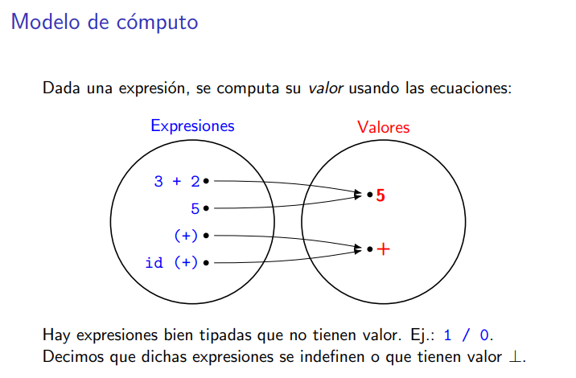
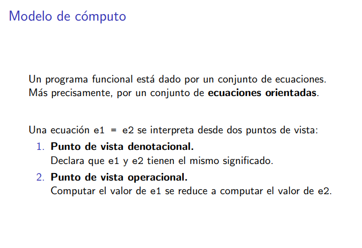
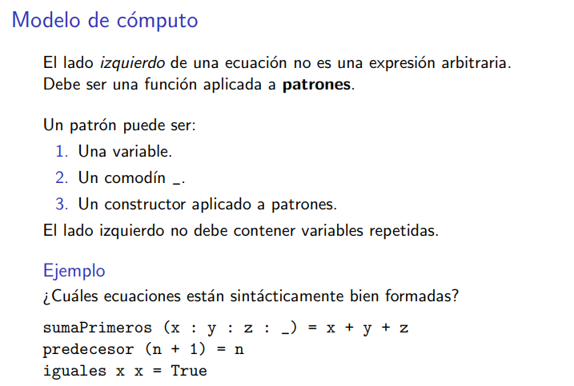

Una variable:

Un comodin:
    (Const x) _ = x

un constructor aplicado a patrones: 
    not True = False
    head (x:xs) = x

    es un patrón porque es el constructor (:) aplicado a dos variables. (:) x xs

sumaPrimeros es un patron porque es un constructor aplicado a una variable aplicado recursivamente a otras variables.
predecesor no es un patrón porque es la aplicación de una aplicación! Para que sea un patrón solo puede ser la aplicación de una variable, un comodín o un constructor aplicado a otros patrones, no una aplicación de otra aplicación.
iguales no es una expresión porque aparece dos veces la misma variable.

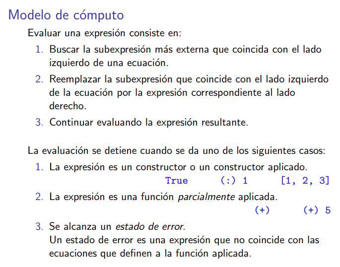

ejemplo con 3. 
    not True = False
    not False -- Aquí ya falla.

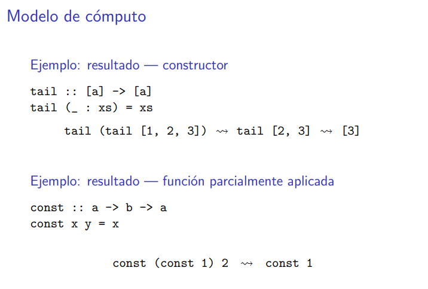

call by name: 
Lo hace Haskell, significa tomar la expresión más a la izquierda que se pueda reducir.

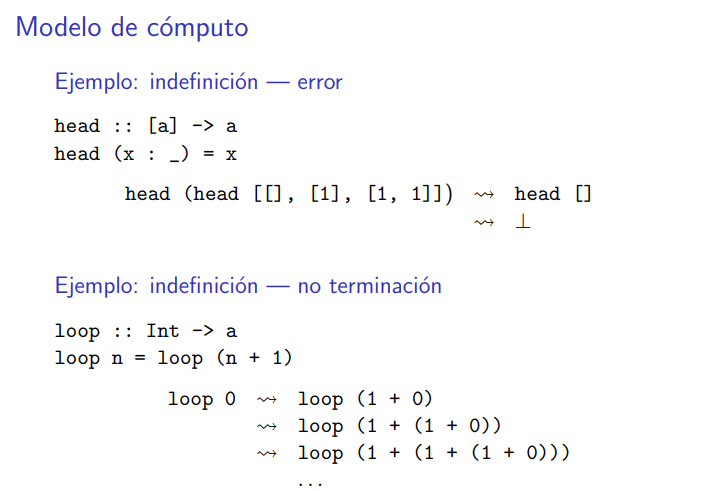

tipa porque la lista vacía es una lista de a. Pero como no matchea con ninguna ecuación de head, entonces falla.

- El reemplazo es **EL** modelo de cómputo en la programación funcional.

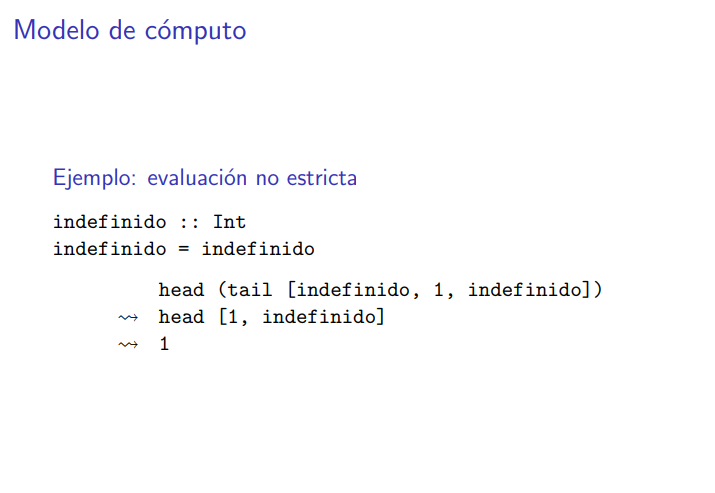

Esto tiene que ver con la evaluación lazy. O sea, que solo se evalúan las partes de la expresión que contribuyen a encontrar al resultado.

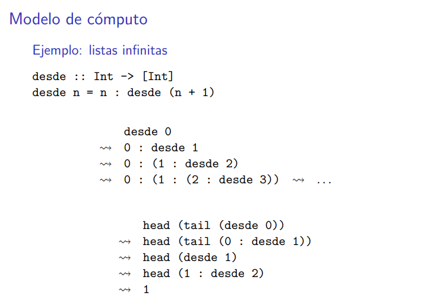
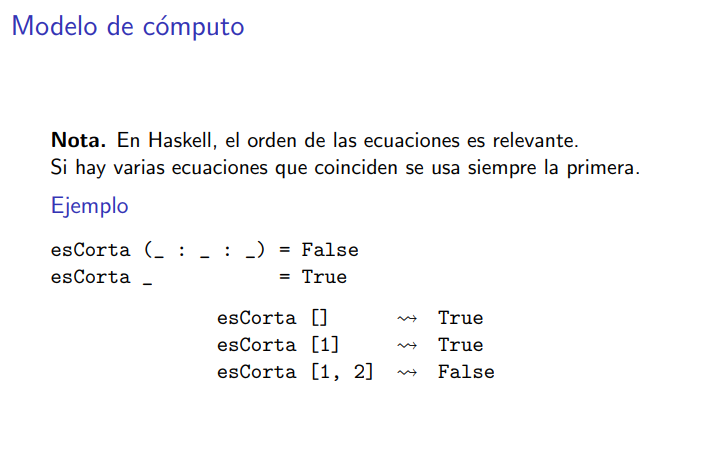

## Funciones de orden superior
    g . f

    (.) :: (b->c)->(a->b)->a->c
    (g . f) x = g (f x)

    (.) :: (b->c)->(a->b)->a->c
    g . f = \x -> g (f x)
    -- \ se refiere a una función que hace algo pero sin darle nombre. 
    ((.) g f)(g . f) :: a->c

    si g=(+) 1 y f=(*)2
    (g . f) 3 == multiplico a 3*2 y le sumo 1 == 7

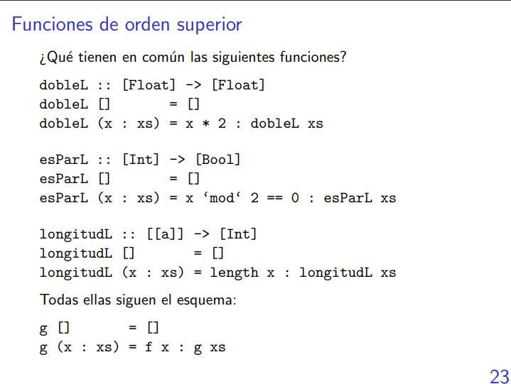
Ahora queremos definir una función que abstraiga eso

    map :: (a->b)->[a]->[b]
    -- map :: (a->b)->([a]->[b]) esta es la manera posta en la que se piensa.
    -- una función que toma una otra función y devuelve una función que toma listas de [a] y -- devuelve una lista de [b] 
    map _ [] = []
    map f (x:xs) = f x : map f xs

redefinamos las otras funciones!

    dobleL xs = map (\x -> x*2) xs
    -- dobleL xs = map (*2) xs
    dobleL = map (\x -> x*2) -- Esta es la forma cheta y la más recomendable de escribirla en la materia. Pasa que dobleL ya es un map que **siempre** toma una lista, entonces dobleL es una expresión que siempre va a estar esperando una lista. 

    Ejemplo: map (*) 2
    map :: (a->b)->[a]->[b]
    (*2) :: Int-> Int
    map (*) 2 :: [Int] -> [Int]

    Seguimos:

    esParL xs = map (\x -> x'mod'2 == 0) xs
    longitudL xs = map (\x -> length x) xs

Hay que entender:
    even n = (==0) (('mod' 2) n) =
    = ((== 0) . ('mod' 2)) n

    even = (== 0) . ('mod' 2)

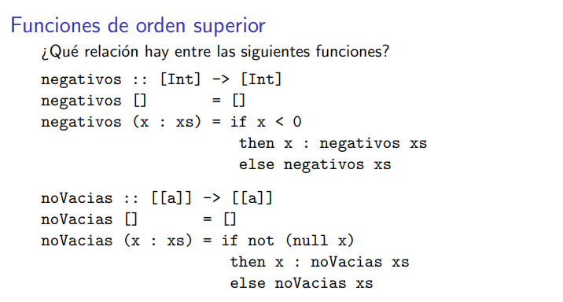
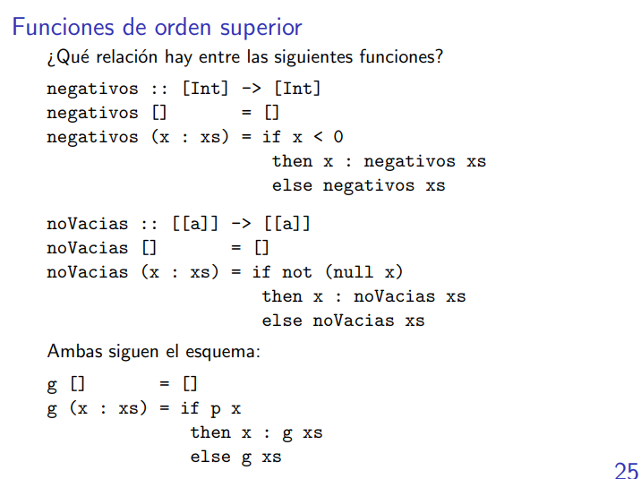

    filter :: (a->Bool)->[a]->[a]
    -- filter :: (a->Bool)->([a]->[a]) esta es la forma cheta de pensarla, y la más correcta. O -- sea, recibe una función que dada una condición sobre la cabeza de la lista, devuelve una -- función que toma una lista del mismo tipo de la cabeza y devuelve una lista con el mismo -- tipo de la cabeza.
    filter _ [] = []
    filter p (x:xs) = if p x then x: filter p xs else filter p xs

redefinamos las funciones!
    negativos = filter (\x -> x<0) 
    -- negativos = filter (<0)
    negativos :: [Int] -> [Int]

    noVacias = filter (\x -> not (null x))
    -- noVacias = filter (not . null)

# Ejercicios
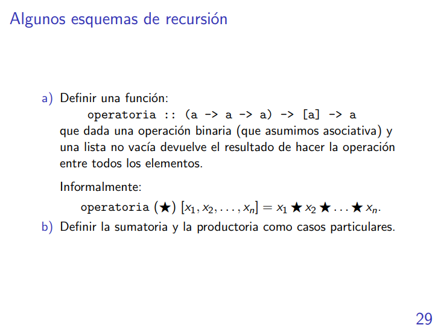

    operatoria :: (a->a->a)->[a]->a
    operatoria _ [x] = x
    operatoria f (x:xs) = f x (operatoria f xs)

    mientras :: (a->Bool) -> (a->a) -> a -> a
    mientras cond f x = if cond then mientras cond f (f x) else x

    fibonacci :: Int -> Int
    fibonacci 0 = 1
    fibonacci 1 = 1
    fibonacci n = mientras (>n+1) ((+) fibonacci (n-1)) 1 -- tengo mis dudas pero creo que así también se vale.

    -- esta es la posta
    fibonacci :: Int -> Int
    fibonacci n = primeraDe3 (mientras (\(_,_,i)-> i/=0) (\(x,y,i)->(y,x+y,i-1)) (0,1,n))
        where primeraDe3 (x,_,_) = x

## notas
- Los constructores es bueno pensarlo como una parte del programa que expresa algo, es solo una parte del lenguaje para construir expresiones. No genera nada en sí, sino que expresa algo. Los constructores son como afirmaciones de alguna expresión, es directamente una forma de representar un expresión la cual es siempre cierta. los constructores no hacen ninguna operación, solo describen cosas a partir de algun dato.
- Las variables representan cosas que no son resultados o expresiones ciertas, o sea, son cosas que hacen falta reducir.
- La diferencia entre un constructor y una variables es que el constructor es algo que es cierto por default y que no se puede reducir, una variable también es algo cierto pero hay que reducirlo.
- No existe la aplicación de una función a más de un argumento. Al menos no en nuestro lenguaje. O sea, la aridad de todas las funciones en Haskell **siempre** es 1.
- un programa en haskell es una 'lista' de ecuaciones que tiene a la izquierda un conjunto de expresiones y a la derecha también.
- Vamos a poder computar con cualquier expresión que tenga tipos.
- Solo vamos a poder computar con expresiones que no tengan variables libres.
- La gracia de la programación funcional es abstraer a patrones que son comunes. Esto generalmente resuelve muchos problemas de forma muy general.

# Ejercicios