# Resolución

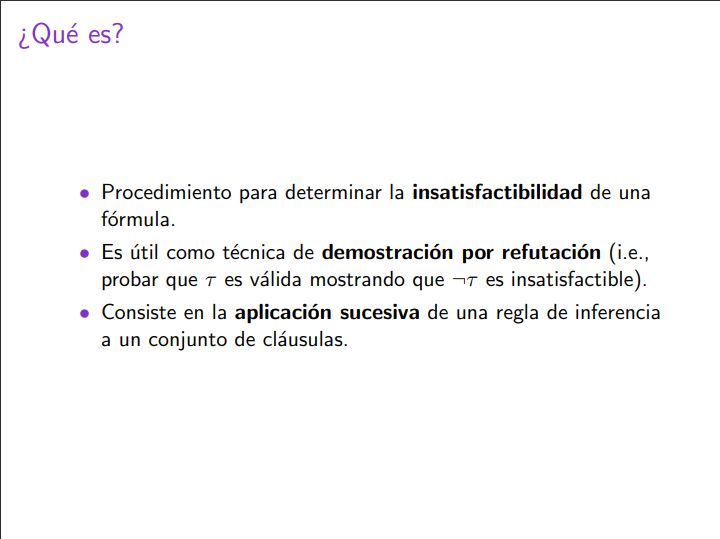

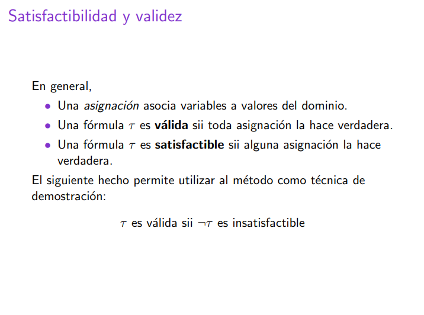

Una formulae s valida cuando toda asignación de variables en el domino la hacer verdadera

Eso es lo mismo que para la negación toda asignación la hace insatisfactible.

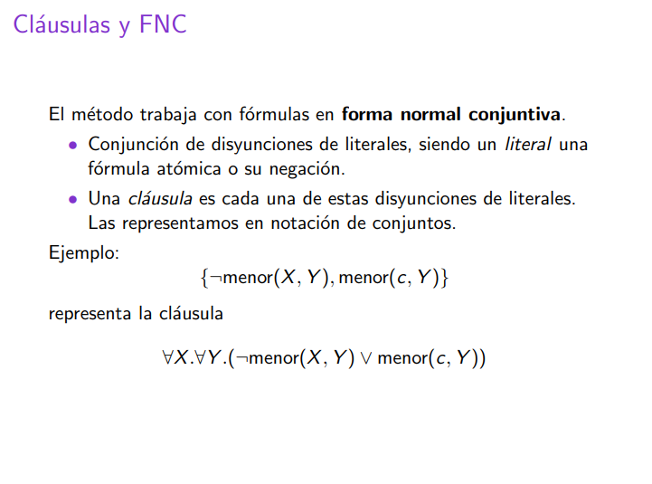

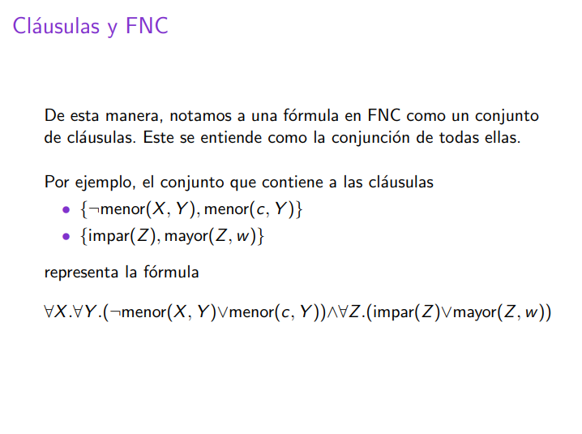

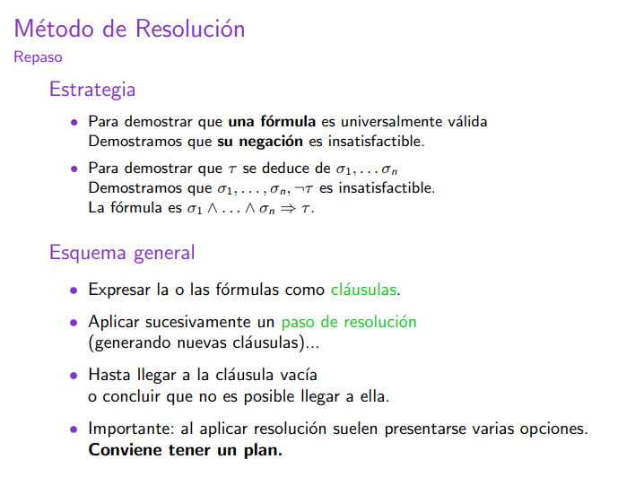

Para demostrar que una fórmula es universalmente válida vamos a demostrar que su negación es insatisfactible.

Realmente es conveniente tener un plan porque sino se pierde mucho tiempo dando vueltas.

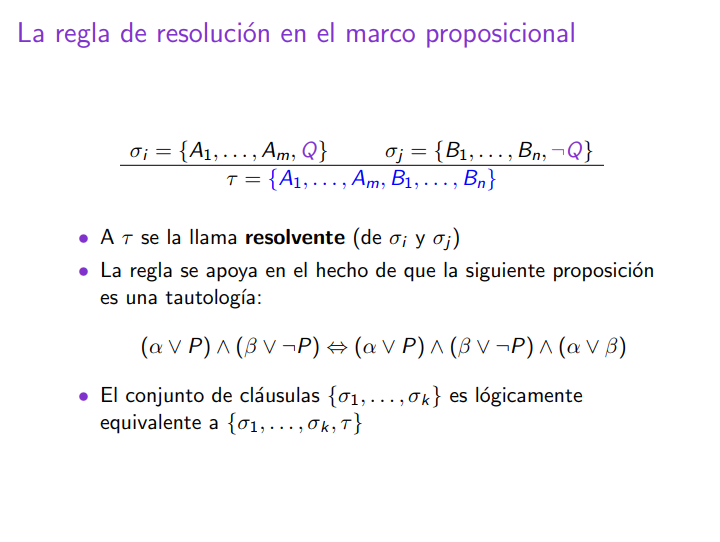

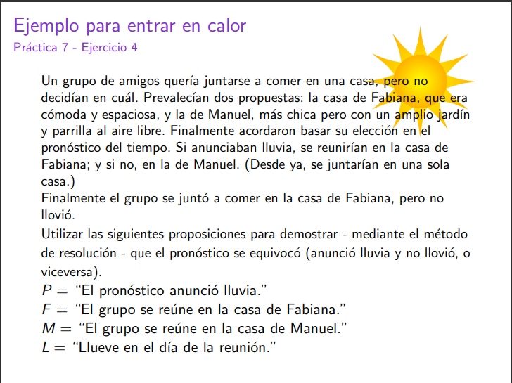

En este caso esas variables son fórmulas atómicas.
$\land$
```
Lo que sabemos es:

P  => F
¬P => M
¬(F ∧ M)
F
¬L

queremos probar que:
(P ∧ ¬L) V (¬P ∧ L)

negamos lo de abajo porque lo que queremos probar es ¬(base de conocimiento) => Lo que queremos probar.
El tema es que negar todo eso es equivalente a: forma clausal(base conocimiento) ∧ ¬(lo que queremos probar)
```

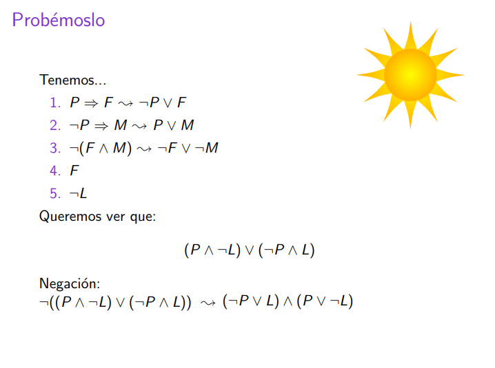

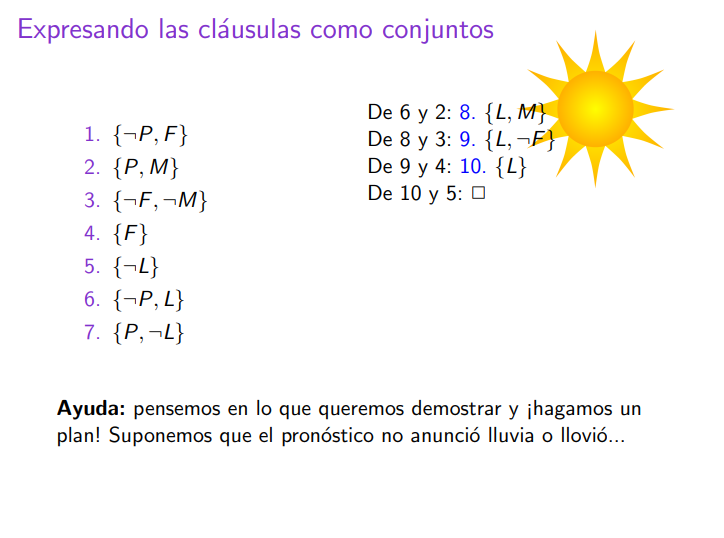

EL truco para todo esto es demostrar por el absurdo. El plan es cómo probarlo por el absurdo usando clasulas.


Lo ideal es razonar en eso de que si vamos al casa de Manu es porqeu llovió, pero al final no llovió.

recorrido que MAS O MENOS deberíamos seguir: 2, 3, 4, 5

Al final o al principio sí o sí hay que usar la 6 porque es la que nos lleva a la contradicción, no es posible no usarla.

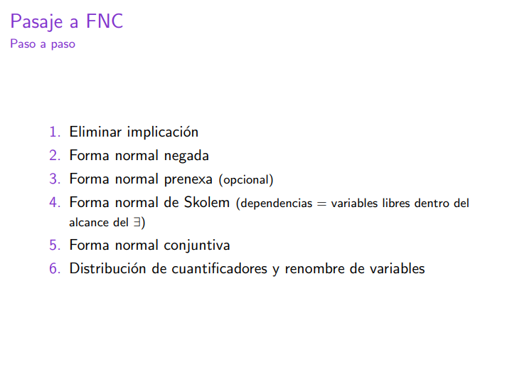

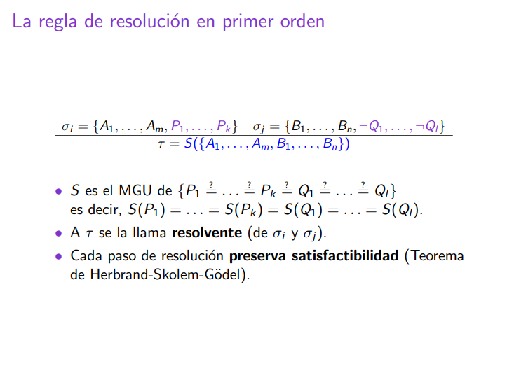

```
Ojo:
P1 := P2 y P2 := P3 => P1 := P3 ES FALSO
```

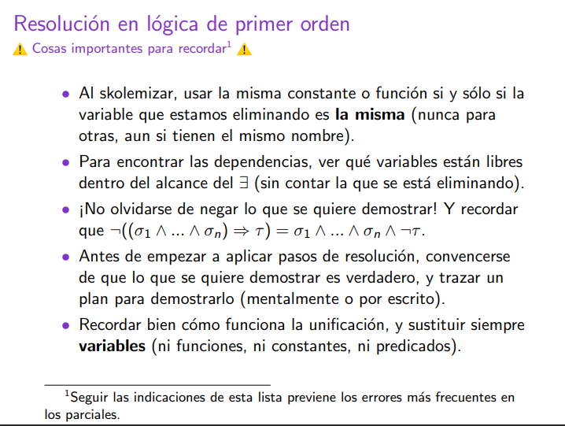

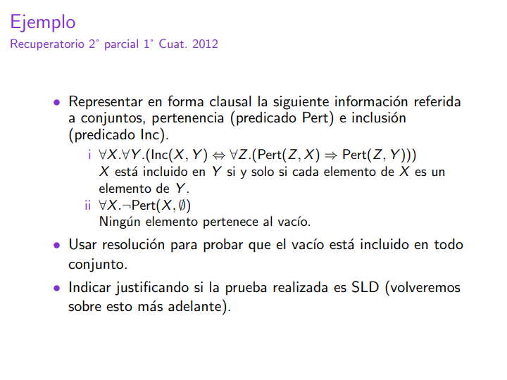

$\forall\empty$
```
Queremos probar que ∀X. Inc(∅, X)
```
```
∀X.XY. Inc(X, Y) => (∀Z. Pert(Z, X) => Pert(Z, Y))

Lo pasamos a forma clausal

∀X.XY. Inc(X, Y) => (∀Z. Pert(Z, X) => Pert(Z, Y))
∀X.XY. (¬Inc(X, Y) V (∀Z. ¬Pert(Z, X) V Pert(Z, Y)))

∀X.XY.∀Z. (¬Inc(X, Y) V ¬Pert(Z, X) V Pert(Z, Y))

1. {¬Inc(X, Y), ¬Pert(Z, X), Pert(Z, Y)}
```
$\exists$
```
∀X.∀Y. (∀Z.(Pert(Z, X) => Pert(Z, Y )) => Inc(X, Y))
∀X.∀Y. ¬(∀Z.(Pert(Z, X) => Pert(Z, Y ))) V Inc(X, Y)
∀X.∀Y. ∃Z.(Pert(Z, X) ∧ ¬Pert(Z, Y )) V Inc(X, Y)
∀X.∀Y. ((Pert(f(X, Y), X) ∧ ¬Pert(f(X, Y), Y)) V Inc(X, Y))
∀X.∀Y. ((Pert(f(X, Y), X) V Inc(X, Y)) ∧ 
        ∧ (¬Pert(f(X, Y), Y) V Inc(X, Y)))

2. {Pert(f(X, Y), X), Inc(X, Y)}
3. {¬Pert(f(X, Y), Y), Inc(X, Y)}
```
```
∀X.¬Pert(X, ∅)

4. {¬Pert(X, ∅)}
```

Ahora lo que hace falta es la consulta.

```
∀X. Inc(∅, X)
∃X. ¬Inc(∅, X)
¬Inc(∅, c)

5. {¬Inc(∅, c)}
```

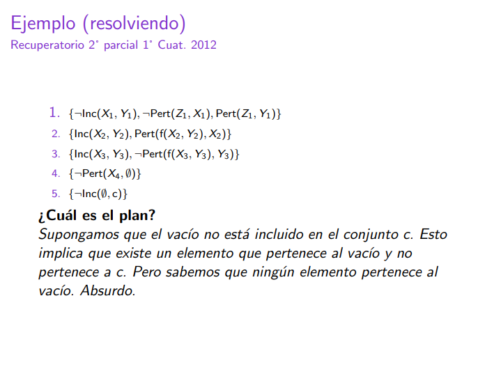

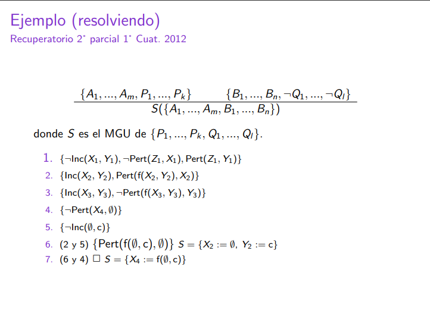


---

Otro ejercicio

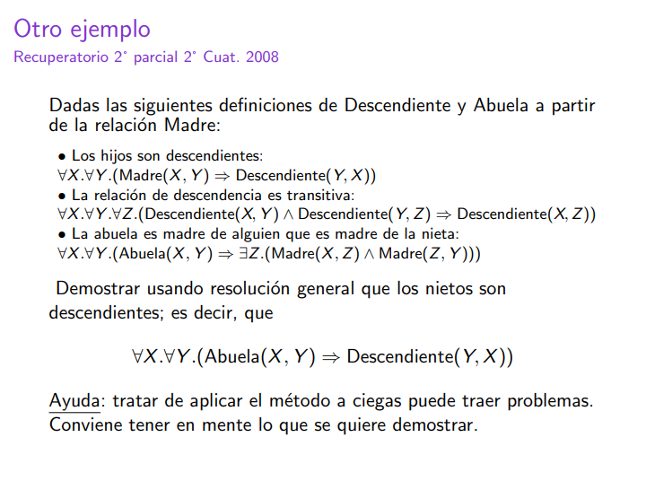

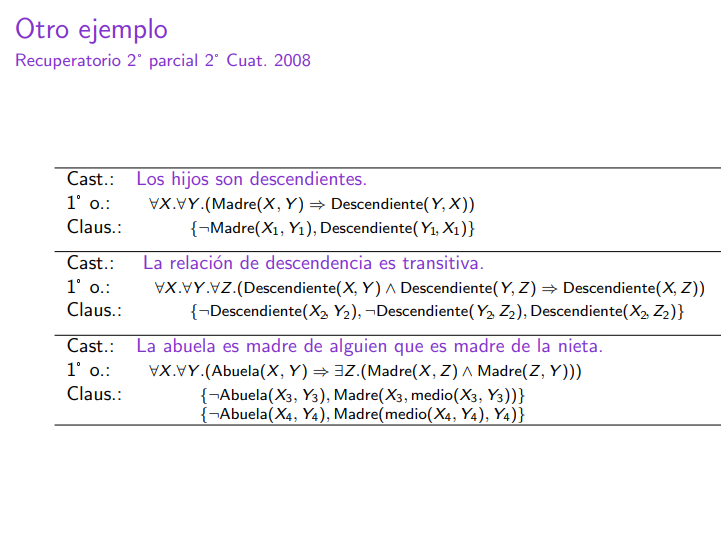

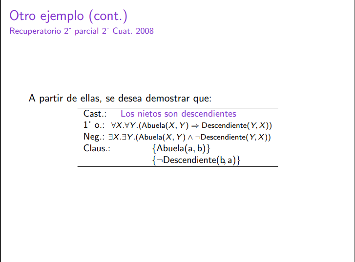

> OJO: NO SE RENOMBRAN CONSTANTES NI SÍMBOLOS DE FUNCIÓN. SOLO SE RENOMBRAN VARIABLES!!!!!!

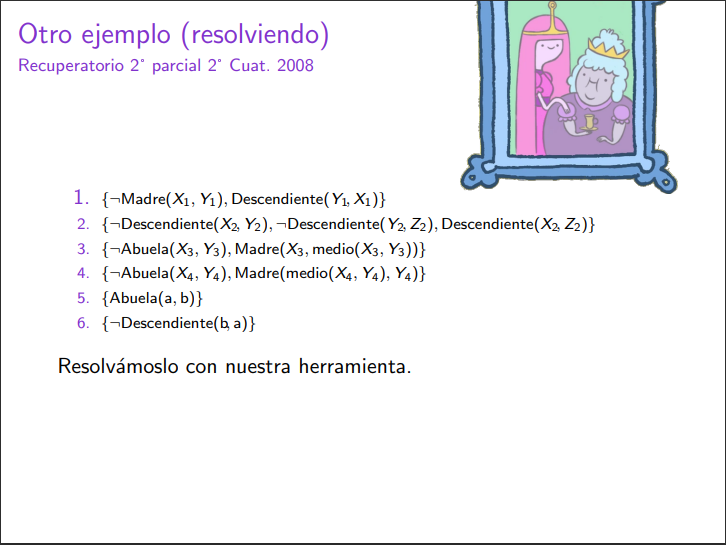

Con la "herramienta" se refieren al resolvedor que está en la sección de 'util' del campus.

https://campus.exactas.uba.ar/mod/resource/view.php?id=61987

Para pasarle el input hay que poner una linea por cada clausula, sin singnos lógicos, todo comas.

5, 4
5, 3
7, 1
8, 1
9, 2
10, 11,
12, 6

[subir las fotos que tomé]

# Resolución SLD

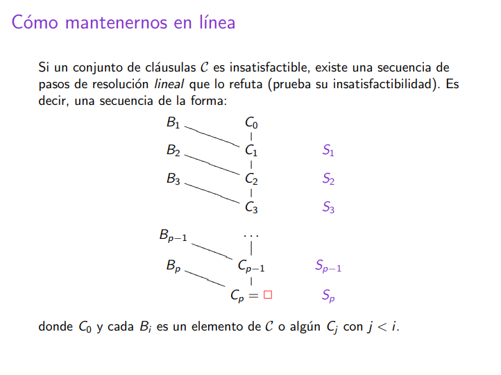

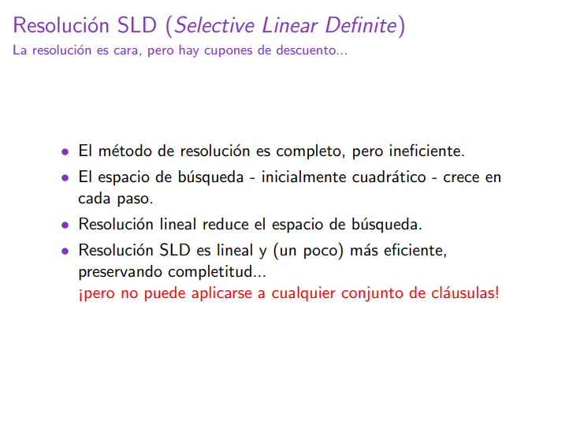

```
Gabriela Steren dio lo de SLD, seguramente su ejemplo sea como en el parcial.
```

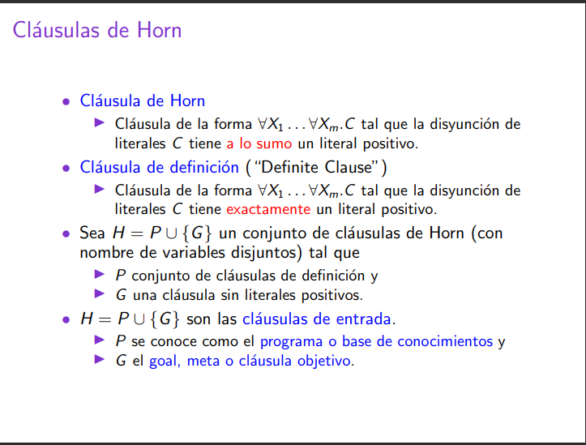

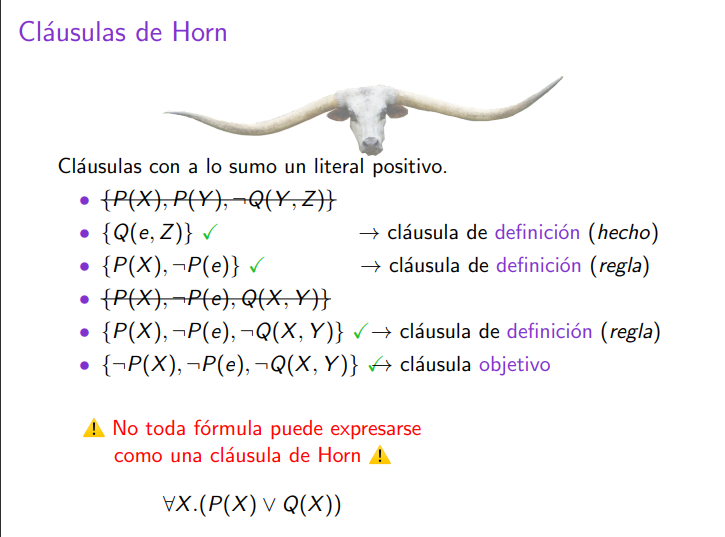

un hecho es que la clausula tiene un literal positivo y nada más; si tuviera más literales (negativos) entonces se dice que es regla.

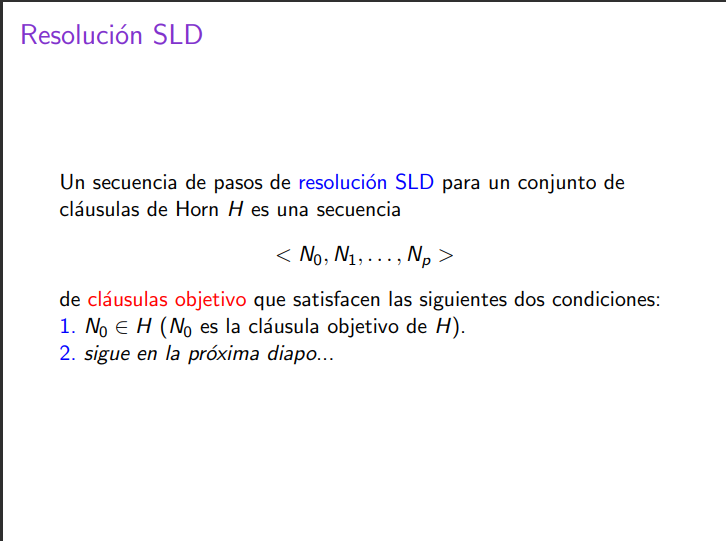

SLD:
lineal,
solo clausulas de Horn,
empezar por una objetivo,
Solo se puede hacer resolución binaria (entre dos literales, 1 de una cláusula y otro de otra).

Que sea lineal singinifica que siempre se usa la resolvente del paso anterior.

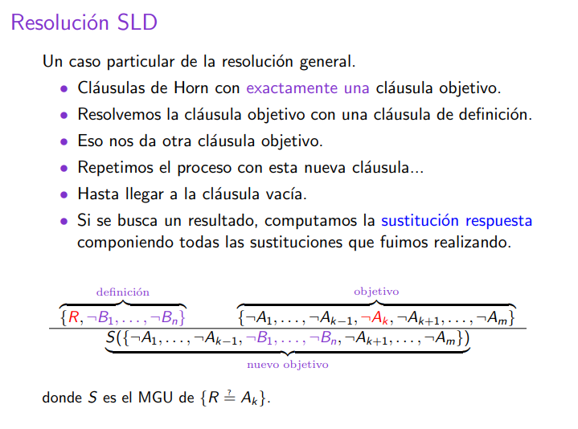

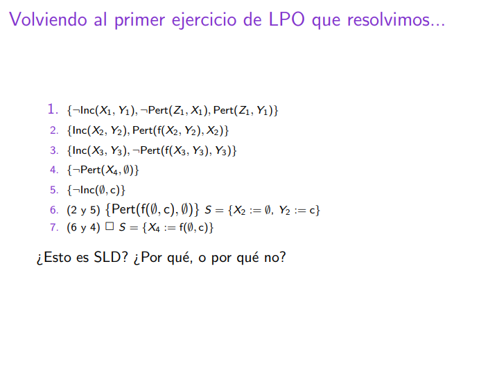

No es SLD porque la cláusula no es una cláusula de Horn.

Sin embargo se puede hacer lo siguiente: descartarla y hacer resolución SLD.

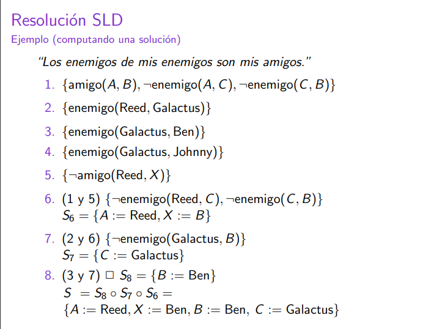

> NOTA: siempre que tengamos las cláusulas lo siguiente es pensar el plan.

En este caso queremos probar que Reed tiene un amigo.

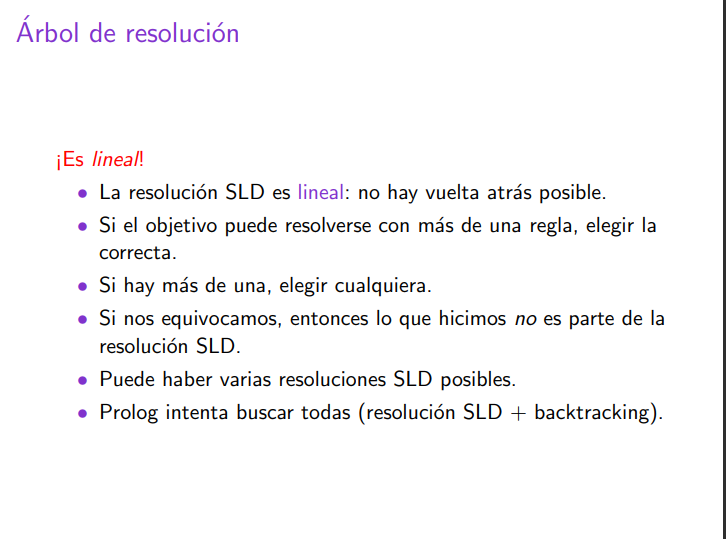

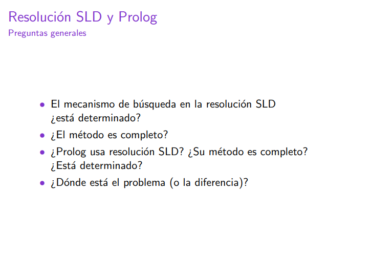

- No es determinado porque podemos llegar a tomar diferentes elecciones durante el uso del método.

- El método es completo si nos restringimos a cláusulas de Horn.

- Si nos restringimos a la parte puramente lógica, entonces prolog hace SLD. No es completo porque a veces se nos cuelga. Está determinado, lo corre una compu.

- La diferencia está en que prolog es determinado y cuando nosotros lo hacemos a mano, no. Prolog siempre toma la primera cláusula con la que puede unificar y nosotros no necesariamente.

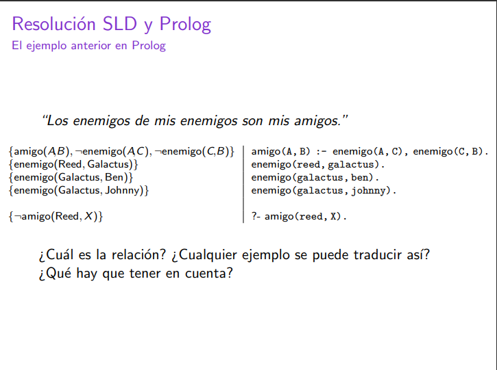

- La relación es que los literales negados van a la derecha del :- ... . Lo que hay que tener en cuenta es que puede agarrar más de una cláusula objetivo (tiene que haber exactamente una cláusula objetivo), y el orden importa.

```
Comentario aparte:

el ; en prolog es una macre que comprime dos cláusulas en una.

Si tenemos:
    P(X) :- Q(Y) ; Q(Z).

Entonces eso es equivalente a:

P(X) :- Q(Y).
P(X) :- Q(Z).
```

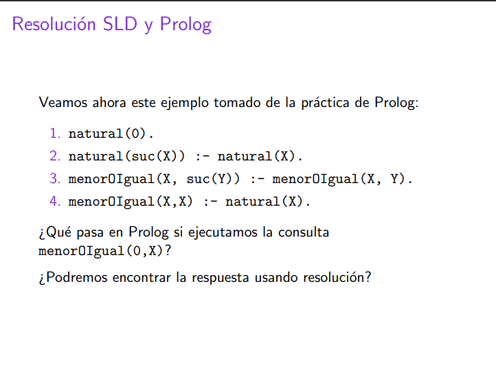

En prolog esto no está bien porque se cuelga, hay que switechear la línea 3 con la 4. Desde un aspecto lógico esto es correcto porque no nos importa el orden.

> Nosotros somos más inteligentes que una computadora!

[subir la foto de la resolución en clase]

No es SLD porque no empezamos con una cláusula objetivo.

Si empezabamos con 5 y 4, y luego 6 y 1, entonces sí es SLD.

> IMPORTANTE
>
> Si nos piden justificar si existe una resolución SLD la cosa es así: si existe una resolución que llega a {} y teníamos todas cláusulas de Horn en nuestra base de conocimiento, entonces existe una resolución SLD.

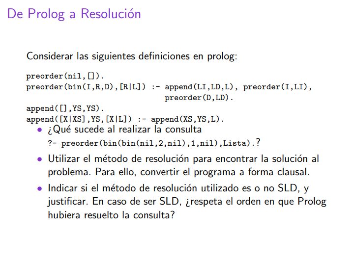

No está buena la definición de preorder porque le pasamos las tes variables sin instanciar! Entonces el append va a hacer una generación infinita que no va a funcionar con los casos recursivos.

[meter la foto de la resolución]

Esa resolución no es SLD.

> Nota: que prolog no encuentre una solución no significa que haya resolución SLD.

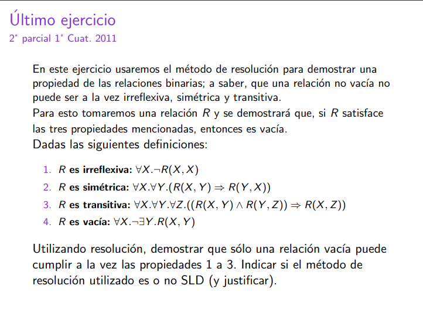

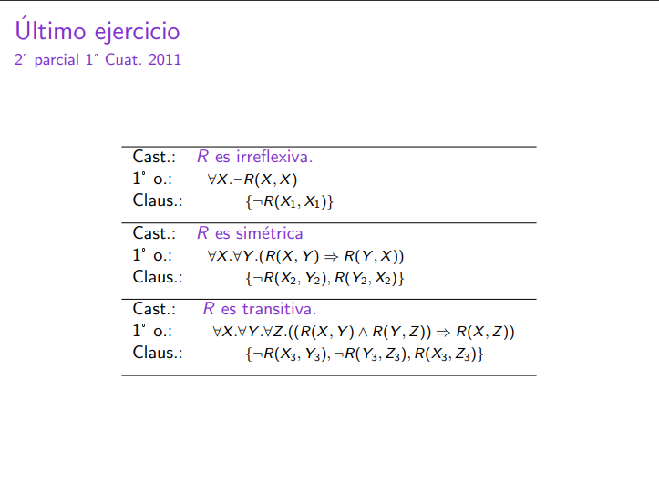

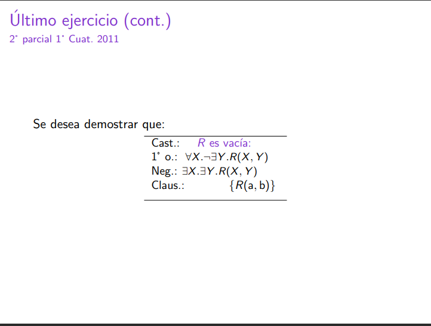

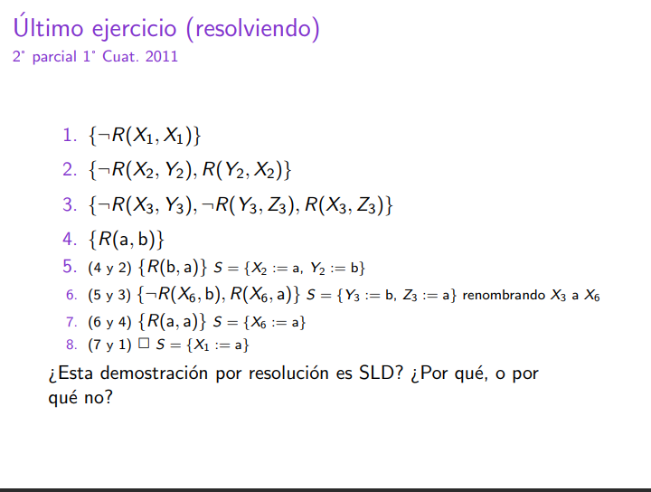

Si no hay cláusular objetivos: no hay resolución.

Podemos empezar con cualquier claúsula objetivo, no tiene por qué ser la consulta necesariamente.

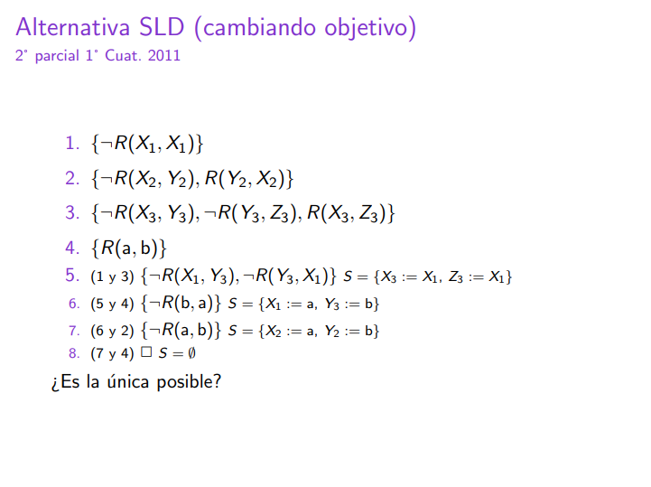

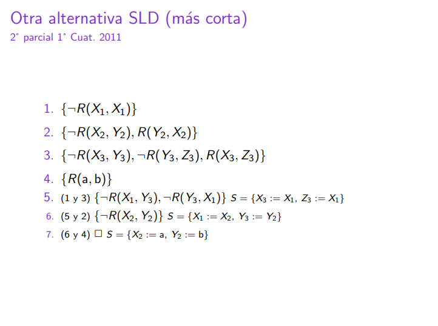

Esta resolución es SLD aunquenos haya quedado lo mismo en la unificación.