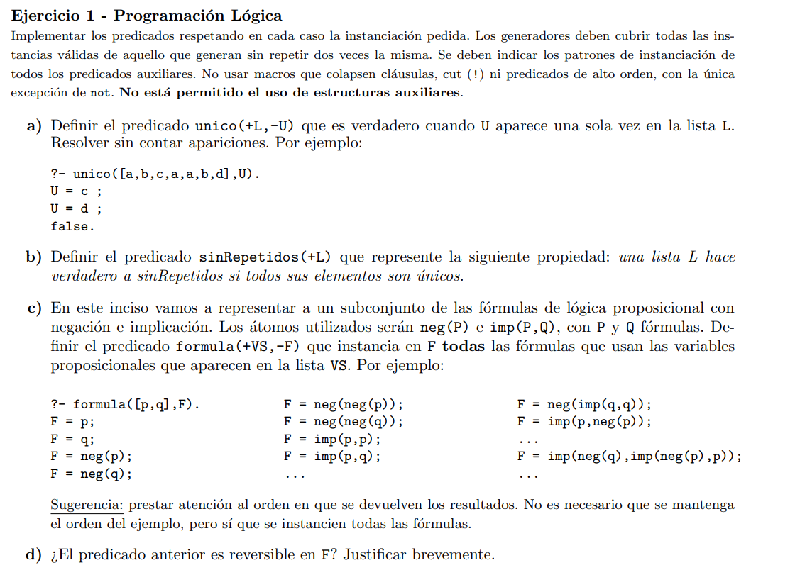
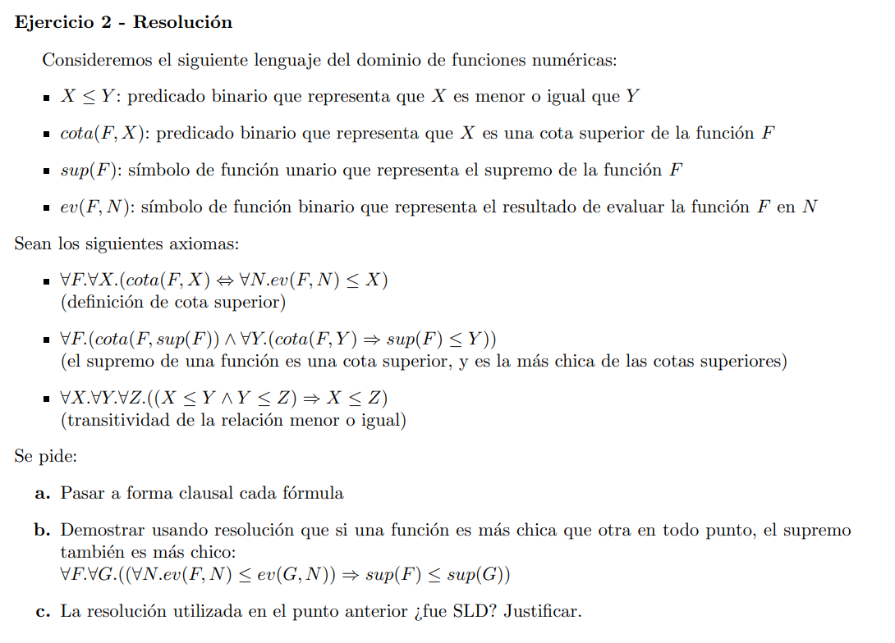
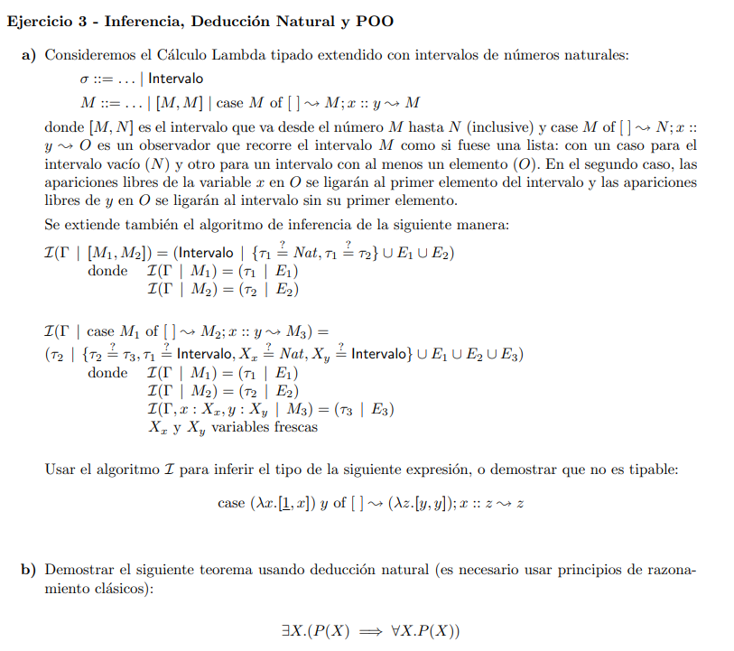

# Repaso segundo parcial

## Ejercicio 1



### a)

```prolog
unico(L, U) :- 
    append(Prefijo, [H | Sufijo], L),
    append(Prefijo, Sufijo, Resto),
    not(member(U, Resto)).

% Es buenísima esta definición!!!

% otra

unico(L, U) :- 
    append(Prefijo, [H | Sufijo], L),
    not(member(U, Prefijo)), 
    not(member(U, Sufijo)).
```

### b)

```prolog
sinRepetidos(L) :- 
    not(member(X, L), not(unico(L, X))).
```

### c)

```prolog
desde(X, X).
desde(X, Y) :- N is X+1, desde(N, Y).

formulasConNSubformulas(1, VS, F) :- member(F, VS).
formulasConNSubformulas(N, VS, neg(F)) :-
    N > 1,
    N1 is N-1,
    formulasConNSubformulas(N1, VS, F).

formulasConNSubformulas(N, VS, imp(FP, FQ)) :-
    N > 2,
    N1 is N-1,
    between(1, N1, NP),
    NQ is N1-NP,
    formulasConNSubformulas(NP, VS, FP),
    formulasConNSubformulas(NQ, VS, FQ),

formula(VS, F) :-
    desde(1, N),
    formulasConNSubformulas(N, VS, F).
```

### d)

No es reversible porque si F está instanciada entonces en algún momento va a unificar PERO desde va a seguir generando resultados infinitamente y no va volver a unificar más.

## Ejercicio 2



## a) 

> se saltean el proceso de pasaje a formal clausal

La cosa queda:

1. 
    ```
    {¬cota(F1, X1), ev(F1, N1) <= X1}
    ```
2. 
    ```
    {¬ev(F2, h(F2, X2) <= X2), cota(F2, X2)}
    ```
3. 
    ```
    {cota(F3, sup(F3))}
    ```
4.  
    ```
    {¬cota(F4, Y4), sup(F4) <= Y4}
    ```
5. {¬(X5 <= Y5), ¬(Y5 <= Z5), X5 <= Z5}

## b)

Pasan a forma clausal lo que se quiere demostrar, de golpe.

6.     
    ```
    {ev(f, N6) <= ev(g, N6)}
    ```
7. 
    ```
    {¬(sup(f) <= sup(g))}

> f y g son constantes. Son símbolos de función de aridad cero.

### El plan

Sabemos que f(N)$\leq$ g(N)$\leq$ sup(g). (f es menor o igual a g en todo punto, y por lo tanto f es menor o igual al supremo de g). Lo sabemos por 6.

Por transitividad el supremo de g tiene que ser mayor que el supremo de f. Ahí está la contradicción con 7.

los pasos potenciales van a ser: 3, 1, 5, 6, 2, 4, 7.

### Finalizando

- De 3 y 1: 
    ``
    S={F1 := F3, X1 := sup(F3)}. 
    ``
    Obtengo 8: 
    ``
    {ev(F3, N1) <= sup(F3)}
    ``
- De 8 y 5: `
    ``
    S={Y5 := ev(F3, N1), Z5 := sup(F3)}. 
    ``
    Obtengo 9: 
    ``
    {¬(X5 <= ev(F3, N1), X5 <= sup(F3))}
    ``
- De 9 y 6: 
    ``
    S=MGU({X5?=ev(f, N6), ev(f3, N1)?=ev(g,N6)})={X5?=ev(f, N6), f3?=g, N1?=N6}.
    ``
    Obtengo 10: 
    ``
    {ev(F, N6)<= sup(g)}
    ``
- De 10 y 2:

    ``
    S = MGU({ev(f, N6) ?= ev(F2, h(F2, X2))}) = {F2 := f, N6 := h(f, sup(g)), X2 := sup(g)} 
    ``
    Obtengo 11:
    ``
    {cota(f, sup(g))}
    ``
- De 11 y 4:
    ``
    S = {F4 := f, Y4 := sup(g)}
    ``
    Obtengo 12:
    ``
    {sup(f) <= sup(g)}
    ``
- De 12 y 7:
    ``
    S = {}
    ``
    Obtengo 13:
    ``
    {}
    ``
Listo.

> Lo importante en esto es tener un plan y en base a ese plan elegir apropiadamente las cláusulas a usar.

## c)

No fue SLD porque no empezamos por una cláusula objetivo.

> Si nos preguntan si existe una solución SLD entonces tenemos que decir que (en este caso ojo): sí la hay porque son todas cláusulas de Horn, tenemos una cláusula objetivo y pudimos encontrar una resolución.

## Ejercicio 3



## a)

case (λx.[1, x]) y of [ ] ~> (λz.[y, y]); x :: z ~> z

1. Rectificación: 
   ```
    case (λw.[1, w]) y of [] ~> (λv.[y, y]); x :: z ~> z
   ```

    La x del x :: z está ligada porque es notación del case.

2. Notación de tipos:
   ```
    R0 = {y: T1}
    M0 = case (λw:T2.[1, w]) y of [] ~> (λv:T3.[y, y]); x :: z ~> z
   ```

3. Generación de restricciones:
    ```
    I(R0 | M0) = (T3->Intervalo      | {T3->Intervalo?=T5, T6?=Intervalo, T4?=Nat, T5?=Intervalo} U E2 U E3)
        I(R0                         | (λw:T2.[1, w]) y ) = (T6 | {T2->Intervalo?=T1->T6, Nat?=Nat, Nat ?= T2})
            I(R0                     | λw:T2.[1, w]     ) = (T2 -> Intervalo | {Nat?=Nat, Nat ?= T2} = E2)
                I(R0, w:T2           | [1, w]           ) = (Intervarlo      | {Nat?=Nat, Nat ?= T2})
                    I(R0, w:T2       | 1                ) = (Nat             | {})
                        Hacer reglas para el 1            = (Nat             | {})
                    I(R0, w:T2       | w                ) = (T2              | {}) 
            I(R0                     | y                ) = (T1              | {})
        I(R0                         | λv:T3.[y, y]     ) = (T3 -> Intervalo | {T1 ?= Nat, T1 ?= T2} = E3)
            I(R0, λv:T3              | [y, y]           ) = (Intervalo       | {T1 ?= Nat, T1 ?= T2})
                I(R0, λv:T3          | y                ) = (T1              | {})
                I(R0, λv:T3          | y                ) = (T1              | {})
        I(R0, x:T4, z:T5             | z                ) = (T5              | {})
    ```

4. MGU:
    ```
    No lo copio, hacerlo. Esta vaina no unifica por clash.
    ```


## b)

```
______________________________ax        _______________________________ax
¬(∀Y.P(Y)), ¬P(Z), P(Z) ⊢ P(Z)          ¬(∀Y.P(Y)), ¬P(Z), P(X) ⊢ ¬P(Z)
____________________________________________________________________________________________________________¬e
¬(∀Y.P(Y)), ¬P(Z), P(Z) ⊢ _
____________________________________________________________________________________________________________Bt_e
¬(∀Y.P(Y)), ¬P(Z), P(Z) ⊢ ∀Y.P(Y)
____________________________________________________________________________________________________________=>i

¬(∀Y.P(Y)), ¬P(Z)⊢ P(Z) => ∀Y.P(Y)
____________________________________________________________________________________________________________∃i
______________________________________________________________________De Morgan II          |
⊢ ¬∀Y.P(Y) <=> ∃Z.¬P(Z)                                                                     |
______________________________________________________________________                       |
⊢ ∃Z.¬P(Z) => ¬∀Y.P(Y) ∧ ¬∀Y.P(Y) => ∃Z.¬P(Z)                                               |
______________________________________________________________________∧e1                    |
⊢ ¬∀Y.P(Y) => ∃Z.¬P(Z)                                                                      |
______________________________________________________________________=>i^{-1}               |
____________________________________________ax           |                                   |
∀Y.P(Y), P(X) ⊢ ∀Y.P(Y)                                 |                                   |
____________________________________________=>i ______________________    ___________________________________
∀Y.P(Y) ⊢ P(X) => ∀Y.P(Y)                       ¬(∀Y.P(Y)) ⊢ ∃Z.¬P(Z)    ¬(∀Y.P(Y)), ¬P(Z)⊢Sigma
____________________________________________∃i  _____________________________________________________________∃e
                                    |                   |
_______________________LEM _________________    _________________
⊢(∀Y.P(Y)) V ¬(∀Y.P(Y))    ∀Y.P(Y)⊢Sigma       ¬(∀Y.P(Y))⊢Sigma    
_____________________________________________________________________________________________________________Ve
Sigma{∃X.(P(X) => ∀Y.P(Y))}
_____________________________________________________________________________________________________________
∃X.(P(X) => ∀X.P(X))
```

> De Morgan sólo se puede usar en el contexto vacío, si tenía cosas en el contexto entonces uso Weaking para sacarme las cosas del contexto y dejarlo vacío.

> el $\iff$ es una macro de $\rho\implies\tau\land\tau\implies\rho$

