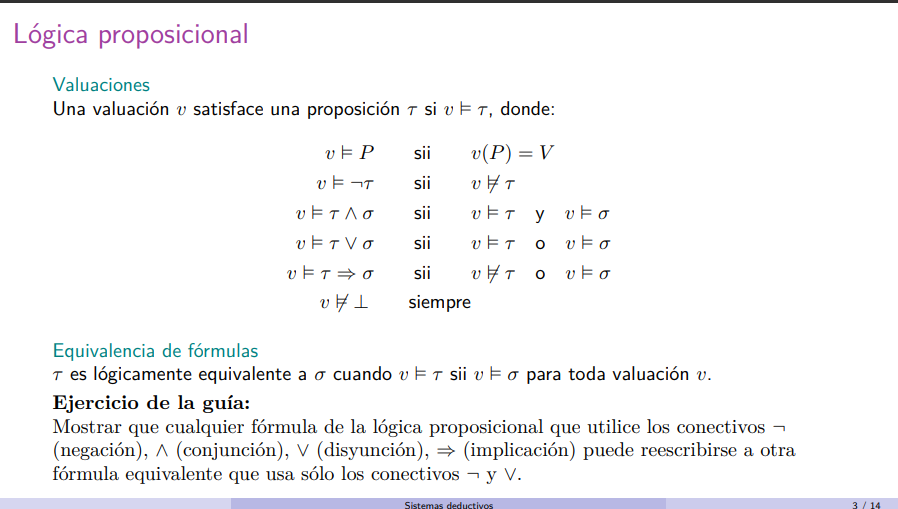
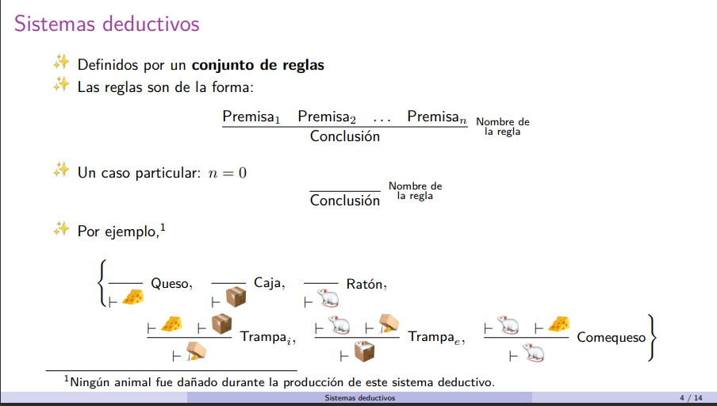
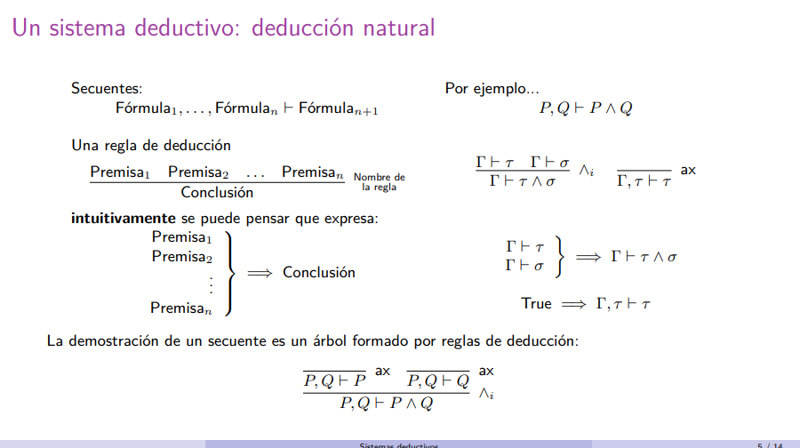
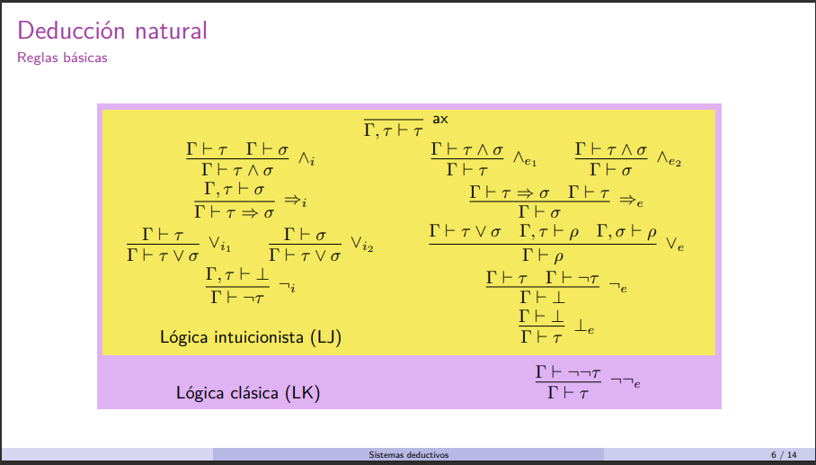
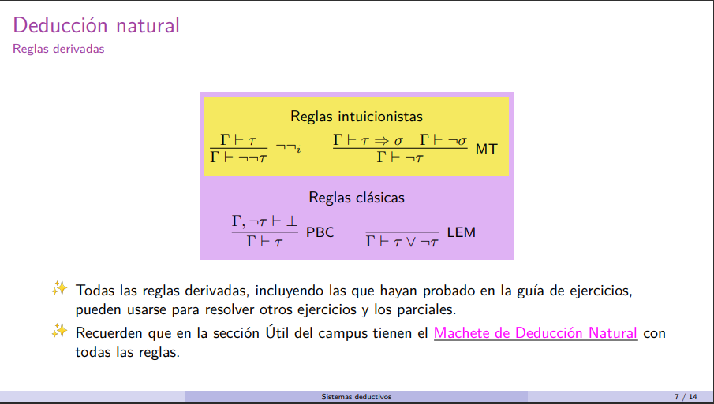
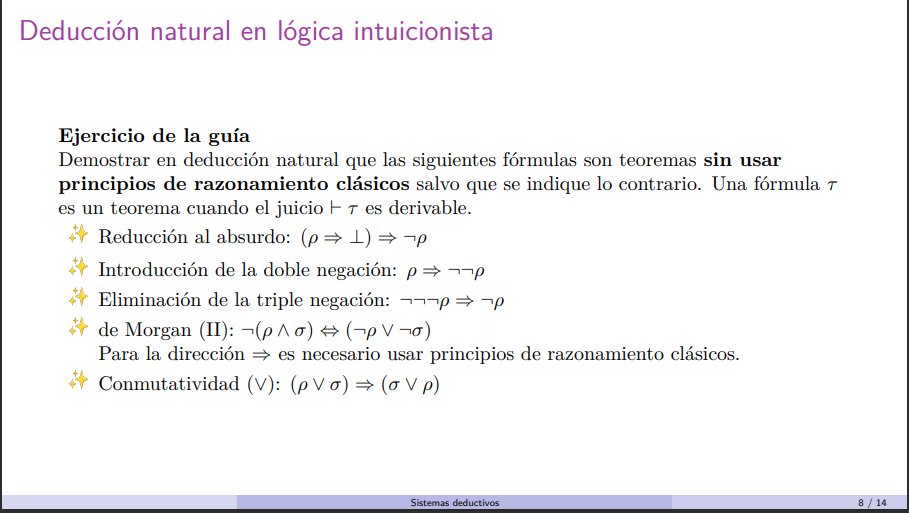
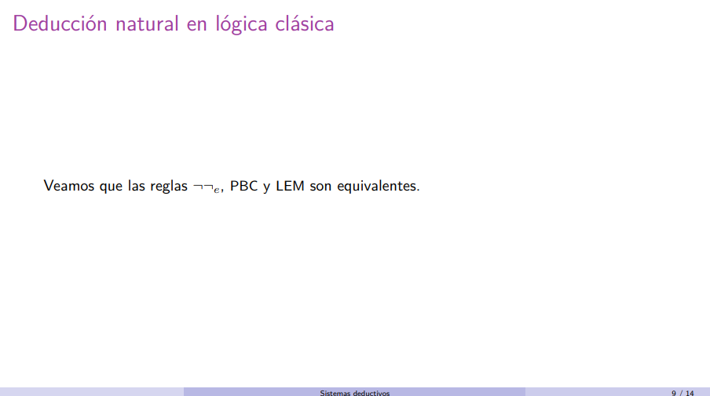
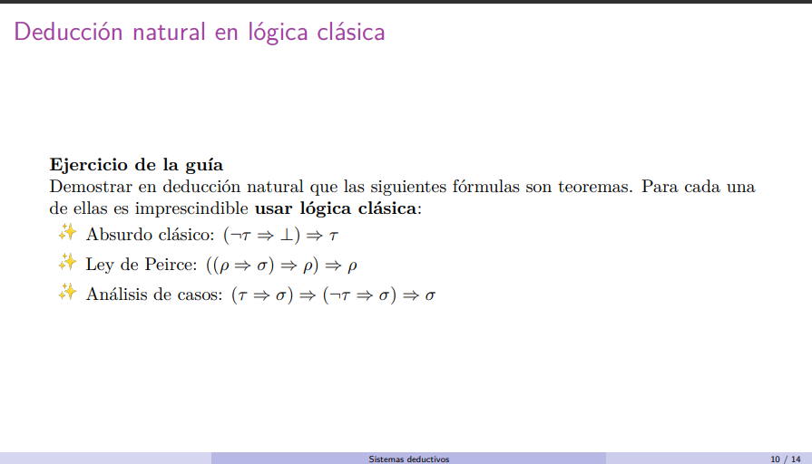
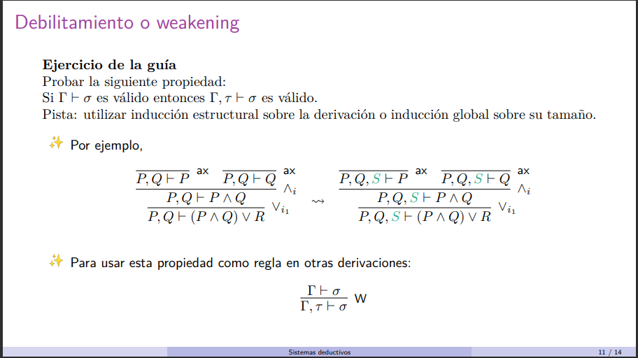

# Sistemas deductivos



Se hace por inducción estructural en las formulas. Hacemos inducción estructural porque la definición de la estructura es una estructura inductiva.

# Mostrar que cualquier fórmula de la lógica proposicional que utilice los conectivos ¬ (negación), ∧ (conjunción), ∨ (disyunción), ⇒ (implicación) puede reescribirse a otra fórmula equivalente que usa sólo los conectivos ¬ y ∨.

Inducción

```

P(t) = t == t'  

Caso base:
    t = P (variable proposicional)
            t = bottom (no cumple el antecedente, la implicación vale)

Casos inductivos:

    - t = ¬s  . HI = P(s) = E s'. s = s' y s' usa unicamente los conectivos ¬ y V.
        t' = ¬s'

    - t = s & p     . HI = P(s) & P(p) = E s'. E p'. s = s' & p = p'. s' y p' usan unicamente los conectivos ¬ y V.
        t' = ¬(¬s' V ¬p')
```




Los secuentes es una lista de hipotesis que validan a una tesis (es lo de $\Gamma \vdash \tau$)

(
$$
\Gamma: \text{ Hipótesis} \\
\vdash: \text{ valida} \\
\tau: \text{ tesis} \\
$$
)

<!-- Si tenemos algo como $\Gamma, \ \tau \vdash \tau$ eso es el equivalente a $\Gamma \union \{\tau\} \ \vdash \tau$ -->



1. Si suponiendo que vale $\tau$ llego a una contradicción, entonces puedo concluir que vale ¬$\tau$ 

2. completar.

3. de ⊥ podemos deducir cualquier cosa.





```
                ____________________ax   _______________ax
                (p => ⊥), p ⊢ p => ⊥    (p => ⊥), p ⊢ p
                _________________________________________=>e
                            (p => ⊥), p ⊢ ⊥
                _________________________________________¬i
                            (p => ⊥) ⊢ ¬p                  
                _________________________________________=>i
                            ⊢ (p => ⊥) => ¬p
```
```
                    __________________________ax
                            p ⊢ p
                    __________________________¬¬i
                            p ⊢ ¬¬p
                    __________________________=>i
                            ⊢ p => ¬¬p
```
```
Camino 1:
                    __________ax       _______
                       R ⊢ p          R ⊢ ¬p
                    ___________________________¬e
                          R = {¬¬¬p, p} ⊢ ⊥
                    ___________________________¬i
                            ¬¬¬p ⊢ ¬p
                    ___________________________=>i
                            ⊢ ¬¬¬ρ => ¬ρ

No nos ayuda porque tenemos más variables pero caemos en un caso practicamente igual.

Camino 2:
                        _______ax
                        R ⊢ p
                        _______¬¬i  ________ax
                        R ⊢ ¬¬p     R ⊢ ¬¬¬p
                    ___________________________¬e
                          R = {¬¬¬p, p} ⊢ ⊥
                    ___________________________¬i
                            ¬¬¬p ⊢ ¬p
                    ___________________________=>i
                            ⊢ ¬¬¬ρ => ¬ρ
```
```
                        ¬(p ∧ σ) ⇔ (¬p ∨ ¬σ)

                Esto se demuestra demostrando los dos lados


                            A                         B
                _______________________     ____________________
                ⊢ ¬(p ∧ σ) => (¬p ∨ ¬σ)    ⊢ (¬p ∨ ¬σ) => ¬(p ∧ σ)
                ________________________________________________∧i
                            ⊢ ¬(p ∧ σ) <=> (¬p ∨ ¬σ)


    (B)

                                    _________ax
                                    R, ¬p ⊢ σ
                                    _________∧e1   ___________ax
                                    R, ¬p ⊢ p   R, ¬p ⊢ ¬p          analogo a izquierda          
                    ___________ax   ___________________________¬e   _________________________
                    R ⊢ ¬p V ¬σ     R, ¬p ⊢ ⊥                       R, ¬σ ⊢ ⊥   
                    __________________________________________________________Ve
                            R = {¬p ∨ ¬σ, p ∧ σ} ⊢ ⊥
                    __________________________________________________________¬i
                            ¬p ∨ ¬σ ⊢ ¬(p ∧ σ)
                    __________________________________________________________=>i
                            ⊢ (¬p ∨ ¬σ) => ¬(p ∧ σ)


    (A)

                                        ______ax    _______ax
                                        R' ⊢ p      R' ⊢ σ  
                                        ___________________∧i   _______________ax
                                        R' ⊢ p ∧ σ              R' ⊢ ¬ (p ∧ σ)
                                        _______________________________________________________¬e
                                        R' = {¬(p ∧ σ), p, σ} ⊢ ⊥
                                        __________________________¬i    _______________________ax
                                           ¬(p ∧ σ), p ⊢ ¬σ                ¬(p ∧ σ), ¬p ⊢ ¬p
                    _______________LEM  __________________________Vi2   _______________________Vi1
                    ¬(p ∧ σ) ⊢ p V ¬p   ¬(p ∧ σ), p ⊢ ¬p ∨ ¬σ           ¬(p ∧ σ), -p ⊢ ¬p ∨ ¬σ
                    ___________________________________________________________________________Ve
                                                ¬(p ∧ σ) ⊢ (¬p ∨ ¬σ)
                    ___________________________________________________________________________=>i
                                                ⊢ ¬(p ∧ σ) => (¬p ∨ ¬σ) 
```

---


```
LEM => ¬¬e => PBC => LEM (es cíclico)
```

```
Hagamos LEM => ¬¬e


                                                        _______________ax _______________ax
                                                        R, ¬¬t, ¬t ⊢ ¬¬t  R, ¬¬t, ¬t ⊢ ¬t
                                                        __________________________________¬e
                                                                R, ¬¬t, ¬t ⊢ ⊥
        _______________LEM      _____________ax         __________________________________⊥e
        R, ¬¬t ⊢ t V ¬t         R, ¬¬t, t ⊢ t                   R, ¬¬t, ¬t ⊢ t
        __________________________________________________________________________________Ve
        R, ¬¬t ⊢ t
        _____________=>i                _______________asumimos
        R ⊢ ¬¬t => t                       R ⊢ ¬¬t
        _______________________________________________=>e
                        R ⊢ t
```
```
Hagamos PBC => LEM

                                                                       _____________ax
                                                                       R' ⊢ t 
                                                ______________ax       _____________Vi1
        tarea                                   R' ⊢ ¬(t V ¬t)         R' ⊢ (t V ¬t) 
        ____________________                   _____________________________________¬e
        R, ¬(t V ¬t), ¬t ⊢ ⊥                          R' = {R, ¬(t V ¬t), t} ⊢ ⊥
        __________________PBC                  ___________________________¬i
        R, ¬(t V ¬t) ⊢ t                       R, ¬(t V ¬t) ⊢ ¬t
        ___________________________________________________________________¬e
                                R, ¬(t V ¬t) ⊢ ⊥
        ___________________________________________________________________PBC
                                R ⊢ t V t
```
```
Hagamos ¬¬e => PBC
                                __________asumimos PBC
                                R, ¬t ⊢ ⊥
                                __________¬i
                                R ⊢ ¬¬t
                                __________¬¬e
                                R ⊢ t
```



```
        _____________________ax         _________________ax
        ¬t => ⊥, ¬t ⊢ ¬t => ⊥           ¬t => ⊥, ¬t ⊢ ¬t   
        _________________________________________________=>e
                        ¬t => ⊥, ¬t ⊢ ⊥
        _________________________________________________¬i
                        ¬t => ⊥ ⊢ ¬¬t
        _________________________________________________¬¬e
                        ¬t => ⊥ ⊢ t
        _________________________________________________=>i
                        ⊢ (¬t => ⊥) => t
```

```

                                                           ____________ax  ______________ax
                                                           R, ¬p, p ⊢ p    R, ¬p, p ⊢ ¬p
                                                           ______________________________¬e
                                                                          R, ¬p, p ⊢ ⊥      
                                                                          _______________⊥e
                                                                          R, ¬p, p ⊢ σ
                                                  _____________________ax _______________=>i
                                                  R, ¬p ⊢ (p => σ) => p   R, ¬p ⊢ p => σ
______________________LEM _____________________ax _______________________________________=>e       
(p => σ) => p ⊢ p V ¬p    (p => σ) => p, p ⊢ p       R = {(p => σ) => p, ¬p} ⊢ p 
_________________________________________________________________________________________Ve
                                (p => σ) => p ⊢ p
_________________________________________________________________________________________=>i
                                ⊢ ((p => σ) => p) => p
```
```

                                __________ax    _____ax
                                R ⊢ t => σ      R ⊢ t              análogo                         
_________________________LEM    _____________________________=>e   ________________________=>e
t => σ, ¬t => σ ⊢ t V ¬t        R = {t => σ, ¬t => σ, t} ⊢ σ       t => σ, ¬t => σ, ¬t ⊢ σ       
_________________________________________________________________________________________Ve
                                t => σ, ¬t => σ ⊢ σ 
_________________________________________________________________________________________=>i
                                t => σ ⊢ (¬t => σ) => σ 
_________________________________________________________________________________________=>i
                               ⊢ (t => σ) => (¬t => σ) => σ
```



Vamos a hacer la demo por induccion global en la altura del árbol.

```                                                          n             n
                                                          _______  -->  ________
Queremos demostrar que si tenemos un árbol de derivacion   R ⊢ t        R, t ⊢ t  . Con ese n nos referimos a la altura.

Caso base:

        Si n = 1                                        
                _____ax --> t pertenece R --> t pertenece R U {t'}      _________ax     
                R ⊢ t                                                   R, t' ⊢ t


Caso inductivo:
                                    i               i 
                                ________ -->    _________
        HI : A i. 1 <= i < n .  R ⊢ t         R, t' ⊢ t

        Queremos ver que vale P(n).

        Hay que analizar 12 casos. Uno por cada regla de inferencia. Se justifica con lema de generacion (porque nos permite afirmar que lo que tenemos tiene sí o sí alguna de las formas de las reglas de inferencia).

        Caso ∧i:

                             <=n-1      <=n-1
                             _______   ________
                             R ⊢ t''   R ⊢ t'''
                _____∧i ---> ___________________∧i ---> Meto un t' en cada contexto y me queda del
                R ⊢ t         R ⊢ t'' ∧ t'''        HI  mismo tamaño. Esa es la idea.


```
---

# Notas
- Si en el contexto tenemos una implicacion, entonces es probable que necesitemos una eliminación de la implicación.
- heuristica: todo lo que está a la izquierda del trinquete: se puede usar por eliminación, lo que está a la derecha: por introducción.
- Si estamos medio trabados es probable que necesitemos un principio clásico.