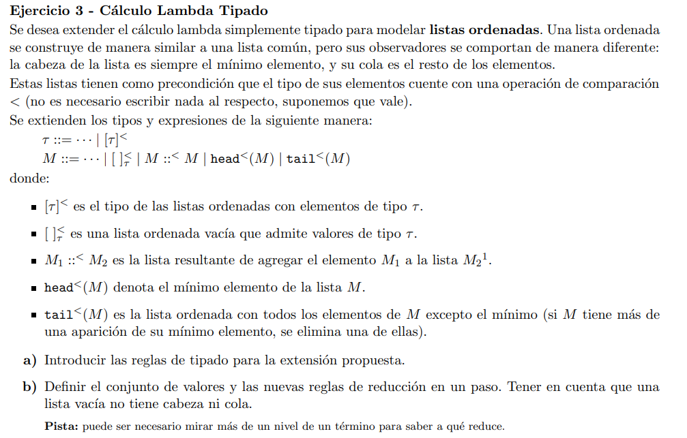
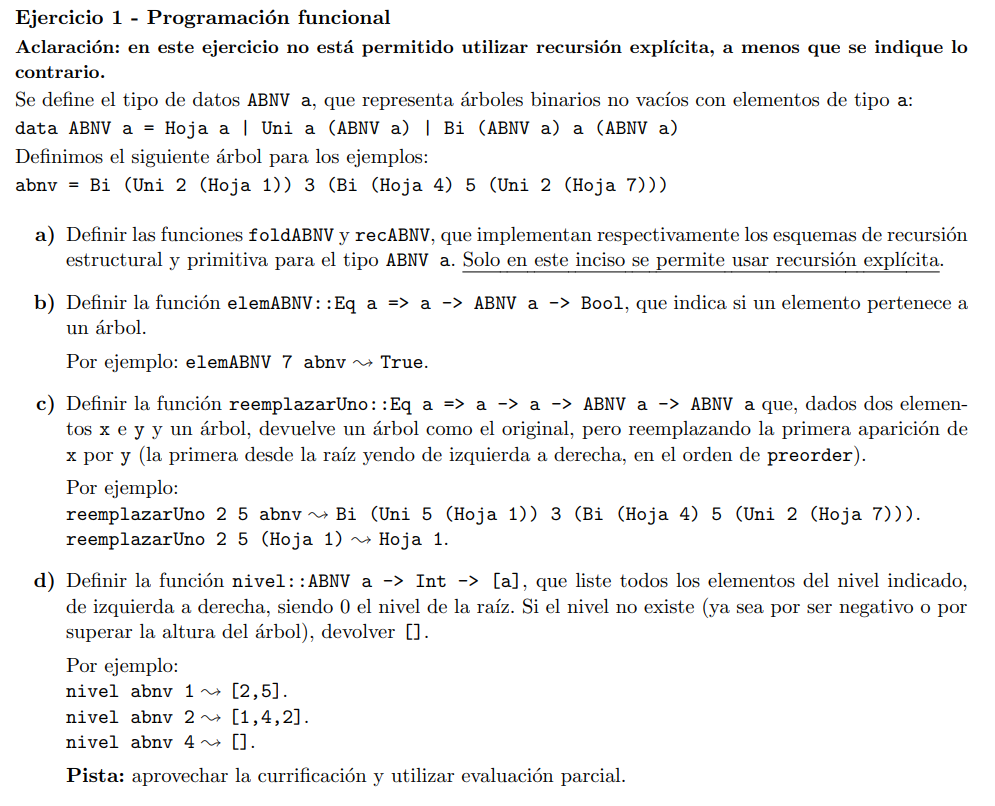
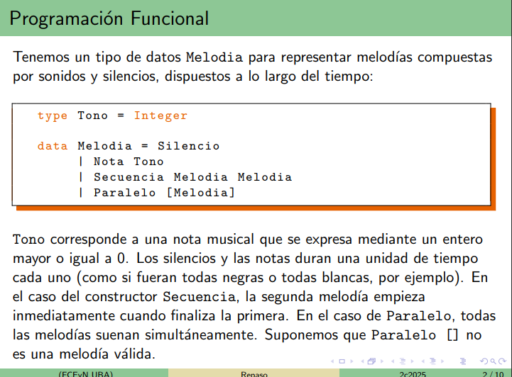
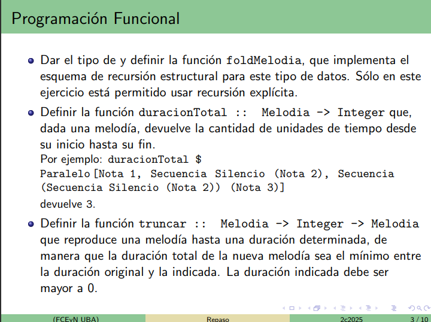
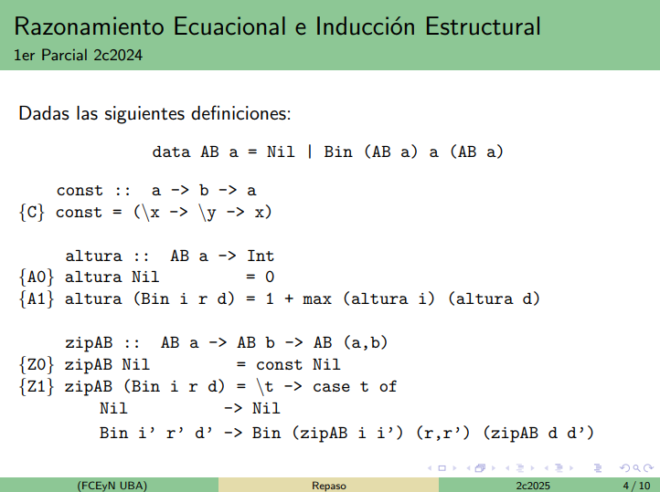
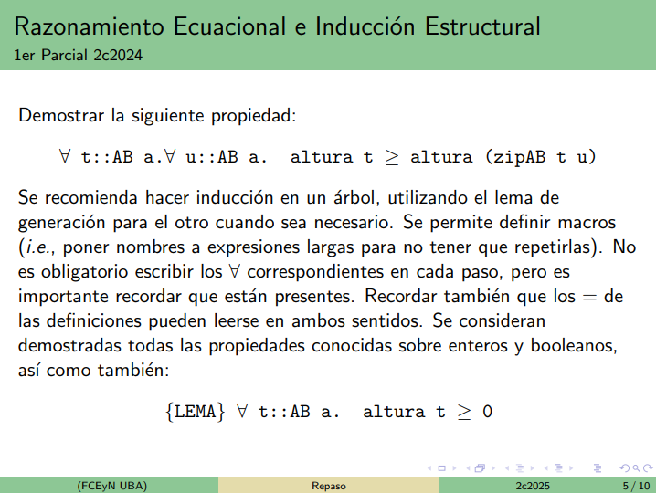
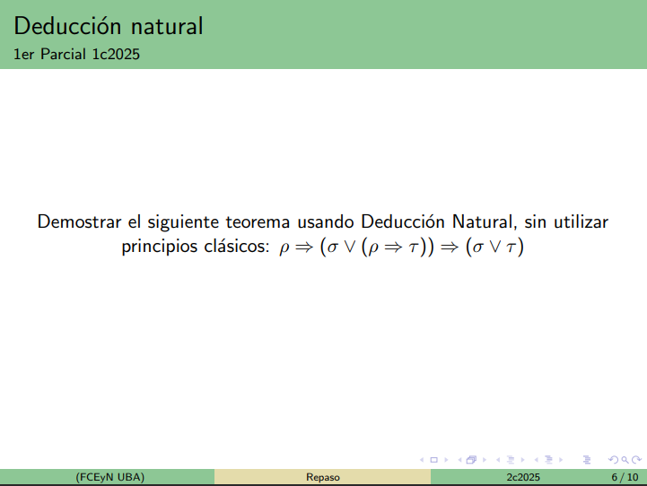

# Clase preparcial!


# Preguntas para hacer

---

¿Qué sería una regla de reducción en un paso?



es la (b)

---

¿Cuál sería una buena intuición para resolver el d?




# Ejercicios de parcial

## Programación funcional



Una buena estrategia cuando vemos un tipo de datos nuevo es pensar a qué tipo de datos nos hace acordar.

Secuencia recuerda a un árbol binario y Melodia recuerda al RoseTree



a) 

```haskell
type Tono = Integer

data Melodia = Silencio | Nota Tono | Secuencia Melodia Melodia | Paralelo [Melodia]

foldMelodia :: b -> (Tono -> b) -> (b -> b -> b) -> ([b] -> b) -> Melodia -> b
foldMelodia fsil ftono fsec fpara melodia = case melodia of
    Silencio        -> Silencio
    Nota t          -> ftono t
    Secuencia m1 m2 -> fsec (rec m1) (rec m2)
    Paralelo ms     -> fpara (map rec ms) -- hay que hacer un map porque fpara 
                                          -- solo resuelve para una lista, no para
                                          -- un b o un Tono suelto.
        where rec = foldMelodia fsil ftono fsec fpara
```

b)

```haskell
duracionTotal :: Melodia -> Integer
duracionTotal = foldMelodia 1 (const 1) (+) (maximum)

-- Es suma porque queremos la suma de los tiempos de cada secuencia.
-- Es maximum porque mapeamos la recursión a cada elemento de la lista y siempre vamos a caer en algún caso de los constructores, finalmente nos va a quedar un numerito en cada posición de la lista y queremos el maximo de esos porque todas las melodías suenan al mismo tiempo ;).
```

c)

```haskell
-- Ejemplos:

-- truncar Silencio 1 ~> Silencio
-- truncar Silencio 3 ~> Silencio
-- truncar (Nota 3) 3 ~> Nota 3
-- truncar (Secuencia (Nota 1) Silencio) 1 ~> Nota 1
-- truncar (Secuencia (Secuencia Silencio Silencio) (Secuencia Silencio Silencio)) 3 ~> Secuencia (Secuencia Silencio Silencio) Silencio
-- truncar (Secuencia (Secuencia Silencio Silencio) (Secuencia Silencio Silencio)) 1 ~> Silencio
-- truncar (Secuencia (Secuencia Silencio Silencio) (Secuencia (Nota 1) Silencio)) 1 ~> Nota 1

-- Truncar un paralelo significa truncar cada una de las melodias en la lista de melodias.

truncar :: Melodia -> Integer -> Melodia
truncar = foldMelodia (const Silencio) (\nota _ -> const nota) -- casos base
                      (\f1 f2 n -> 
                        let m1 = f1 n
                            duracionRestante = n - duracionTotal m1
                        in if duracionRestante > 0 
                            then Secuencia m1 (f2 duracionRestante)
                            else m1)
                      (\fs n -> Paralelo (map ($ n) fs))

-- Es (const Silencio) porque truncar recibe un n que es el Integer!
-- es f1 y f2 porque los casos base me devuelven funciones que esperan un n!
-- Aplicar f1 n lo que hace es cortar la primera mitad de la Secuencia.
-- es map ($ n) fs porque mapeamos la aplicación del n que esperan todas las funciones. O sea, eso aplica n a todas las funciones de fs.
-- fs es una lista de evaluaciones parciales.
-- El let es com un where pero que nos permite escribir primero los reemplazos.

equivalentes al caso Paralelo

(\fs n -> Paralelo (\rec n -> rec n) fs)
(\fs n -> Paralelo [rec n | rec <- fs])
```

```haskell
recMelodia :: b -> (Tono -> b) -> (Melodia -> Melodia -> b -> b) -> ([Melodia] -> [b] -> b) -> Melodia -> b
recMelodia fsil fnota fsec fpara melodia = case melodia of
    Silencio        -> fsil Silencio
    Nota t          -> fnota t
    Secuencia m1 m2 -> fsec m1 m2 (rec m1) (rec m2)
    Paralelo ms     -> fpara ms (map rec ms)

    where rec = recMelodia fsil fnota fsec fpara
```

## Razonamiento ecuacional e Inducción Estructural




$\forall$
```
Paso 1: predicado unario

P(t):=  ∀ u :: AB a. altura t >= altura (zipAB t u)
```
```
Caso Base:

    P(Nil) :=
        ∀ u :: AB a. altura Nil >= altura (zipAB Nil u)

                    altura Nil >= altura (zipAB Nil u) 
                    0 >= altura (zipAB Nil u)               {A0}
                    0 >= altura (const Nil u)               {Z0}
                    0 >= altura ((\x -> \y -> x) Nil u)     {const}
                    0 >= altura ((\y -> Nil) u)             {beta}
                    0 >= altura (Nil)                       {beta}
                    0 >= 0                                  {A0}
                    True                                    {Propiedad de enteros}
```
```
Paso inductivo:

    Sean ∀ i :: AB a. ∀ d :: AB a. ∀ r :: a. Quiero ver que (P(i) ∧ P(d) => P(Bin i r d))
                                                            ____________    _____________
                                                                HI              TI


    HI_1: P(i) = ∀ u_1 :: AB a. altura i >= altura (zipAB i u_1)
    HI_2: P(d) = ∀ u_2 :: AB a. altura d >= altura (zipAB d u_2)


    altura (Bin i r d)      >= altura (zipAB (Bin i r d) u)
    1 + max altura i altura d >= altura (zipAB (Bin i r d) u)                                                     {A1}

    1 + max altura i altura d >= altura ((\t -> case t of                                                     |
                                            Nil             ->   Nil                                          |   {Z1}   
                                            Bin i' r' d'    ->   Bin (zipAB i i’) (r,r’) (zipAB d d’)         |
                                      ) u )                                                                   |
                                      ______________________________________________________________________
                                                    macro

    1 + max altura i altura d >= altura (case u of                                                            |
                                        Nil -> Nil                                                            |   {beta}
                                        Bin i' r' d' -> macro                                                 |
                                        )                                                                     |

    Por lema de generación de árboles binarios, entonces u = Nil o u = Bin i' r' d'

    Caso u = Nil:
        1 + max altura i altura d >= altura (case Nil of                                                            |
                                            Nil -> Nil                                                              |
                                            Bin i' r' d' -> macro                                                   |
                                          )

        1 + max altura i altura d >= altura Nil                                                                      por case 
        1 + max altura i altura d >= 0                                                                               {A0}
        altura (Bin i r d) >= 0                                                                                      {A1}
        True                                                                                                         {LEMA} 

```

## Deducción natural



```
                                                                 __________________________________ax
                                                                    R, (q V (p => t)) ⊢ p
____________________________ax   _________________________ax     __________________________________Vi2
R ⊢ q V (p => t)                  R, (q V p) ⊢ (q V p)            R, (q V (p => t)) ⊢ q V p
____________________________Vi2  _________________________Vi1     __________________________________Vi1
R ⊢ (q V p) V (q V (p => t))      R, (q V p) ⊢ (q V p) V t          R, (q V (p => t)) ⊢ (q V p) V t
____________________________________________________________________________________________________Ve
        |                                   
        |
        |                   ________________ax  ________________ax  _________________ax
        |                   R, q V p ⊢ q V p    R, q V p, q ⊢ q     R, q V p, p ⊢ p
        |                   _________________________________________________________Ve
        |                   R, q V p ⊢ q                        
________________**          ________________Vi1    ______________Vi2
R ⊢ (q V p) V t             R, q V p ⊢ q V t        R, t ⊢ q V t
____________________________________________________________________________________________Ve
R = {p, (q V (p => t))} ⊢ q V t 
____________________________________________________________________________________________=>i
p ⊢ (q V (p => t)) => (q V t)
____________________________________________________________________________________________=>i
p => (q V (p => t)) => (q V t)


otro Ve que podíamos tomar era R ⊢ q V (p => t) y salía más corto
```
> CONSEJO: Si llegamos a tener una disyunción en el contexto entonces tal vez nos conviene hacer eliminación del V (Ve) con esa disyunción (que luego la vamos a poder probar trivalmente) y luego como la vamos a partir y meter en el contexto entonces eso puede ayudarnos.


