# Demo chica
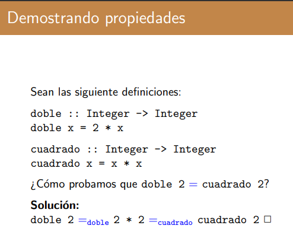

Por principio de igualdad es que esto vale.

# Propiedades útiles!
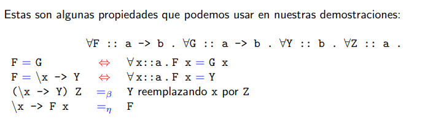

# Extensionalidad funcional
## curry . uncurry = id 
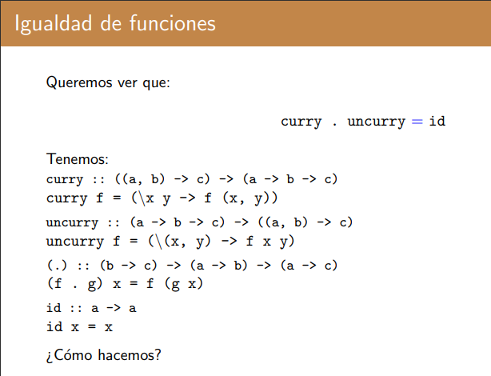

### Dem
```
∀ x::a->b->c . (curry . uncurry) x = id x

    (curry . uncurry) x = id x                            = 
    curry  (uncurry x)  = id x                            =        {def (.)}
    curry (\(x',y') -> x x' y') = id x                    =        {def uncurry}
    (\x'' y'' -> (\(x',y') -> x x' y') (x'', y'')) = id x =        {def curry}
    (\x'' y'' -> x x'' y'')                        = id x =        {def beta}
    (\x'' y'' -> x x'' y'')                        = id x =        {def beta}
    (\x'' -> y'' -> x x'' y'')                     = id x =        
    (\x'' -> x x'')                                = id x =        {def eta}
    x                                              = id x =        {def eta}
    x                                              = x    =        {def id}
```
> x : : a -> b -> c porque uncurry toma algo de ese tipo, devuelve algo de tipo ((a -> b) -> c) y curry devuelve algo de tipo a -> b -> c

# Lemas de generación
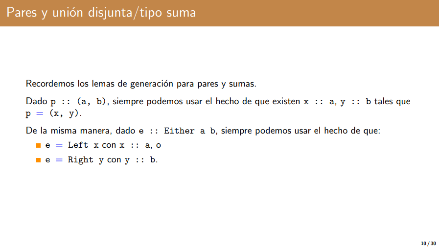

Lo que dice todo lema de generación es: dado un tipo de dato y una propiedad que queremos demostrar, entonces demostramos que esa propiedad es valida para cada uno de sus constructores.

## Either Int (Int, Int) . prod p q = prod q p
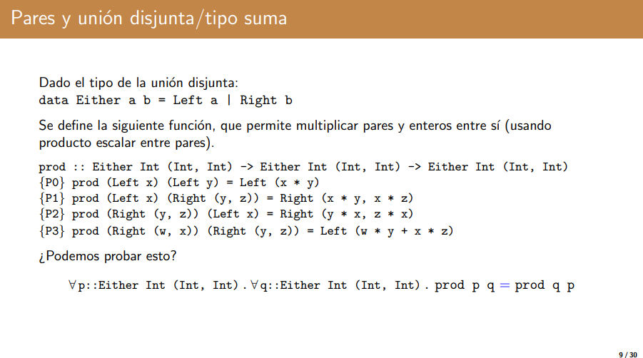
```
∀ p::Either Int (Int, Int) . ∀ q::Either Int (Int, Int) . prod p q = prod q p

    p y q pueden ser o de tipo Left Int o Right (Int, Int)

    Por lema de generación:
        p :: Either Int (Int, Int).
            o bien p = Left x_1           x_1 :: Int 
            o bien p = Right p_1          p_1 :: (Int, Int)

    como p_1 es de tipo par (Int, Int), entonces seguro que cuando demostremos vamos a tener que hacer uso de lema de generación de pares.

    Por lema de generación de pares:
        p_1 :: (Int, Int)
            ∃ y_1, z_1 :: Int. y = (y_1, z_1)

    Tenemos que hacer lo mismo para q. 

    Por lema de generación:
        q :: Either Int (Int, Int).
            o bien p = Left x_2           x_2 :: Int 
            o bien p = Right p_2          p_2 :: (Int, Int)

    como p_2 es de tipo par (Int, Int), entonces seguro que cuando demostremos vamos a tener que hacer uso de lema de generación de pares.

    Por lema de generación de pares:
        p_2 :: (Int, Int)
            ∃ y_2, z_2 :: Int. y = (y_2, z_2)

    Para resolver esto veamos por casos:

    1. 
        p = left x_1
        q = left x_2

        prod left x_1 left x_2 = prod left x_2 left x_1 =
        Left (x_1*x_2) = prod left x_2 left x_1         =               {P0}
        Left (x_1*x_2) = left (x_2*x_1)                 =               {P0}
        Left (x_1*x_2) = left (x_1*x_2)                 =               {def conmutatividad}
    
    2. 
        p = Left x_1
        q = Right (y_2, z_2)

        prod (Left x_1) (Right (y_2, z_2)) = prod (Right (y_2, z_2)) (Left x_1) =       
        prod Right (x_1*y_2, x_1*z_2)      = prod (Right (y_2, z_2)) (Left x_1) =       {P1}     
        Right (x_1*y_2, x_1*z_2)           = Right (y_2*x_1, z_2*x_1)           =       {P2}     
        Right (x_1*y_2, x_1*z_2)           = Right (x_1*y_2, x_1*z_2)           =       {def conmutatividad}     

    3. 
        Es analogo a 2. pero cambiando el orden de las operaciones
    
    4. 
        p = Right (y_1, z_1)
        q = Right (y_2, z_2)

        prod (Right (y_1, z_1)) (Right (y_2, z_2)) = prod (Right (y_2, z_2)) (Right (y_1, z_1)) = 
        Left (y_1*y_2 + z_1*z_2) = prod (Right (y_2, z_2)) (Right (y_1, z_1))                   =   {P3}
        Left (y_1*y_2 + z_1*z_2) = Left (y_2*y_1 + z_2*z_1)                                     =   {P3}
        Left (y_1*y_2 + z_1*z_2) = Left (y_1*y_2 + z_1*z_2)                                     =   {def conmutatividad}
```

## interseccion d (diferencia c d) = vacío

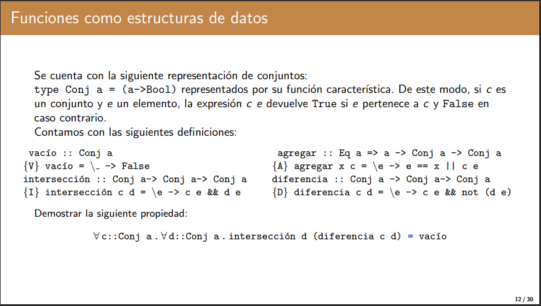

```
∀ c::Conj a . ∀ d::Conj a . interseccion d (diferencia c d) = vacıo

    Por extensionalidad funcional, para demostrar esto basta ver que:

        ∀ x::a. interseccion d (diferencia c d) x = vacıo x

    Para el lado derecho:

        vacio x = (\_ -> False) x
        vacio x = False             {Por beta}

    Entonces quiero ver que el lado izquierdo es igual a False.

    interseccion d (diferencia c d) x       =                             
    (\e -> d e && (diferencia c d) e) x     =                             {I}
    d x && (diferencia c d) x               =                             {beta}
    d x && (\e -> c e && not (d e)) x       =                             {D}
    d x && c x && not (d x)                 =                             {beta}
    False                                   =                             {propiedad de booleanos}
```

## Notas
- El principio de extensionalidad funcional me dice que dos funciones son iguales si son iguales 1 a 1.

# Inducción estructural

> Lo primero siempre es entender la propiedad y convencerse de que es verdadera.

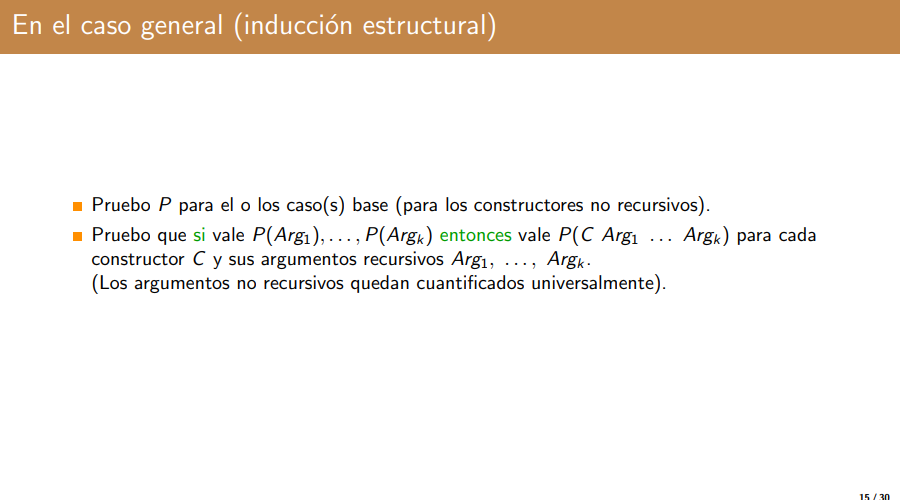

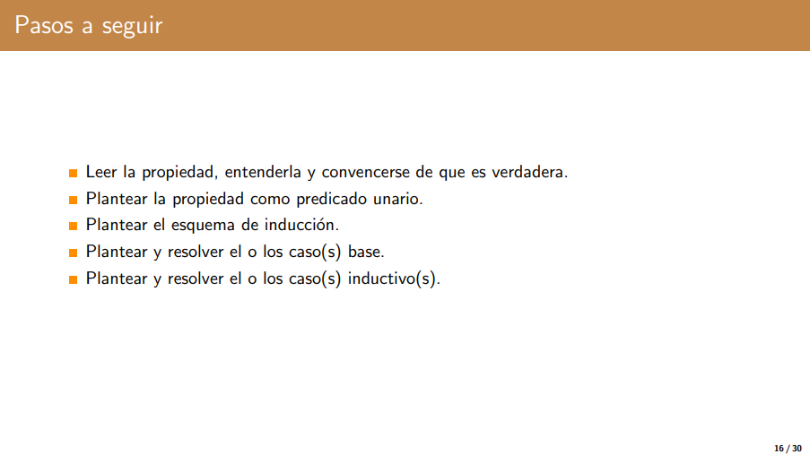

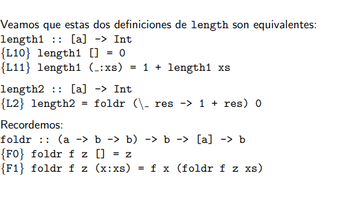


## length1 = length 2

Probemos que length1 = length2

```
Por extensionalidad funcional basta ver que:
    
    ∀ ys::[a]. length1 ys = length2 ys

    P(xs) ≡ length1 xs = length2 xs

    Caso base:
        P([]) ≡
            length1 [] = length2 []                     =                     
            0 = length2 []                              =                     {L10}
            0 = foldr (\ res -> 1 + res) 0 []           =                     {L2}
            0 = 0                                       =                     {F0}

    El caso base se ve comprobado.

    Paso inductivo:
                P(xs) = length1 xs = length2 xs
                    HI    = length1 xs = length2 xs (= P(xs))
                    TI    = P(x:xs)
            
            length1 (x:xs) = length2 (x:xs)                                                   =                       
            1 + length1 xs = length2 (x:xs)                                                   =                       {L11}
            1 + length2 xs = length2 (x:xs)                                                   =                       {HI}
            1 + length2 xs = foldr (\_ res -> 1+ res) 0 (x:xs)                                =                       {L2}
            1 + length2 xs = (\_ res -> 1+res) x (foldr (\_ res -> 1 + res) 0 xs)             =                       {F1}
            1 + length2 xs = (\res -> 1+res) (length2 xs)                                     =                       {beta}
            1 + length2 xs = 1 + length2 xs                                                   =                       {beta}

    El paso inductivo se ve comprobado.
```

## elem e ys ⇒ elem (f e) (map f ys)
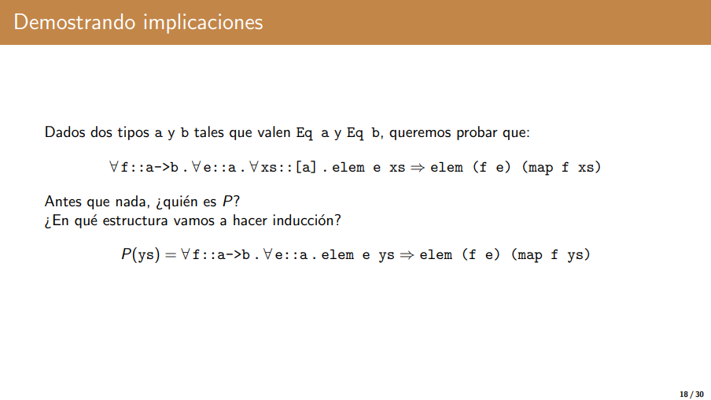

#### ¿Tiene sentido hacer inducción?

##### Sí porque estamos trabajando con un tipo de dato que es inductivo (o sea que tiene constructores).

### Dem
```
    P(ys) ≡ ∀ f :: a->b. ∀ e::a. elem e ys => elem (f e) (map f ys)

    Caso base:

        P([]) ≡ 
            elem e [] => elem (f e) (map f [])
            False => elem (f e) (map f [])          {Por F0}
            False => ...                            {Vale por lógica}

    Paso inductivo:

        HI: ∀ f::a->b. ∀ e::a. elem e xs => elem (f e) (map f xs) |||| ojo que acá NO va ∀ xs:: [a] porque sino estamos afirmando de que vale lo que queremos demostrar y entonces no estamos demostrando nada.

        TI: P(x:xs)

        Izquierda:
            elem e (x:xs)                                       =               
            e == x || elem e xs                                 =               {E1}
        
        Derecha:
            elem (f e) (map f (x:xs))                               =               
            elem (f e) (f x: map f xs)                              =               {M1}
            f e == f x || elem e (map f xs)                         =               {E1}

        Por lema de generación de Bool e == x es True o False

            - Caso True:
                por congruencia f e == f x = True
                    True || ... => True || ... Vale por lógica
                    ___________    ___________ 
                        izq            der
            
            - Caso False:
                izq: False || elem e xs = elem e xs

                    Por HI: elem e xs => elem (f e) (map f xs)
                    
                    Por propiedad de Bool:
                        ∀ x, y, z :: Bool (x => y) => x => z V y

                        entonces por HI y propiedad de bool nos queda que
                            elem e xs => f e == f x || elem (f e) (map f xs)
                            _________           ___    _____________________
                                x                z              y

```

> Para poder separar en casos siempre tenemos que hacer uso de una propiedad que nos permita afirmar que estamos haciendo lo correcto... ¿A qué suena? -_-_-_-_-_-_-_-_-> Lemas de generación; o sino alguna propiedad que en principio no es tan trivial y que -si bien nos puede resolver el problema en un paso- hay que demostrarla.
> Un propiedad que pudimos haber usado era 
$$
∀ w,x,y,z : : Bool. (w \implies x \land y \implies z) \implies (w \lor y \implies x \lor z)
$$

## length ys = length (reverse ys) que por reverse es igual a length ys = length (foldl (flip (:)) [] ys)

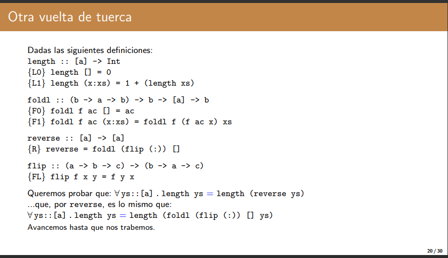

La profe confirmó que nos vamos a trabar en el paso inductivo. Salteamos el caso base.

```
P(ys) = length ys = length (foldl (flip (:)) [] ys)

    Paso inductivo:

        HI: length xs = length (foldl (flip (:)) [] xs)
        TI: P(xs)
    
        izquierda:  
            length (x:xs)                                                   = 
            1 + length xs                                                   =       {L1} 
            1 + length (foldl (flip (:)) [] xs)                             =       {HI} 
        
        Derecha:
            length (foldl (flip (:)) [] (x:xs))                             =        
            length (foldl (flip (:)) (flip (:) [] x) xs)                    =        {F1}
            length (foldl (flip (:)) (flip (:) x []) xs)                    =        {FL}
            length (foldl (flip (:)) (x:[]) xs)                             =        {beta}
        
        Problema: 
            El acumulador nos cambia siempre.
        Solución:
            Tenemos que usar un lema que nos permita probar algo un poco más general y que este sea un caso particular.
        
        LEMA:
            ∀ ys, zs :: [a]. length ys + length zs = length (foldl (flip (:)) zs ys)
                                                            ________________________
                                                             esto es como concatenar
                                                             las dos listas.
            
        IDEA: Demostrar que la propiedad que quiero demostrar es corolario del LEMA.

        Como zs = [], entonces por LEMA: 
            Izquierda:
                length ys + length [] =                                     {L0} 
                length ys + 0 = 
                length ys
            
            Derecha:
                length (foldl (flip (:)) [] ys) = 
                length ys                                                   {LEMA}

            Demostración de LEMA:

                Q(ys) = ∀ zs::[a]. length ys + length zs = length (foldl (flip (:)) zs ys)

                    Caso base:
                        Q([])=
                            length [] + length zs = length (foldl (flip (:)) zs [])
                        
                        Izquierda:
                            length [] + length zs =
                            0 + length zs         =                                    {L0}
                            length zs             =                                    {L0}
                        
                        Derecha:
                            length (foldl (flip (:)) zs []) =
                            length zs                       =                           {F0}
                    
                    El caso base se ve comprobado.

                    Paso inductivo:
                        HI: Q(x:xs)
                        TI: (x:xs)

                        Izquierda:
                            length (x:xs) + length zs   =                         
                            1 + length xs + length zs   =                                  {L1}                    
                            1 + (length xs + length zs) =                                

                        Derecha:
                            length (foldl (flip (:)) zs (x:xs))              =                       
                            length (foldl (flip (:)) (flip (:) zs x) xs)     =                       {F1}
                            length (foldl (flip (:)) ((:) x za) xs)          =                       {FL}
                            length (foldl (flip (:)) (x:zs) xs)              =                       {beta}
                            length xs + length (x:zs)                        =                       {HI}
                            length xs + 1 + length zs                        =                       {L1}
                            1 + length xs + length zs                        =                       {L1}
                            1 + (length xs + length zs)                      =                       {L1}

                    El paso inductivo se ve comprobado.

                Como el caso base y el paso inductivo se ven comprobados, entonces por principio de inducción LEMA queda demostrado.
            
            Como demostramos LEMA, entonces su uso en nuestra propiedad inicial es válido y por lo tanto la propiedad es verdadera.
```
- Cuando tenemos foldl aplicar inducción de una no suele ser útil porque el acumulador va cambiando constantemente.
- Para el LEMA convenía hacer inducción en ys porque ys es que foldl usa para hacer recursión.

## cantNodos t = length (inorder t)

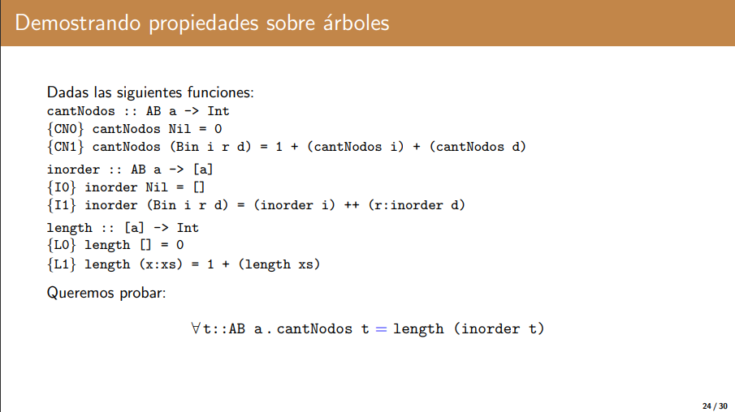

```
P(t) = cantNodos t = length (inorder t)

    Caso base:
        P(Nil):
            cantNodos Nil = length (inorder Nil)
            0 = length (inorder Nil)                     =                               {CN0}
            0 = length ([])                              =                               {I0}
            0 = 0                                        =                              {L0}

    Paso inductivo:
        P(Bin i r d)
        HI: P(i) \land P(d)

        Izquierda:
            cantNodos(Bin i r d)                         =          
            1+ (cantNodos i) + (cantNodos d)             =                                 {CN1}

        Derecha:
            length (inorder (Bin i r d))                 =    
            length ((inorder i) ++ (r: inorder d))       =                                  {I1}

        LEMA:  
            length (xs++ys) = length xs + length ys

            length (inorder i) + length (r: inorder d)   =                                  {LEMA}
            length (inorder i) + 1 + length (inorder d)  =                                  {L1}
            (cantNodos i) + 1 + (cantNodos d)            =                                  {HI}
            1 + (cantNodos i) + (cantNodos d)            =                                  {HI}

        Demostración de LEMA:

            Tarea.
```

## Ejercicio para plantear esquema de inducción
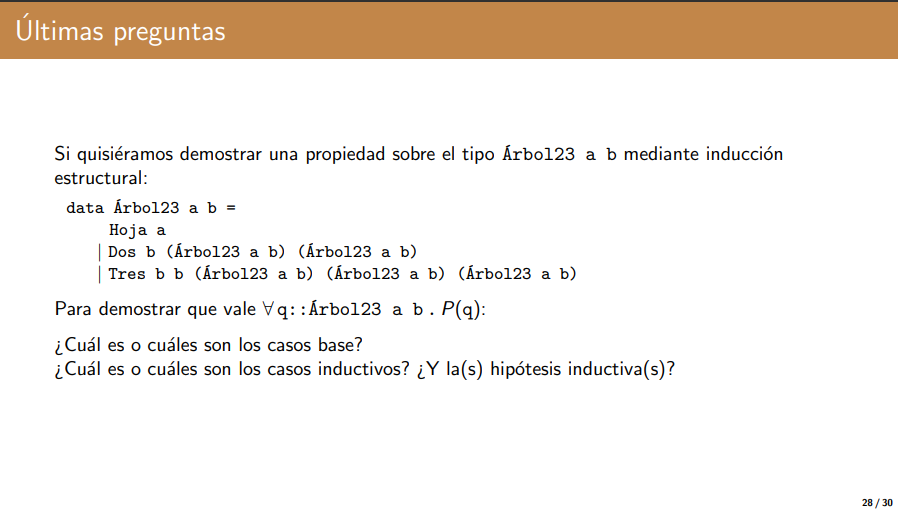

```
Casos base:
    q = Hoja x          (con x::a)

Caso inductivo:
    q = Dos x i d 
    HI = P(i) \land P(d)

Caso inductivo:
    q = tres x y i c d  ()
    HI= P(i) \land P(c) \land P(d)
```

- Para sacar este LEMA solamente había que pensar que necesitaba una propiedad que me dijera que el length de una lista++otra_lista es igual al length de lista + length otra_lista.
# Notas
- La regla $\beta$ es la que se refiere a "evaluar" a la función con el argumento que le estás pasando.
- La regla $\eta$ es la que se refiere a "sacar" los argumentos que se encuentran al final del lado izquierdo y al final del lado derecho.
- Siempre que estemos demostrando algo tenemos que pensar en qué queremos demostrar y tomar un camino que sí nos lleve a esa solución.
- Si no sabemos muy bien por donde llevar la demostración podemos partir por el final de la demo o bien desde el principio y vamos completando desde uno de los lados hasta que nos trabemos, y luego vamos con el otro lado hasta que nos trabemos, si no llegamos a probar la igualdad con esto pero llegamos a cosas muy parecidas, entonces probablemente necesitemos probar un lema!
- No se puede hacer inducción en una función y tampoco sobre datos que no tenemos ni idea de lo que son.
- Escribir y no mostrar el paso de razonamiento ecuacional baja puntos. Escribir y luego aplicar el paso de razonamiento ecuacional está bueno para nosotros pero para los profes no.
- Lema de generacion para listas vs inducción: la inducción nos permite usar la Hipótesis inductiva.
- Una buena manera de saber en cuál parámetro hay que hacer inducción nos conviene usar el que aperece en las ecuaciones.

# Receta para inducción estructural
- Convencerse de que la propiedad es real.
- Plantear la propiedad como predicado unario.
- Probar el caso base.
- Probar el caso inductivo.
- Feliz cumpleaños.