# Intro

Los paradigmas de programación son las distintas formas que tenemos de abordar la realidad.

Algunos tipos:

- Paradigma de programación concurrente.

# Programación orientada a objetos

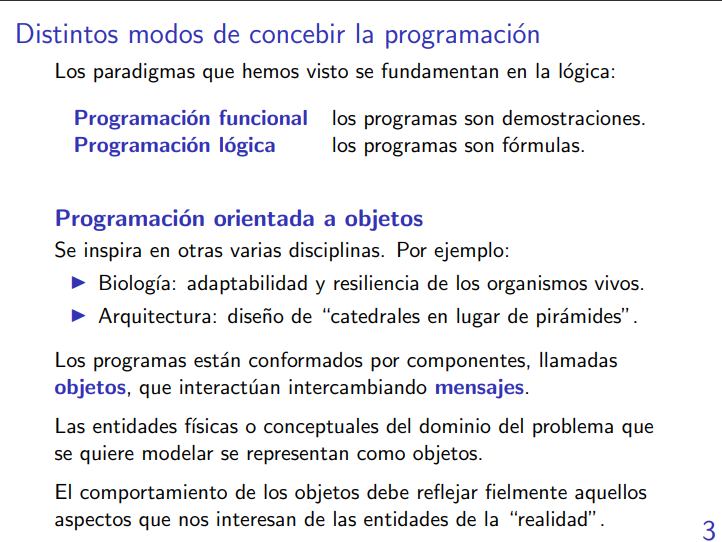

> Esto es algo así como ir construyendo diferentes computadoras que hacen algo en específico y que van a terminar interactuando entre sí para poder resolver un problema en particular. 

> Cualquier cosa puede ser un objeto, literalmente.

## Notas
- La POO no se basa en la lógica como sí lo hace la programación funcional (en cierta forma) y la lógica. O sea, no es que no haya lógica (porque sino no sería ni un programa, tal vez).
- La POO nos invita a modelar la realidad de una forma un poco más "natural" a como vemos o interactuamos con el universo.

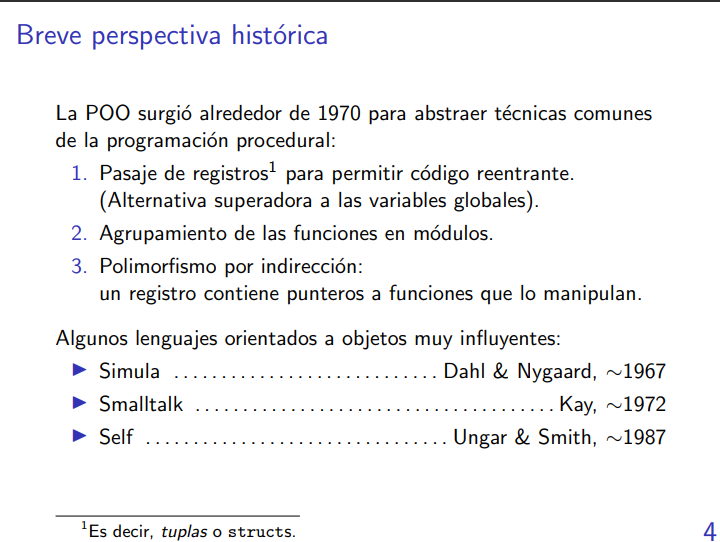


# Conceptos fundamentales en POO

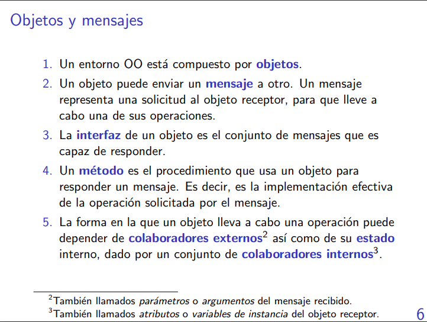

Pensar POO es como pensar un entorno donde uno empieza a interactuar con objetos. No tanto pensarlo como un lenguaje en particular.

> **mensaje VS método:** mensaje es la petición/solicitud de un objeto a otro. 
La cuestión es que dependiendo del objeto receptor, este puede implementar un método que es el que responde al mensaje.

> Lo único que pueden hacer los objetos (de forma simple) es enviar y recibir mensajes.

> Hablar de objetos es como hablar de una computadora, cuando este envía o recibe un mensaje puede colaborar con otros objetos para poder responder a una solucitud. Está bien hablar de código cuando hablamos de "objetos".

> Los mensajes son objetos.

> Los métodos no serían funciones en sí (aunque a veces les decimos de esa manera) porque pueden modificar el estado interno de un objeto y no siempre nos pueden llegar a devolver lo mismo aunque le pasemos los mismos parámetros (que es lo que hace por definición una función).

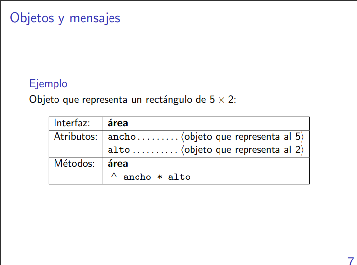

La interfaz es el conjunto de mensajes que puede recibir el objeto.

El método área lo que hace es enviarle al mensaje 'ancho': multiplicar por 'alto'. Esto es así porque en POO solo pueden enviarse y recibirse mensajes entre objetos, **no** se vale algo diferente a eso.

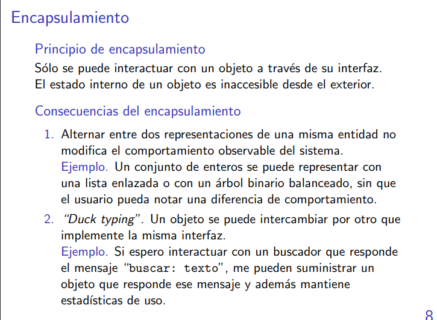

> A un objeto solo le interesa cuál es la forma de otro objeto y no cómo está construido.

> El encapsulamiento es basicamente hacer que exista poca dependencia entre códigos.

- El encapsulamiento está fuertemente apegado al principio de bajo acoplamiento. Me encanta eso.

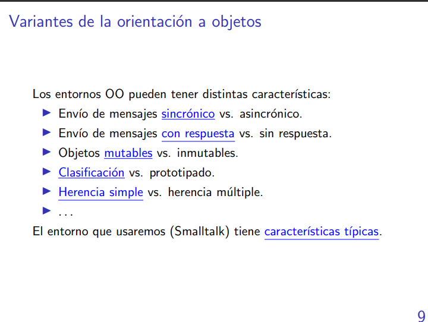

> sincrónico: envío un mensaje y me mantengo esperando hasta obtener la respuesta.

> asincrónico: envío un mensaje y me pongo a hacer otras cosas mientras espero la respuesta.

> mutable: el envío de un mensaje puede modificar el estado interno del objeto.

> clasificación: cada objeto pertenece a una clase. Ejemplo: un perro en particualr pertenece a un tipo de perros; o un tipo de animal pertenece a una familia (gatos -> felinos, perros -> caninos); es una jerarquía.

> prototipado: los objetos no se clasifican, simplemente hay muchos objetos y si quiero un nuevo objeto, entonces copio a uno existente.

> Herencia simple: cada clase hereda algo de una clase a la que pertenece (como que el perro Golden herede de la clase Perro el método ladrar). Se dice que una clase hereda de una super clase.

> Herencia múltiple: una clase que hereda de muchas super clases.

- La mayoría de lenguajes de programación elijen las carácterísticas qeu están subrayadas.

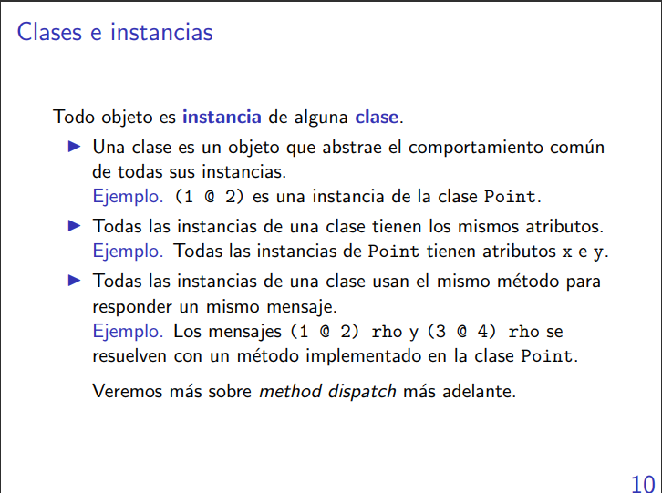

> Todo objeto es instancia de una -y solo una- clase.

> ese @ funciona como (1, 2) para la clase Point. Es como hacer print(type(1 @ 2)) ~~~> Point

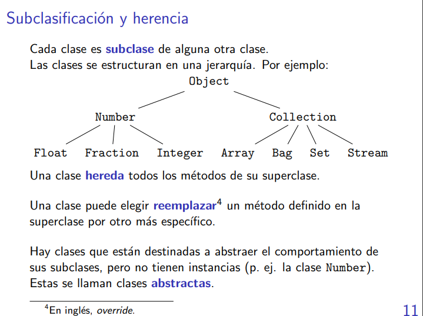

Como en este caso solo hay herencia simple, entonces cada clase solo tiene una superclase.

> Cuando le mando un mensaje a un objeto, se responde con solo un método.

> Que una clase sea abstracta es como cuando en python hacemos una clase que no tenga un \___init\___ y que solo tenga un conjunto de métodos.

# Introducción a la POO en SmallTalk

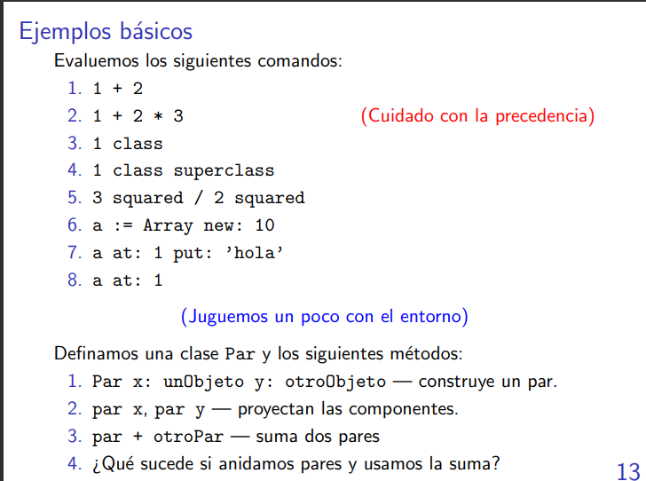

En SmallTalk los operadores no tienen precedencia, siempre se asocia a izquierda. Se arregla con paréntesis.

El mensaje unario tiene mayor precedencia que el binario. Ese squared sí se comporta como uno espera en esa expresión.

> La superclase de Object es ProtoObject y la superclase de eso es nil. La superclase de nil tira un error si la consulto.

> ``` a := Array new: 10 ``` Me da un array de tamaño 10 con todas sus posiciones en nil.

> La indexación de posiciones en SmallTalk comienza desde 1 y no desde 0.

> En ```a at: 1 put: ’hola’``` el único mensaje que se le manda a 'a' es: ```at: 1 put: ’hola’```

> El mensaje ```a at: 1``` es totalmente distinto de ```a at: 1 put: ’hola’```, para SmallTalk es así. Uno es el mensaje ```at:``` y el otro es el mensaje ```at:put:``` (así es la notación de SmallTalk).

- Los mensajes que podemos usar son de 3 diferentes formas: unarios (como squared), binarios (como +) y keyword (como at:).

> Las clases son objetos pero no todos los objetos son clases.

1. 
```smalltalk
x: unObjeto y: otroObjeto
    ^self new inicializarX: unObjeto y: otroObjeto
```

> El ^ es el return.

> ``self new`` es una instancia de Par.

Aquí definimos como una clase responde a este mensaje.

Ahora nos queda ver como una instancia de la clase responde a un mensaje.

```smalltalk
inicializarX: unObjeto y: otroObjeto
    componenteX := unObjeto.
    componenteX := unObjeto.
```

> y lo guardamos como una variable de instancia (los colaboradores internos de los que hablamos hace rato).

```smalltalk
+ otroPar
    ^Par x: (self x + otroPar x) y: (self y + otroPar y)
```

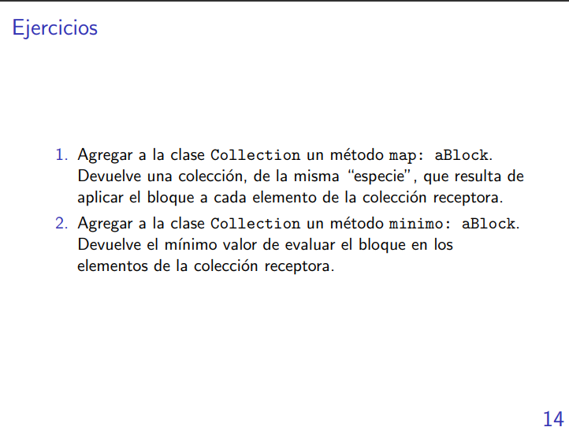

```smalltalk
map: unBloque
    | (self nuevaColeccion) |
    nuevaColeccion := self species new. # me devuelve al clase de la instancia
    self do: [:x | 
        nuevaColeccion add: (unBloque value x)
    ].
    ^nuevaColeccion
```

> un bloque es una expresión que se encuentre entre corchetes ([]), y es como una lambda.

```smalltalk
coleccion map [x | x*x]
```
2. 
    ```smalltalk
    minimo: unBloque
    | minimoHastaAhora |
    minimoHastaAhora := Infinito new
    self do: [x |
        | y |
        y := unBloque value x.
        (minimoHastaAhora > y) 
            ifTrue: [
                minimoHastaAhora := y
            ]
    ].
    ^minimoHastaAhora
    ```
    ```
    DENTRO DE Infinito
    > x
        ^true.
    ```

> el do es como un for.

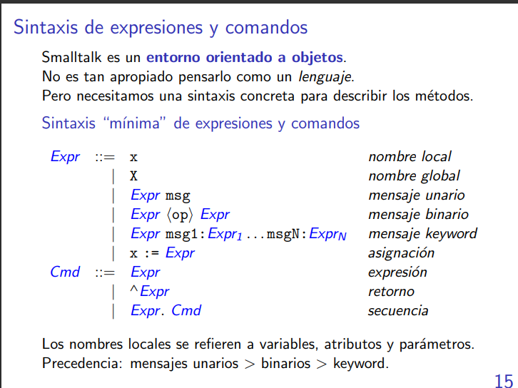

Cmd se le piensa como un comando.

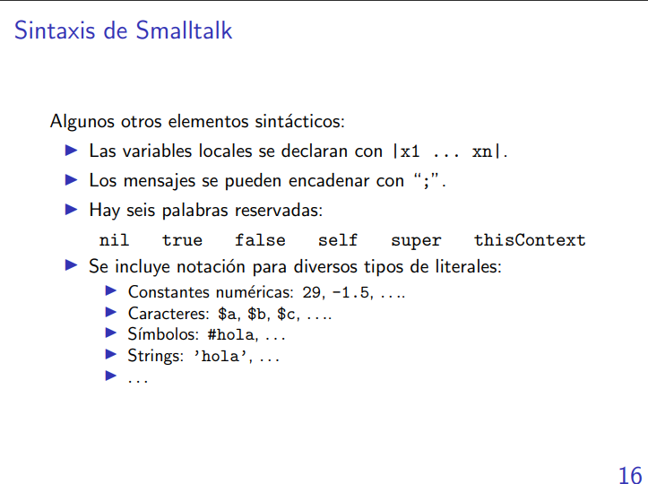

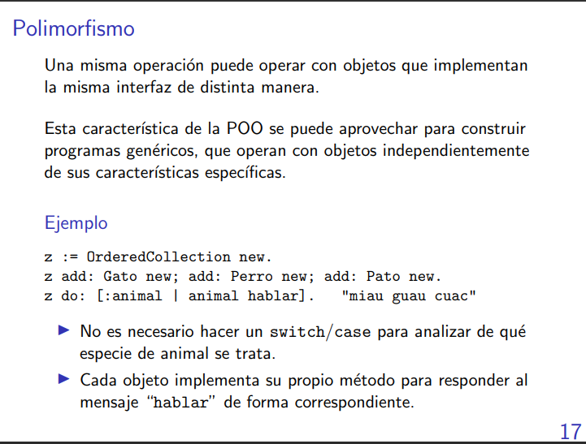

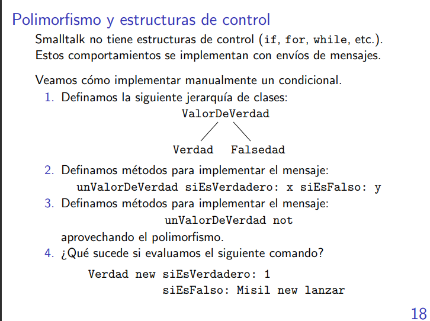

```
siEsVerdadero unBloque siEsFalso
    ^unBloque
```
> IMPORTANTE: acá en el return se evalúa a unBloque antes de retornarlo.

4. Es importante notar que se va a lanzar al misil porque para poder saber si es verdadero o no hay que evaluar ambas "guardas", entonces terminas lanzando al misil.

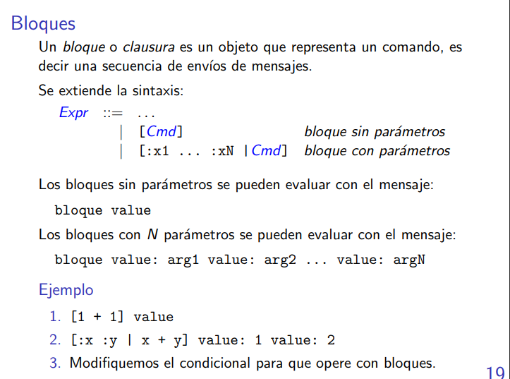

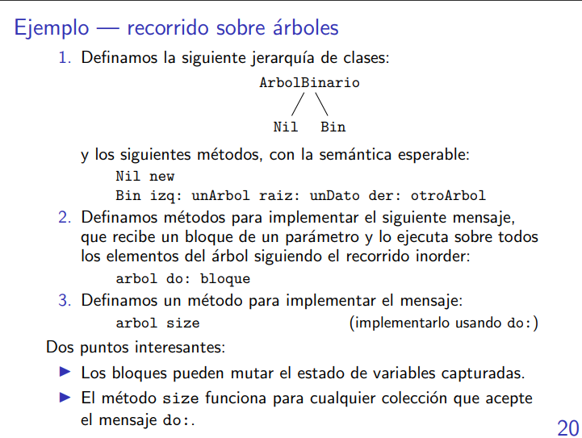

```
size
    | contador |
    contador := 0
        self do: [:x |
            contador := contador + 1
        ].
    ^contador.
```

> los bloques son como una lambda. 

# Conceptos importantes

- Encapsulamiento.
- Herencia.
- Polimorfismo (un mismo mensaje puede tener una respuesta diferente dependiendo de a quién se lo mande).

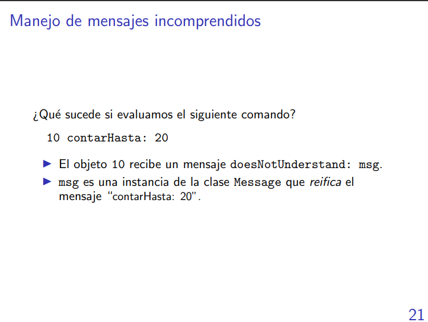

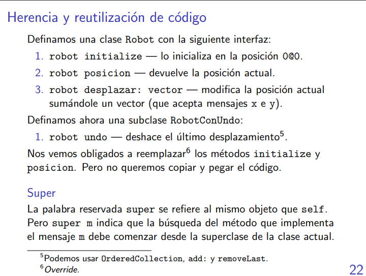

[me quedo sin batería. Luego agrego las diapos y comentarios finales.]

# Notas

> Todas las clases tienen un nombre que comienza con mayúscula.

> **OFFTOPIC:** en Europa para venderte las cosas primero te presentan el fundamento teórico y luego los ejemplos. En Estados Unidos es al revés.

> Aprender a usar cuis smalltalk, lo hizo un egresado del DC.

> Una imagen es un archivo binario que guarda todo el estado de un sistema.