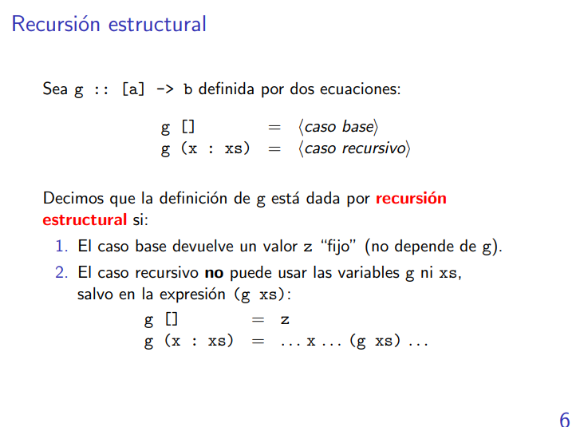
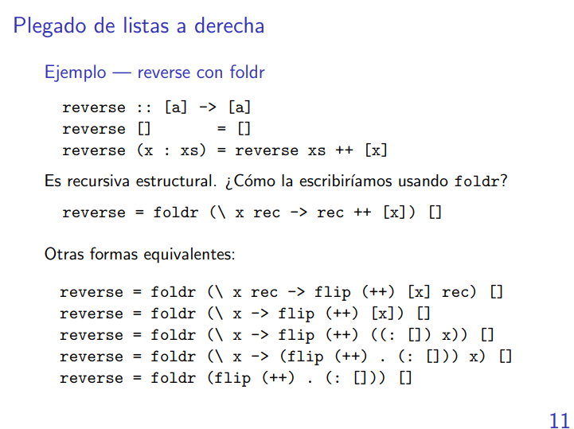
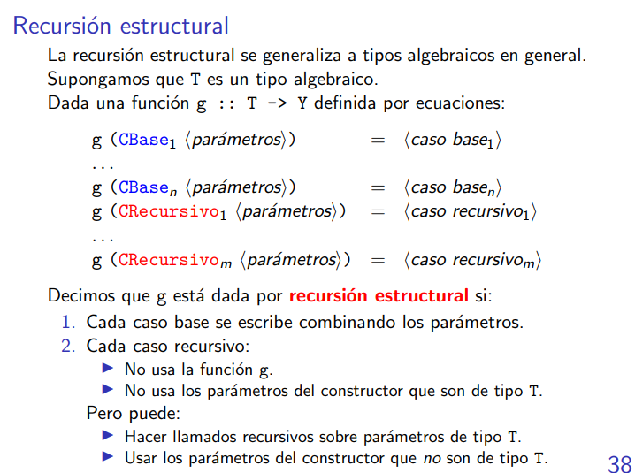

# Breve repaso

Vimos map y filter **completar colocando definición de las funciones**

```haskell
-- Queremos ver que tipo tiene map filter

map :: (a->b)->[a]->[b]
filter :: (a->Bool)->[a]->[a]

el dominio de map es (a->b)
el dominio de filter es (c->Bool)->[c]->[c] -- cambiamos las a para que no se confundan con las a's del map. Sino te queda a = (a->Bool), absurdo. Pero sí puede hacer se c = (a->Bool)

Todo el tipo de filter debe ser de la forma (a->b)
map filter :: [a]->[b] 
map filter :: [c->Bool]->[[c]->[c]]

a se instanció en c->Bool y b se instanció en [c]->[c]

```
aplicar un función a un argumento que tiene su propio tipo implica que el TODO tipo del argumento matchee con el tipo del dominio de la función. Las funciones reciben siempre un argumento.

Otro ejemplito 
```haskell
Ordenar :: Ord a=> [a]->[a]

ordenar [1,2,3] :: [Int]
    |       |  
[a]->[a]  [Int] EL tipo matchea si instanciamos a como Int.
 |    |     
dom  codom
```
```haskell
map filter [esPar, esPrimo, (>3)] = [filter esPar, filter esPrimo, filter (>3)]
```

Repasito de función lambda...
```haskell
(\x -> e) :: a->b
x::a   e::b

(\x -> (x+1,x+2)) :: Int -> ((Int, Int))
```

---
---

# Esquemas de recursión
## Sobre listas
Son formas de abstraer el comportamiento de muchas funciones sobre listas a la vez.


### Recursión estructural
El caso base devuelve un z fijo que no depende de la función recursiva (g).
el caso recursivo no puede usar ni a g ni a la cola de la lista, solo puede usarlos en la parte recursiva de la función recursiva g.

```haskell
(++) :: [a]->[a]->[a]
(++) [] = (\ys -> ys)
(++) (x:xs) = (\ys -> x:(++) xs ys) -- (\ys -> x:(++) xs ys) == (\ys -> x:((++) xs) ys) 
--                                                                          |   |
--                                                                          g  cola
```
#### La función que me generaliza la recursión estructural es foldr!
```haskell
foldr :: (a->b->b)->b->[a]->b
foldr _ z [] = z
foldr f z (x:xs) = f x (foldr f z xs)
-- (foldr f) z (x:xs) = f x (foldr f z xs)
--     |                 |       |
--     g                 a       b
```
Ejemplito
```haskell
suma :: [Int]->Int
suma = foldr (+) 0
--       |    |_______________
--   (a->b->b)->b->[a]->b     |
--                            Int->Int->Int
--  |_____________________________________|
--                    |
--             Int->[Int]->Int
```
```haskell
reverse :: [a]->[a]
reverse = foldr(\x rec -> rec++[x]) []
--             |__________________|  |
--                      |           [a]
--              a->[a]->[a]
--       |_____________________________|
--                     |
--                 [a]->[a]
```

```haskell
((:) . f) 2 ((:) . f 3 [])
(:) (f 2) ((:) . f 3 [])
(:) (f 2) ((:) (f 3) [])
(:) (f 2) ([f 3])
[f 2, f 3]

(const (+1)) 2 ((const (+1) 3) 0)
(const (+1)) 2 ((const (+1) 3) 0)
(const (+1)) 2 (1)
(1 + 1)
2

### Notas
- Una garantía de que una función se define como recursión estructural me garantiza de que la ejecución de la función siempre termina SIEMPRE que dentro de la funcion se usen funciones totales; en caso de no haber funciones totales no tengo garantías de que la funcion principal sea total.
- Que una función definida como recursión estructural haga uso de funciones que no estén definidas como recursión estructural no significa que la función principal no sea recursión estructural. -- Con esta porquería no aprobé un parcial de PLP el cuatri 1 del 2025 y basicamente me vi obligado a recursar.
- Conviene user el elemento neutro en el caso vacío, generalmente.
- `(\x -> f x) == f`
```
### Recursión primitiva
Es parecida a la estructural, la única diferencia es que ahora sí se puede usar la cola de la lista fuera del llamado recursivo, de ser necesario.

```haskell
trim :: String -> String
trim [] = []
trim (x:xs) = if x== ' '
                then trim xs
                else x:xs

-- Con foldr
trim :: String -> String
trim = foldr (\x rec -> if x == ' ' then rec else x: ¿xs?) -- imposible porque no tengo cs en ningún lado.

-- Atención porque esta funcion no la entendí el cuatri pasado.
recr :: (a->[a]->b->b) -> b -> [a] -> b
recr _ z [] = z
recr f z (x:xs) = f x xs (recr f z xs)

trim :: String -> String
trim = recr (\x xs rec -> if x == ' ' then rec else x:xs)
--    |    |_____________________________________________|
--    |                          |                       |
--    |          Char -> String -> String -> String      |
--    |                                                  |
--    |__________________________________________________|
--                             |  
--                      String -> String
```

##### Notas
- La recursión primitiva engloba a la recursion estructural.
- Toda recursion primitiva es una instancia de recr.

### Recursión iterativa
La recursión iterativa me sirve si tengo una especia de acumulador,
En este caso el caso base devuelve el acumulador.
En el caso recursivo la función se llama a si misma sobre la cola de la lista y actualizando al acumulador.
En el caso recursivo la funcion se llama inmediatamente a sí misma.

```haskell
reverse' :: [a]->[a]->[a]
reverse' ac [] = ac
reverse' ac (x:xs) = reverse' (x:ac) xs

bin2dec' :: Int -> [Int] -> Int
bin2dec' ac [] = ac
bin2dec' ac (b:bs) = bin2dec' (c+22*ac) bs

isort' :: Ord a=> [a]->[a]->[a]
isort' ac [] = ac
isort' ac (x:xs) = isort' (insertar x ac) xs
```
```haskell
foldl :: (b->a->b) -> b -> [a] -> b
foldl _ acc [] = acc
foldl f acc (x:xs) = foldl f (f acc x) xs 
```
```haskell
bin2dec = foldl (\ac b -> b+2*ac) 0
**completar con el ejemplo de la diapo**
```
#### Notas
- Toda recursión iterativa es una instancia de foldl.
- foldl es un operador de iteracion.

### Recursión global


### Notas
- Si la función f es asociativa y conmutativa, entonces foldr y foldl dan lo mismo.

# Tipos de datos inductivos
## Tipos de datos algebraicos
Acá lo que importa es que el usuario cree sus propios tipos de datos.

```haskell
data Dia = Dom | Lunes | Martes | Miercoles | Jueves | Viernes | Sabado
data Persona = LaPersona String String String -- Persona tiene UN solo constructor que es LaPersona :: Persona
```
```haskell
nombre, apellido :: Persona -> String
fechaNacimiento :: Persona -> Int
nombre (LaPersona n _ _) **completar con la diapo**
```
```haskell
data Nat = Zero | Succ Na


doble :: Nat -> Nat
doble Zero = Zero
doble (Succ nat) = Succ (Succ (doble nat)) -- Cuando llamo a doble nat es como hacer el Succ (Succ (nat-1)). Pensar una manera mejor de representar el ejemplo jsjsjsjsjs.

infinito :: Nat
infinito = Succ infinito -- ¿Es el sucesor del 0? No, ¿Es el cero? No, entonces es el Suc inf. es como Succ(Succ(Succ(Succ(Succ(...

esZero :: Nat -> Bool
esZero Zero = True
esZero _ = False

esZero inf -> False

coso :: Nat
coso = coso

esZero coso -> coso -> coso -> coso -> coso -> ...
```
```haskell
data Lista a = Vacia | Cons a (Lista a)
data [a] = [] | a : [a]
```
## Esquemas de recursión sobre otras estructuras
La recursión estructural para tipos de datos en general... Como para árblos binarios por ejemplo.

Vamos a tener una ecuación para el constructor base y una ecuación para el constructor recursivo.

En los constructores recursivos NO se pueden usar los parámetros del tipo g en otro caso que no sea recursivo, aquellos parámetros que no sean del tipo de g, entonces los puede usar libremente,

```haskell
foldAB :: (b -> a -> b -> b) -> b -> AB a -> b
foldAB _ z Nil = z
foldAB f z (Bin izq r der) = f (foldAB f z izq) r (foldAB f z der)
```
### Notas
Para el foldAB, si tuvieramos más constructores, entonces tendríamos que tener más ecuaciones, eso quiere decir que tendriamos que tener una función por cada constructor disponible.
# Notas
- Decidir si una definición es correcta o no en Haskell depende técnicamente de lo que queramos representar.
- En la materia importan las estructuras finitas.
