# Razonamiento ecuacional

Lo que queremos probar es que dos expresiones son equivalentes. O sea que al aplicarlas llegamos al mismo resultado, aún si estás están definidas diferente.

Scope de la materia para esto (cosas que podemos asumir en todo ejercicio):
- Lo que nos interesa en este caso son estructuras de datos finitas. O sea, tipos de datos inductivos.
- Todas las funciones son totales: las ecuaciones cubren todos los casos, la recursión siempre termina.
- El programa no depende del orden de las ecuaciones.

> Siempre que demostremos algo necesitamos principios en los que confiamos!

1. Principio de reemplazo: 
Si tengo que e1 = e2 porque está definido así o llegué legalmente a esa expresión, entonces siempre puedo reemplazar e1 por e2 cuando lo necesite, la igualdad vale por definición. 

**ver ejemplo en la diapo**

Pasa que el principio de reemplazo no alcanza par aprobar todas las equivalencias posibles (o que nos interesan).

**ver otro ejemplo en la diapo con los not**
Notar que x no representa ni a True ni a False, solo es una letra que representa a algo que es de tipo Bool, pero no significa que es literalmente True o False.

2. Principio de Inducción sobre Booleanos:
Si $P(True)$ \ o \ $P(False)$ entonces $\forall x \ :: \ Bool. \ P(x)$
Eso significa que todo Booleano es o True o False.

## Ejemplo
```haskell
{FST} fst (x, _) = x
{SND} snd (_, y) = y
{SWAP} swap (x, y) = (y, x)
```
Podemos probar $\forall p \ :: \ (a,b). \ fst \ p \ = \ snd \ (swap \ p)$
Ver lo que tengo escrito en la hoja.
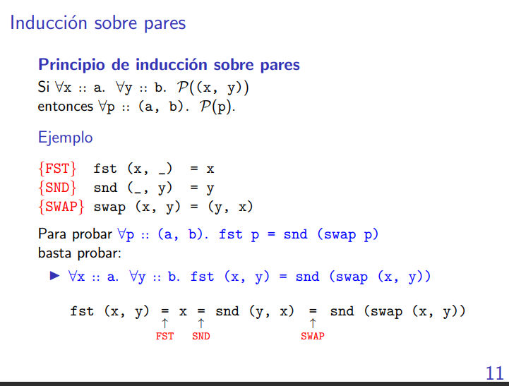

Lo de usar el $\forall$ es más que nada para poder destrabar la expresión y poder usar alguna de las ecuaciones disponibles vía principio de reemplazo.


Lo de arriba implica lo de abajo es principio de inducción, lo de abajo implica lo de arriba es algo que se puede demostrar trivialmente, sale con simples reemplazos.

## Inducción sobre naturales.
Es muy parecido al de álgebra I. Si una prop vale para Zero, y si por HP => P (Succ n) entonces vale para todo nat.
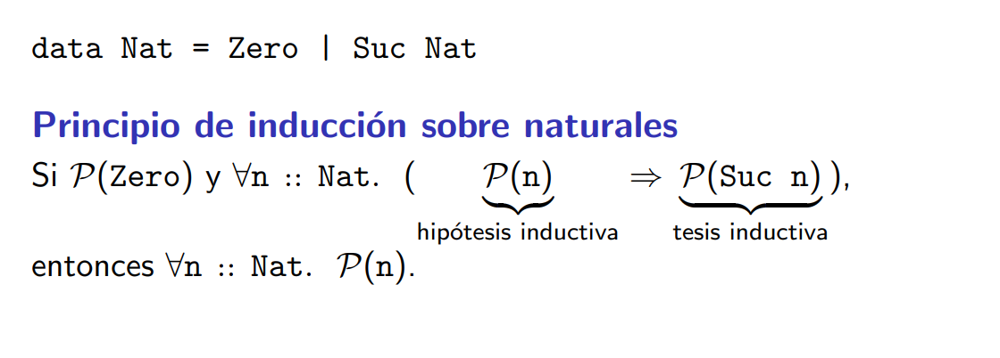

### Ejemplo
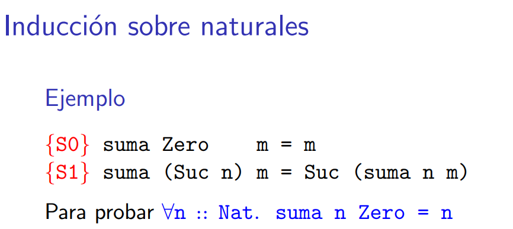

Dem por inducción estructural en Nat, si

P(n) := (suma n Zero = n)

basta ver que:
P(Zero)

\forall n :: Nat. (P(n) => P(Succ n))

Veamos primero P(Zero):
P(Zero) = suma Zero Zero = Zero

En efecto:
suma Zero Zero = Zero por {S0}

Veamos ahora que dado n :: Nat vale P(n) => P(Succ n)

La HP dice P(n) = (suma n Zero = n)

Queremos demostrar la Tesis inductiva que dice:

P(Succ n) = (suma (Succ n) Zero = Succ n)

en efecto:

suma (Succ n) Zero =
= Succ (suma n Zero)  =     por {S1} 
= Succ n                    por HI 

# Todo tipo de dato inductivo tiene su principio de inducción estructural
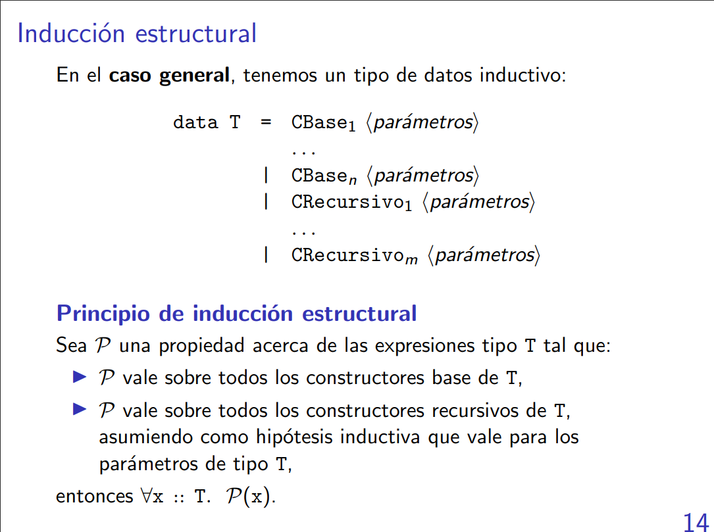

## Ejemplo: Principio de inducción sobre listas

Queremos probar que $\forall l$ :: [a]. P(l),
basta probar:
- P([])
- $\forall$ x :: a. $\forall$ xs :: [a]. (P(x:xs) => P(x:xs))

O sea, la segunda dice que para hacer inducción estructural en listas, entonces tengo asumir que vale P para la cola y tengo que demostrar que vale P si le meto un elemento en la cabeza de la cola.

## Ejemplo: Principio sobre árboles binarios.
Queremos probar que $\forall l$ :: [a]. P(l),
basta probar:
- P(Nil)
- $\forall i, \ d$:: AB a.  $\forall r$ :: a. ((P(i) $\land$ P(d))) => P(Bin i r d)

Entonces se puede concluir que:
$\forall t$ :: AB a. P(t)

## Ejemplo: Principio de inducción sobre polinomios
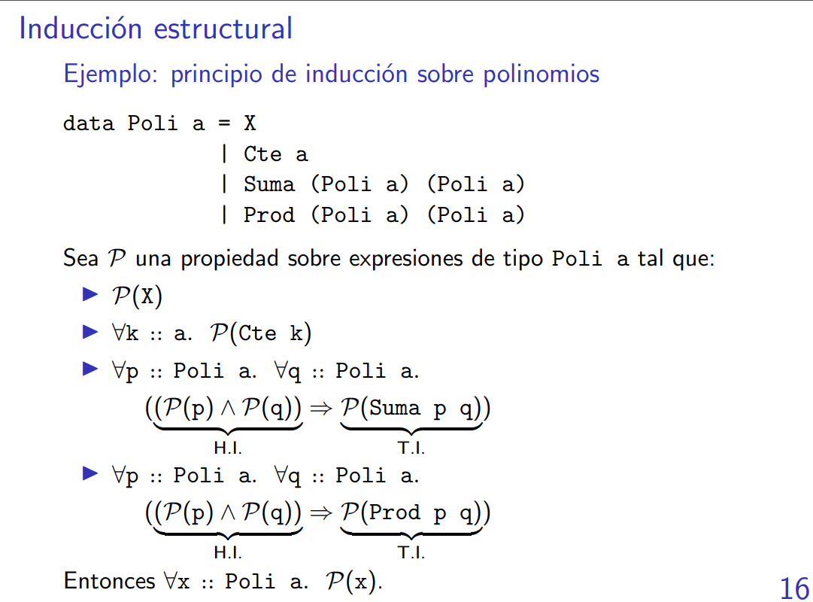

Lo que está antes de la implicacion es la hipotesis inductiva, lo que está después es la tesis inductiva.

# Ejemplos de induccion sobre listas.

## Ejemplo 1
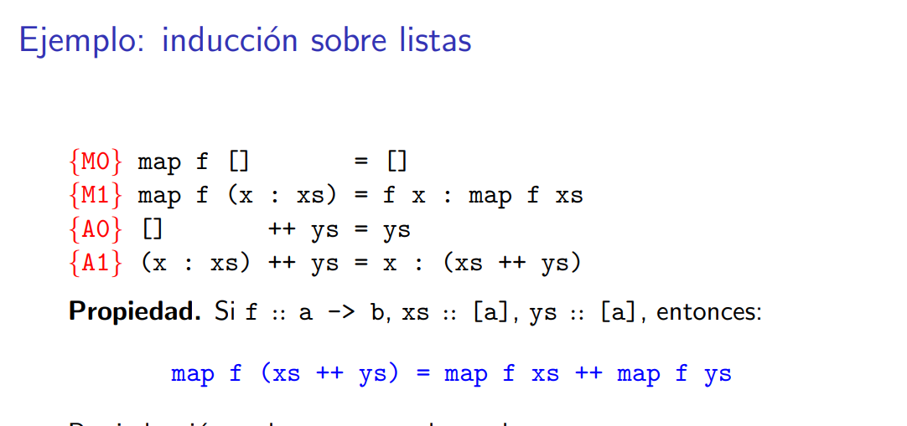

Queremos ver por casos, qué pasa con xs. Hacer inducción en xs va a permitir que se destraben las ecuaciones.

> Nunca podemos hacer inducción en funciones porque no son un tipo de dato.

## Demostracion
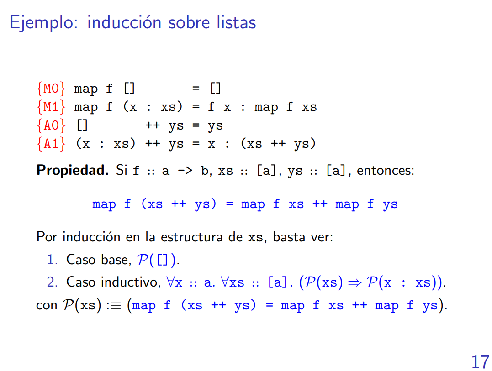
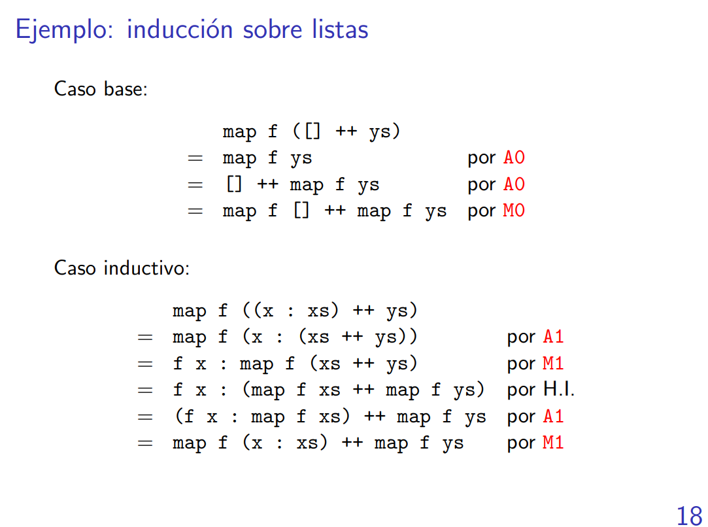

## Ejemplo 2
```haskell
foldr _ z [] = z
foldr f z (x:xs) = f x : foldr f z xs
```
```haskell
foldl _ z [] = z
foldl f z (x:xs) = foldl f (f z x) xs
```
```haskell
reverse [] = []
reverse (x:xs) = reverse xs ++ [x]
```
```haskell
flip f x y = f y x
```
Generalmente conviene hacer inducción donde la cosa se traba.
### Demostracion
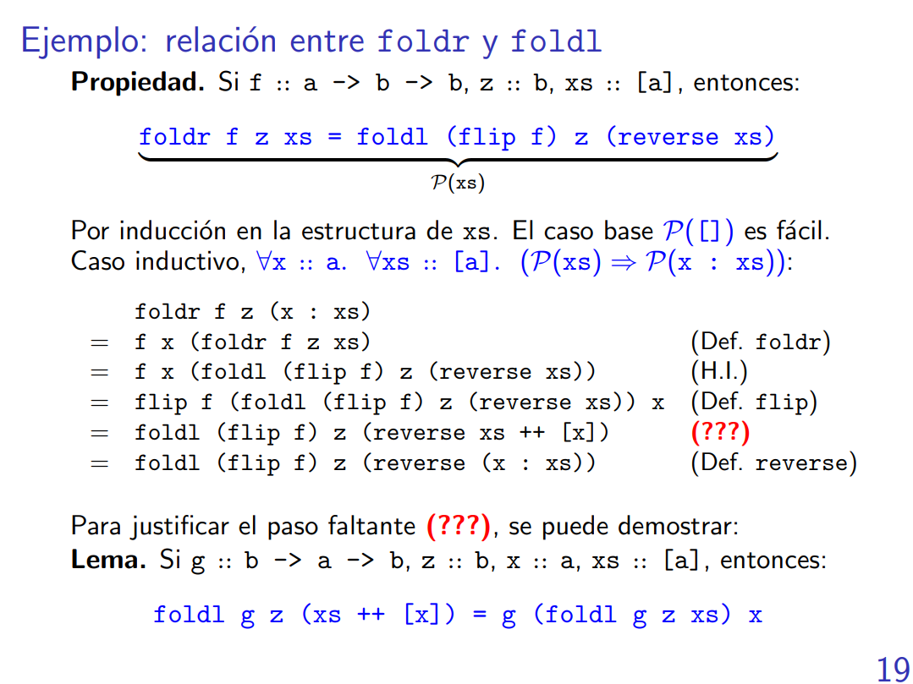

HI = (foldr f z xs = foldl (flip f) z (reverse xs))

> Conviene fijar variables siempre que usamos un para todo en la demostración. O sea, fijamos una o varias variables y luego hacemos inducción en lo que queremos.


## Principio de inducción

## Extensionalidad

Que algo sea diferente intensional se refiere a que las definiciones son distintas, que sea diferente extensional se refiere a que no computan lo mismo. El extensional es como cuando comparamos el resultado final de uno con el otro.

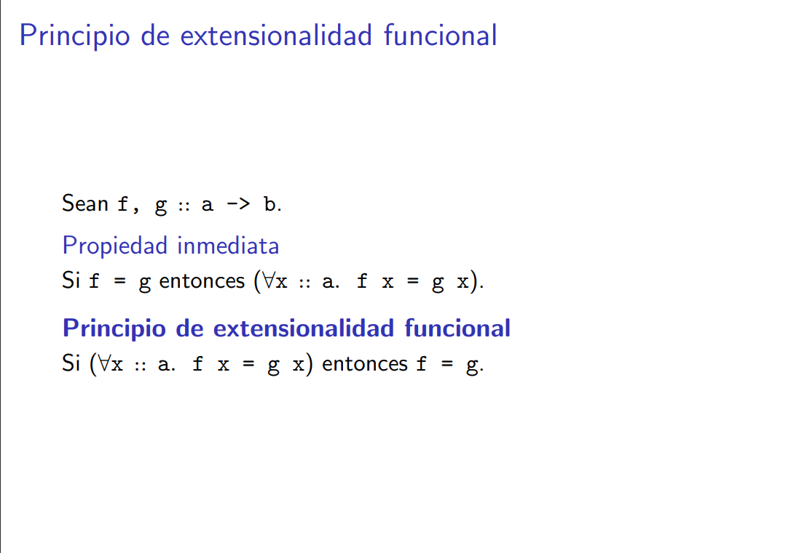

En la materia vamos a asumir siempre el principio de extensionalidad funcional.

> Si quiero probar que f = g, basta con probar con que son iguales en toda instancia.

Esto sirve para probar igualdad entre funciones.

## Isomorfismo

Lo del obs lo que quiere decir es que si yo enchufo un e1 en un programa y obtengo un True, si hago lo mismo con e2 entonces también tengo True.

Ver que dos funciones son isomorfas significa que hay que probar que para f y g funciones, entonces vale que f . g == g . f por extensionalidad funcional.

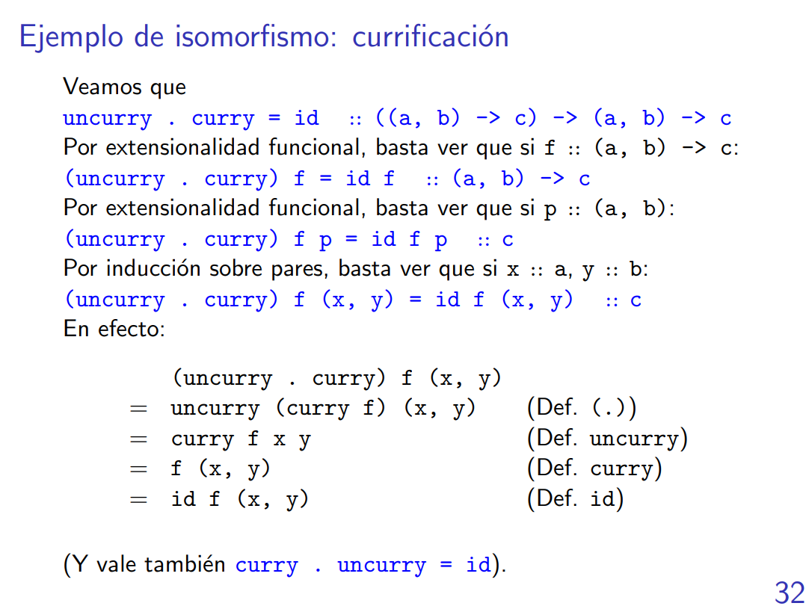

La diferencia entre el Either y el Maybe es que el Maybe me devuelve un tipo u otro, el Either es para tomar un tipo u otro pero siempre devuelvo lo mismo.
> No es un tema central en la materia.

# Inducción estructural