# Deducción natural para lógica proposicional

## Sistemas deductivos

Un sistema deductivo es un conjunto de reglas que nos permiten trabajar con ciertas premisas para poder lelgar a ciertas conclusiones.

Queremos poder cosas de forma afirmar matemáticamente precisa sobre nuestros programas en distintos lenguajes de programación.

Nos van a dar herramientas para poder hacer eso.

> A las afirmaciones las vamos a llamar juicios.

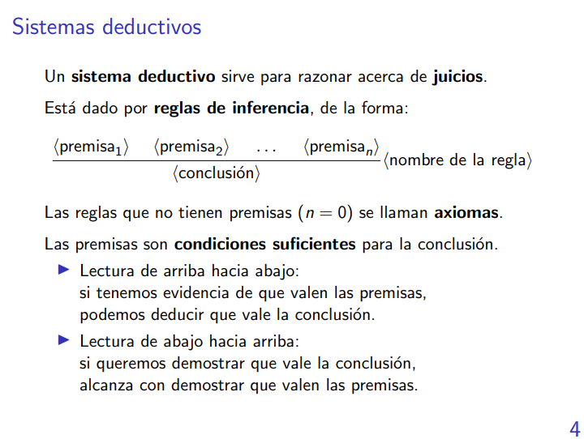

Eso lo que quiere decir es que si yo ya sé todas las premisas entonces puedo concluir lo que está abajo.

El nombre de la regla (nombre de la regla de inferencia) es la que nos permite -a partir de ciertas premisas- llegar a una conclusión.

Las reglas sin premisas se les llama axiomas.

Esto es como una implicación hacia abajo, o sea la conclusión no implica a una premisa.

### Un ejemplo

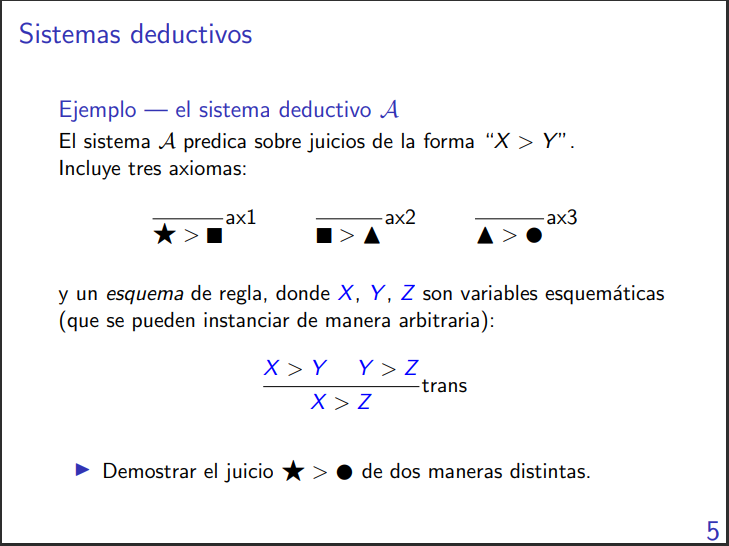

Ese $\gt$ en principio en un sistema deductivo no significa nada, depende de la semántica que le demos.

Un esquema de regla es como una plantilla que me dice que si yo reemplazo las variables esquemáticas entonces la conclusión siempre es verdadera.


Versión 1:
```

                __________ax2  ______ax3
                    C > T       T > O 
___________ax1  _____________________trans 
    E > C                 C > O
________________________________ trans
        E > O
```
A esto se le llama árbol de derivación sobre un juicio (el juicio es E > O)

Como no tiene ninguna premisa abierta o "suelta" entonces se dice que el árbol está completo. O sea, que toda hoja es una premisa.

Versión 2:
```
_____ax1    _____ax2
E > C       C > T
_________________ax1  _____________________ax3 
        E > T                 T > O
___________________________________________ trans
                E > O
```

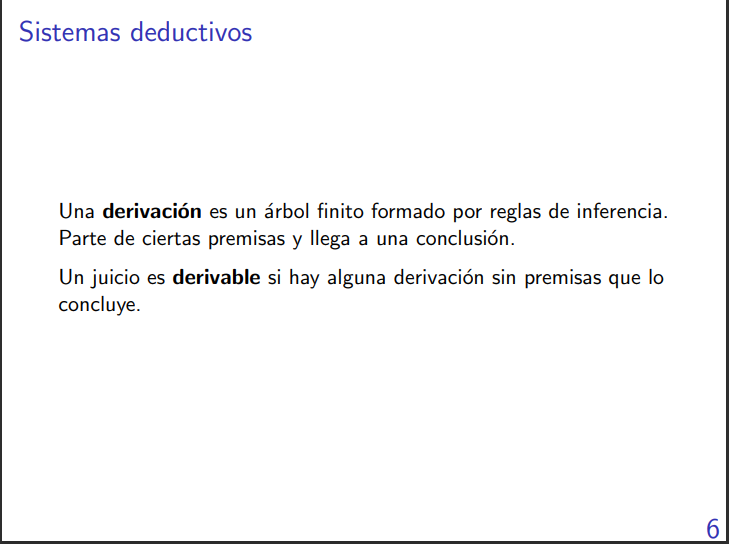

### Otro ejemplo

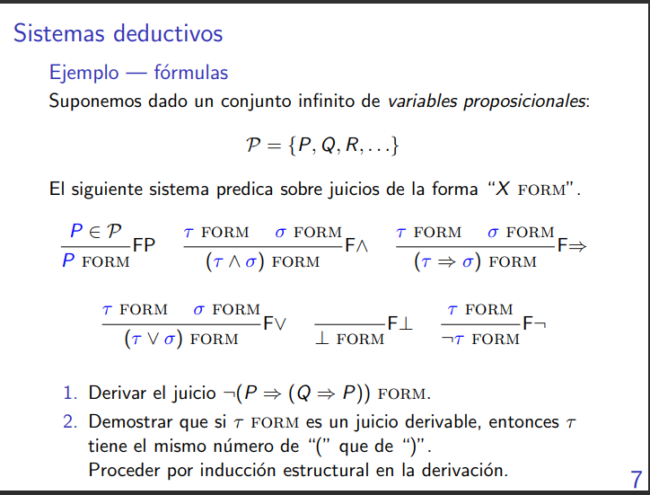

La P en azul representa cualquier variable proposicional.

SI yo sé que $\tau$ es una fórmula y que $\sigma$ también es una formula, entonces vale que $\tau \land \sigma$ es una fórmula.

``` 
                                                          ____FP       ____FP
                                                           Q             P
    _______FP                                             _________________F=>
       P                                                        (Q => P)
    _________________________________________________________________________________________F=>
                                    (P => (Q => P))
    _________________________________________________________________________________________F¬
                                    ¬(P => (Q => P)) FORM
```

Para demostrar lo pedido se puede hacer por inducción en las reglas.

## Deducción natutal para lógica proposicional

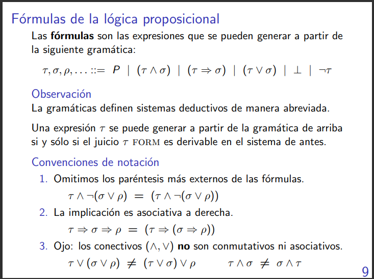

Una definición indutciva es como La gramática para generar N es N ::= * | ° | ° N * | ...
Puedes aplicar todas las construcciones que quieras para poder generar definiciones.

El **Ojo** dice eso porque como las fórmulas no tienen ningún tipo de semántica entonces no podemos asumir que tienen las mismas que ya conocemos de la matemática, a menos que se diga lo contrario.

Que una formula sea válida se refiere a que una fórmula es verdadera por la forma que tiene y no por el significado que yo le doy.

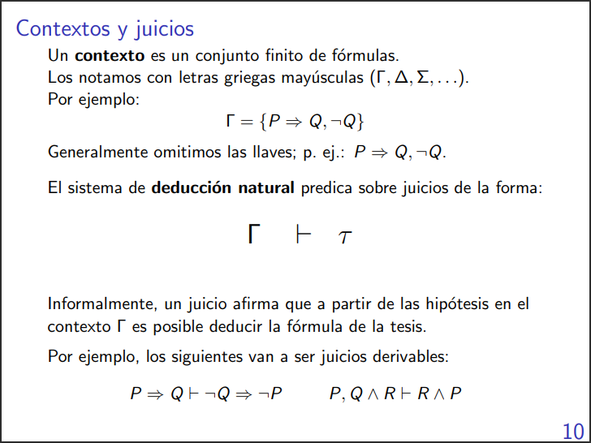

Traducción $\Gamma \vdash \tau$:

Bajo las hipotesis $\Gamma$ vale la tesis $\tau$ 

Ese $\vdash$ es como un $\implies$ pero no son lo mismo ojo.

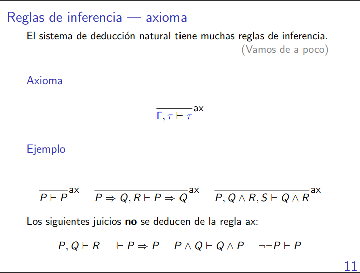
Los juicios no valen porque la tesis no está incluida dentro de las hipótesis.

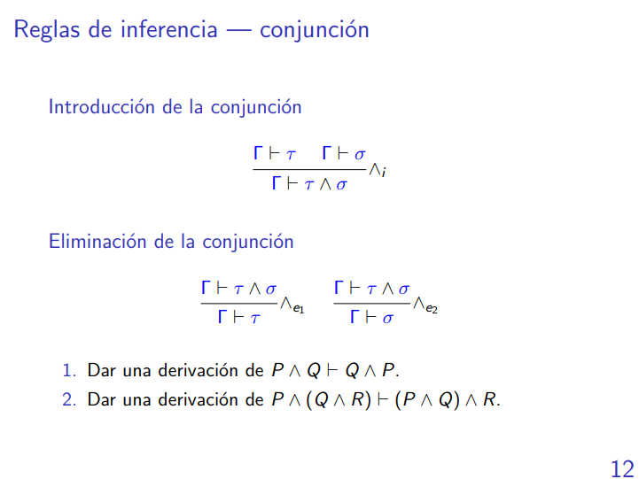

```


        ________________ax                               ________________ax
        P && Q ⊢ P && Q                                    P && Q ⊢ P && Q
        ________________e2                               ________________e1
        P && Q ⊢ Q                                         P && Q ⊢ P 
        _________________________________________________________________&&i
                                P && Q ⊢ Q && P
```
```
                                        P & (Q & R) ⊢ P & (Q & R)
                                        _________________________e2
        P & (Q & R) ⊢ P & (Q & R)       P & (Q & R) ⊢ Q & R                     P & (Q & R) ⊢ P & (Q & R)
        _________________________e1     ____________________e1                  __________________________e2
        P & (Q & R) ⊢ P                 P & (Q & R) ⊢ Q                         P & (Q & R) ⊢ Q & R
        ________________________________________________&i                      ____________________e2
        P & (Q & R) ⊢ P & Q                                                     P & (Q & R) ⊢ R
        ________________________________________________________________________________________&i
                                P & (Q & R) ⊢ (P & Q) & R
```

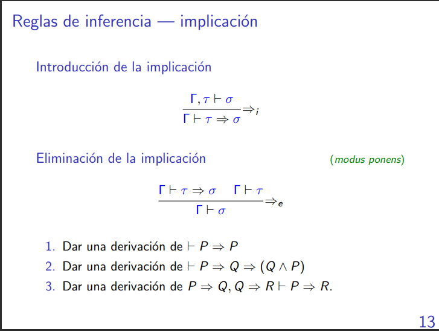

```


                               _______ax
                                P ⊢ P
                        ____________________=>i
                               ⊢ P => P 
```
```


                ________ax                   _________ax
                P, Q ⊢ Q                     P, Q ⊢P
                ______________________________________&i
                        P, Q ⊢ Q & P
                ______________________________________=>i
                        P ⊢ Q => (Q & P)
                ______________________________________=>i
                        ⊢ P => Q => (Q & P)
```
```
                                        __________________________ax      _____________________ax
                                        P => Q, Q => R, P ⊢ P => Q        P => Q, Q => R, P ⊢ P
        __________________________ax    _______________________________________________________=>e
        P => Q, Q => R, P ⊢ Q => R                      P => Q, Q => R, P ⊢ Q
        _______________________________________________________________________________________=>e
                                        P => Q, Q => R, P ⊢ R
        _______________________________________________________________________________________=>i
                                        P => Q, Q => R ⊢ P => R
```

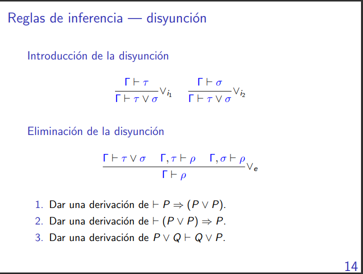

```
                                _________ax
                                  P ⊢ P
                                _________Vi1
                                P ⊢ P V P
                        ______________________________=>i
                                ⊢ P => (P V P)
```
```
                        _____________ax ____________ax  _____________ax
                        P V P ⊢ P V P   P V P, P ⊢ P    P V P, P ⊢ P
                        _____________________________________________Ve
                                        P V P ⊢ P
                        _____________________________________________=>i
                                        ⊢ (P V P) => P
```
```


        P V Q ⊢ P V Q   P V Q, P ⊢ P    P V Q, P ⊢ P 
        ______________________________________________Ve
                        P V Q ⊢ P                         --> Ojo 
        ______________________________________________Vi2
                        P V Q ⊢ Q V P
```
Ojo: esto no vale porque que valga P no significa que valga P V Q

```                     _________________ax     _________________ax
                        P V Q, Q ⊢ Q            P V Q, P ⊢ P
        _____________ax _________________Vi2    _________________Vi1
        P V Q ⊢ P V Q   P V Q, P ⊢ P V Q        P V Q, Q ⊢ Q V P
        _________________________________________________________Ve
                        P V Q ⊢ Q V P
```

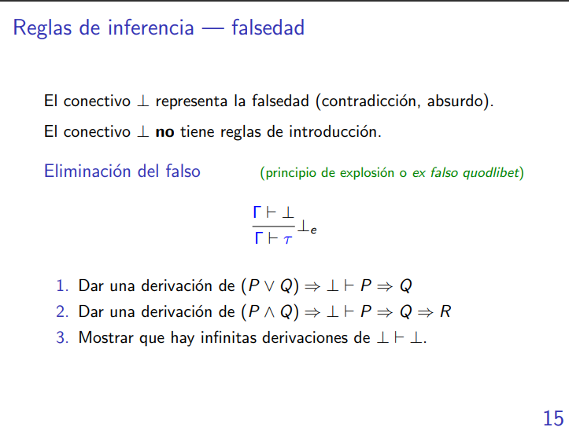

```                                                      
                                                        ________________________ax
                                                        (P V Q) => ⊥, P ⊢ P
                _______________________________ax       ________________________Vi1
                (P V Q) => ⊥, P ⊢ (P V Q) => ⊥          (P V Q) => ⊥, P ⊢ P V Q
                _________________________________________________________________=>e
                                        (P V Q) => ⊥, P ⊢ ⊥
                _________________________________________________________________⊥e
                                        (P V Q) => ⊥, P ⊢ Q 
                _________________________________________________________________=>i
                                        (P V Q) => ⊥ ⊢ P => Q
```
```
                                                       _____________________ax  _____________________ax
                                                        P & Q => ⊥, P, Q ⊢ P    P & Q => ⊥, P, Q ⊢ Q
                _____________________________ax        ______________________________________________&i
                P & Q => ⊥, P, Q ⊢ P & Q => ⊥                   P & Q => ⊥, P, Q ⊢ P & Q   
                ____________________________________________________________________________________=>e
                                        P & Q => ⊥, P, Q ⊢ R
                ____________________________________________________________________________________⊥e
                                        P & Q => ⊥, P, Q ⊢ R 
                ____________________________________________________________________________________=>i
                                        P & Q => ⊥, P ⊢ Q => R
                ____________________________________________________________________________________=>i
                                        P & Q => ⊥ ⊢ P => Q => R
```
```
                                        ______ax
                                        ⊥ ⊢ ⊥                                   
```
Es una forma y hay un infinitas, se puede probar por inducción.


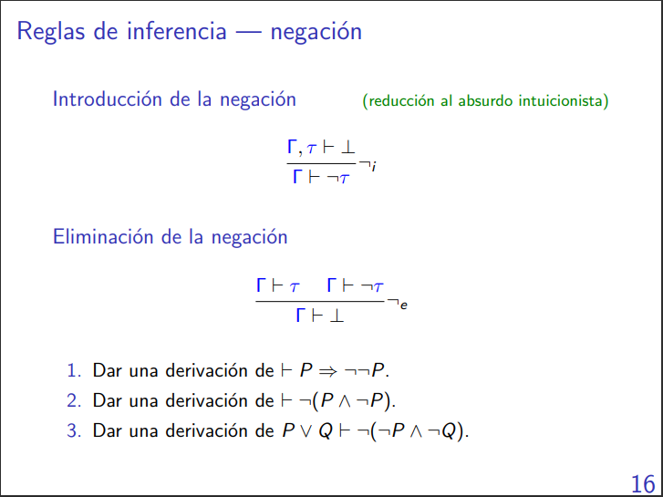

```
                        _________ax     ___________ax
                        P, ¬P ⊢ P       P, ¬P ⊢ ¬P
                        ____________________________¬e
                                P, ¬P ⊢ ⊥
                        ____________________________¬i
                                P ⊢ ¬¬P
                        ____________________________=>i
                                ⊢ P => ¬¬P
```
```
                        ________________ax      ________________ax
                        P & ¬P ⊢ P & ¬P         P & ¬P ⊢ P & ¬P 
                        ________________&e1     ________________&e2
                        P & ¬P ⊢ P              P & ¬P ⊢¬P
                        ________________________________________¬e
                                        P & ¬P ⊢ ⊥
                        ________________________________________¬i
                                        ⊢ ¬(P & ¬P)
```
```


                                                  ____________________________ax
                                                  P V Q, ¬P & ¬Q, P ⊢ ¬P & ¬Q
                          _____________________ax ____________________________&e1
                          P V Q, ¬P & ¬Q, P ⊢ P   P V Q, ¬P & ¬Q, P ⊢ ¬P         ANÁLOGO AL DE LA IZQ.      
______________________ax  ____________________________________________________¬e           |
P V Q, ¬P & ¬Q ⊢ P V Q                  P V Q, ¬P & ¬Q, P ⊢ ⊥                    P V Q, ¬P & ¬Q, Q ⊢ ⊥
____________________________________________________________________________________________________Ve
                        P V Q, ¬P & ¬Q ⊢ ⊥
____________________________________________________________________________________________________¬i
                        P ∨ Q ⊢ ¬(¬P ∧ ¬Q).
```

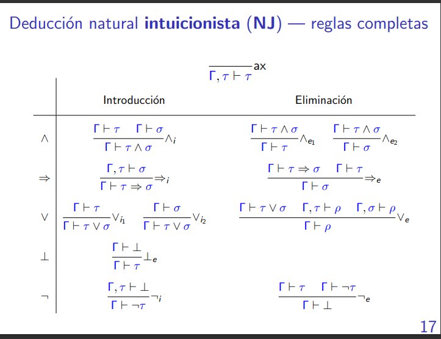

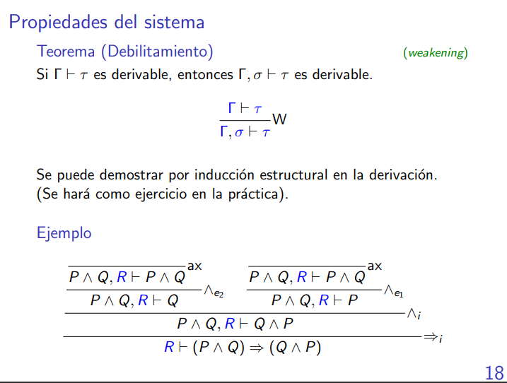

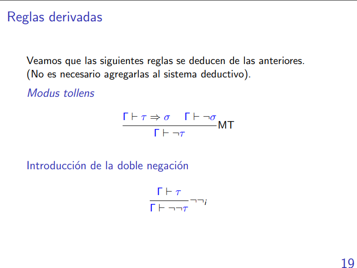


```
        Γ ⊢ τ => σ        
        ______________W   _________ax
        Γ, τ ⊢ τ => σ     Γ, τ ⊢ τ                          Γ ⊢ ¬σ
        ___________________________=>e                    __________W
                Γ, τ ⊢ σ                                    Γ, τ ⊢ ¬σ        
        _____________________________________________________________¬e
                Γ, τ ⊢ ⊥
        _____________________________________________________________¬i
                Γ ⊢ ¬τ
```
```
        _________ax
        Γ ⊢ τ
        _________W                  ___________ax
        Γ, ¬τ ⊢ τ                   Γ, ¬τ ⊢ ¬τ        
        _______________________________________¬e
                        Γ, ¬τ ⊢ ⊥
        _______________________________________¬i
                        Γ ⊢ ¬¬τ
```

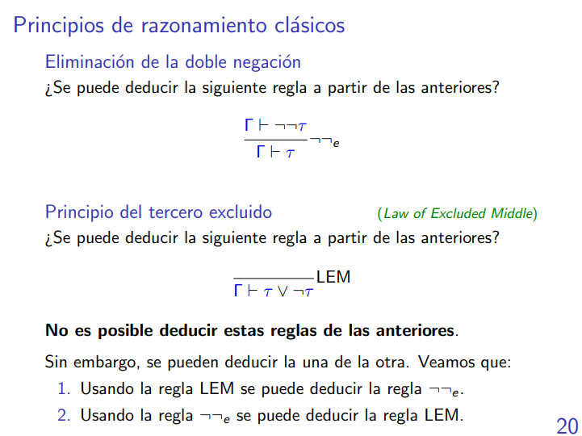

```
                                                        ___________listo, quería llegar a esto.
                                                        Γ ⊢ ¬¬τ 
                                        ___________ax   ___________w
                                        Γ, ¬τ ⊢ ¬τ      Γ, ¬τ ⊢ ¬¬τ      
        __________LEM   _________ax     ___________________________¬e   
        Γ ⊢ τ V ¬τ      Γ, τ ⊢ τ        Γ, ¬τ ⊢ τ                    
        __________________________________________Ve
                        Γ ⊢ τ
```
```
        _______________________ax
        Γ, ¬(τ V ¬τ), τ ⊢ τ
        ________________________Vi1   ___________________________ax
        Γ, ¬(τ V ¬τ), τ ⊢ τ V ¬τ      Γ, ¬(τ V ¬τ), τ ⊢ ¬(τ V ¬τ)
        _________________________________________________________¬e
        Γ, ¬(τ V ¬τ), τ ⊢ ⊥
        _______________________¬i
        Γ, ¬(τ V ¬τ) ⊢ ¬τ
        _______________________Vi2  _________________________ax
        Γ, ¬(τ V ¬τ) ⊢ τ V ¬τ      Γ , ¬(τ V ¬τ) ⊢ ¬(τ V ¬τ)
        _______________________________________________¬e
                        Γ ⊢ ¬¬(τ V ¬τ)
        _______________________________________________¬¬e
                        Γ ⊢ τ V ¬τ
```

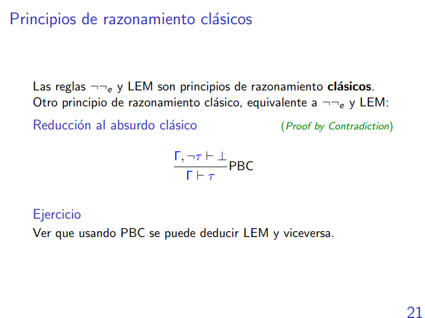

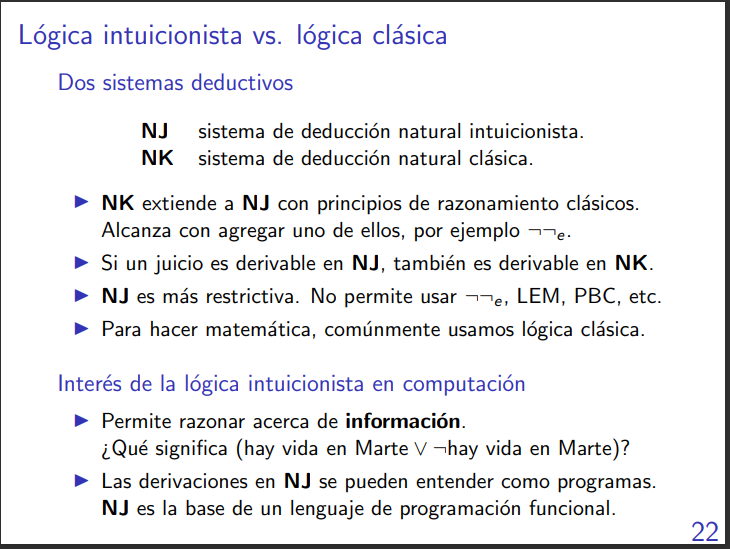

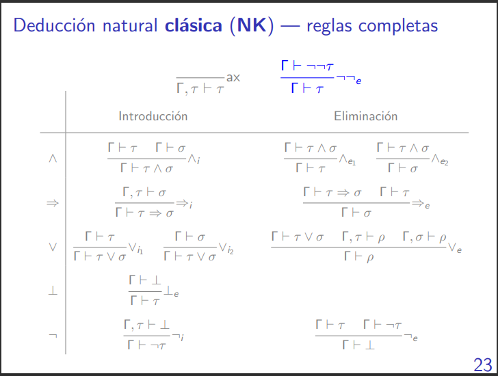

## Semántica bivaluada

Cada letra que tenemos en nuestra fórmula le vamos a dar un valor de Verdadero o Falso.

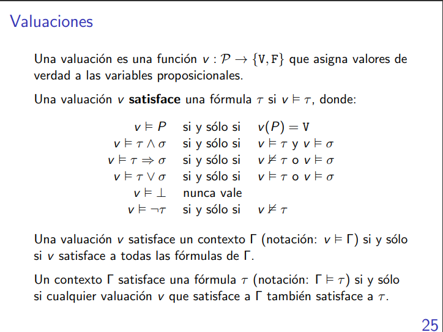

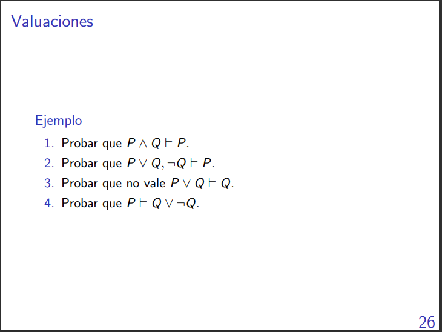

Esto se resuelve haciendo tabla de verdad o una especia de razonamiento en palabras.

$$
\vdash \tau <=> \dashV \tau
$$

Esto me sirve para lo siguiente: si yo hago un juicio y la tabla de verdad no lo valida entonces es porque ese juicio no es correcto.

# Notas
- Los axiomas son afirmaciones que damos por válidas siempre.
- El "siempre que se puede aplicar una regla, entonces hay que aplicarla" no es algo del todo cierto, primero hay que pensar si las premisas valen o no.
- La tesis siempre va a ser exactamente una fórmula.
- Muchas veces nos va a pasar que nos vamos a trabar y vamos a tener que hacer una eliminación de la disyunción antes.
- Se puede hacer induccion en un arbol de derivación porque el árbol es una estructura inductiva, entonces habría que hacer inducción estructural.