# Cálculo Lambda

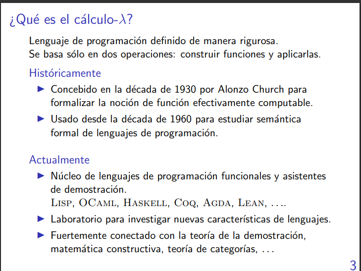

> No existe un solo tipo de calculo lambda.

> Nosotros vamos a trabajar con $\lambda^b$ o sea, una lambda que devuelve booleanos.

# Cálculo-$\lambda^b$: sintáxis y tipado:

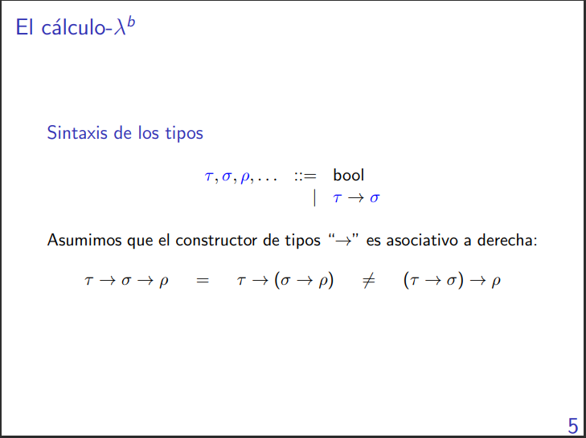

Un tipo puede ser $bool$, otro sería $bool \rightarrow bool$, o $bool \rightarrow bool \rightarrow bool$, o ...

Los $\tau$, $\sigma$, $\rho$, ... se refieren a las expresiones que podemos tener

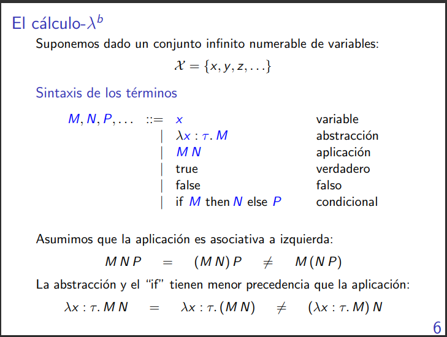

- Los parámetros de las funciones que vamos a usar son los del conjunto $\chi = \{x, y, z\}$. 
O sea: $x$ es un término, $y$ también. y toda letra minuscula es un término.

- Se le llama aplicación porque se piensa como que M es un término que es función que toma un parámetro, y que ese parámetro es N.

- La aplicación asocia a izquierda (igual que haskell).

- Cuando usamos letras griegas: son tipos.

- Cuando usamos letras minúsculas: son variables.

- Cuando usamos letras mayúsculas: son términos.

Lo que quiere decir el último es que si M, N y P son términos, entonces podemos hacer if M then N else P

Lo que quiere decir la segunda es que todo lo que sea $\lambda\ variable \ : \ tipo\ .\ término$ **es un término**. 

Por ejemplo: 

$\lambda$ x: bool. x --> es la identidad de una variable bool.

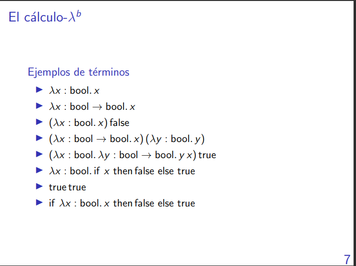

true true está -sintácticamente- bien formado pero no nos gusta porque no tipa.

El que le sigue también está bien formado sintácticamente pero tampoco nos gusta porque no tipa pues la guarda espera un booleano y no una función.

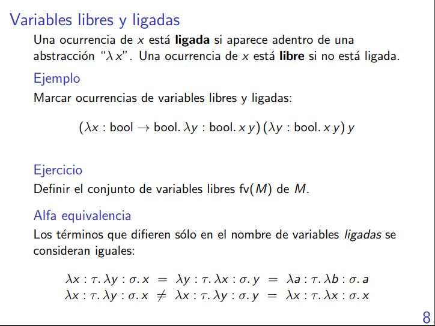

    λ x: τ. M
            ___
            cuerpo

Si hay una x en el cuerpo, entonces x está ligada


    (λx : bool → bool. λy : bool. x y) (λy : bool. x y) y
                                  _ _              _ _
                                lig lig          lib lig 

> OJO: para determinar a cuál lambda está ligada una variable, entonces nos valemos por la ocurrencia de la variable en la lambda "más cerca", o sea, la más interna. Es por eso que en el último ejemplo se vale:
    
    λx : τ. λy : σ. y = λx : τ. λx : σ. x

Porque la x del cuerpo se liga con λx : σ que es la lambda más interna que liga a x.

    λx : σ. z == λy : σ. z /= λz : σ. z /= λz : σ. x

---

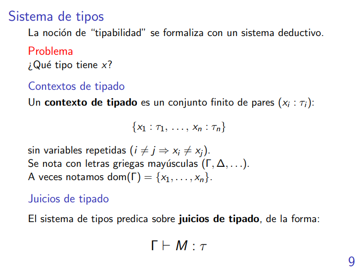

El tipo de una x depende del contexto en el que estemos.

> Todos los sistemas deductivos nos permiten hacer firmaciones y justificarlas.

Lo último quiere decir que: 

Bajo un cierto contexto $\Gamma$ el término M tiene tiene un tipo $\tau$

---

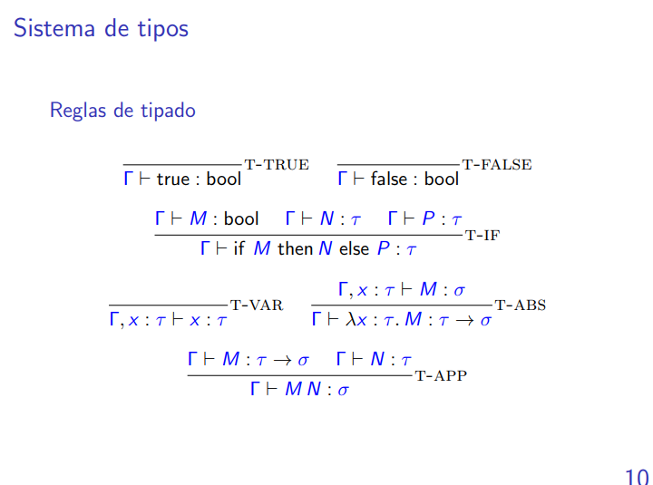

> Hay una regla de tipado por cada forma de construir un término.

$\in$

Una forma de escribir T-Var es

        x ∈ Γ
    _______________    <------>    _______________
        Γ ⊢ x: τ        equiv.     Γ, x: τ ⊢ x: τ

O sea que si x está en Gamma, entonces es como un esquema de axioma.

En T-Abs la x puede aparecer libre arriba pero no abajo.

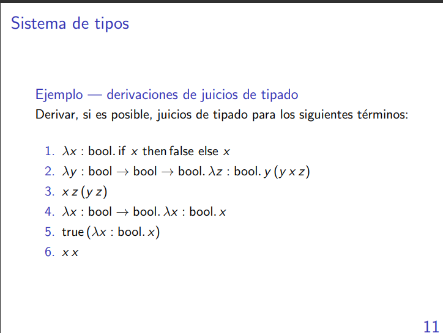
```
__________________T-VAR   _____________________T-FALSE    ____________________T-VAR
x: bool ⊢ x: bool           x: bool ⊢ false: bool           x: bool ⊢ x: bool
______________________________________________________________________________T-IF
                x: bool ⊢ if x then false else x : bool
______________________________________________________________________________T-ABS
                ⊢ λx : bool. if x then false else x : bool -> bool
```

```

                            ___________________________T-VAR    ____________T-VAR
                            Γ ⊢ y: bool -> bool -> bool         Γ ⊢ x: bool
                            ________________________________________________
                            Γ ⊢ y: algo -> bool -> bool Γ ⊢ x: algo
                            ________________________________________________
                                                    |            
                                                    |                                        
                                        _________________________T-APP  ___________________T_VAR
                                            Γ ⊢ y x: bool -> bool       Γ ⊢ z: algo
                                        ___________________________________________________
                                            Γ ⊢ y x: algo -> bool   Γ ⊢ z: algo
_______________________________T-VAR     __________________________________________________T-APP
    Γ ⊢ y: bool -> bool -> bool                 Γ ⊢ y x z: bool
___________________________________________________________________________________________ 
    Γ ⊢ y: algo -> bool -> bool    Γ ⊢ y x z: algo 
___________________________________________________________________________________________T-APP
        Γ = {x: bool, y: bool -> bool -> bool, z: bool} ⊢ y (y x z): bool -> bool -> bool
___________________________________________________________________________________________T-ABS
                x: bool, y: bool -> bool -> bool ⊢ λz: bool. y (y x z): bool -> bool -> bool
___________________________________________________________________________________________T-ABS
                ⊢ λy : bool → bool → bool. λz : bool. y (y x z) : (bool -> bool -> bool)
                                                                   -> bool -> bool -> bool
```

```
__________________________________________________________________________________________T-VAR
            x: bool -> bool, y. bool⊢ y : bool
__________________________________________________________________________________________T-ABS
            x: bool -> bool ⊢ λy. bool. y : bool -> bool
__________________________________________________________________________________________RENOMBRE
            x: bool -> bool ⊢ λx. bool. x : bool -> bool
__________________________________________________________________________________________T-ABS
            ⊢ λx : bool → bool. λx : bool. x : bool -> bool -> bool -> bool
```
```
______________________________________________FALLA
    x: τ ⊢ x x: algo -> σ   x: τ ⊢ x: algo
______________________________________________T-APP
        x: τ ⊢ x x : σ
```

Falla porque para que esto ande tendría que pasar que

```
algo = τ = algo -> σ
```

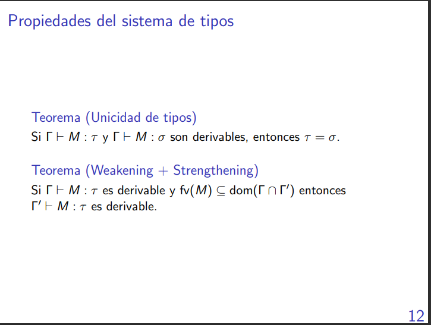

El segundo teorema dice que si x no aparece dentro de las variables libres de M, entonces puedo sacar a x del contexto.


# Cálculo-$\lambda^b$: semántica operacional:

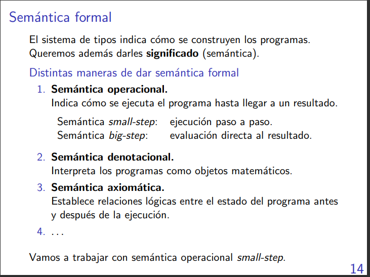
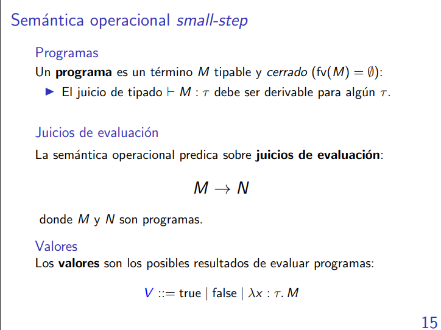
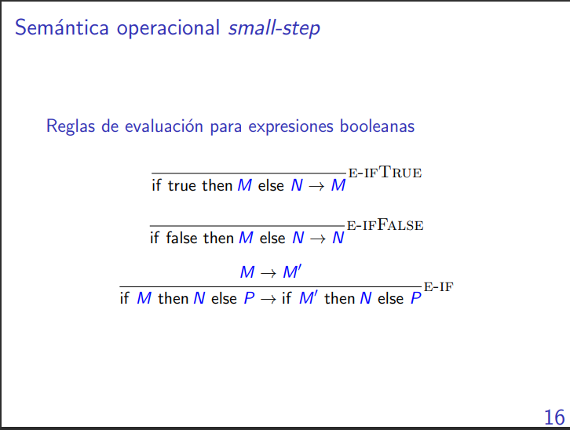

Las reglas de cómputo son las que hacen efectivamente un cómputo y las congruencia son las que se meten dentro de las expresiones para resolver el cómputo.

```
______________________________________________________________________________________E-IFFALSE
    if false then false else true -> true
______________________________________________________________________________________R-IF
if (if false then false else true) then false else true → if true then false else true
```
Lo que les gusta a los profes 
```
if (if false then false else true) then false else true => if true then false else true
                                                        |
                                                        |
                                                        Por E-IF, E-IFFALSE
```

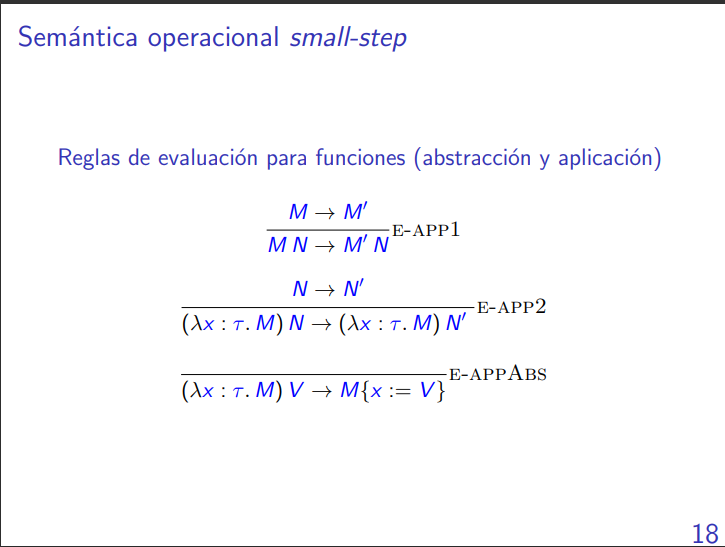
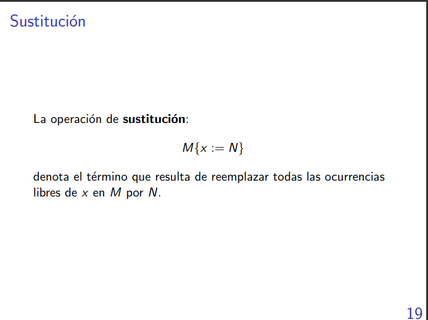

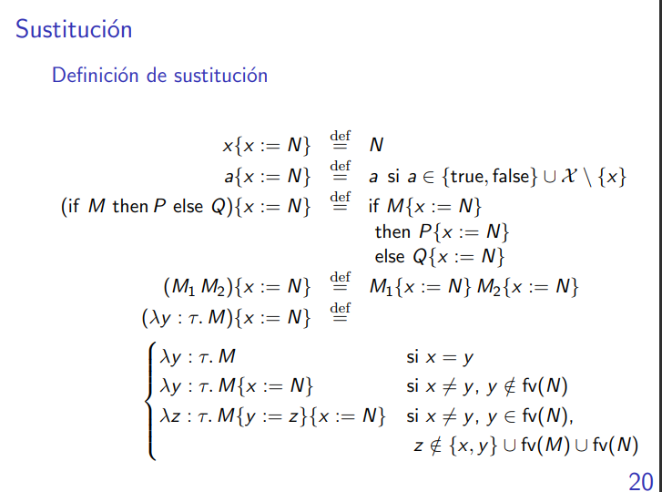
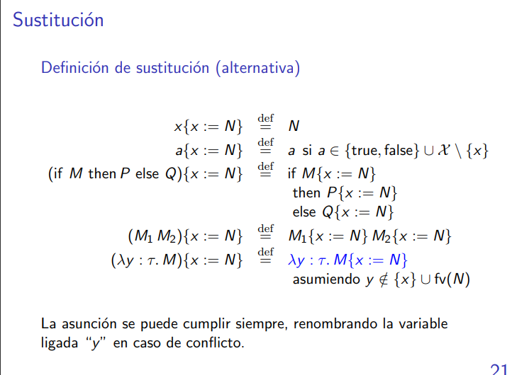


La justificación de que al hacer recursión en el caso lambda es que siempre hacemos los reemplazos en un término que tiene tamaño menor que el término más "global" que tenía adentro al término de adentro (en donde estamos realizando los reemplazos).

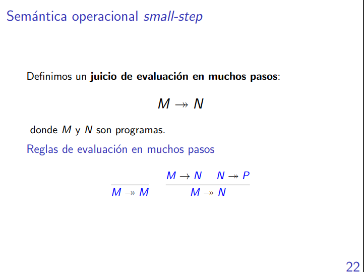

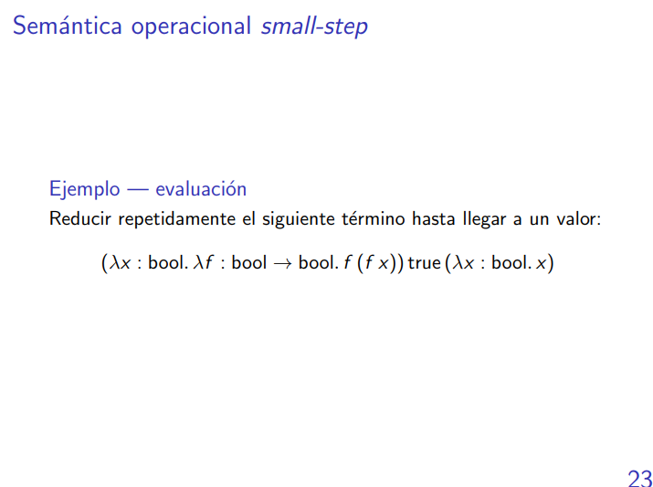

```
(λx : bool. λf : bool → bool. f (f x)) true (λx : bool. x) ->> E-APP1, e-APPABS ->> 
->> (λf: bool -> bool. f(f True)) (λx: bool. x) ->> E-APPABS ->>
->> (λx: bool. x) ((λx: bool. x) True) ->> 
->> E-APP2, E-APPABS ->>  (λx: bool. x) True ->> 
->> E-APPABS ->> 
->> True
```

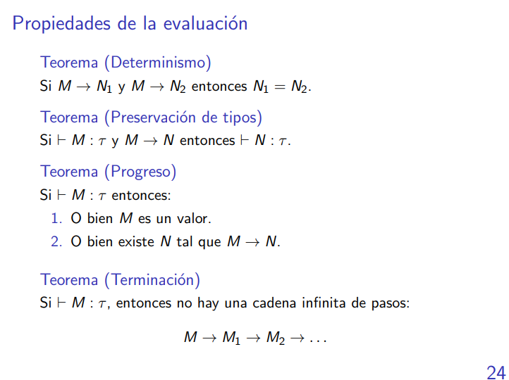
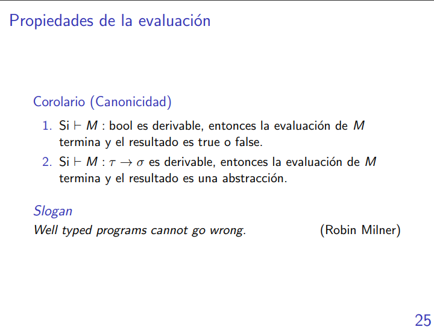

---

# Cálculo-$\lambda^{bn}$: extensión con números naturales:

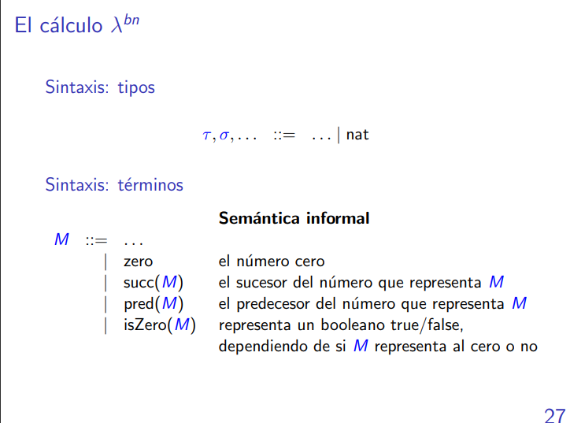

Esos tres puntos lo que significa es "a lo que ya había le sumamos".

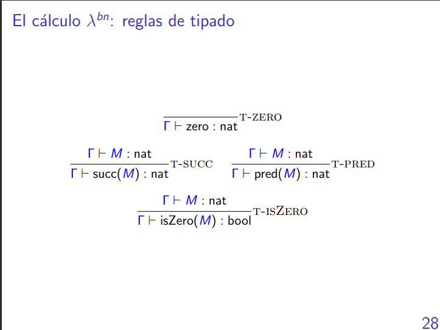
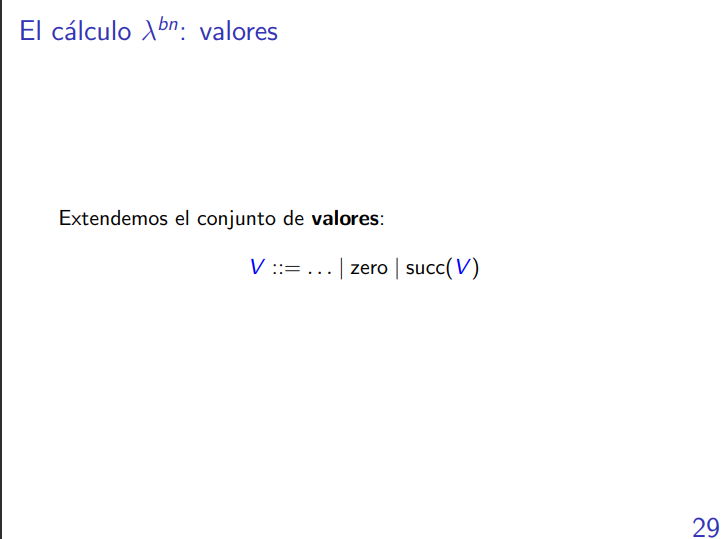
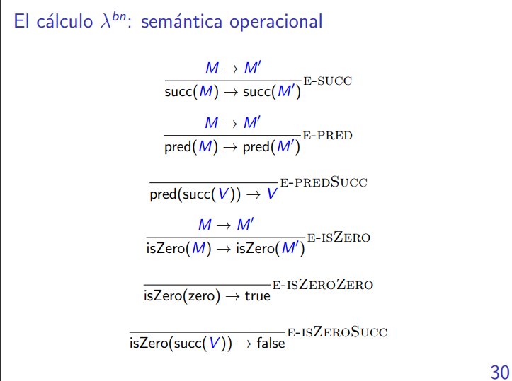
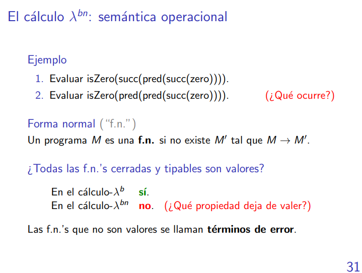