# Unificación e Inferencia de tipos

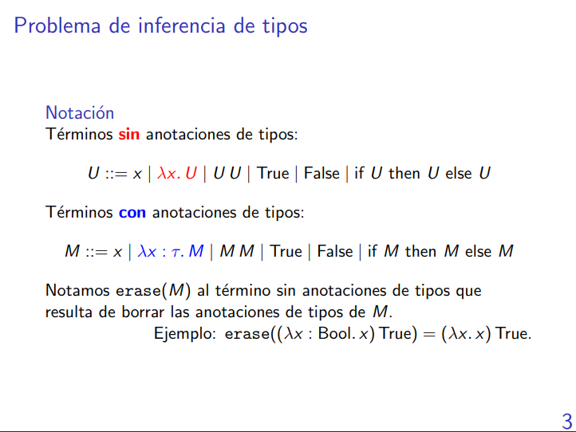

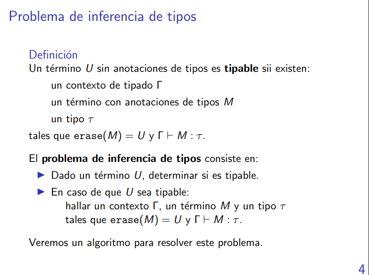
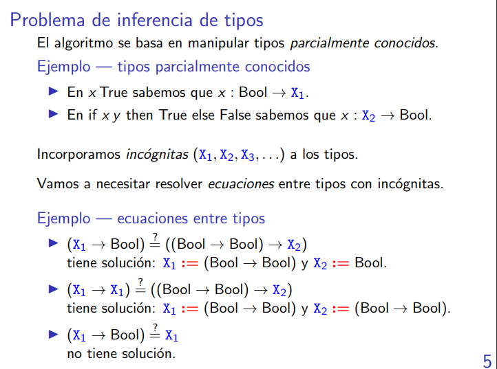

## Algoritmo de Unificación

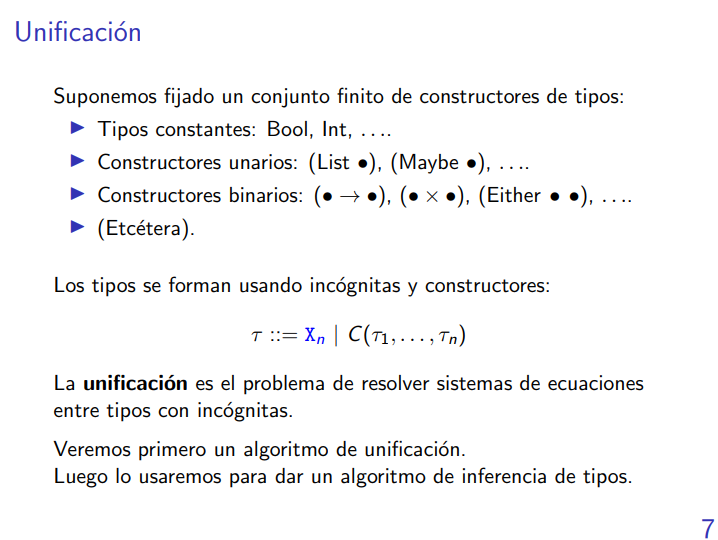

O sea, tau puede ser: o una variable de tipos o un constructor con n argumentos.

```
Ejemplo:

[Bool] [Int] Están construidos con el mismo constructor pero difieren en los tau de adentro.

[Bool] -> Int   [Bool -> Int] No están construidos con el mismo constructor
```

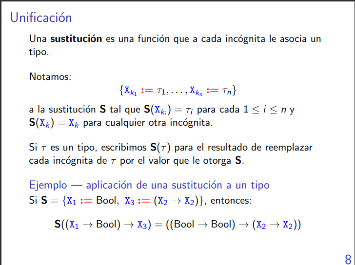

```
Ejemplo:

S = {X1 := Bool, X2 := Int -> Bool, X3 := X4 -> X5}

- S(X2) = Int -> Bool
- S(X3) = X3
- S(x3) = X4 -> X5

S es como una función tal que S :: Incógnitas -> Tipo

- S(Bool -> X3 -> X4) = Bool -> (X4 -> X5) -> X4
```

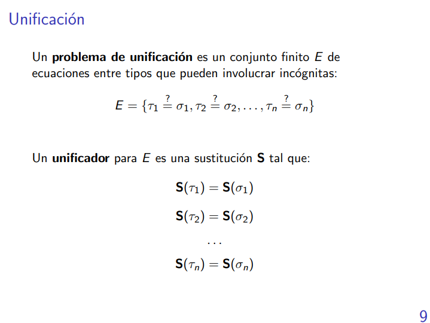
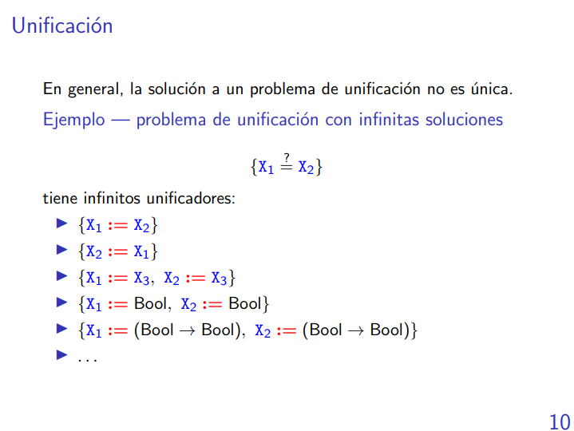

La solución a un problema de unificación no siempre tiene que existir, y aún si hay existencia no significa que hay unicidad.

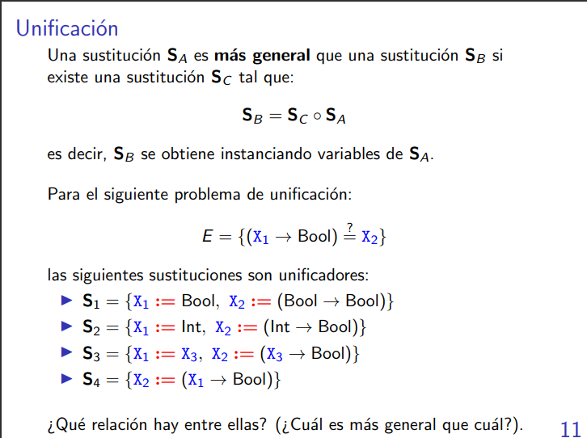

```
S1 no es más general que S2 porque no podemos escribir a S2 como S2 = _ ° S1. El tema es que estamos instanciando a X1 en dos cosas.

S1, S2 y S3 no son más generales entre sí

S4 es más general que todas las demás porque puedo construir a todas las demás usando a S4.
```

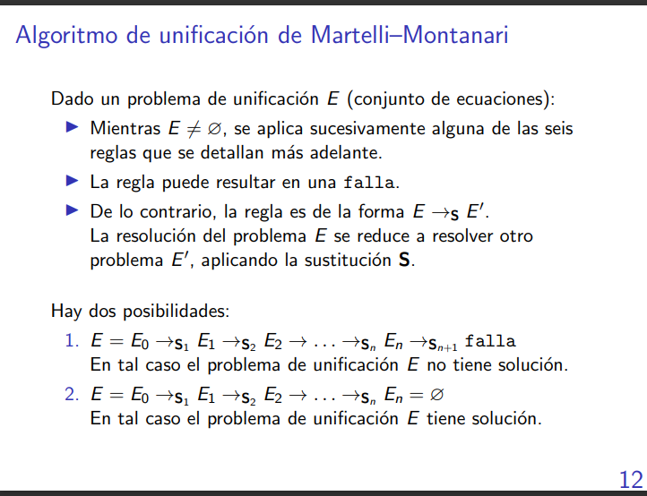

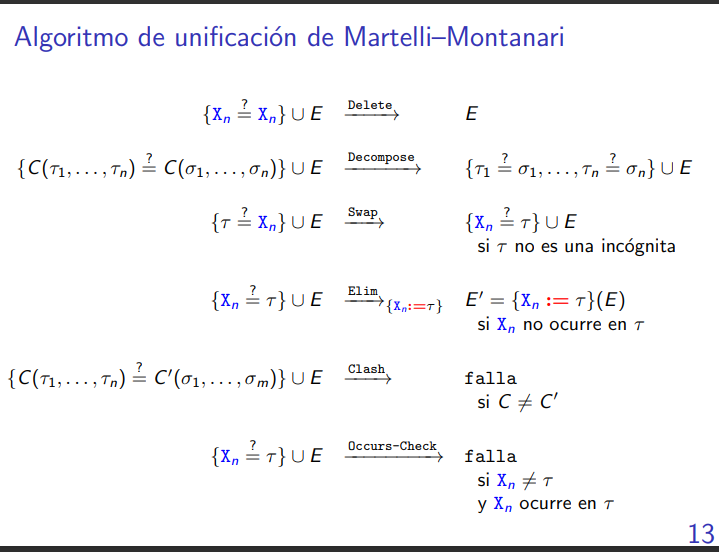
```
Si tengo algo como {Bool = Bool} entonces eso reduce a {} por Decompose, no por Elim.
```

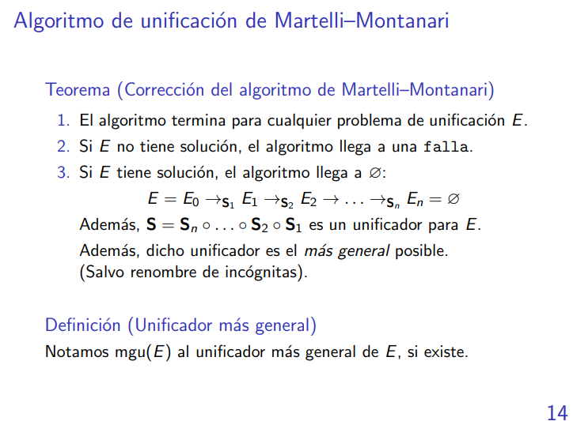

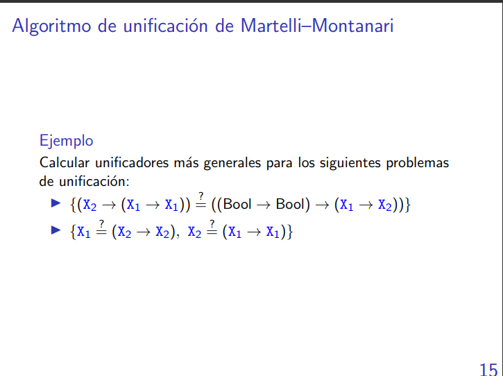

```
E =
    {(X2 -> (X1 → X1)) ?= ((Bool -> Bool) -> (X1 → X2))}                -> Decompose
    {X2 ?= (Bool -> Bool),  (X1 → X1) ?= (X1 → X2)}                     -> Elim: {X2:= B -> B}
    {(X1 → X1) ?= (X1 → (Bool -> Bool))}                                -> Decompose
    {X1 ?= X1, X1 ?= (Bool -> Bool)}                                    -> Delete
    {X1 ?= (Bool -> Bool)}                                              -> Elim: {X1:= B -> B}
    {}

E tiene solución.

MGU(E) = {X1 := Bool -> Bool} ° {X2 := Bool -> Bool} = {X1 := Bool -> Bool, X2 := Bool -> Bool}

El orden es: la primera sustición que hice, va a ir de última en la composición.
```

```
E =
    {X1 ?= (X2 → X2), X2 ?= (X1 → X1)}      -> Elim: {X1 := (X2 -> X2)}
    {X2 ?= ((X2 → X2) → (X2 → X2))}         -> Occurs-Check

Por lo tanto E no tiene solución. 
MGU(E) no está definido.
```

## Algoritmo de inferencia de tipos

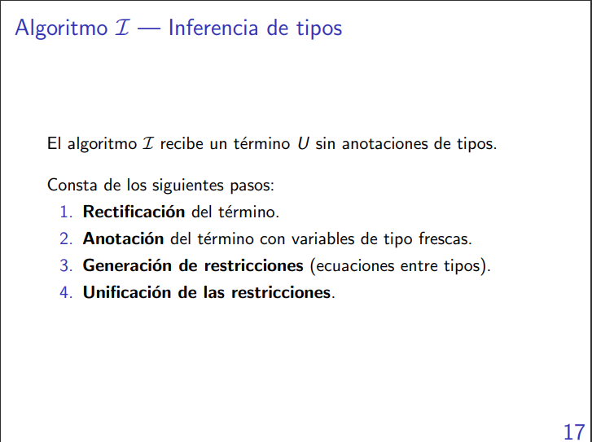
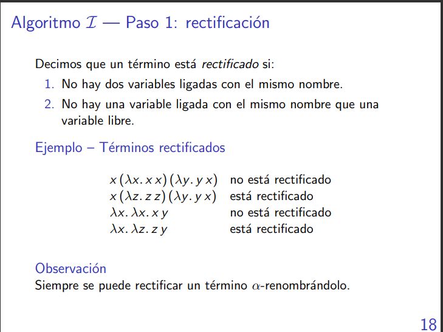

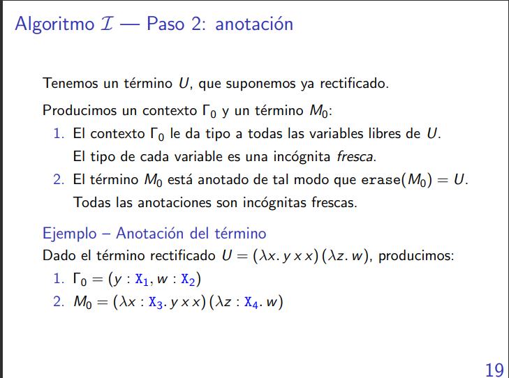

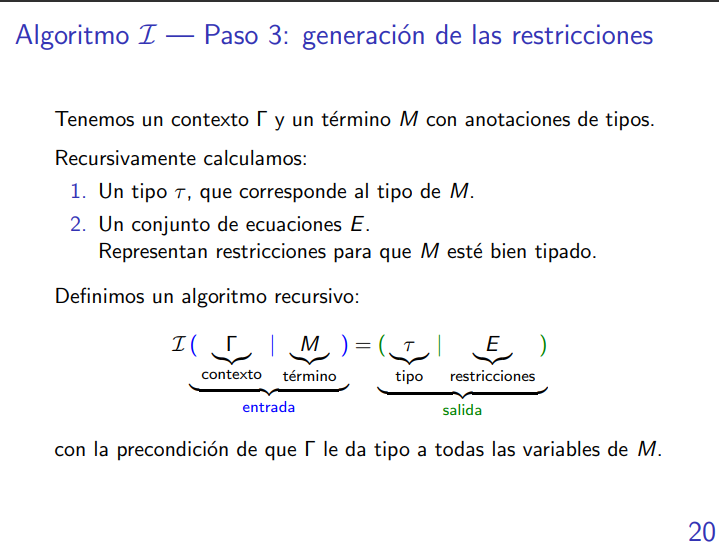

EL algoritmo I toma un contexto y un M y devuelve el tipo de M y las restricciones par aM.

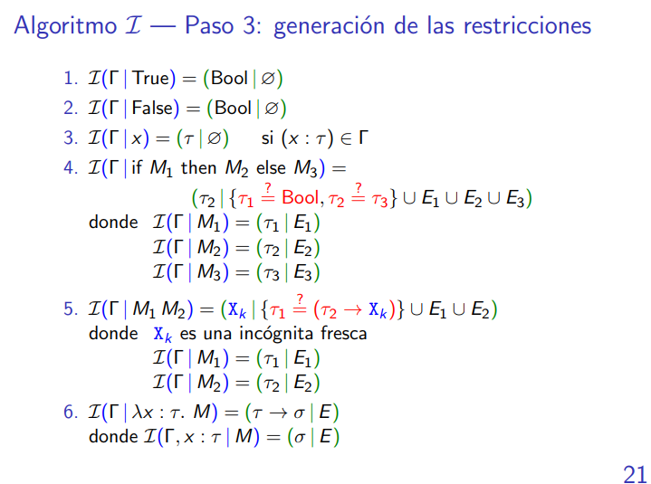
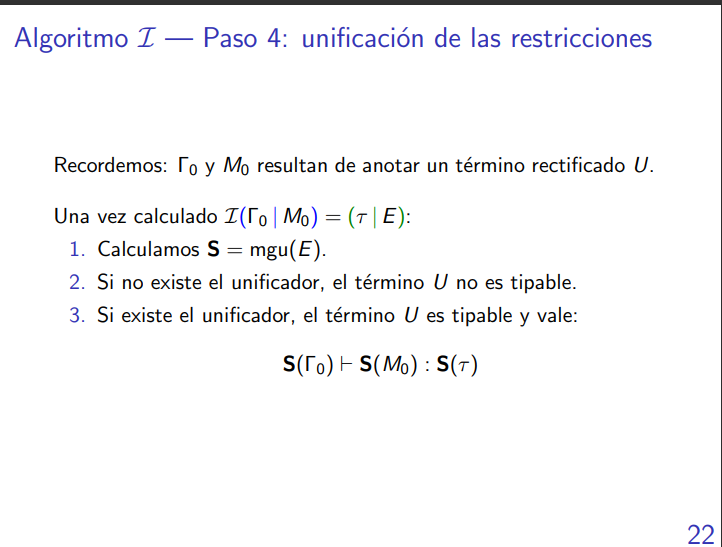

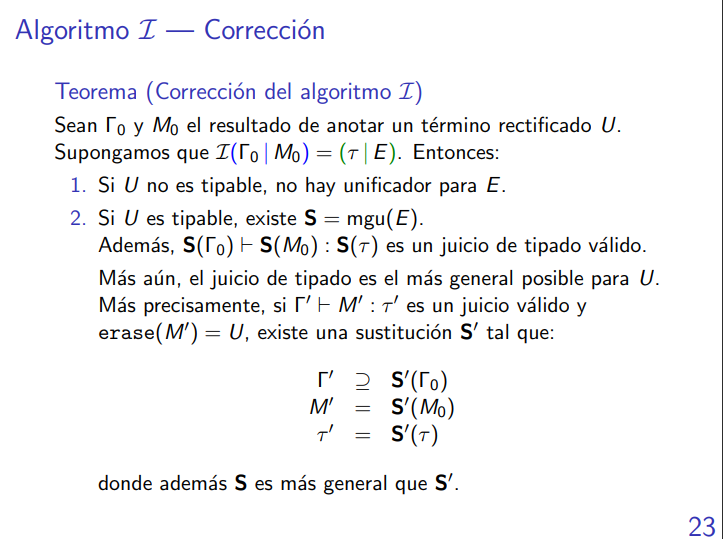

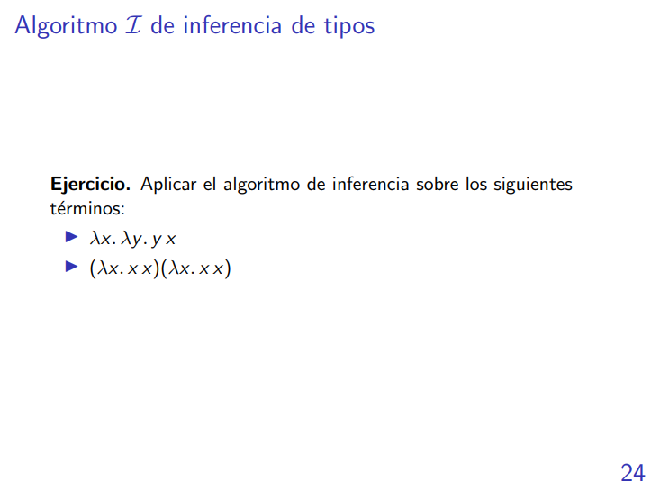

```
λx. λy. y x

1. Está rectificado.

2. R0 = {}, M0 = λx: X1. λy:X2. y x

3. I( {}| λx: X1. λy:X2. y x) = (X1 -> X2 -> X3 | {X2 ?= X1 -> X3})
        |             
   I( x: X1| λy:X2. y x) = (X2 -> X3 | {X2 ?= X1 -> X3})
        |
   I( x: X1, y:X2 | y x) = (X3 | {X2 ?= X1 -> X3})
        |              |
    I(x: X1, y:X2 | y) (x: X1, y:X2 | x)
        |                   |
        (X2 | {})           (X1 | {})      

4. S = MGU({X2 ?= X1 -> X3}) = {X2 := X1 -> X3}

Como existe el MGU entonces U es tipable y el juicio de tipado más general es 
                        S({}) |- S(M0): S(X1 -> X2 -> X3)
O sea:
    
    |- λx: X1. λy: X1 -> X3. y x : X1 -> (X1 -> X2) -> X3
```
```
(λx. x x)(λx. x x)

1. (λx. x x)(λy. y y)

2. R0 = {}, M0 = (λx: X1. x x)(λy: X2. y y)

3. I(R0 | M0) = 
    I( {} | (λx: X1. x x)(λy: X2. y y)) =
    |                               |
    I({} | λx: X1. x x)           I({} | λy: X2. y y)
    |
    I(x: X1 | x x) = (X3 | {X1 ?= X1 -> X3})
    |            |
    I(x:X1 | x)  I(x:X1 | x)
    |               |
    (X1 | {})       (X1 | {})
```