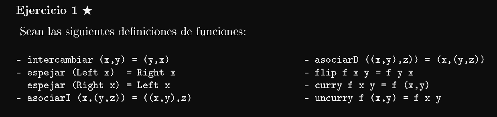
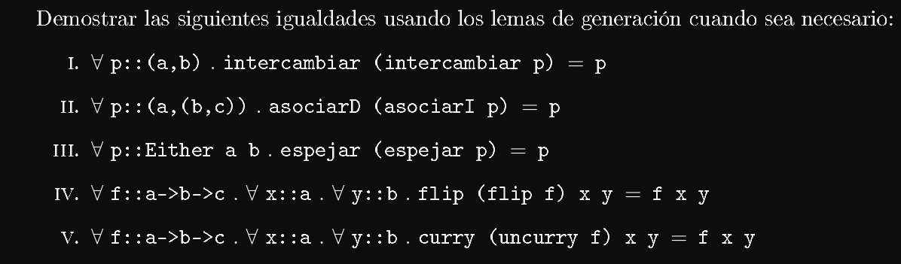
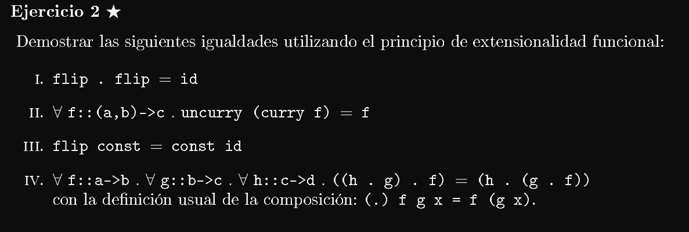
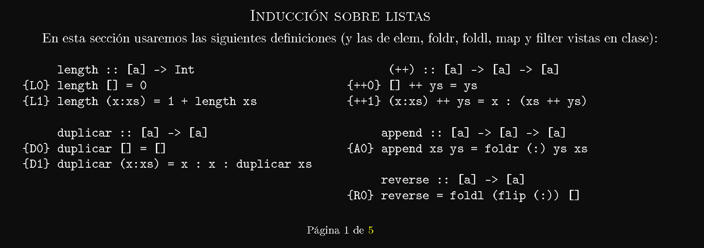
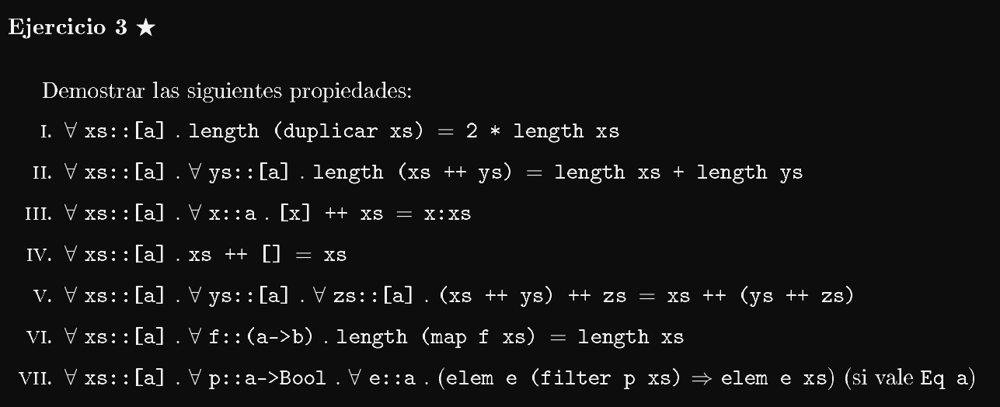

# Ejercicio 1




1. 
$\text{Por lema de generación de pares } \forall x::a, \ y::b.$ Quiero demostrar que intercambiar (intercambiar (x,y)) = (x,y)
```
En efecto:

    intercambiar (intercambiar (x,y)) = (x,y)
    intercambiar (y,x) = (x,y)                      por ec. de intercambiar
    (x,y) = (x,y)                                   por ec. de intercambiar
```
2. 
$\text{Por lema de generación de pares } \forall x::a. \ k::d.$ Quiero demostrar que asociarD (asociarI (x, k)) = (x,k). 

Nuevamente 
$\text{por lema de generación de pares } \forall x::a. \ y::b. \ z::c.$ Quiero demostrar que asociarD (asociarI (x, (y,z))) = (x, (y,z)). 
```
En efecto:

    asociarD (asociarI (x, (y,z))) = (x, (y,z))
    asociarD ((x, y), z) = (x, (y ,z))                    por ec. de asociarI
    (x, (y,z)) = (x, (y,z))                               por ec. de asociarD
```
3. 
$\text{Por lema de generación de sumas } \forall  p \ :: \ Either \  a \ b .$ Quiero demostrar que espejar (espejar p) = p. 

$\text{por lema de generación de sumas } \forall x:: a. \ y:: b.$ Quiero demostrar que espejar (espejar p) = p. 
```
En efecto:
    1. Si p :: Left x
        espejar (espejar Left x) = Left x.
        espejar (Right x) = Left x.                    por ec. de espejar
        Left x = Left x                                por ec. de espejar

    2. Si p :: Right y
        espejar (espejar Right y) = Right y.
        espejar (Left y) = Right y.                      por ec. de espejar
        Right x = Right y                                por ec. de espejar
```
3. 
Quiero demostrar que ∀ f::a->b->c . ∀ x::a . ∀ y::b . flip (flip f) x y = f x y
```
En efecto:
    flip (flip f) x y = f x y
    flip f y x = f x y           por ec. de flip
    f x y = f x y                por ec. de flip
```
4. 
Quiero demostrar que ∀ f::a->b->c . ∀ x::a . ∀ y::b . curry (uncurry f) x y = f x y
```
En efecto:
    curry (uncurry f) x y = f x y
    uncurry f (x y) = f x y              por ec. de curry
    f x y = f x y                        por ec. de uncurry
```

# Ejercicio 2


1. 
```
id               :: (a->a)
flip . flip      :: (a->b->c)->a->b->c
flip . flip = id :: (a->b->c)->a->b->c
```
$$
\text{Por extensionalidad funcional sean } f \ :: \ \text{(a->b->c)}. \ x :: a. \ y :: b. \\
\text{Quiero demostrar que } flip \ . \ flip \  (f \ x \ y) = \ id (f \ x \ y)
$$
```
En efecto:
    flip . flip (f x y) = id (f x y)
    (flip . flip) (f x y) = id (f x y)
    flip (flip f x y) = id (f x y)          por ec. de (.)
    flip (f y x) = id (f x y)               por ec. de flip
    f x y = id (f x y)                      por ec. de flip
    f x y = f x y                           por ec. de id
```
2. 
```
curry                      :: ((a,b) -> c) -> a -> b -> c
uncurry                    :: (a -> b -> c) -> (a,b) -> c
uncurry (curry f) = f      :: a->b->c
```
$$
\text{Por extensionalidad funcional sean } x :: a. \ y :: b. \\
\text{Quiero demostrar que } uncurry  \ (curry \ f) \ x \ y = \ f \ x \ y 
$$
```
En efecto:
    uncurry (curry f) x y = f x y
    curry f (x y) = f x y               por ec. de uncurry
    f x y = f x y                       por ec. de curry
```
3. 
```
id                          :: a->a
flip                        :: (a->b->c)->b->a->c
const                       :: a->b->a
flip const                  :: b->a->a
const id                    :: a->(a->a)
```
$$
\text{Por extensionalidad funcional sean } x :: a. \ y :: b. \\
\text{Quiero demostrar que } flip  \ const \ x \ y \= \ const \ id \ x \ y
$$
```
En efecto:
    flip const x y = const id x y
    (flip const) x y = (const id) x y
    const y x = (const id) x y          por ec. de flip
    y = (const id) x y                  por ec. de const
    y = ((const id) x) y                
    y = id y                
    y = y                               por ec. de id
```
4. 
```
(.)                                    :: (b->c)->(a->b)->(a->c)
h . g                                  :: (a->c)  
(h . g) . f                            :: (a->c)
(h . (g . f))                          :: (a->c)
```
$$
\text{Por extensionalidad funcional sea } x :: a.\\
\text{Quiero demostrar que } ((h \ . \ g) \ . \ f) \ x \ = \ (h \ . \ (g \ . \ f)) \ x
$$
```
En efecto:
    ((h . g) . f) x =  (h . (g . f)) x
    (h . g) (f x)   =  (h ((g . f) x))        por ec. de (.)
    (h  (g (f x)))  =  (h (g (f x)))         por ec. de (.)
```

# Ejercicio 3



1. 
$$
\text{Por inducción sobre xs, para probar lo pedido basta ver que } \\
\text{} \\
P([]) \\
P(xs) \implies P(x:xs) \text{ donde}\\
\forall x::a. \ xs::[a]. \  P(xs) \equiv length (duplicar \ xs) = 2 * length \ xs
$$
```
Caso base:

    P([]) = 
    = length (duplicar []) = 2 * length [] =
    = length [] = 2 * length []            =      {D0}
    = 0 = 2 * 0                            =      {L0}
    = 0 = 0                                =      definicion de (*)

El caso base se ve comprobado.
```
```
Paso inductivo:

    P(xs) = length (duplicar xs) = 2 * length xs
    HP = P(xs) vale
    Quiero probar que P(xs) => P(x:xs), Luego

    P(x:xs) =
    length (duplicar (x:xs)) = 2 * length (x:xs)        =      
    length (x:x: duplicar xs) = 2 * length (x:xs)       =      {D1}
             |______________|                
                |
                xs'

    length (x:xs')                  = 2 * length (x:xs)               =       
    1 + length xs'                  = 2 * (1 + length xs)             =       {L1}
    1 + length (x: duplicar xs)     = 2 * (1 + length xs)             =       
    1 + 1 + length (duplicar xs)    = 2 * (1 + length xs)             =       {L1}
    2 + length (duplicar xs)        = 2 * (1 + length xs)             =       {L1}
    2 + 2 * length xs               = 2 * (1 + length xs)             =       {HI}
    2 * (1 + length xs)             = 2 * (1 + length xs)             =       {Saco factor común 2}
    2 * (1 + length xs)             = 2 * (1 + length xs)             

    El paso inductivo se ve comprobado
```
Como hemos podido probar el caso base y el paso inductivo, entonces por principio de inducción estructural sobre listas hemos probado lo que queríamos probar, es decir:
$$
\forall xs::[a]. \  P(xs) \equiv length (duplicar \ xs) = 2 * length \ xs
$$

2. 
$$
\text{Por inducción sobre xs, para probar lo pedido basta ver que } \\
\text{} \\
P([]) \\
P(xs) \implies P(x:xs) \text{ donde}\\
\forall x::a. \ xs, \ ys::[a]. \  P(xs) \equiv length \ (xs \ ++ \ ys) \ = \ length \ xs \ + \ length \ ys
$$
```
Caso base:

    P([]) = 
    = length ([] ++ ys) = length [] + length ys =
    = length ys = length [] + length ys         =      {++0}
    = length ys = 0 + length ys                 =      {L0}
    = length ys = length ys                     =      definicion de (+)

El caso base se ve comprobado.
```
```
Paso inductivo:

    P(xs) = length (xs ++ ys) = length xs + length ys
    HP = P(xs) vale
    Quiero probar que P(xs) => P(x:xs), Luego

    P(x:xs) =
    = length ((x:xs) ++ ys) = length (x:xs) + length ys       =
    = length (x: xs ++ ys) = length (x:xs) + length ys        =     {++1}
    = 1 + length (xs ++ ys) = 1 + length xs + length ys       =     {L1}
    = 1 + length xs + length ys = 1 + length xs + length ys   =     {HI}

    El paso inductivo se ve comprobado
```
Como hemos podido probar el caso base y el paso inductivo, entonces por principio de inducción estructural sobre listas hemos probado lo que queríamos probar, es decir:
$$
\forall x::a. \ xs, \ ys::[a]. \  P(xs) \equiv length \ (xs \ ++ \ ys) \ = \ length \ xs \ + \ length \ ys
$$

> Me salteo un par de ejercicicios porque sino no termino más.

6. 
$$
\text{Por inducción sobre xs, para probar lo pedido basta ver que } \\
\text{} \\
P([]) \\
P(xs) \implies P(x:xs) \text{ donde}\\
\forall x::a. \ xs ::[a]. \ f::(a->b). \  P(xs) \equiv \ length \ (map \ f \ xs) \ = \ length \ xs
$$

Recuerdo 
```haskell
map :: (a->b)->[a]->[b]
map _ []     = []               {M0}
map f (x:xs) = f x : map f xs   {M1}
```
```
Caso base:

    P([]) = 
    length (map f []) = length []
    length [] = length []               {M0}

    El caso base se ve comprobado.
```
```
Paso inductivo:

    P(xs) = length (map f xs) = length xs
    HP = P(xs) vale
    Quiero probar que P(xs) => P(x:xs), Luego

    P(x:xs) =
    = length (map f (x:xs))  = length (x:xs)           = 
    = length (f x: map f xs) = length (x:xs)           =   {M1} 
    = length (x': map f xs)  = length (x:xs)           =   {f x = x'} 
    = 1 + length (map f xs)  = 1 + length xs           =   {L1} 
    = 1 + length xs          = 1 + length xs           =   {HI} 

    El paso inductivo se ve comprobado.
```

Como hemos podido probar el caso base y el paso inductivo, entonces por principio de inducción estructural sobre listas hemos probado lo que queríamos probar, es decir:
$$
\forall x::a. \ xs ::[a]. \ f::(a->b). \  P(xs) \equiv \ length \ (map \ f \ xs) \ = \ length \ xs
$$

7. 
$$
\text{Por inducción sobre xs, para probar lo pedido basta ver que } \\
\text{} \\
P([]) \\
P(xs) \implies P(x:xs) \text{ donde}\\
\forall xs::[a]. \ p::a->Bool. \ e::a. (elem \ e \ (filter \ p \ xs) \implies \ elem \ e \ xs) \ \text{(si vale Eq a)}
$$

Recuerdo 
```haskell
filter :: (a-> Bool)->[a]->[a]
filter _ []     = []                                            {F0}
filter f (x:xs) = if f x then x: filter f xs else filter f xs   {F1}
```
Si $(elem \ e \ (filter \ p \ xs))$ no vale entonces $elem \ e \ xs$ puede valer o no valer.
para poder demostrar lo pedido debemos asumir que $(elem \ e \ (filter \ p \ xs))$ vale
```
Caso base:

    P([]) = 
    elem e (filter p []) =>  elem e []
    elem e [] =>  elem e []                 {F0}

    El caso base se ve comprobado.
```
```
Paso inductivo:

    P(xs) =  (elem e (filter p xs) ⇒ elem e xs)
    HP = P(xs) vale
    Quiero probar que P(xs) => P(x:xs), Luego

    P(x:xs) =
    = elem e (filter p (x:xs)) ⇒ elem e (x:xs)           <=>
        1. Si filter p (x:xs) == True
            <=> elem e (x: filter p xs) ⇒ elem e (x:xs)  <=>   {F1}
                1.1 Si e == x
                    True => True
                1.2 Si e /= x
                    elem e (filter p xs) ⇒ elem e xs     <=>   
                    <=> True                                    {HP}
        2. Si filter p (x:xs) == False
            <=> elem e (filter p xs) ⇒ elem e (x:xs)
                2.1 Si e == x
                    <=> elem e (filter p xs) ⇒ True <=>
                    <=> elem e (filter p xs) == True
                2.2 Si e /= x
                    <=> elem e (filter p xs) ⇒ elem e xs <=>    {E1}
                    <=> True                                     {HP}

    El paso inductivo se ve comprobado. 
```

Como hemos podido probar el caso base y el paso inductivo, entonces por principio de inducción estructural sobre listas hemos probado lo que queríamos probar, es decir:
$$
\forall xs::[a]. \ p::a->Bool. \ e::a. (elem \ e \ (filter \ p \ xs) \implies \ elem \ e \ xs) \ \text{(si vale Eq a)}
$$

# Ejercicio 4
1. 
Demostración por principio de inducción sobre listas

Sea por principio de extensionalidad funcional
$\forall xs::[a]. \ P(xs) \equiv $ reverse xs = foldr (\x rec-> rec ++ (x:[])) [] xs

$$
\text{Por inducción sobre xs, para probar lo pedido basta ver que } \\
\text{} \\
P([]) \\
P(xs) \implies P(x:xs) \text{ donde}\\
$$
        P(xs) ≡ ∀ x :: a. ∀ xs::[a]. reverse (x:xs) = foldr (\x rec-> rec ++ (x:[])) [] (x:xs)

Recuerdo 
```haskell
foldr :: (a->b->b) -> b-> [a] -> b
foldr _ z [] = z                            {F0}
foldr f z (x:xs) = f x (foldr f z xs)        {F1}
```
```
Caso base:
    P([]) =
    = reverse [] = foldr (\x rec-> rec ++ (x:[])) [] [] = 
    = reverse [] = []                                   =     {F0}
    = [] = []                                           =     {R0}

    El caso base se ve comprobado.
```
```
Paso inductivo:
    P(xs) ≡ ∀ x :: a. ∀ xs::[a]. reverse xs = foldr (\x rec-> rec ++ (x:[])) [] xs
    HP = P(xs) vale

    P(x:xs) =
    = reverse (x':xs) = foldr (\x rec-> rec ++ (x:[])) [] (x':xs)           = 
    = [x'] ++ reverse xs = foldr (\x rec-> rec ++ (x:[])) [] (x':xs)        = {R1}
    = reverse xs ++ [x'] = (++) (foldr (\x rec -> rec ++ (x:[]))) [x']      = {F1}
    = (++) (reverse xs) [x'] = (++) (foldr (\x rec -> rec ++ (x:[]))) [x']  = {F1}
    = (++) (reverse xs) [x'] = (++) (reverse xs) [x']                       = {HP}

    El paso inductivo se ve comprobado.
```
Como logramos probar el caso base y el paso inductivo, entonces por principio de inducción sobre listas podemos afirmar que probamos lo que queriamos probar, es decir, probamos que:
  
        P(xs) ≡ ∀ x :: a. ∀ xs::[a]. reverse (x:xs) = foldr (\x rec-> rec ++ (x:[])) [] (x:xs)

Es verdadero.

> Me podrí con estos ejercicios. Sigo adelante con otros.

# Ejercicio 6

No se ve difícil, pero sí se ve eterno.

# Ejercicio 7

Es eterno, pero muy completo. Lo dejo para prepararme para el parcial.

# Ejercicio 10
```haskell
altura :: Ab a -> Int
altura = foldAB (const 0) (\i r d -> 1 + max i d)

cantNodos :: Ab a -> Int
cantNodos = foldAB (const 0) (\i r d -> 1 + i + d)
```

Probemos esto con inducción estructural. Basta ver que vale:

    P(Nil) 
    P(Bin (Ab a) a (Ab a))
    Donde:
        ∀ x::AB a . P(x) = altura x ≤ cantNodos x

```
Caso base:
    P(Nil)  = altura Nil <= cantNodos Nil =
            = const 0 <= cantNodos Nil    =        {por ec. de altura}
            = const 0 <= const 0          =        {por ec. de cantNodos}
            = 0 <= 0                      =        {por ec. de const}

    El caso baes se ve comprobado.
```

```
Paso inductivo:
    Sea ∀ x::AB a . P(x) = altura x ≤ cantNodos x
    HP = P(x) vale

```
> No sé dónde agregar el otro elemento.

    