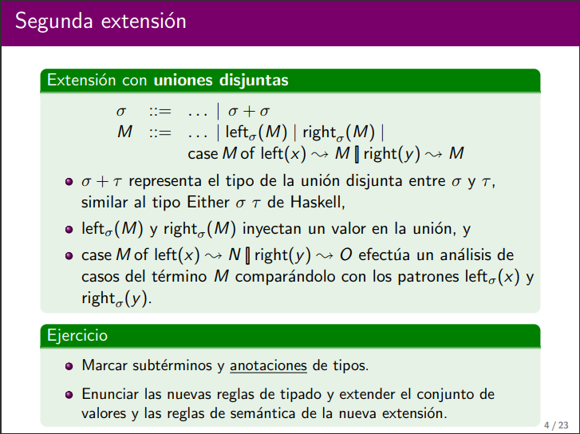
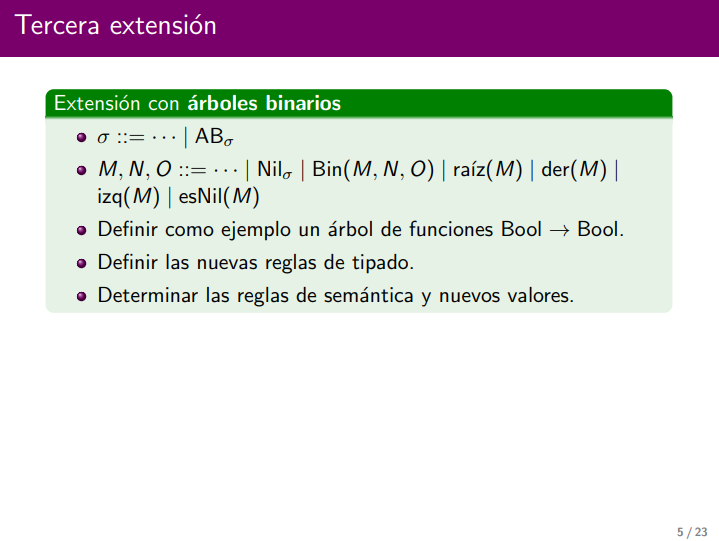
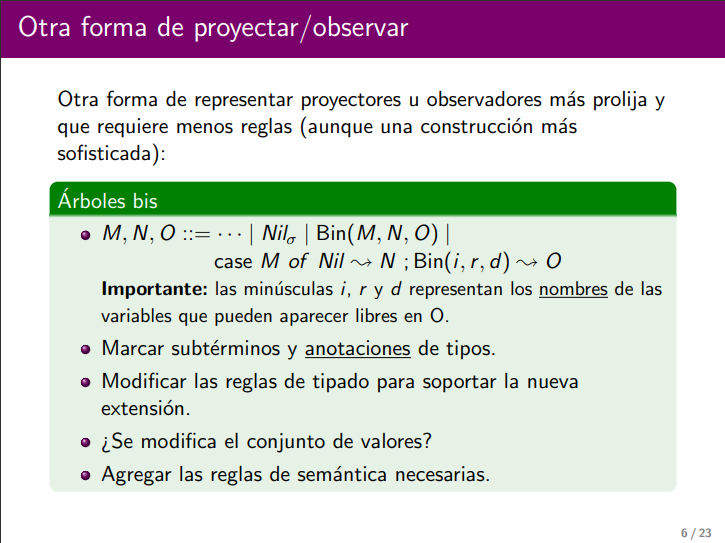
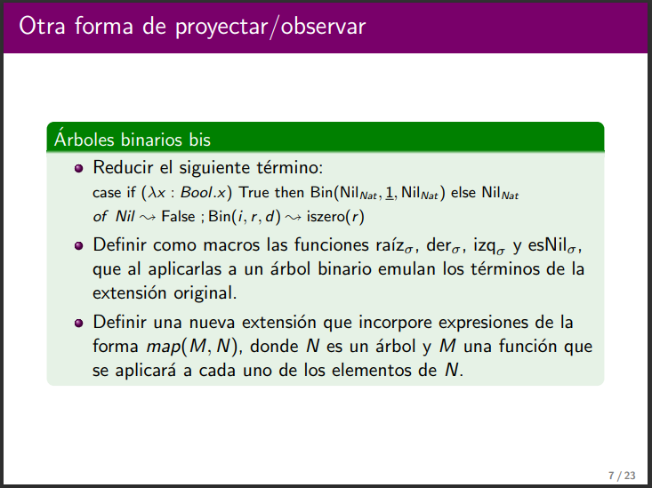

# Clase cálculo lambda - Parte dos

Vamos a extender al cálculo lambda para que tenga tuplas de dos elementos.

Pasos:

1. Tenemos que extender la gramática
2. Si hace falta extendemos el sistema de tipos.

Tipos: $\sigma,\tau := \sigma \times \tau$

Gramática: 
```
M := ... | (M, M) | π_1(M) | π_2(M)
```
## Ejercicio macro $\text{curry}_{\sigma,\tau,\delta}$

Definición macro
```
curry_σ,τ,δ ≡ λf: σ x τ -> δ. λx: σ. λτ. f (x,y)
```
Reglas de tipado
```
Γ ⊢ M: σ     Γ ⊢ N:τ
______________________T-Tupla
Γ ⊢ (M, N): σ x τ


Γ ⊢ M: σ x τ
__________________T-pi1
Γ ⊢ π_1(M): σ

Γ ⊢ M: σ x τ
__________________
Γ ⊢ π_2(M): τ
```
Conjunto de valores
```
V := ... | (V, V)
```
Nuevas reglas semánticas

Reglas de congruencia
```
    M -> M'
_____________________T-
(M, N) -> (M', N)


    N -> N'
_____________________T-         DEFINIMOS ESTA REGLA ASÍ PORQUE QUEREMOS PRESERVAR DETERMINISMO
(V, N) -> (V, N')


    M -> M'
_________________
π_1(M) -> π_1(M')

    M -> M'
_________________          SE DEFINE ASÍ PORQUE LAS OTRAS DOS DE ARRIBA ME REDUCEN, ESTA ES LA
π_1(M) -> π_1(M')               QUE HACE EL ÚLTIMO PASO DE REDUCCIÓN.

    M -> M'
_________________               SE DEFINE ASÍ PORQUE LAS OTRAS DOS DE ARRIBA ME REDUCEN, ESTA ES LA
π_2(M) -> π_2(M')               QUE HACE EL ÚLTIMO PASO DE REDUCCIÓN.
```
Reglas de cómputo
```
____________________C-π_1
π_1((V1, V2)) -> V1

____________________
π_2((V1, V2)) -> V2
```

Verificar el siguiente juicio de tipado:

$\empty\vdash\pi _{1}((\lambda x:Nat.(x, True)) 0):Nat$
```
τ:Bool

_____________(T-var)    ______________________(T-True)
x:Nat ⊢ x:Nat           x:Nat ⊢ True : τ
______________________________________________(T-tupla)
x:Nat ⊢ (x, True) Nat X τ
______________________________________________(T-Abs)      ___________(T-zero)
∅ ⊢ λx: Nat. (x, True): Nat -> Nat X τ                     ∅ ⊢ 0: Nat
______________________________________________________________________(T-App)
∅ ⊢ (λx: Nat. (x, True)) 0: Nat X τ
______________________________________________________________________(T-pi1)
∅ ⊢ π_1((λx: Nat. (x, True)) 0): Nat
```

Reducir el siguiente término a un valor:

$\empty\vdash\pi _{1}((\lambda x:Nat.(x, True)) 0):Nat$

```
π_1((λx: Nat. (x, True)) 0) --> E-pi1, beta
π_1((0, True)) --> C-π_1
0 --> es valor
```

## Extensión con uniones disjuntas



Ese + es simplemente una anotación de tipo para lo que nosotros definiremos como unión disjunta.

Ejemplo
```
Case left_{bool}(0) of left(x) --> isZero(x) [] right (x) --> x 
```

Reglas de tipado
```
Γ ⊢ M : τ 
______________________T-Left
Γ ⊢ left_σ(M) : τ + σ


Γ ⊢ M : τ 
______________________T-right
Γ ⊢ right_σ(M) : σ + τ


Γ ⊢ M: σ + τ    Γ, x: σ ⊢ N: δ    Γ, y: τ ⊢ O: δ
__________________________________________________T-case
Γ ⊢ case M of left(x) --> N [] right(y) --> O : δ 
```

Conjunto de valores:
```
V:= ... | Left_σ(V) | right_σ(V)
```

Reglas de semántica:

Reglas de congruencia:

```
    M -> M'
_______________________
left_σ(M) -> left_σ(M')


    M -> M'
_______________________
right_σ(M) -> right_σ(M')


                                    M -> M'
__________________________________________________________________________________________
case M of left(x) --> N [] right(y) --> O -> case M' of left(x) --> N [] right(y) --> O 


-------------- cómputo
_______________________________________________________________
case left_σ(V) of left(x) --> N [] right(y) --> O -> N {x <- V}


_______________________________________________________________
case right_σ(V) of left(x) --> N [] right(y) --> O -> O {y <- V}

```

Este case lo que hace es: dame algo de tipo suma y luego yo me encargo de desarmarlo.


## Extensión con árboles binarios



Un ejemplo sería

```
Nil_{Bool->Bool} --> Nil_{BB}

Bin (Nil_{BB}, λx:Bool. x), Nil_{BB}
```

Reglas de tipado:

```
_________________T-Nil
Γ ⊢ Nil_σ : AB_σ


Γ ⊢ M1 : AB_σ   Γ ⊢ M2 : AB_σ   Γ ⊢ M3 : AB_σ
________________________________________________T-Bin
Γ ⊢ Bin(M1, M2, M3) : AB_σ


Γ ⊢ M: AB_σ
________________
Γ ⊢ raiz(M) : σ


Γ ⊢ M: AB_σ
________________
Γ ⊢ der(M) : AB_σ

Γ ⊢ M: AB_σ
________________
Γ ⊢ izq(M) : AB_σ

Γ ⊢ M: AB_σ
________________
Γ ⊢ esNil(M) : Bool
```

Conjunto de valores:

```
V := ... | Nil_σ | Bin_σ(V, V, V)
```

Reglas de semántica:

```
    M -> M' 
_____________________________
Bin(M, N, O) -> Bin(M', N, O)


    N -> N' 
_____________________________
Bin(V, N, O) -> Bin(V, N', O)


    O -> O' 
_____________________________
Bin(V, V, O) -> Bin(V, V, O')


    M -> M'
_____________________
esNil(M) -> esNil(M')


------------- cómputo

____________________
esNil(Nil_σ) -> True

_______________________________
esNil(Bin(V1, V2, V3)) -> False


der(Nil_σ) # es un error. Para resolver esto tenemos dos opciones: o no lo escribimos o 

der(Nil_σ) -> \bottom_{AB_σ}

donde \bottom_{AB_σ} = fix (λx:AB_σ. x)

##################################################
fix es el punto fijo de una función! 

el punto fijo es dada una función y un valor, si aplicamos ese valor como argumento a la función, entonces esta me devuelve ese mismo argumento.

ejemplo: 

f(x) = 1 --> Acá x=1 es el punto fijo.
f(x) = x + 1 --> Acá x=vacío.
f(x) = x --> Acá se vale toda x.

Algo así como el valor de x que hace que la función se comporte como la identidad.

en este caso fix se define como indeterminado si hay 0 o más de un punto fijo.
##################################################


Terminar las demás...
```

## Otra forma de proyectar/observar



La única anotacion es σ y la sabemos del Nil.

Los subtérminos son M, N, O

modificación de reglas de tipado:

```

Γ ⊢ M: AB_σ     Γ ⊢ N: τ    Γ, i:AB_σ, r: σ, d: AB_σ ⊢ O: τ
____________________________________________________________
Γ ⊢ case M of Nil ~> N [] Bin(i, r, d) ~> O: AB_σ -> τ

Usamos τ porque en principio no tienen por qué devolver el mismo tipo! Por ejemplo: el AB puede ser de funciones lambda que me devuelven un Bool al ser reducidas!!!
```

No se modifican el conjunto de valores.

Reglas de semántica, vamos a tener una por cada subtérmino!

```
Las mismas 3 del Bin

    M -> M'
____________________________________________________________________________________E-case
case M of Nil ~> N [] Bin(i, r, d) ~> O ~> case M' of Nil ~> N [] Bin(i, r, d) ~> O


---------- cómputo

__________________________________________________
case Nil_σ of Nil ~> N [] Bin(i, r, d) ~> O ~> N


__________________________________________________________________________C-Case
case Bin(V1, V2, V3) of Nil ~> N [] Bin(i, r, d) ~> O{i:=V1, r:=V2, d:=V3} 
```




Ejercicio:
```
case if (λx : Bool.x) True then Bin(Nil_Nat, 1, Nil_Nat) else Nil_Nat of Nil ~> False ; Bin(i,r, d) ~> iszero(r) --> E-case, E-IF, Beta

case if True then Bin(Nil_Nat, 1, Nil_Nat) else Nil_Nat of Nil ~> False ; Bin(i,r, d) ~> iszero(r) --> E-case, E-If-True

case Bin(Nil_Nat, 1, Nil_Nat) of Nil ~> False ; Bin(i,r, d) ~> iszero(r) --> E-case, E-If-True --> C-Case

iszero(1) --> E-isZeroSucc

False --> es una forma normal que en particular es un valor porque se encuentra definido en nuestro conjunto de valores.
```

```
esNil_σ = (λx: AB_σ. case x of Nil_σ ~> True [] Bin(i, r, d) ~> False)

raiz_σ = (λx: AB_σ. case x of Nil_σ ~> \bottom_σ [] Bin(i, r, d) ~> r)
```

Ojo que el Map este sí es recursivo!
```
M, N, O := ... | map(F, M)
```
No me modifica el conjunto de valores porque al aplicar map o caigo en un árbol que va a ser de un tipo válido. Siempre caigo en un árbol y yo ya tenía definido a los árboles para todo tipo.

Regla de tipado
```
Γ ⊢ F: σ -> τ   Γ ⊢ M: AB_σ
_____________________________
Γ ⊢ map(F, M): AB_τ
```

Regla de congruencia: dos porque hay dos subtérminos
```
    F -> F'
_______________________
map(F, M) -> map(F', M)


    M -> M'
_______________________
map(V, M) -> map(V, M)

```

Reglas de cómputo:

```
    ∅ ⊢ V: σ -> τ
_________________________
map(V, Nil_σ) -> Nil_τ 


____________________________________________________________ ~~~~> Esto es recursión.
map(V, Bin(V1, V2, V3)) -> Bin(map(V, V1), V V2, map(V, V3))

```
Le metemos esa "premisa" a la regla porque sino no estamos aclarando de dónde sale el τ. Es importante recordar que las reglas de cómputo **pueden** tener esas "premisas", lo único que no tienen las reglas de cómputo son pasos de reducción. Igualmente recordemos que si lelgamos a una regla de cómputo es porque todo tipó antes.

Metemos el map en V1 y V2 porque V1 y V2 son los subárboles disponibles.


# Notas
- Cuando agregamos alguna estructura nueva generalmente es útil agregar también algún tipo de observador para poder realizar alguna operación muy fundamental con la estructura.
- La gracia de la macro es que no modifiquemos el sistemas que estamos modelando, solamente usarla como un reemplazo sintáctico.
- Conviene agregar una regla de tipado por cada nuevo contructor agregado, puede haber algún caso patológico en donde debamos agregar más reglas de tipado.
- Que esté en forma normal significa que no puedo aplicar ninguna regla de reducción.
- Diferencia entre valor y error: Ambos son formas normales PERO los errores no pertenecen al conjunto de valores definido.
- Las reglas de semántica son: una parte las reglas que me definen qué hacer con los valores (de cómputo), las reglas que me reducen expresiones (de congruencia).
- Un subtérmino es un término dentro de otro término. Ejemplo: Left_sigma(M), ahí M es subtérmino de tipo sigma.
- Nos pueden llegar a pedir en el parcial que modifiquemos algo en un cálculo lambda para que no lelguen a errores.
- Podemos pensar que si tenemos una especie de if o case y alguna rama tiene un bottom, entonces nuestro programa puede llegar a un valor si no cae en esa rama, que haya un bottom en una rama no implica que el programa sea bottom.
- Solo podemos usar una regla de cómputo por aplicación de reglas.
- No podemos llamar a una macro en la definición de otra macro.
- En el parcial puede haber alguna versión con recursión.