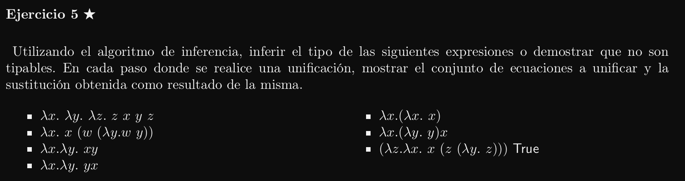
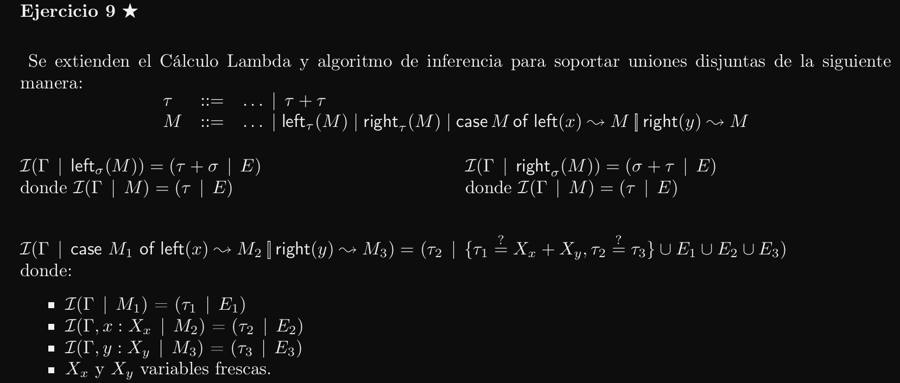

# a) λx. λy. λz. z x y z
1. Rectificación:
```
λx. λy. λk. k x y z
```

2. Anotación:
```
R0 = {z:X4}
M0 =  λx:X1. λy:X2. λk:X3. k x y z
```
3. Generación de restricciones:
``` 
                                                        t
                                               ____________________
I({z:X4} | λx:X1. λy:X2. λk:X3. k x y z)    = (X1 -> X2 -> X3 -> X7 | E)
 I({z:X4, λx:X1} | λy:X2. λk:X3. k x y z)   = (X2 -> X3 -> X7 | E)
  I({z:X4, λx:X1, λy:X2} | λk:X3. k x y z)  = (X3 -> X7 | E)
                                                                           E
                                                   _______________________________________________
   I({z:X4, λx:X1, λy:X2, λk:X3} | k x y z) = (X7 | X6?=(X4 -> X7), X5?=(X2 -> X6), X3?=(X1 -> X5))
    I({z:X4, λx:X1, λy:X2, λk:X3} | k x y)  = (X6 | X5 ?= (X2 -> X6), X3 ?= (X1 -> X5))
     I({z:X4, λx:X1, λy:X2, λk:X3} | k x)   = (X5 | X3 ?= (X1 -> X5))
      I({z:X4, λx:X1, λy:X2, λk:X3} | k)    = (X3 | {})
      I({z:X4, λx:X1, λy:X2, λk:X3} | x)    = (X1 | {})
     I({z:X4, λx:X1, λy:X2, λk:X3} | y)     = (X2 | {})
    I({z:X4, λx:X1, λy:X2, λk:X3} | z)      = (X4 | {})
```
4. Unificación de restricciones
```
S = MGU(E) =
 {X6?=(X4 -> X7), X5?=(X2 -> X6), X3?=(X1 -> X5)}       -> Elim {X5 := X2 -> X6}
 {X6?=(X4 -> X7), X3?=(X1 -> (X2 -> X6))}               -> Elim {X6 := X4 -> X7}
 {X3?=(X1 -> (X2 -> X4 -> X7))}                         -> Elim {X3 := X1 -> X2 -> X4 -> X7}
 {}

 S = {X3 := X1 -> X2 -> X4 -> X7} ° {X6 := X4 -> X7} ° {X5 := X2 -> X6} =
     {X3 := X1 -> X2 -> X4 -> X7, X6 := X4 -> X7}

 Juicio de tipado más general:
  S(R0) |- S(M0) : S(t) = 
    {z: X4} |- λx:X1. λy:X2. λk:X3. k x y z : X1 -> X2 -> X1 -> X2 -> X4 -> X7 -> X7
```
### Corrección
Está mal porque el alfarenombre correcto en rectificación es: λx. λy. λk. k x y k.

Al hacerlo con ese alfarenombre llegamos a un occurs-check y la expresión no tipa. Igualmente estuvo bueno practicar todo el ejercicio.

---



