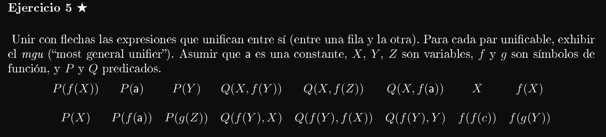
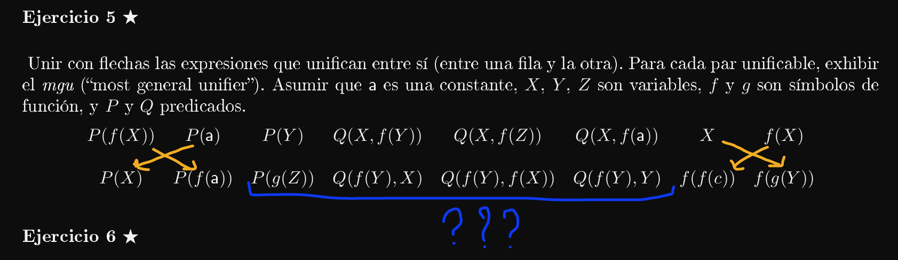
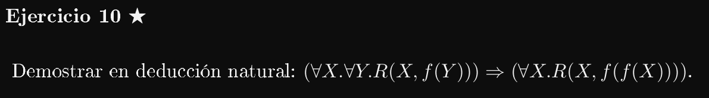
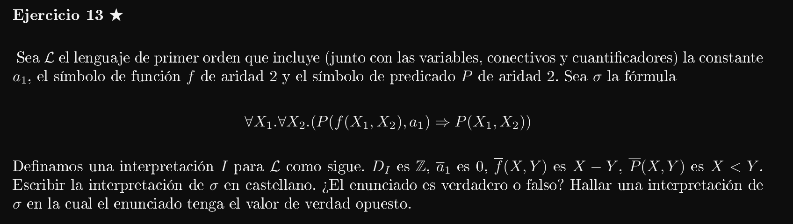
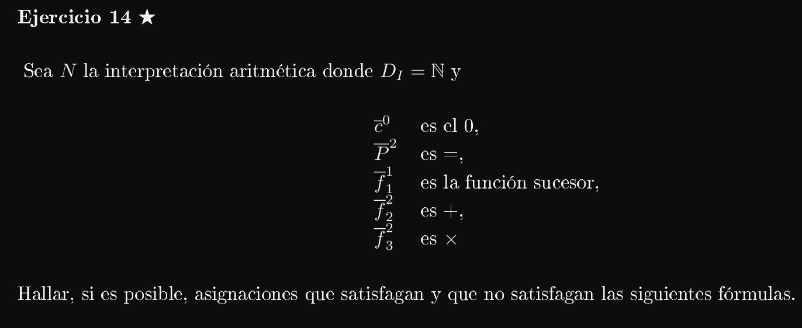
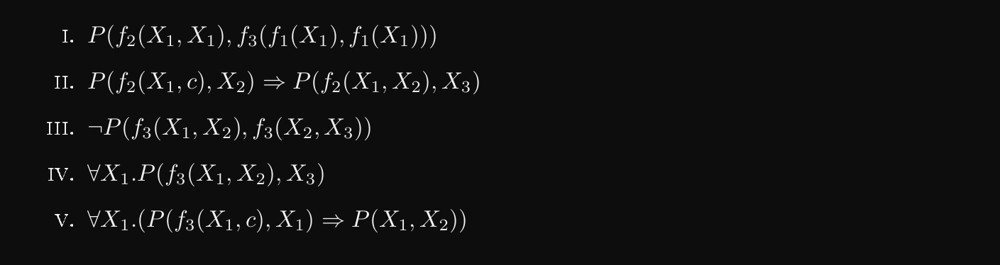

---


3. Intercambio (∃/∀): ∃X.∀Y.P(X,Y ) =⇒ ∀Y.∃X.P(X,Y)
```
____________________________ax  _____________________________________ax
∃X.∀Y.P(X,Y) |- ∃X.∀Y.P(X,Y)    ∃X.∀Y.P(X,Y), ∀Y.P(X,Y) |- ∀Y.P(X,Y)
_____________________________________________________________________∃e
∃X.∀Y.P(X,Y) |- ∀Y.P(X,Y)
_____________________________________________________________________∀e
∃X.∀Y.P(X,Y) |- P(X,Y)
_____________________________________________________________________∃i
∃X.∀Y.P(X,Y) |- ∃X.P(X,Y)
_____________________________________________________________________∀i
∃X.∀Y.P(X,Y) |- ∀Y.∃X.P(X,Y)
_____________________________________________________________________=>i
|- ∃X.∀Y.P(X,Y) => ∀Y.∃X.P(X,Y)
```

10. ∀X.(P(X) ∨ σ) ⇐⇒ (∀X.P(X))∨σ
```
                                    No sé
________________________________________________________________________________________
                                ∀X.(P(X) ∨ σ), P(X), ¬σ |- ⊥
________________________________________________________________________________________¬i
                                ∀X.(P(X) ∨ σ), P(X) |- ¬¬σ
________________________________________________________________________________________¬¬e
_______________________________ax               |
∀X.(P(X) ∨ σ) |- ∀X.(P(X) V σ)                  |
_______________________________∀e _________________________   __________________________ax
∀X.(P(X) ∨ σ) |- P(X) V σ         ∀X.(P(X) ∨ σ), P(X) |- σ    ∀X.(P(X) ∨ σ), σ |- σ
________________________________________________________________________________________∨e
∀X.(P(X) ∨ σ) |- σ
________________________________________________________________________________________Vi2
∀X.(P(X) ∨ σ) |- (∀X.P(X)) ∨ σ
________________________________________________________________________________________=>i
|- ∀X.(P(X) ∨ σ) => (∀X.P(X)) ∨ σ
```
```
                                                                        no sé
_________________________ax _________________________________ax _________________________
(∀X.P(X))∨σ|-(∀X.P(X))Vσ    (∀X.P(X))∨σ,(∀X.P(X))|-(∀X.P(X))   (∀X.P(X))∨σ, σ|-(∀X.P(X))
_________________________________________________________________________________________Ve
(∀X.P(X)) ∨ σ |- ∀X. P(X) 
_________________________________________________________________________________________∀e
(∀X.P(X)) ∨ σ |- P(X) 
_________________________________________________________________________________________Vi1
(∀X.P(X)) ∨ σ |- P(X) ∨ σ 
_________________________________________________________________________________________∀i
(∀X.P(X)) ∨ σ |- ∀X.(P(X) ∨ σ) 
_________________________________________________________________________________________=>i
|- (∀X.P(X)) ∨ σ => ∀X.(P(X) ∨ σ) 
```

13. ∃X.(P(X) =⇒ ∀X.P(X))

```
??????????????????????????????????????
______________________________________ax
P(Z) |- P(X)
______________________________________∀i
P(Z) |- ∀X.P(X)
______________________________________=>i
|- P(Z) => ∀X.P(X)                        > se vale? El ∃X no liga a la X del ∀X?
______________________________________∃i
|-∃X.(P(X) => ∀X.P(X))
```



```
______________________________________________________________________ax
(∀X.∀Y.R(X,f(Y ))) |- ∀X.∀Y. R(X,f(Y))
______________________________________________________________________∀e {X := X}
(∀X.∀Y.R(X,f(Y ))) |- ∀Y. R(X,f(Y))
______________________________________________________________________∀e {Y := f(X)}
(∀X.∀Y.R(X,f(Y ))) |- R(X,f(f(X)))
______________________________________________________________________∀i
(∀X.∀Y.R(X,f(Y ))) |- ∀X.R(X,f(f(X)))
______________________________________________________________________=>i
|-(∀X.∀Y.R(X,f(Y ))) ⇒ (∀X.R(X,f(f(X))))
```
>>> Son válidos esos reemplazos?

---



Si la resta entre dos números a y b es negativa, entonces a < b.

Para mi el enunciado es verdadero. 

> No entiendo a qué se refieren con una interpretación para sigma, no debería de ser para L? EDIT: efectivamente, hay que darle una interpretación a L.

No se me ocurre nada para reemplazar y que me de el valor de verdad contrario.

---




No entiendo cómo es eso de la asignación. EDIT: la asignación es una función que le da valores a cada variable libre. En resumen: le damos valores a las variables libres.

1. 
    ```
    P(f2(X1,X1), f3(f1(X1),f1(X1)) )
    
    2A = (A+1)(A+1)
    2A = A^2 + 2A + 1
    (A/2) + 1 + (1/2A) = 1
    (A/2) + (1/2A) = 0
    (2(A^2) + 2)/ 4A = 0
    2(A^2) + 2 = 0
    2(A^2) = -2
    A^2 = -1 ~~~> Imposible si nuestro dominio es los números Naturales.
    ```

3. 
    ¬P(f3(X1,X2),f3(X2,X3))

    A*B /= B*C
    A /= C

    Asignación = {X1 := c, X2 := f(c), X3 := f(f(c))}
    
5. 
    ∀X1.(P(f3(X1,c),X1) ⇒ P(X1,X2))

    ¬P(f3(X1,c),X1) V P(X1, X2)

    X1*0 /= X1 V X1 = X2

    0 /= X1 V X1 = X2 ~~~> mmmm

    Es imposible porque el único valor para que la fórmula valga es X1 := 0 y el para todo no sería válido entonces.


