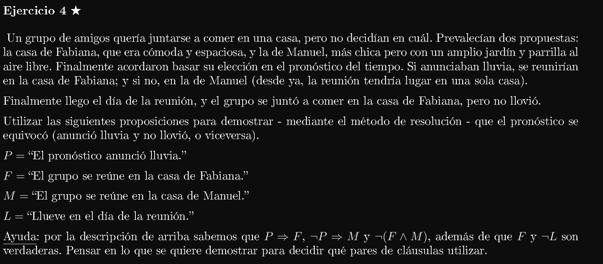
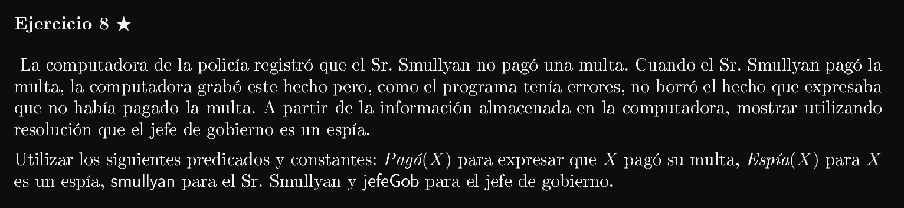
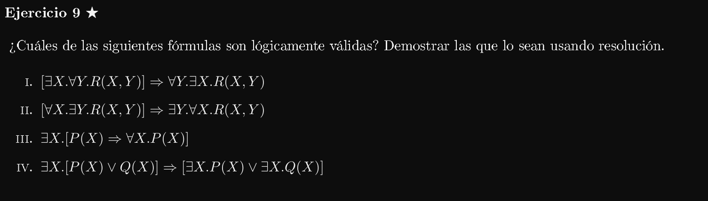
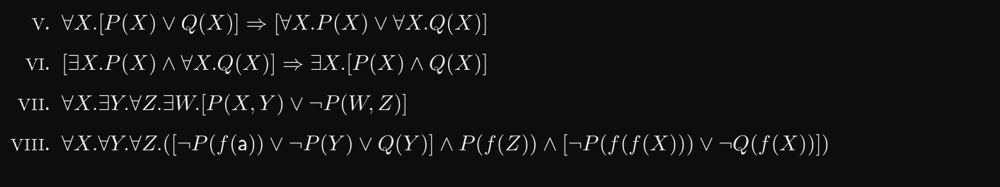
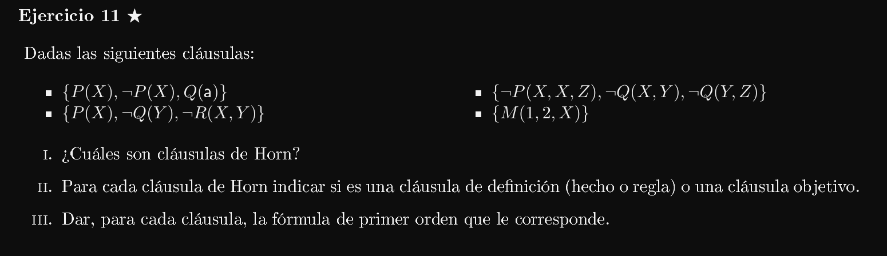
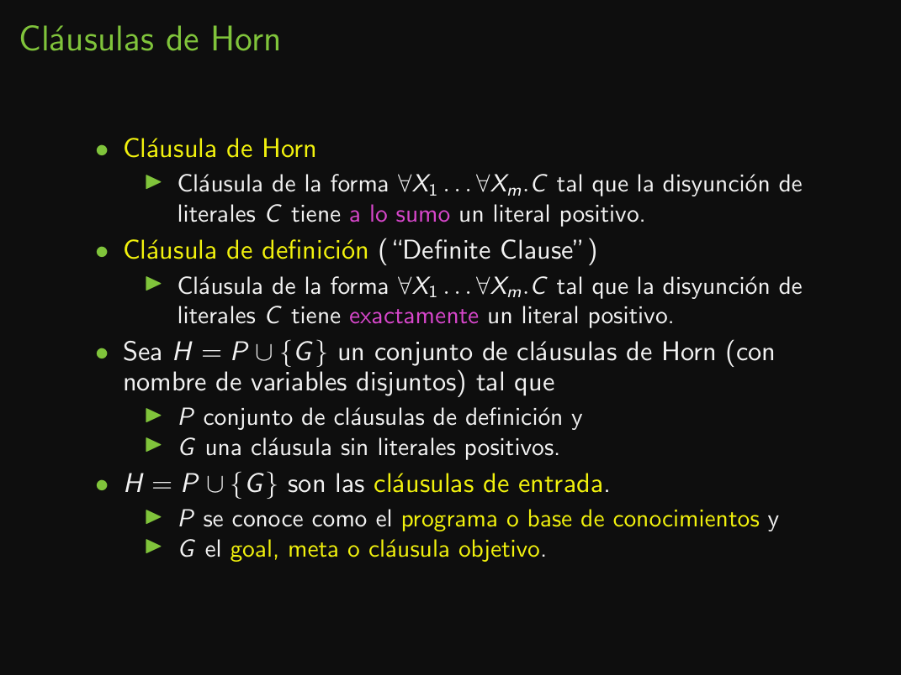
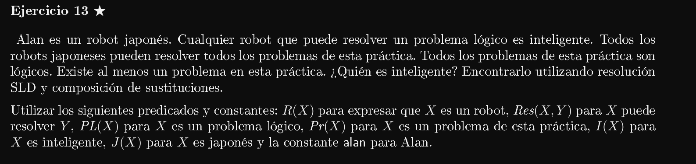
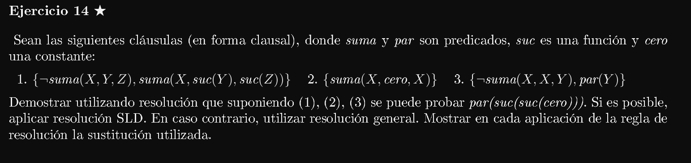
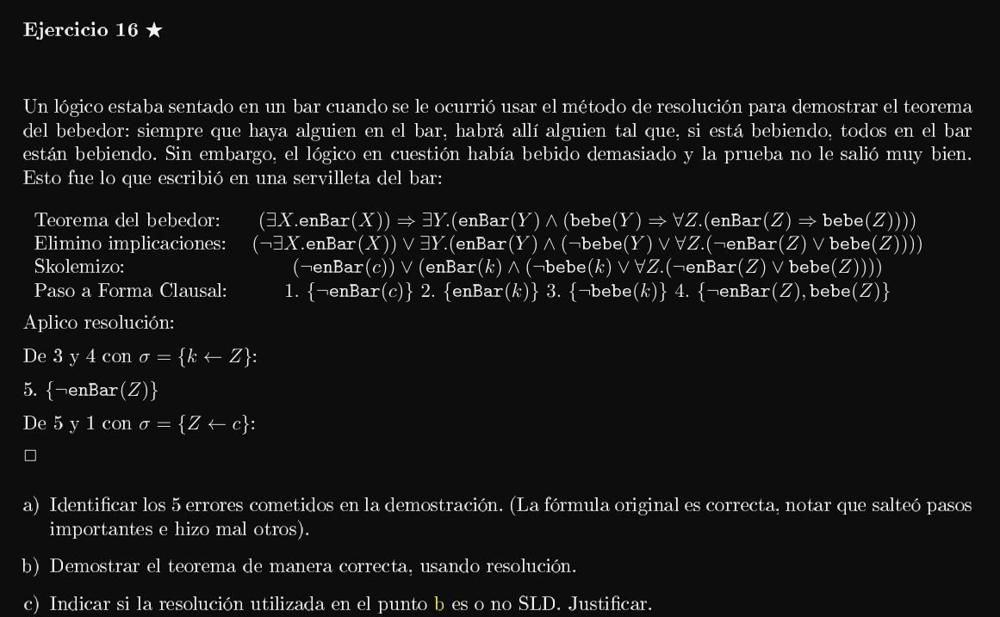
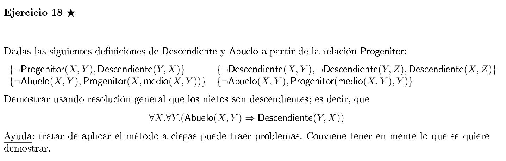

5. 

    D := ¬(P ∧Q)⇒(¬P ∨¬Q)
    ¬D := ¬(¬(P ∧Q)⇒(¬P ∨¬Q))

    ¬(¬(¬(P ∧Q)) V (¬P ∨¬Q))
    ¬(¬(¬(P ∧Q)) V (¬P ∨¬Q))
    ¬¬(¬(P ∧ Q)) ∧ ¬(¬P V ¬Q)
    (¬(P ∧ Q)) ∧ (¬¬P ∧ ¬¬Q)
    (¬P V ¬Q) ∧ P ∧ Q ~~~~~~~> Forma normal conjuntiva (FNC)

    Forma Clausal ~> {{(¬P, ¬Q)}, {P}, {Q}}

6. 

    D := (P ∧Q)∨(P ∧R)
    ¬D := ¬((P ∧ Q) ∨ (P ∧ R))

    ¬((P ∧ Q) ∨ (P ∧ R))
    ¬(P ∧ Q) ∧ ¬(P ∧ R)
    (¬P V ¬Q) ∧ (¬P V ¬R) ~~~~~~~~~> FNC

    Forma clausal ~~~~~~~> {{¬P, ¬Q}, {¬P, ¬R}}

8. 

    D := P ⇒ (Q ⇒R)
    ¬D := ¬(P ⇒ (Q ⇒R))

    ¬(P ⇒ (Q ⇒R))
    ¬(¬P V (¬Q V R))
    ¬¬P ∧ ¬(¬Q V R)
    P ∧ ¬¬Q ∧ ¬R
    P ∧ Q ∧ ¬R ~~~~~~~~~~~~~> FNC

    Forma clausal ~> {{P}, {Q}, {R}}

---


A qué se refiere que se deduzca (P ∧ Q) de la fórmula (¬P ⇒ Q)∧(P ⇒ Q)∧(¬P ⇒ ¬Q)? A qué ¬((¬P ⇒ Q)∧(P ⇒ Q)∧(¬P ⇒ ¬Q)) |- (P ∧ Q)???

1, 2 y 5 son tautologías. Las demás o no son o no estoy seguro.

5. 

    ¬(P ∧Q)⇒(¬P ∨¬Q). Su forma clausal era {{(¬P, ¬Q)}, {P}, {Q}}, Luego:

    C = {{(¬P, ¬Q)}, {P}, {Q}}
           ______    ___  ___
            1         2    3
        
        De 1 y 2 obtenemos la resolvente 4 = {¬Q}
        De 3 y 4 obtenemos la resolvente 5 = {}
        
        INSAT  

    Por lo tanto ¬(P ∧Q)⇒(¬P ∨¬Q) es válida.

6. 

    (P ∧ Q) ∨ (P ∧ R). Su forma clausal era {{¬P, ¬Q}, {¬P, ¬R}}, Luego:

    C = {{¬P, ¬Q}, {¬P, ¬R}}
          ______    ______
            1          2
        
        No existe resolvente entre 1 y 2 porque no podemos encontrar ningun literal negado en una y afirmado en la otra.
        Como no existe resolvente entre 1 y 2 que genere una nueva cláusula entonces devolvemos SAT.

    Por lo tanto (P ∧ Q) ∨ (P ∧ R) es inválida.

---



```
P => F, ¬P => M y ¬(F ∧ M)

Forma, clausal ~~> {{¬P, F}, {P, M}, {¬F, ¬M}}

Pero como también tengo que ver que (P ∧ ¬L) V (¬P ∧ L) que es equivalente a que el pronóstico se equivocó.

entonces la forma clausal me queda

C ={{¬P, F}, {P, M}, {¬F, ¬M}, {¬P, L}, {P, ¬L}}. Luego:
    _______  ______  ________  _______  _______
        1       2       3       4          5

    De 1 y 5 obtenemos la resolvente 6 = {F, ¬L}
    De 6 y 3 obtenemos la resolvente 7 = {¬L, ¬M}
    De 4 y 7 obtenemos la resolvente 8 = {¬P, ¬M}
    De 2 y 8 obtenemos la resolvente 9 = {}

    INSAT.

    Por lo tanto la la primera fórmula era verdadera.
```

---


Skip por ahora.

---


1. 

    D := ∃X.∃Y.X < Y
    ¬D := ¬(∃X.(∃Y.X < Y))

    ¬(∃X.(∃Y.X < Y))
    ∀X.¬(∃Y.X < Y)
    ∀X.∀Y. ¬(X < Y)
    ∀X.∀Y. ¬(<(X, Y)) ~~~~~~~~> Forma normal de Skolem

    forma clausal ~~~> {{¬ X < Y}}

2. 

    D := ∀X.∃Y.X < Y
    ¬D := ¬(∀X.∃Y.X < Y)

    ¬(∀X.∃Y.X < Y)
    ∃X.¬∃Y.(X < Y)
    ∃X.∀Y.¬(X < Y)
    ∀Y.¬(f(c) < Y) ~~~~~~~~> Forma normal de Skolem

    forma clausal ~~~> {{¬(f(c) < Y)}}

6. 

    D := ∀X.(P(X)∧∃Y.(Q(Y)∨∀Z.∃W.(P(Z)∧¬Q(W))))
    ¬D := ¬(∀X.(P(X)∧∃Y.(Q(Y)∨∀Z.∃W.(P(Z)∧¬Q(W)))))

    ¬(∀X.(P(X) ∧ ∃Y.(Q(Y)∨∀Z.∃W.(P(Z)∧¬Q(W)))))
    ∃X. (¬(P(X) ∧ ∃Y.(Q(Y)∨∀Z.∃W.(P(Z)∧¬Q(W)))))
    ∃X. (¬P(X) V ¬∃Y.(Q(Y)∨∀Z.∃W.(P(Z)∧¬Q(W))))
    ∃X. (¬P(X) V ∀Y.¬(Q(Y) ∨ ∀Z.∃W.(P(Z)∧¬Q(W))))
    ∃X. (¬P(X) V ∀Y.(¬Q(Y) ∧ ¬∀Z.∃W.(P(Z)∧¬Q(W))))
    ∃X. (¬P(X) V ∀Y.(¬Q(Y) ∧ ∃Z.¬∃W.(P(Z)∧¬Q(W))))
    ∃X. (¬P(X) V ∀Y.(¬Q(Y) ∧ ∃Z.∀W.¬(P(Z)∧¬Q(W))))
    ∃X. (¬P(X) V ∀Y.(¬Q(Y) ∧ ∃Z.∀W.(¬P(Z) V ¬¬Q(W))))
    ∃X. (¬P(X) V ∀Y.(¬Q(Y) ∧ ∃Z.∀W.(¬P(Z) V Q(W))))   // Qué porquería leer esto.
    ∃X.∀Y.∃Z.∀W.(¬P(X) V (¬Q(Y) ∧ (¬P(Z) V Q(W))))
    ∀Y.∃Z.∀W.(¬P(f(c)) V (¬Q(Y) ∧ (¬P(Z) V Q(W))))
    ∀Y. ∀W.(¬P(f(c)) V (¬Q(Y) ∧ (¬P(f(Y)) V Q(W))))             // en el paso siguiente hay que distribuir el primer V.
    ∀Y. ∀W.((¬P(f(c)) V ¬Q(Y)) ∧ (¬P(f(c)) V (¬P(f(Y)) V Q(W)))) ~~~> Forma normal de Skolem

    Forma clausal ~~~> {{¬P(f(c)), ¬Q(Y)}, {¬P(f(c)), ¬P(f(Y)), Q(W)}}          // Tengo la vista frita

---



```
D := Pagó(smullyan) ∧ ¬Pagó(smullyan) => Espía(jefeGob)
¬D := ¬(Pagó(smullyan) ∧ ¬Pagó(smullyan) => Espía(jefeGob))

¬(Pagó(smullyan) ∧ ¬Pagó(smullyan) => Espía(jefeGob))
¬(¬(Pagó(smullyan) ∧ ¬Pagó(smullyan)) V Espía(jefeGob))
¬(¬Pagó(smullyan) V ¬¬Pagó(smullyan) V Espía(jefeGob))
¬(¬Pagó(smullyan) V Pagó(smullyan) V Espía(jefeGob))
¬¬Pagó(smullyan) ∧ ¬Pagó(smullyan) ∧ ¬Espía(jefeGob)
Pagó(smullyan) ∧ ¬Pagó(smullyan) ∧ ¬Espía(jefeGob)

C := {{Pagó(smullyan)}, {¬Pagó(smullyan)}, {¬Espía(jefeGob)}}
      _______________    ________________   _______________
            1                   2                   3

    De 1 y 2 obtenemos la resolvente 4 = {}
    INSAT.

    Por lo tanto D era válida.
```
> Me parece que no va por acá la cosa porque esto se supone que debería de hacerlo con lógica de primer orden pero en ningún momento usé un cuantificador existencial o universal. Preguntar.

---




Voy de golpe

8. 

    ∀X.∀Y.∀Z.([¬P(f(a)) ∨ ¬P(Y) ∨ Q(Y)] ∧ P(f(Z)) ∧ [¬P(f(f(X))) ∨¬Q(f(X))])

    C := {{¬P(f(a)), ¬P(Y), Q(Y)}, {P(f(Z))}, {¬P(f(f(X))), ¬Q(f(X))}}
           _____________________    _______    _____________________
                    1                  2                3
    
    De 2 y 3 calculamos:
        MGU(P(f(Z)) ?= P(f(f(X)))) y obtenemos la resolvente 4 = {¬Q(Z)}
    De 1 y 4 calculamos:
        MGU(Q(Y) ?= Q(Z)) y obtenemos la resolvente 5 = {¬P(f(a)), ¬P(Z)}
    
    No sé qué hacer.

> preguntar.

---



Recuerdo:



---

Me skipeo todo lo que sea de Horn o SLD porque no lo vimos en la teórica, tampoco hemos visto ninguna clase práctica con eso.






---



skip

---



```
C := {{¬Progenitor(X,Y ),Descendiente(Y,X)}, {¬Abuelo(X,Y ),Progenitor(X,medio(X,Y ))}}
C' := C U {{¬Descendiente(X,Y ),¬Descendiente(Y,Z),Descendiente(X,Z)}, {¬Abuelo(X,Y),Progenitor(medio(X,Y), Y)}}

D := ∀X.∀Y.(Abuelo(X,Y ) ⇒ Descendiente(Y,X))
¬D := ¬(∀X.∀Y.(Abuelo(X,Y ) ⇒ Descendiente(Y,X)))

¬(¬∀X.∀Y.(Abuelo(X,Y ) V Descendiente(Y,X)))
¬(∃X.¬∀Y.(Abuelo(X,Y ) V Descendiente(Y,X)))
¬(∃X.∃Y.¬(Abuelo(X,Y ) V Descendiente(Y,X)))
(¬∃X.∃Y.¬(Abuelo(X,Y ) ∧ ¬Descendiente(Y,X)))
(∀X.¬∃Y.¬(Abuelo(X,Y ) ∧ ¬Descendiente(Y,X)))
(∀X.∀Y.¬¬(Abuelo(X,Y ) ∧ ¬Descendiente(Y,X)))
∀X.∀Y.(Abuelo(X,Y ) ∧ ¬Descendiente(Y,X))

C'' := C' U {{Abuelo(X,Y)}, {¬Descendiente(Y,X)}}

Enumero:

1. {¬Progenitor(X,Y), Descendiente(Y,X)}
2. {¬Abuelo(X,Y), Progenitor(X, medio(X,Y))}
3. {¬Descendiente(X,Y), ¬Descendiente(Y,Z), Descendiente(X,Z)}
4. {¬Abuelo(X,Y), Progenitor(medio(X,Y),Y)}
5. {Abuelo(X,Y)}
6. {¬Descendiente(Y,X)}

Luego:
    De 1 y 6 obtenemos la resolvente 7 = {¬Progenitor(X,Y)}
    De 3 y 6 obtenemos la resolvente 8 = {¬Descendiente(Z,Z), ¬Descendiente(Z,Z)} # unifico {Y := X, X := Z}
    De 5 y 4 obtenemos la resolvente 9 = {Progenitor(medio(X,Y),Y)}

    No estoy seguro que esto funcione porque veo como una especie de Occurs-check entre 7 y 9.
```

> Consultar si esto es correcto.

