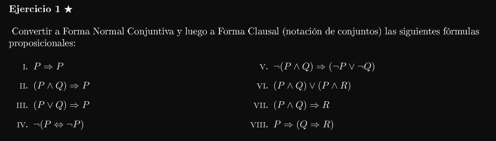
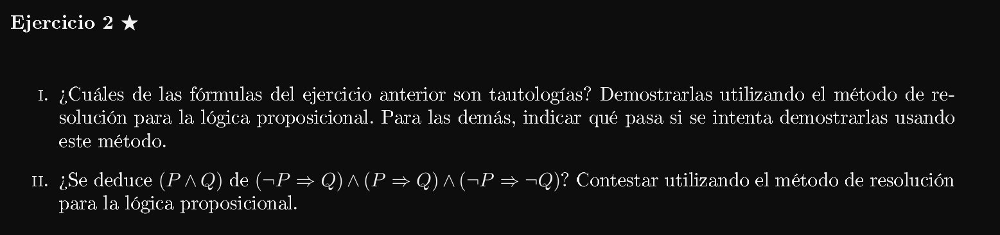
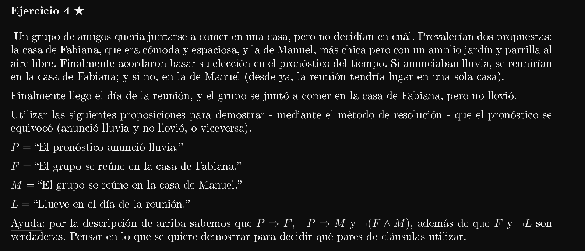
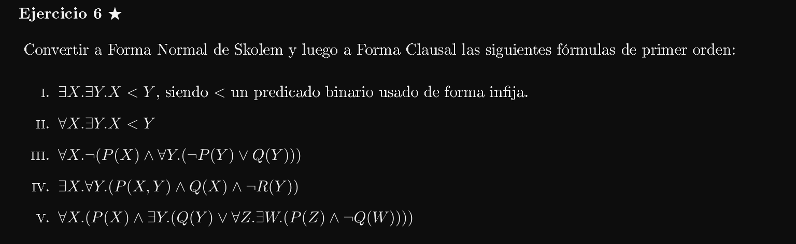

5. 

    D := ¬(P ∧Q)⇒(¬P ∨¬Q)
    ¬D := ¬(¬(P ∧Q)⇒(¬P ∨¬Q))

    ¬(¬(¬(P ∧Q)) V (¬P ∨¬Q))
    ¬(¬(¬(P ∧Q)) V (¬P ∨¬Q))
    ¬¬(¬(P ∧ Q)) ∧ ¬(¬P V ¬Q)
    (¬(P ∧ Q)) ∧ (¬¬P ∧ ¬¬Q)
    (¬P V ¬Q) ∧ P ∧ Q ~~~~~~~> Forma normal conjuntiva (FNC)

    Forma Clausal ~> {{(¬P, ¬Q)}, {P}, {Q}}

6. 

    D := (P ∧Q)∨(P ∧R)
    ¬D := ¬((P ∧ Q) ∨ (P ∧ R))

    ¬((P ∧ Q) ∨ (P ∧ R))
    ¬(P ∧ Q) ∧ ¬(P ∧ R)
    (¬P V ¬Q) ∧ (¬P V ¬R) ~~~~~~~~~> FNC

    Forma clausal ~~~~~~~> {{¬P, ¬Q}, {¬P, ¬R}}

8. 

    D := P ⇒ (Q ⇒R)
    ¬D := ¬(P ⇒ (Q ⇒R))

    ¬(P ⇒ (Q ⇒R))
    ¬(¬P V (¬Q V R))
    ¬¬P ∧ ¬(¬Q V R)
    P ∧ ¬¬Q ∧ ¬R
    P ∧ Q ∧ ¬R ~~~~~~~~~~~~~> FNC

    Forma clausal ~> {{P}, {Q}, {R}}

---

A qué se refiere que se deduzca (P ∧ Q) de la fórmula (¬P ⇒ Q)∧(P ⇒ Q)∧(¬P ⇒ ¬Q)? A qué ¬((¬P ⇒ Q)∧(P ⇒ Q)∧(¬P ⇒ ¬Q)) |- (P ∧ Q)???

1, 2 y 5 son tautologías. Las demás o no son o no estoy seguro.

5. 

    ¬(P ∧Q)⇒(¬P ∨¬Q). Su forma clausal era {{(¬P, ¬Q)}, {P}, {Q}}, Luego:

    C = {{(¬P, ¬Q)}, {P}, {Q}}
           ______    ___  ___
            1         2    3
        
        De 1 y 2 obtenemos la resolvente 4 = {¬Q}
        De 3 y 4 obtenemos la resolvente 5 = {}
        
        INSAT  

    Por lo tanto ¬(P ∧Q)⇒(¬P ∨¬Q) es válida.

6. 

    (P ∧ Q) ∨ (P ∧ R). Su forma clausal era {{¬P, ¬Q}, {¬P, ¬R}}, Luego:

    C = {{¬P, ¬Q}, {¬P, ¬R}}
          ______    ______
            1          2
        
        No existe resolvente entre 1 y 2 porque no podemos encontrar ningun literal negado en una y afirmado en la otra.
        Como no existe resolvente entre 1 y 2 que genere una nueva cláusula entonces devolvemos SAT.

    Por lo tanto (P ∧ Q) ∨ (P ∧ R) es inválida.

---

Skip por ahora.

---

1. 

    D := ∃X.∃Y.X < Y
    ¬D := ¬(∃X.(∃Y.X < Y))

    ¬(∃X.(∃Y.X < Y))
    ∀X.¬(∃Y.X < Y)
    ∀X.∀Y. ¬(X < Y)
    ∀X.∀Y. ¬(<(X, Y)) ~~~~~~~~> Forma normal de Skolem

    forma clausal ~~~> {{¬ X < Y}}

2. 

    D := ∀X.∃Y.X < Y
    ¬D := ¬(∀X.∃Y.X < Y)

    ¬(∀X.∃Y.X < Y)
    ∃X.¬∃Y.(X < Y)
    ∃X.∀Y.¬(X < Y)
    ∀Y.¬(f(c) < Y) ~~~~~~~~> Forma normal de Skolem

    forma clausal ~~~> {{¬(f(c) < Y)}}

6. 

    D := ∀X.(P(X)∧∃Y.(Q(Y)∨∀Z.∃W.(P(Z)∧¬Q(W))))
    ¬D := ¬(∀X.(P(X)∧∃Y.(Q(Y)∨∀Z.∃W.(P(Z)∧¬Q(W)))))

    ¬(∀X.(P(X) ∧ ∃Y.(Q(Y)∨∀Z.∃W.(P(Z)∧¬Q(W)))))
    ∃X. (¬(P(X) ∧ ∃Y.(Q(Y)∨∀Z.∃W.(P(Z)∧¬Q(W)))))
    ∃X. (¬P(X) V ¬∃Y.(Q(Y)∨∀Z.∃W.(P(Z)∧¬Q(W))))
    ∃X. (¬P(X) V ∀Y.¬(Q(Y) ∨ ∀Z.∃W.(P(Z)∧¬Q(W))))
    ∃X. (¬P(X) V ∀Y.(¬Q(Y) ∧ ¬∀Z.∃W.(P(Z)∧¬Q(W))))
    ∃X. (¬P(X) V ∀Y.(¬Q(Y) ∧ ∃Z.¬∃W.(P(Z)∧¬Q(W))))
    ∃X. (¬P(X) V ∀Y.(¬Q(Y) ∧ ∃Z.∀W.¬(P(Z)∧¬Q(W))))
    ∃X. (¬P(X) V ∀Y.(¬Q(Y) ∧ ∃Z.∀W.(¬P(Z) V ¬¬Q(W))))
    ∃X. (¬P(X) V ∀Y.(¬Q(Y) ∧ ∃Z.∀W.(¬P(Z) V Q(W))))   // Qué porquería leer esto.
    ∃X.∀Y.∃Z.∀W.(¬P(X) V (¬Q(Y) ∧ (¬P(Z) V Q(W))))
    ∀Y.∃Z.∀W.(¬P(f(c)) V (¬Q(Y) ∧ (¬P(Z) V Q(W))))
    ∀Y. ∀W.(¬P(f(c)) V (¬Q(Y) ∧ (¬P(f(Y)) V Q(W))))             // en el paso siguiente hay que distribuir el primer V.
    ∀Y. ∀W.((¬P(f(c)) V ¬Q(Y)) ∧ (¬P(f(c)) V (¬P(f(Y)) V Q(W)))) ~~~> Forma normal de Skolem

    Forma clausal ~~~> {{¬P(f(c)), ¬Q(Y)}, {¬P(f(c)), ¬P(f(Y)), Q(W)}}          // Tengo la vista frita

    

    