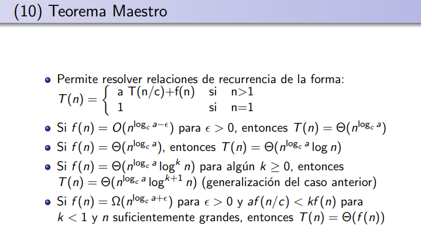
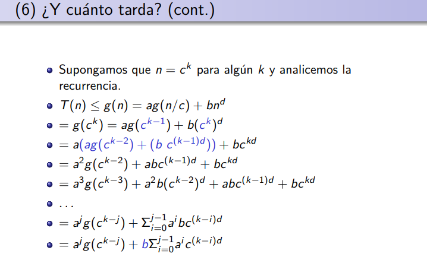
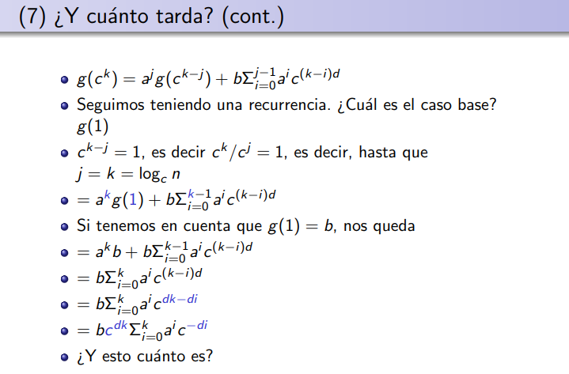
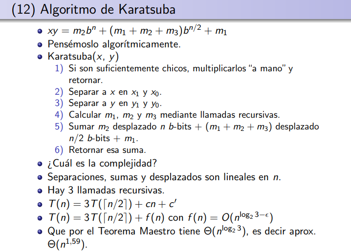

# Complejidad computacional
## Importancia
    Medio obvio papá.

## Tiempo de ejecución de un algoritmo A
- TA(I)= suma de los tiempos de ejecución de las instrucciones realizadas por el algoritmo de con la instancia I.
- Dada una instancia I, defininmos |I| como la cantidad de bits necesarios para almacenar los datos de entrada de I.
- Complejidad de un algoritmo A:
fA(n)=maxi:|I|=n T_A(I)

## Notación O
f(n) = O(g(n)) si existen c ∈ R+ y n._0_. ∈ N tales que f(n)<= cg(n) para todo n>= n0
## REPASAR
- Notación theta

## Notas
- log(n) es O(n), pero no al revés
  
---
---

# Divide & Conquer
## Def
La idea de esto es lo que ya te imaginas, tomas un problema y lo vas dividiendo en problemas cada vez más pequeños hasta que sea easy de resolver, lo resuelves y luego tomas la otra parte ya resuelta y fusionas los resultados de laguna manera.

## Como se hace
- Tomo un problema y lo divido en subproblemas del mismo tipo que el original.
- Se resuelven los problemas más chicos.
- Se combinan las soluciones.

- Esto se hace vía los siguientes pasos:
    - Dividir.
    - Conquistar.
    - Combinar.

## Caracteristicas
- Las subpartes tienen que ser mas pequeñas que la original.
- Tiene que ser el mismo tipo de tarea.
- Dividir y combinar pueden no ser nulas, pero no tienen que ser demasiado costosas. 
    - Idea de eso: la parte de combinar debe ser mas o menos simple, sino no tiene mucho sentido. 

## Forma general
- f(x) es lo que quiero calcular.
    - Si x es suficientemente chico o simple, solucionar de manera ad hoc.
    - Si no,
        - Dividir a x en x1, x2, ..., xk
        - Para todo i<=k, hacer Yi = f(xi)
        - Combinar los Yi en un Y que es una solución para x.
        - Devolver Y.

## Teorema maestro

### Como lo uso
- Resuelvo el problema con D&C.
- Como ya sé a, c y d entonces me voy al teorema.
    Ejemplos:
    - a=4, c=2, d=1: Separar y mezclar es lineal, o sea que f(n) tiene que ser n1, entonces como log2(4) es 2, entonces epcilon es 1 y por lo tanto estoy en el primer caso.
    - a=4, c=2, d=0: **terminar**
### Notas
- n/c es el tamaño de las instancias más chicas, o sea, si tengo un mazo y lo divido en dos, encontes c=2
- a es la cantidad de subproblemas de tamaño n/c que hay que resolver.
- b'n^d lo que quiere decir es que todo el costo computacional de dividir y unir todas las soluciones es a lo sumo polinomial.
- d es lo que me cuesta dividir. Pensar en cuantas partes voy a tener y luego cuantas partes voy a tener que unir, si tengo 4 y 4, entonces d=1 porque es lineal juntar todo (en el ejemplo del mazo de cartas).
- El epcilon está fuera del logaritmo.
- Es recomendable ver con atención esto.

    
    

### Notas
- j es la cantidad de pasos de recursión que ya hice.
- k es la cantidad de pasos máximos.

### Nota de color
- Ver problema Quick select. Ta bueno, es como Quick sort pero viendo el k-ésimo menor.
## Algoritmo de Karatsuba
