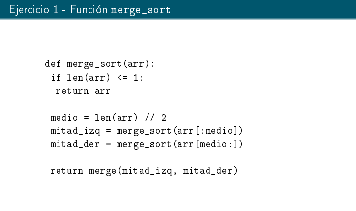
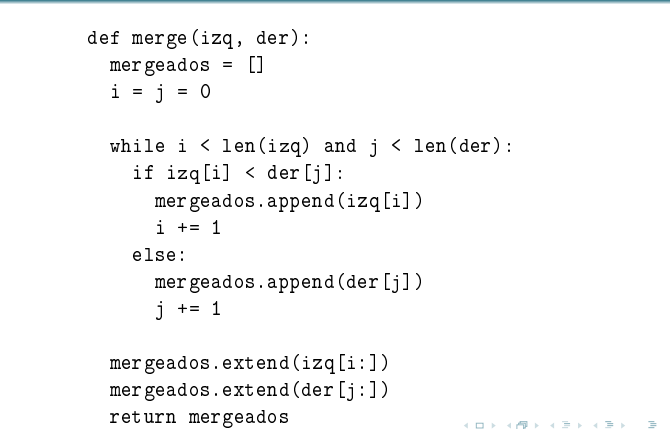
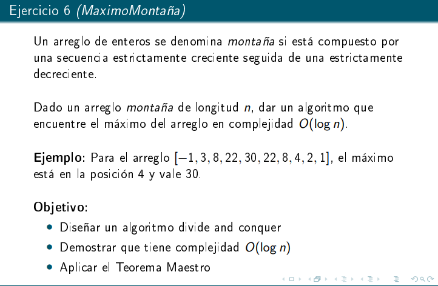
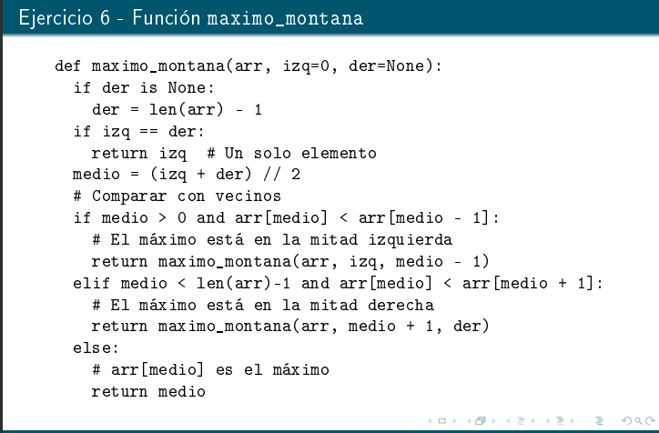

# Divide & Conquer
## Idea
- Hay que saber en cuantos subproblemas dividimos y el tamaño de cada división

La idea de poner cada función de complejidad es que: 
    tenemos la función y la tenemos que comparar con el epcilon, 
        - El epcilon es para comparar, ese es el poder del teorema maestro.
## Def

## Notas
- El logaritmo en el teorema maestro lo que me dice es el punto de equilibrio.
- Hay casos que el costo de dividir es infimo.
- El epcilon el unico rol que cumple es que 
- O() es que está acotado menor o estricto por abajo, con theta es acotado por abajo. 
- La ultima condicion del teo maestro habla de cuando la parte de combinar es mas grande que la parte de dividir. 
- O() costo dividir mas unir es menor que procesamiento.
- theta costo dividir mas unir es mas o menos igual a procesar.
- omega costo dividir mas unir es mayor que procesar.

### Ejercicios
#### Ejercicio 1: Merge Sort

pregunta 5: 
    a=2, c=2, en el teo maestro justo da log_2(2)=1, por lo tanto la complejidad queda n^1, y como O(n^1) \in O(n^1) entonces estamos en el caso 2, finalmente la complejidad es 
        theta(n^1 log n) == theta(n log n) == O(n log n)
##### Notas
- theta (n/2) es theta (n). No olvidar eso, igualmente sale razonandolo un poco.
- Uno calcula el combinar IGNORANDO las llamadas recursivas. Importante.
- Cuando estamos evaluando un caso base y n=1 en realidad se refiere a que el caso base NO carrea al n original, el caso base ya no guarda ni tiene ninguna relación con el n original.

#### Ejercicio 2: Búsqueda Binaria

    a=1, c=2, f=O(1), entonces caemos en el segundo caso del teo maestro, se reducen todos los exponentes de n que son el log_c(a) a 0 y la complejidad queda log n yeah yeah 3)

#### Ejercicio 3: Busqueda lineas modificada
    El problema en cuestión es determinar si un elemento está en una lista.

estamos usando el siguiente algoritmo:
    def busqueda_lineal(elem, array):
        if len(array)==1 and array[0]== elem:
            return True
        if len(array)==0
            return False
        return busqueda_lineal(subarray(array, 0, 1)) **Completar con la diapo**

- No es D&C porque la división debe ser balanceada, y el tamaño de los subproblemas debe ser considerablemente menor.
- No importa si es par o impar la división.

    def busqueda_linealV2(elem, array) 
        SÍ es D&C, **completar con la diapo**

#### Ejercicio 6: Maximo Montaña

    Esto sale haciendo una especie de busqueda binaria. Me paro en el medio, me fijo si:
        ó estoy creciendo.
        ó estoy decreciendo.
        ó soy al que buscaba.
    
    En caso de que soy el que buscaba (en el primer intento de busqueda), entonces a la materia NO le importa que lo devuelva directo (aunque en la vida real sí, obvio), tengo que hacer la recursión posta posta posta y me carreo el valor hasta lo más chico posible.

Naturalmente, podemos intuir de que la complejidad va a ser log n porque se parece a busqueda binaria. Para demostrar formalmente eso tenemos que identificar a, c, y f, luego ver el teo maestro.

- para justificar que las operaciones son constantes hay que decir: una operación es constante, acceder a índices en un array es constante.

- El algoritmo funciona, para poder justicar esto tenemos que pensar:
    ¿Qué quiero resolver?
    Las características de la entrada.
    ¿Qué hace mi algoritmo?

- Dar un argumento donde englobes a esas tres preguntas es suficiente para 'demostrar' que es correcto el algoritmo.

- **Tarea: escribir la función recursiva**

#### Ejercicio 8: Maxima subsecuencia

el problema está cuando tienes la maxima subsecuencia estando en el medio.
- estas cosas se resulelven haciendo las preguntas adecuadas.
    - ¿Qué es lo mejor que me aporta la izquierda?
    - ¿Qué es lo mejor que podía aportar la derecha?

## Interesante:
    La parte de combine puede ser cualquier otra cosa. No tiene por qué ser D&C siquiera, hay total libertad. Una cosa importante de D&C es simplemente mantener la estructura de dividir, conquistar y combinar.

# Notas
- El parcial va a tener preguntas teóricas.
- Teoricamente, el algoritmo D&C es más correcto a nivel conceptual si usa EL MISMO algoritmo de combine en cada llamado recursivo.
- En la materia les interesa que el algoritmo D&C SEA D&C literalmente, no caer en casos borde como que lo encuentro a la primera y lo devuelvo, sino que hago recursión para completar el arbol de recursión.

# Estudiar el algoritmo de Kadane

# Desafío

Tenemos una matriz cuadrada y cada fila está ordenada y las columnas igual.
Tenemos un elemento dado.
Hay que encontrarlo con D&C.

Para ayudarme a saber si encontré bien el a y el c. Deben ser 3 y 4 respectivamente.

#### Ejercicio 14: Diferencia Mínima

- Muchos de los problemas de D&C terminan cayendo en merge sort o búsqueda binaria. Hay problemas que no.

**Es tarea**

# Ayuda
En la fórmula del teo maestro:
    mandamos TODO lo recursivo en la:
        a * T(n/c)
    y TODO lo demás en:
        f(n)
    O sea:
        a * T(n/c) + f(n)

        engloba      engloba 
        todo lo      todo lo
        recursivo    que no
                        es recursivo
- Identificar las tres partes de un algoritmo D&C es fundamental:
    1. Dividir
    2. Conquistar.
    3. Combinar.

# Comentarios finales:
- Se elige notación O en vez de theta por motivos de abuso de notación, theta es cuando es muy muy formal, se usa O para acotar lo más que se pueda por arriba en caso de que más adelante se encuentre un algoritmo mejor.
- Muchas veces en la computación hay nombres de fantasía que engloban problemas easy.
