# Programación dinámica bottom up

La idea es simplemente armar mi solución final a partir de los casos base, evitando el hecho de tener que calcular todo aquello que ya se haya calculado.

# Astro Trade

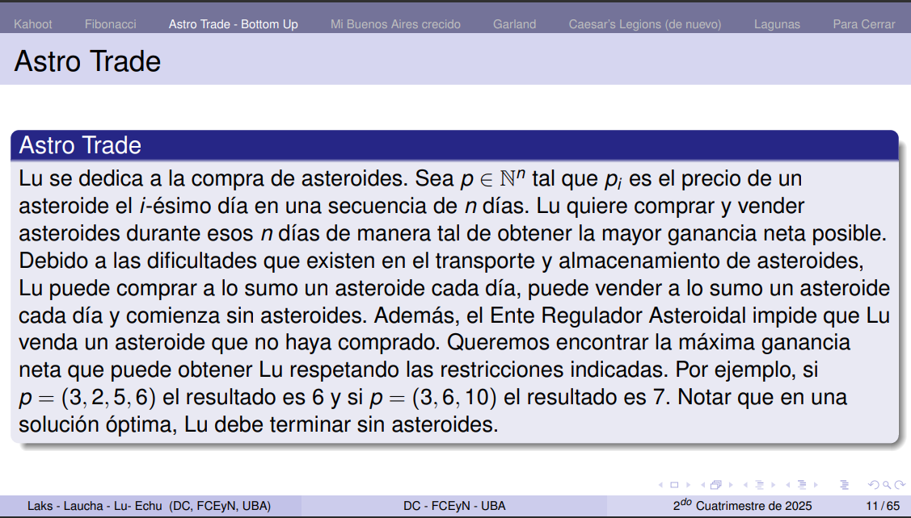

Nos damos cuenta que en la función recursiva solo dependemos del día anterior y no tenemos que guardarnos nada anterior a ese.

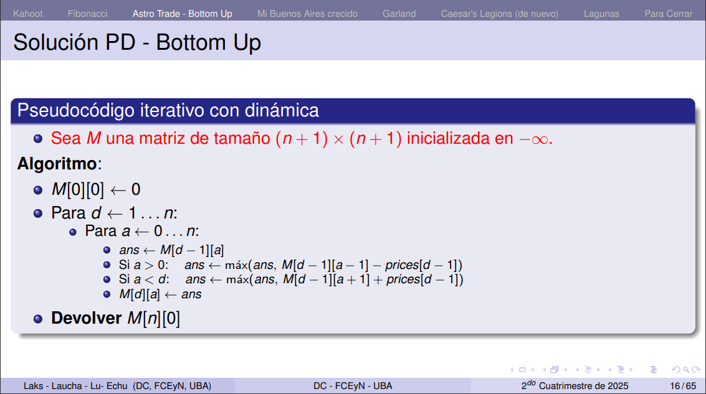

Se me ocurre que para mejroar esto podemos usar únicamente un array con el precio de cada día y el índice indica el día en que estamos. Así no tenemos que tener una matriz de díaXprecio.

idea que dieron en la clase:

```
cantidad_de_dias = n

dia_actual = [] * cantidad_de_dias
dia_anterior = [] * cantidad_de_dias

dia_anterior = [0, -inf, -inf, ...]
dia_actual = [0-precio_dia, ]
```
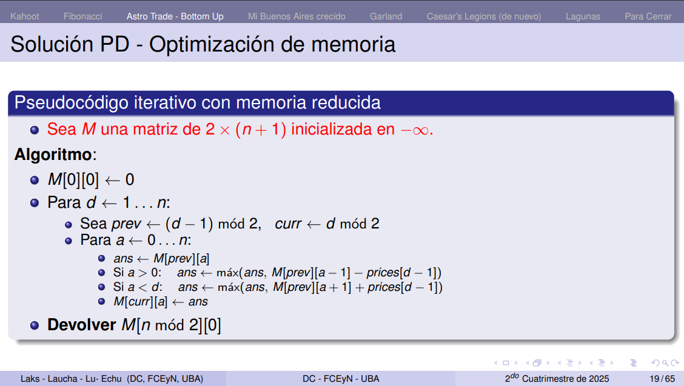

# Mi Buenos Aires crecido

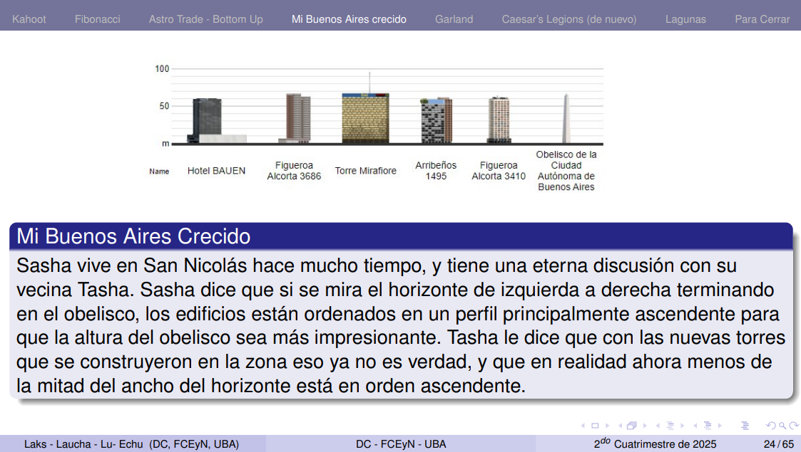
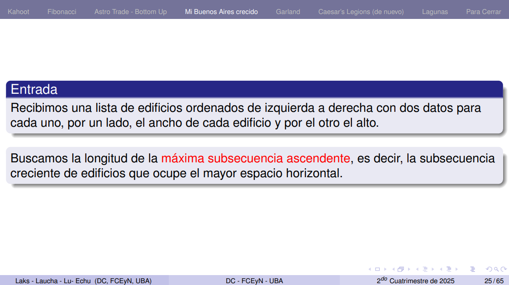
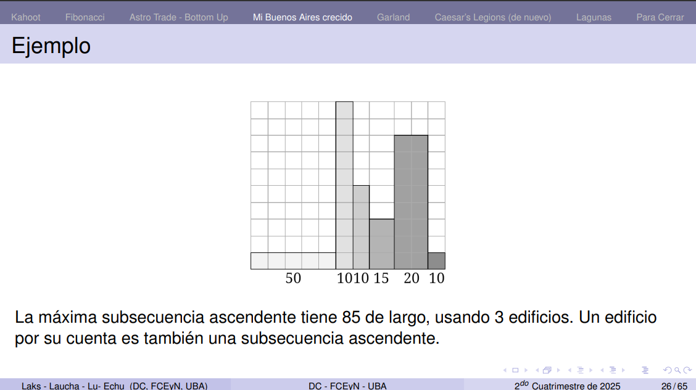

Asumo que la entrada es una lista de tuplas (ancho, alto)

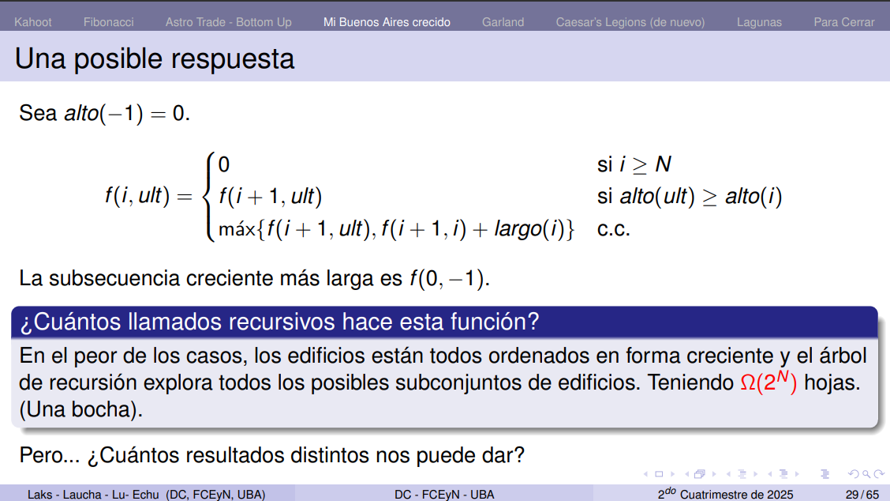

tenemos O(n^2) resultados distintos.

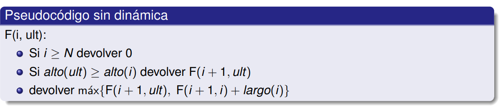

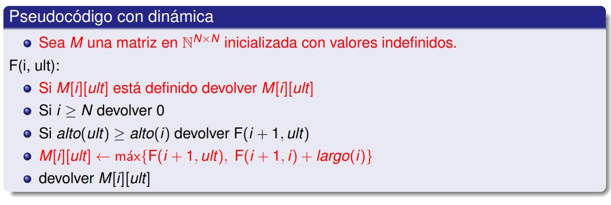

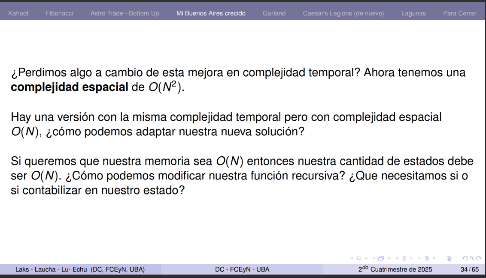

Lo ideal sería bajar la cantidad de estados.

Nuestros estados es el tamaño de la matriz, eso significa que si nuestra función solo debe tomar un parámetro que vaya de de 0 a n-1 porque si tenemos 2 significa que vamos a ver todos los estados posibles entre cada uno, n^2.

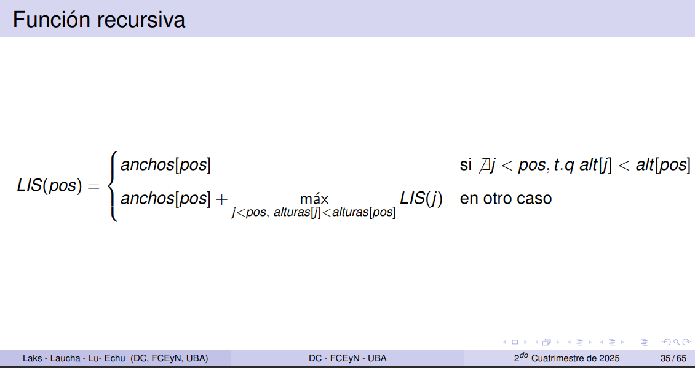
Semántica:
    El tamaño de la subsecuencia de ancho más largo terminada en pos.

Esta vaina funciona porque cuando llamo desde el último veo todas las maximas subsecuencias que son válidas y por la memorización nunca termino calculando de vuelta los casos anteriores a pos-1

# Garland
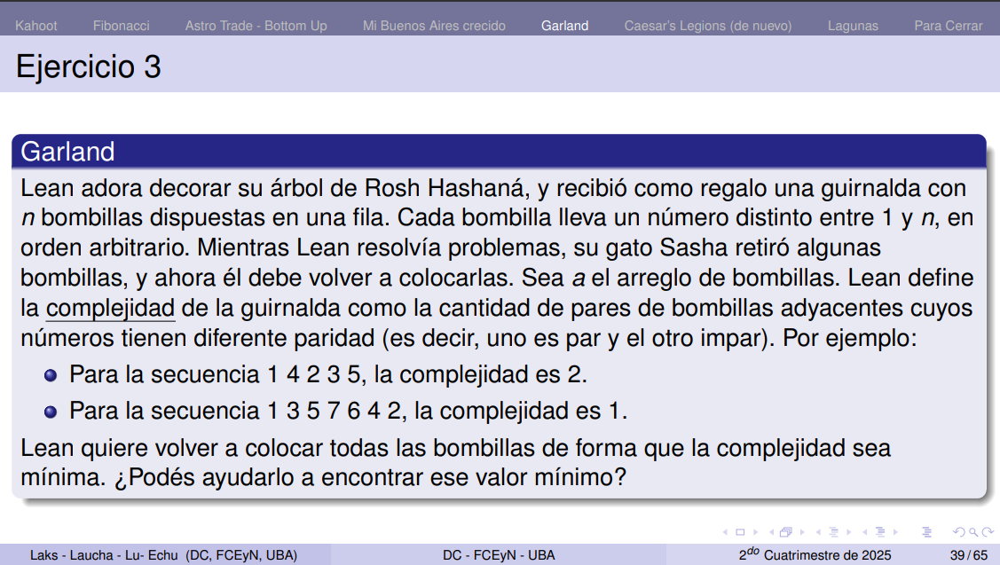
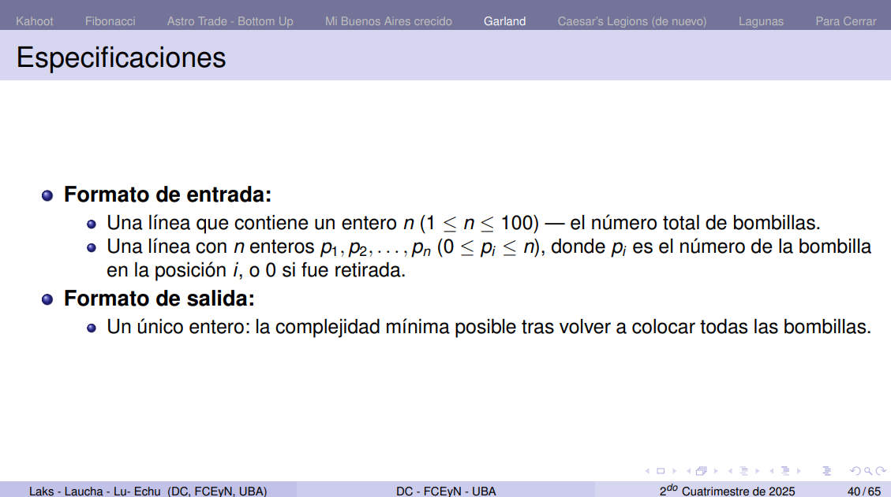

Un estado es como 
    fijo-> (i, cant_pares_usados, paridad_ultimo) -> (i+1, cant_pares_usados, paridad_ultimo)

Si coloco un par => (i, e, p) -> (i+1, e+1, paridad= True)

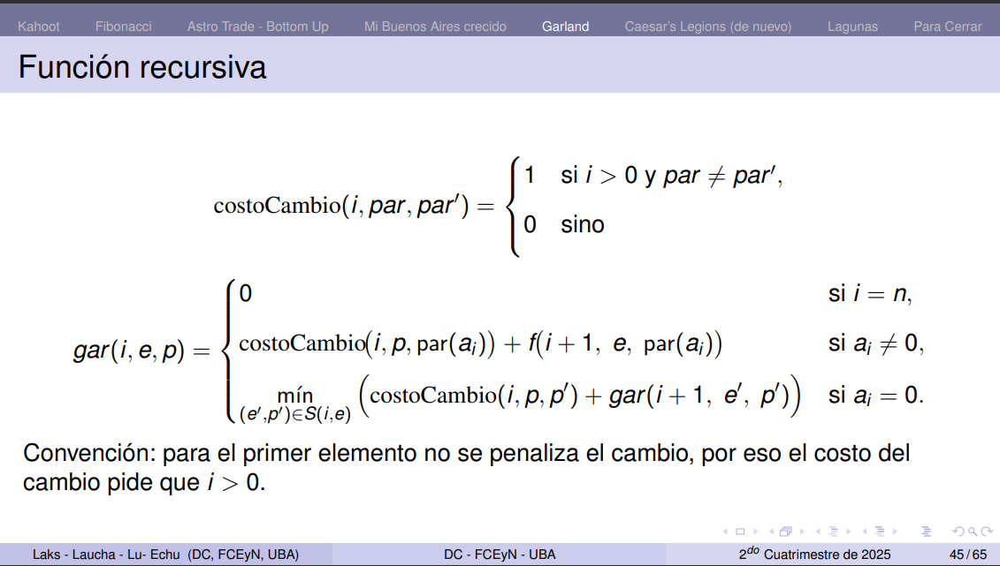

El del medio es el caso en que no hago nada, y el tercero es el caso en que pongo un cero.

# Caesar's Legion

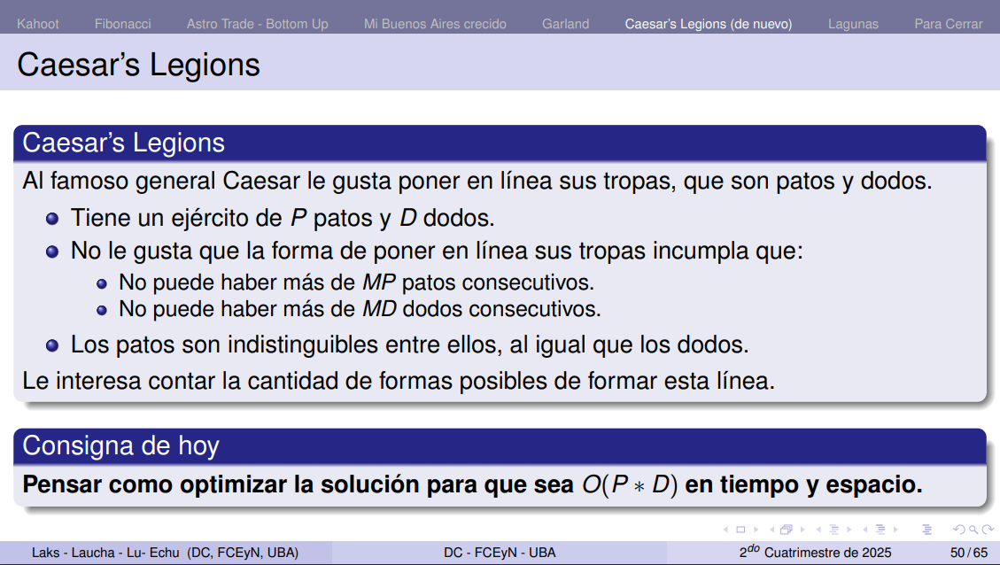
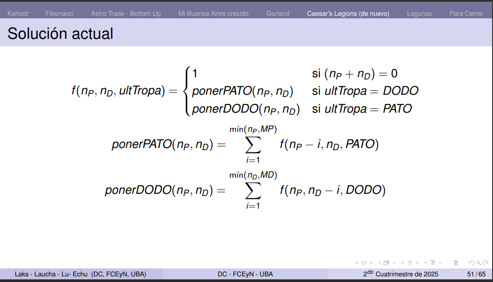

> Pensar en una tabla aditiva!!! (pensar en programación competitiva).
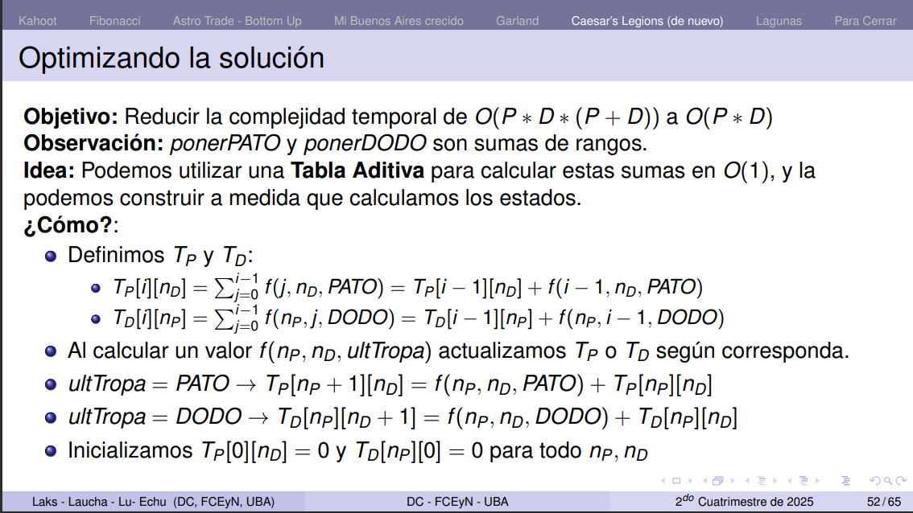
cada fila es la cantidad de dodos disponibles. y cada columna es la posición en la que estoy calculando. PARA tabla_patos (tp)


Pasar a dinaminca:
1. Inicializar la memo.
2. Preguntar si ya lo tengo.
3. Guardar lo que calculé antes de devolver el resultado.

- Lo ideal es guardarme los llamados anteriores en una matriz de tamaño cantidad_estados^(cantidad_de_estados * cantidad_de_estados).       
- Una manera de saber si voy a necesitar guardarme valores previos es ver la función recursiva, sus casos.
- Hicimos un juego aca https://fuiz.org/play?code=64261
- cantidad transiciones por estado: cuanto me cuesta pasar de un estado a otro.