# clase Recorridos sobre grafos

# Notas
- Es importante saber y recordar siempre en la carrera el concepto de un árbol.

# DFS


[AGREGAR DIAPOS DEL EJEMPLO DE DFS]


# Propiedades (?

- Se usa una pila para DFS.
- El invariante de DFS es: parentización. Leer del Cormen.
- Me dice la distancia de un nodo a la raíz (o nodo desde donde se comenzó a ejecutar DFS).
- Me da las tree-edges.

# BFS


# Propiedades (?

- Se usa una cola para BFS.
- El invariante BFS es: para todo nodo en la cola del BFS, entonces todos los nodos están a la misma distancia de la raíz con una diferencia de máximo 1. Leer del Cormen.
- BFS no me da todos los caminos mínimos directamente.
- BFS me da la distancia mínima a la raíz para cada nodo.

# Ejercicios


# Ejercicio 2


# Ejercicio 3


```
Lo que se me ocurre es que el grafo tiene dos nodos distinguidos. La casa de Rasta y la fábrica de alfajores. Cada nodo es una cuadra distinta, y cada arista entre dos nodos es la calle que una a ambas esquinas.
```


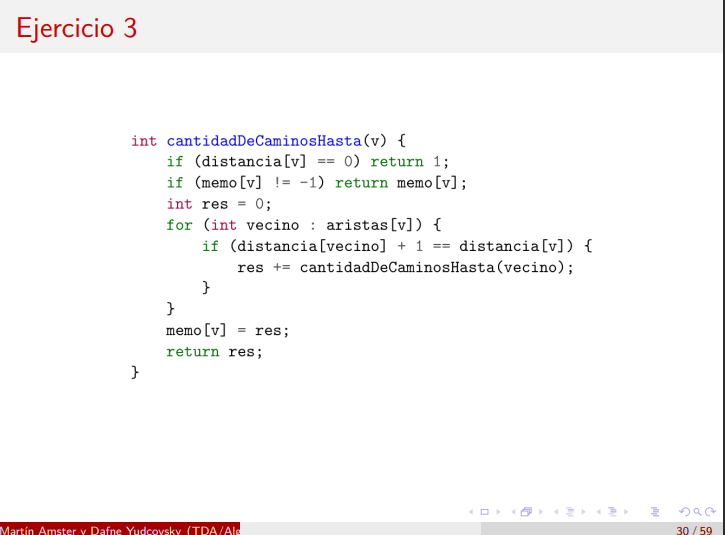
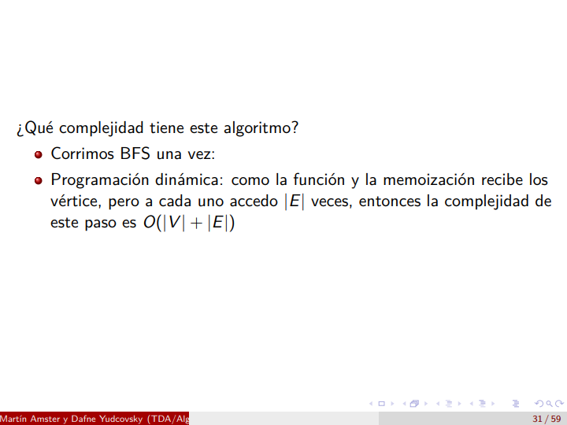

# Ejercicio 4

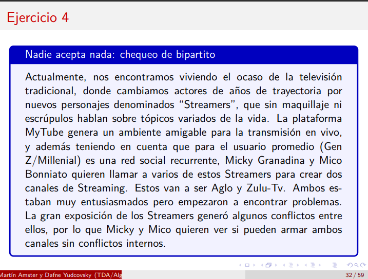
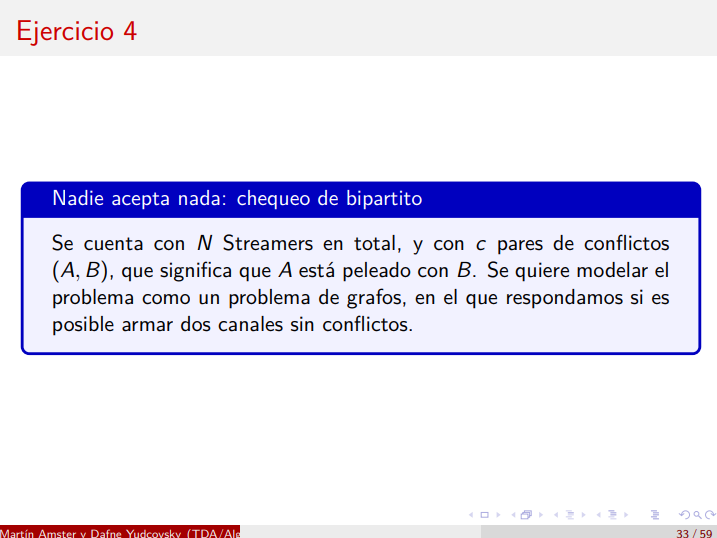

```
Nos armamos un grafito que en principio separa en dos partes a los canales, de un lado los de un canal y de otro lado los de otro canal. Cada streamer es un nodo y existe una arista entre dos streamers sii hay un conflicto entre ellos.

ES posible armar un grafo que cumpla lo pedido si nunguna arista c se encuentra dentro de un mismo lado del grafo. 

Ejemplo:

Canal 1                 Canal 2
S1 ----------------------- S5
S2 ----------------------- S6
S3 ----------------------- S7
S4 ----------------------- S8

Aquí lo que digo es que los del Canal 1 no están peleados entre sí porque no hay ninguna arista que los conecte (análogo para el canal 2) y solo hay aristas entre canal 1 y canal 2 si existe un conflicto entre esos dos streamers.
```

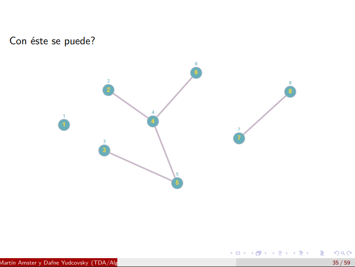
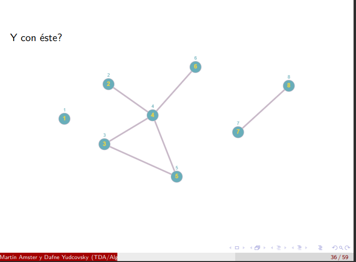

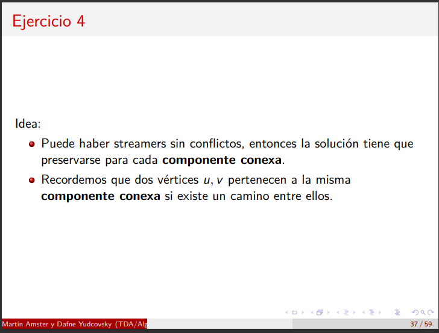
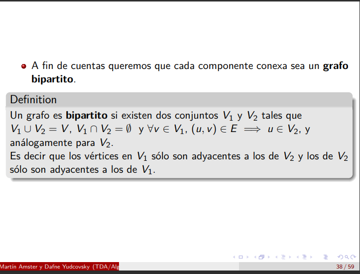
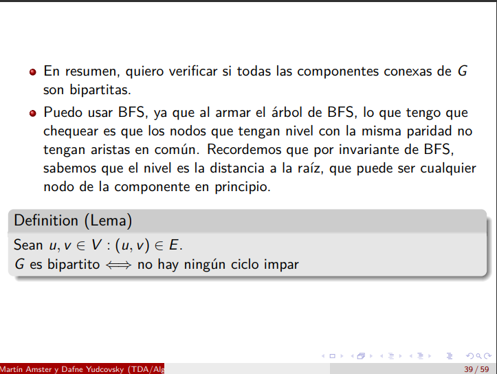

Para chequear que un grafo sea bipartito se puede usar dfs y verificar que los nodos pares solo tengan conexión con los impares, y que los impares solo tengan conexión con los pares.

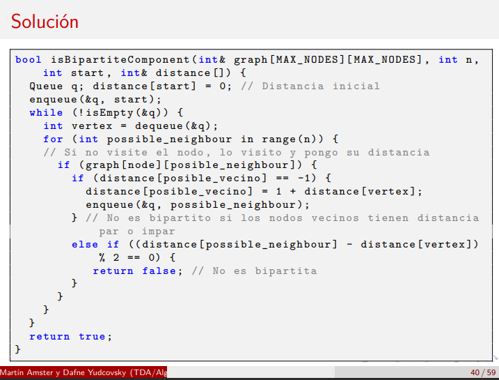
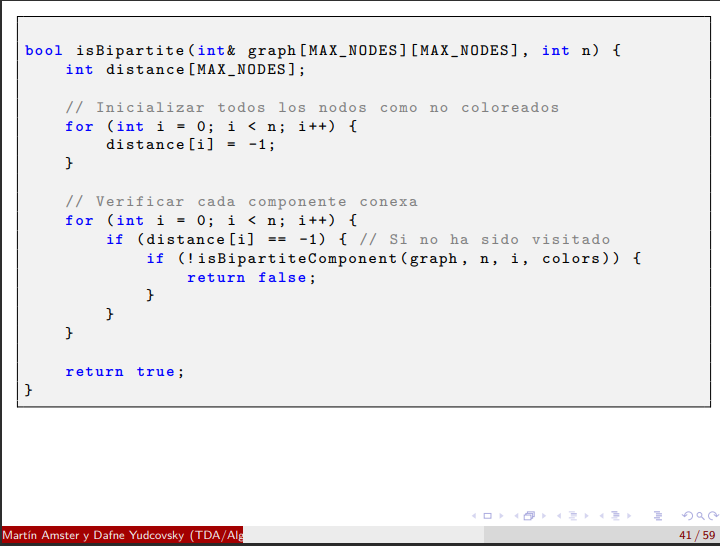

```
Explicado en palabras VÁLIDO PARA EL PARCIAL:

me armo el grafo y corro BFS para obtener todas las distancias. Le meto módulo 2 a todas las distancias. Me fijo que todos los vecinos tengan diferente paridad.
```

# Ejercicio 5

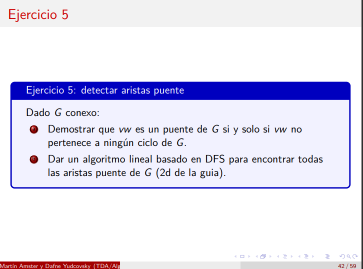
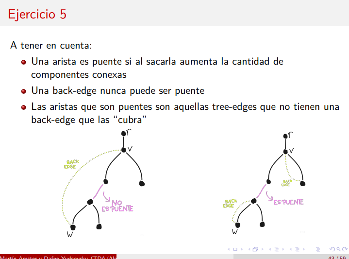

a)

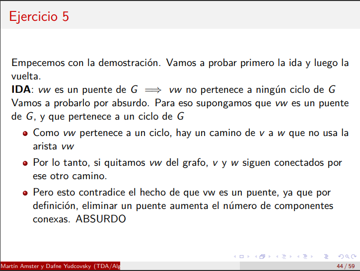

```
Si vw no es puente G-{vw} es conexo => hay un camino P que conecta a vw.
```

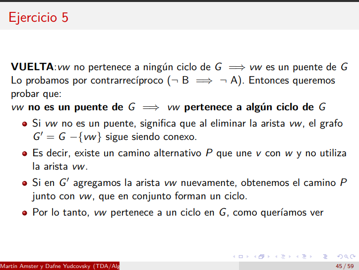

b)
```
Lo que se me ocurre es ir recorriendo el grafo con DFS y me voy guardando los nodos por los que ya pasé. En caso de que consigo una arista que me conecte un nodo con otro que ya visité, entonces encontré una backedge y por lo tanto esa arista NO es puente, caso contrario, sí es puente.
```
```python
"""
pseudocódigo que se me ocurre
"""

grafo = grafo de entrada 
aristas = dfs(grafo)

cant_aristas_puente = 0
conjunto_nodos_visitados = set()
for arista in aristas:
    nodo_1 = arista[0]
    if nodo_1 in conjunto_nodos:
        continue
    else:
        conjunto_nodos_visitados.add(nodo_1)
        cant_aristas +=1

print(cant_aristas_puente)
```
No es así exactamente

Seguimos...

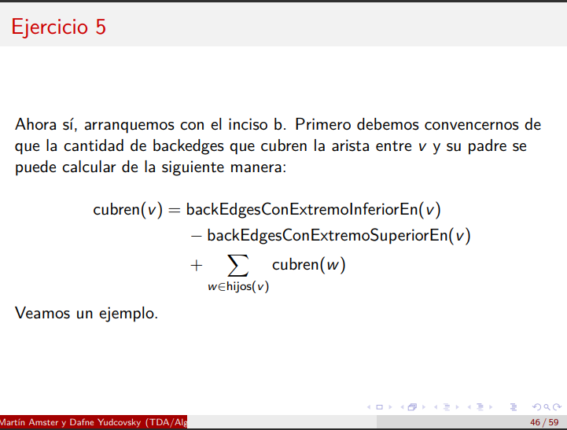

```python
def dfs(v, p=1):
    estado[v] = gris
    for (u in vecinos[v]):
        estado[v] = blanco
        dfs(u)
    
    estado[v] = negro
```

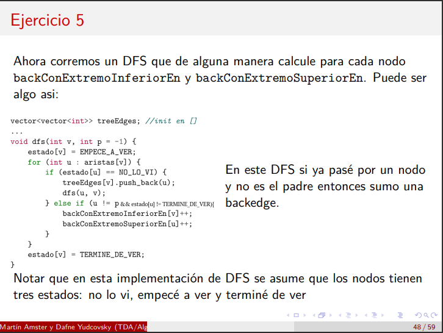

Hay que demostrarlo.

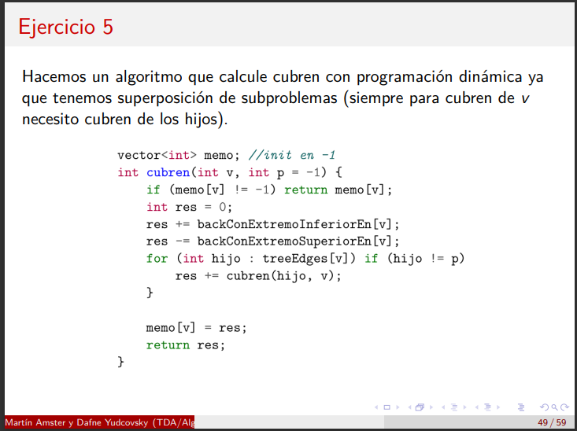
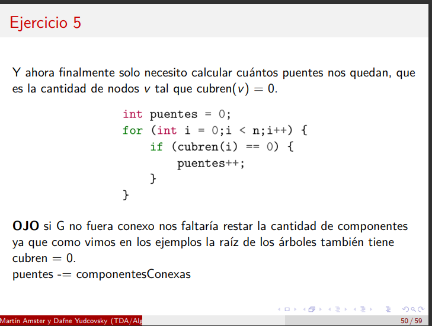

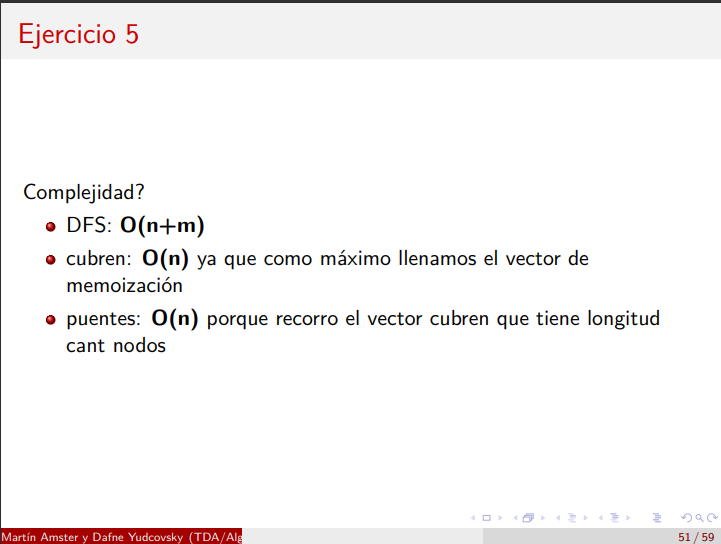

# Ejercicio Luces

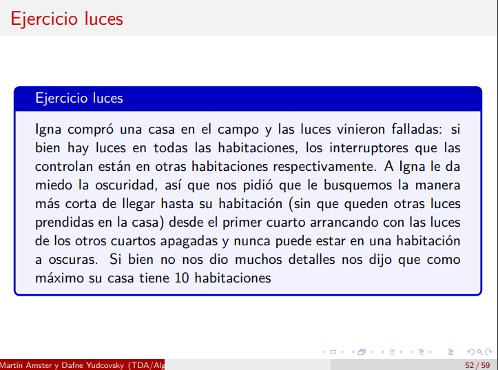

```
Se me ocurre para el modelado que cada habitacion es un nodo y que existe una arista entre dos habitaciones sii existe un interruptor en una que me enciende una luz de la otra.
```
```
Se me ocurre que para resolverlo no puedo usar aristas que me conecten nodos que estén a más de 1 de distancia y que debemos seguir cualquier arista que me conecte inmediatamente con el nodo anterior. O sea, si hay una arista entre dos nodos y la distancia entre ellos es 1, entonces seguro que me sirve.
```


# Nota

- Lo mejor que podemos hacer es no modificar los algoritmos de recorridos sobre grafos. Lo que hay que hacer es modelar muy bien el problema con un grafo y luego aplicar al algoritmo de recorrido. No es conveniente modificar un algoritmo porque hay que demostrar que el mismo es correcto y es una tarea complicada. Lo que podemos hacer es aprovecharnos de las propiedades de la implementación del algoritmo!
- Si el grafo es no dirigido, entonces no hay ni forward ni cross edge.

