# Representación de grafos y demos en grafos

Un grafo es una estructura que se compone de nodos y aristas y que nos permiten modelar una gran cantidad de problemas.

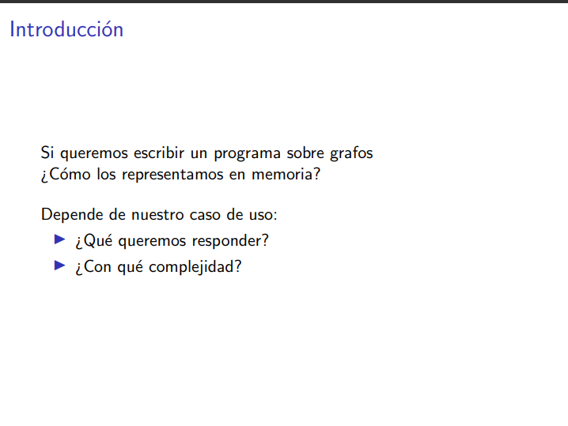

Conviene elegir una representación que sea lo más adecuada posible según diferentes factores como

1. Cantidad de nodos.
2. Cantidad de aristas.

Lo podemos representar con matriz de adyacencia, lista enlazada o lista de adyacencia.

En general si:

```
cantidad de nodos >> cantidad de aristas --> conviene más lista de adyacencia.
cantidad de nodos << cantidad de aristas --> conviene más la matriz de adyacencia.
La peor suele ser: lista de aristas.
```

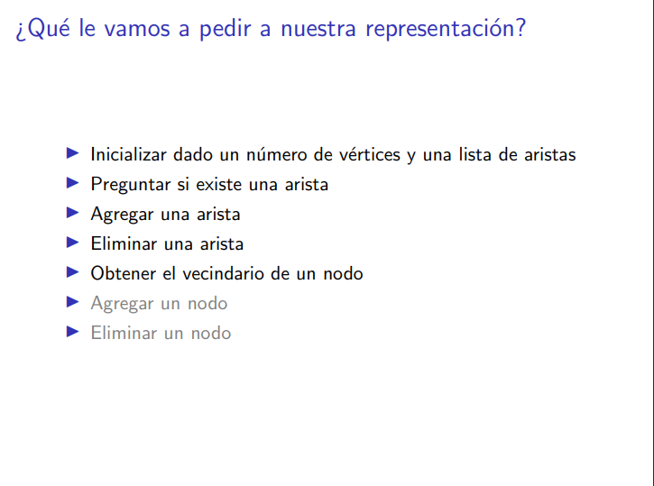
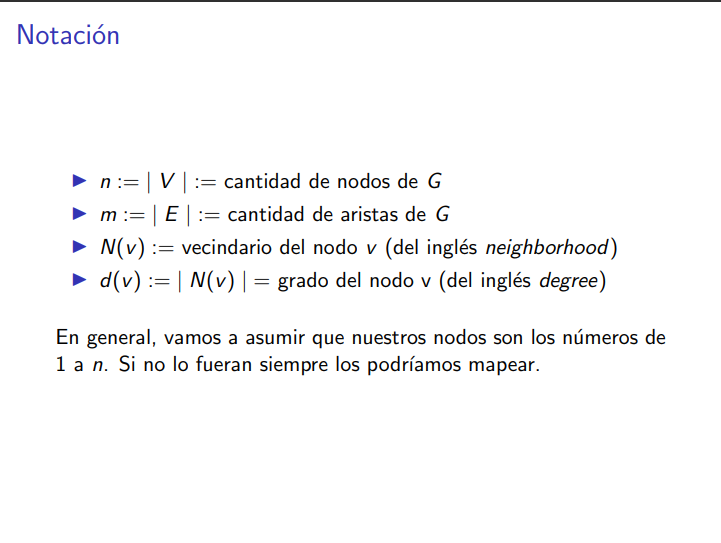

El vecindario de un nodo es un conjunto de vértices, no un grafo.

# Matriz de adyacencia

Es una matriz cuadrada donde hay un 1 si dos nodos están conectados, y un cero sino.

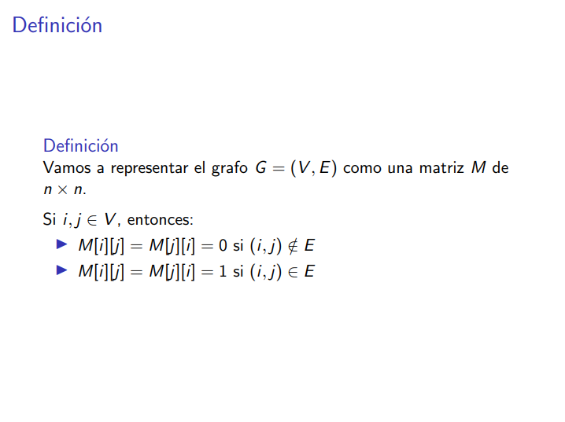
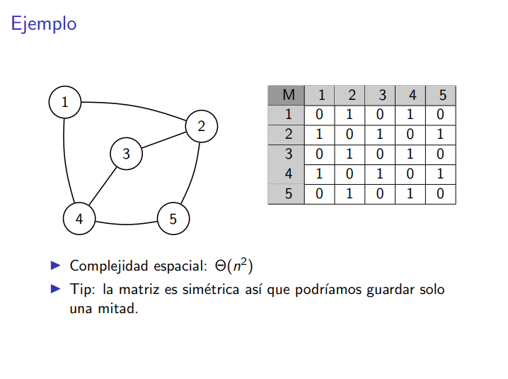

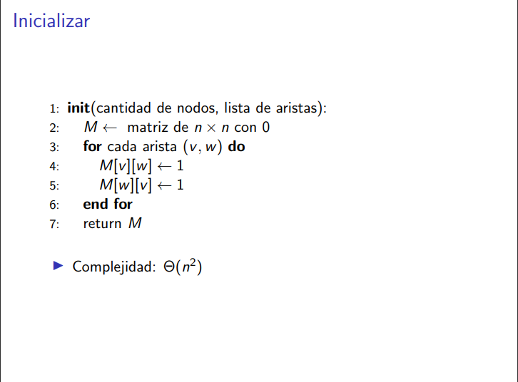
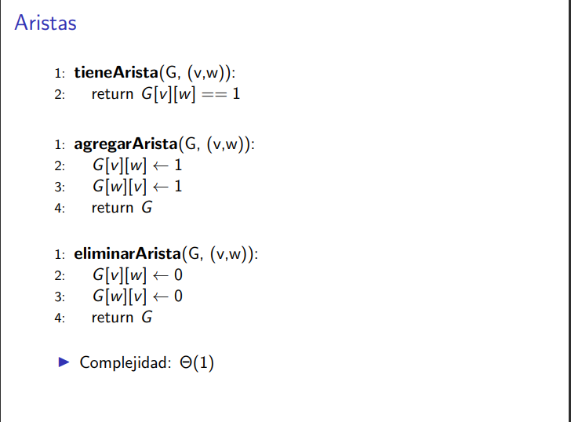
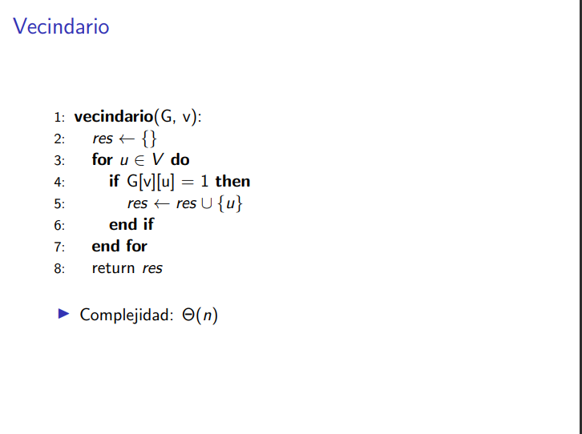

# Lista de adyacencia

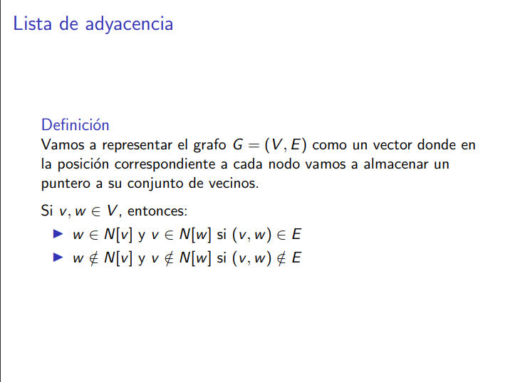
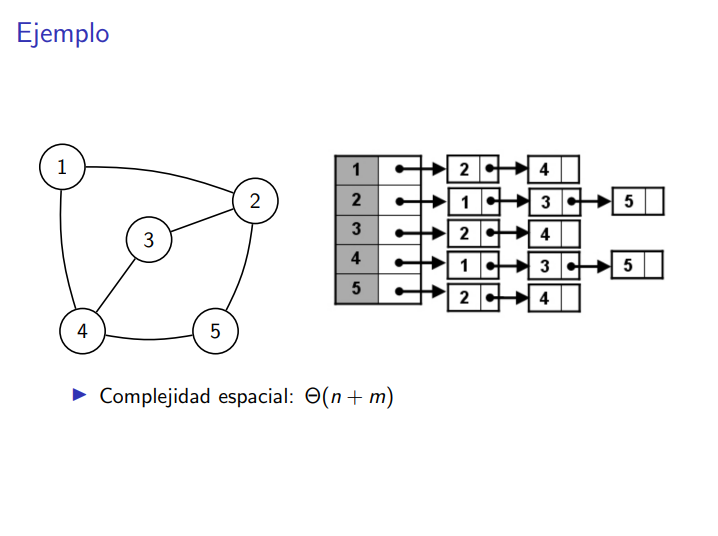

Si no usamos un hash map para representar a la lista de adyacencia entonces suele estar implementado como un arreglo de listas enlazadas.

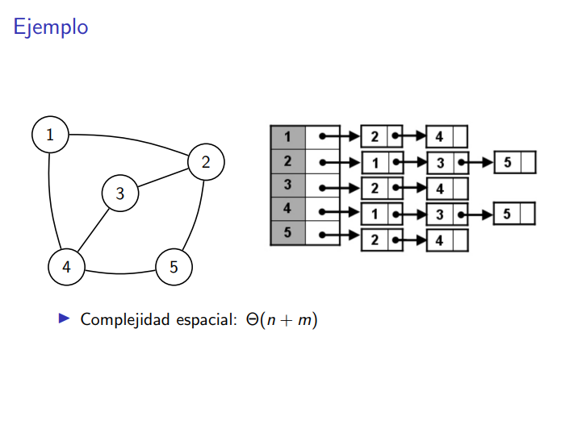

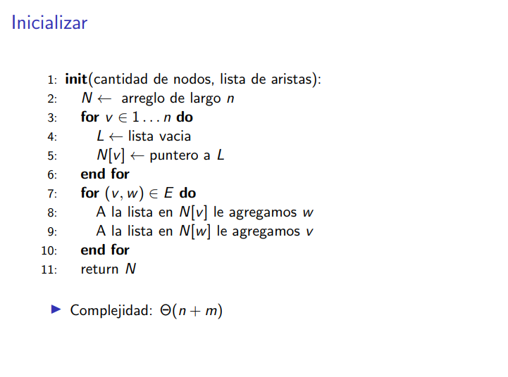

El orden de recorrer el vecindario de un nodo v es O(N(v))

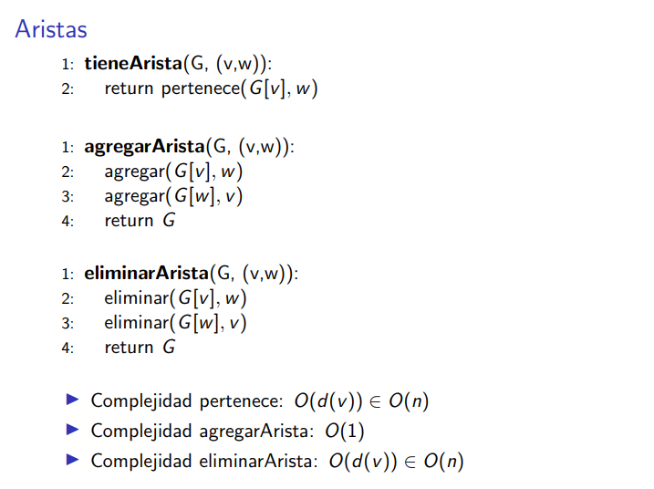

Si hicieramos la implementación de la lista de adyacencia con un array de AVL, eso empeora algunas complejidades pero mejora otras. Todo depende del caso de uso.

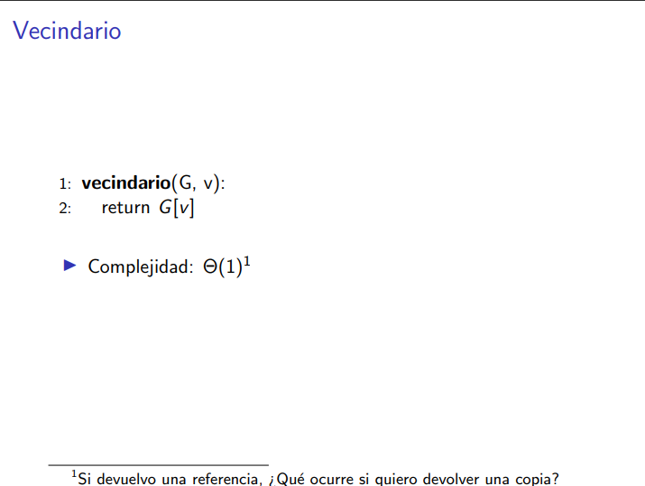

Si lo devuelvo por copia es orden del tamaño del vecindario.

Esta implementación es la más fácil. Pero también se usa un vector de vez en cuando (un vector es un array redimensionable).

Un hack para borrar un elemento de una lista de adyacencia es recordar primero que como lo que nos importa es el **conjunto** de vecinos, entonces si quiero eliminar un vecino, entonces lo que hago es swapear al que quiero eliminar con el último y me olvido del último. Aunque depende también del problema que tenga.

# Grafos implícitos

Esto está cheto! Es como ver el árbol de backtracking! Nunca lo almacenaste ni lo viste, pero sí que lo utilizaste para resolver el problema.

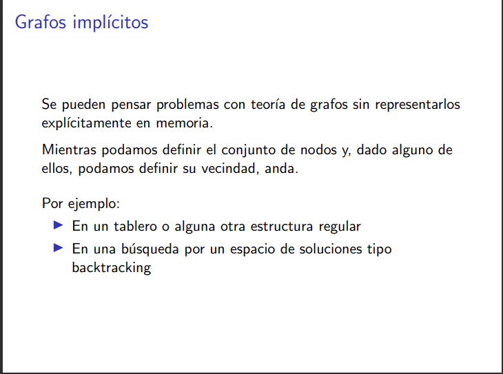  

En general todo problema que represente a algun tablero con casillas por las cuales me puedo mover es un grafo donde cada nodo es una casilla y hay una arista segun las casillas a las cuales me puedo mover.

# Demos en Grafos

Aclaración: hay un handout de cómo se escribe todo lo que sigue pero formalmente.

## Ejercicio

Probar que en todo grupo de dos o más personas hay por lo menos dos de ellas que tienen la misma cantidad de amigos en el grupo.

Lo modelamos como un grafo donde cada persona es un nodo y cad arista entre dos nodos representa la amistad entre esas dos personas. La cantidad de amigos de una persona es el vecindario del nodo que representa a esa persona.

$\implies$

Queremos demostrar que
$$
\forall \ G \ /\ |V(G)|\ =\ 2 \implies \exists \ u,\ v \in V(G) /\ d_{G}(u) = d_{G}(v)
$$

Idea:

Ssabemos que $v\in V(G)$ y sabemos que $0\leq d(v)\leq n-1$

Armemos un grafo donde un nodo no tengo a ningún amigo y hasta el nodo n-1 ese tiene a todos los amigos. O sea, el nodo 0 tiene 0 amigos, el 1 tiene 1 amigo, ...

Si
$$
\exists u \in V(G) / d_{G}(u) = 0 \implies \not \exists v\in V(G)/ d_{G}(V)=n-1 \\

\text{y viceversa (el viceversa va a ser el caso 2)} \\

\text{Por lo tanto se cumple}
$$

(El viceversa no es un sí y solo sí, sino que es "la misma idea pero al revés".)

1. 0 <= d(v) <= n-2
2. 1 <= d(v) <= n-1

En el caso (1) hay n-1 valores /= posibles para d_G(v) y n nodos => E dos nodos (o más) con igual valor d_G(v)

Ídem caso (2)


A esto se le llama demostración directa (es como inducción). Partimos desde un grafo cualquiera y me voy agarrando de las propiedades y en algún momento se me parte por casos mi problema y luego demuestro que en mis casos posibles, entonces eso demuestra que se cumple la propiedad para todo grafo.

## Ejercicio

Sean P y Q dos caminos distintos de un grafo G que unen un vértice v con otro w. Demostrar en forma directa que G tiene un ciclo cuyas aristas pertenecen a P o Q.

Idea:

Existe un camino $P= \{p_1, p_2, ..., p_k\}$ y uno $Q=\{q_1, q_2, ..., q_n\}$ donde cada par (i, i-1) ocurra que hay una arista en el grafo (sino no tendría sentido trivialmente).

> Lo que queremos es usar las propiedades para poder modelarlo para todos los caminos posibles de todo grafo.

$\forall \ 2\leq i\leq min(n,k)$

Como $P \neq Q \land p_1 = q_1  = v$, debe existir un i tal que p_j = q_j $\forall j<i \land p_i \neq q_i$

(Hasta el nodo i-1 los caminos son iguales, y en el nodo i se separan.)

Como $p_k = w = q_n$, P y Q se tienen que volver a unir (necesariamente).

Quiero el punto donde se vuelven a unit por 1era vez después de separarse.

Sea $p_l = q_e$ ese punto de reencuentro. 

Se cumple que

$p_j \not\in Q, \ i\leq j\leq j-1$
$q_j \not\in P, \ i\leq j\leq e-1$

(O sea, que los caminos son diferentes en todo punto anterior a $p_l$, recordar que $p_l = q_e$)

Luego 

$c_1 = p_{i-1}, p_i, ..., p_{l-1}, p_l$
$c_2 = q_{i-1}, q_i, ..., q_{e-1}, q_e$

Son dos caminos que unen $q_{i-1} = p_{i-1}$ con $p_l = q_e$ sin otro nodo en común.

Por lo que:

$p_{i-1}, p_i,\ \dots, p_l == q_e , q_e-1, \ \dots, q_i, q_{i-1} == p_{i-1}$

que es un ciclo donde todo nodo está en P o Q

$\square$

Atención: alguien en la clase se le ocurrión un contraejemplo para esta demo: aquí está el dibujo

[insertar dibujo]

Lo que está mal es la línea

$q_j \not\in P, \ i\leq j\leq e-1$

Hay que leer el handout porque ahí sí está correcta la demo.

La idea importante es que cada subcamino donde se separan no comparten nada.

$p_j \neq q_j , \text{si } j\leq j\leq l-1 \land i\leq j\leq e-1, p_l = q_e$

hay un tramito entre la ultima vez que son iguales y la primera vez que se unen. Entonces cuando tomo un indice para P que está en ese tramo, entonces cualquiera de esos índices no los puedo matchear con ninguno de Q.


El problemita de lo anterior era por el uso de los índices. Podemos usar algunas palabras al momento de explicar esto.

## Ejercicio

Todo $G_n (n\geq 2)$ conexo tiene al menos dos vértices distintos $v_1, v_2$ tal que $G \\ \{v_!\}$ y $G \\ v_2$ son conexos

> Recordar qeu si un grafo G no es conexo, entonces tiene al menos 2 componentes conexas.

> Vamos a usar inducción en |V(G)| = n

[en la diapo está el caso base]

$P(n): $ Si un grafo $G_n (n \geq 2)$ es conexo, entonces $\exists v_1 \neq v_2 \in V(G)$ **completar**

La hipótesis inductva es:

$\exists v_1, v_2 / G_i - \{v_1\} \land G_i - \{v_2\}$ son conexos.

En el handout no está el siguiente comentario:

Proposición: existe dos vértices tales que si yo saco ó uno u el otro, entonces siempre me queda conexo.

Si saco los dos de una compoenente conexa, entonces ya demostramos que funciona.

Si están en dos componentes conexas distintas: entonces me paro en un vértice y luego me conecto con un vértice que estaba dentro de esa misma componente conexa y luego me voy a v y luego de v me voy a la otra compoenente conexa siguiente potencialmente la misma estrategia.

Supongamos que yo tengo dos compoenentes conexas: una es C_i y C_j, y v es el nodo que me uno ambas componentes conexas.

## Ejercicio

La suma de los grados de todos los vértices es igual al doble de la cantidad de aristas. Es decir, $\sum_{v \in V(G)}d(v) = 2 |E(G)|$

Hacemos inducción sobre la cantidad de aristas:

Sea G= (V, E), |E(G)|= m

$\sum_{v \in V(G)}d(v) = 2 |E(G)|$

Queremos construirnos cualquier grafo de cualquier cantidad de nodos e ir agregando aristas para lograr esta propiedad.

Demostración:

Inducción sobre la cantidad de aristas

Caso base:

n = 0

d(v) = 0 $\forall v\in V(G) \implies \sum_{v\in V(G)}d(v) = 0$ perfecto.

paso inductivo:

$|V(G)|= n \land |E(G)|= m$ 

Sea $G' = (V(G), E(G) - \{e\})$

$|E(G')| = n-1 \implies$ por HI vale que:

$\sum_{v \in V(G')}d(v) = 2 |E(G')| = 2(n-1)$

Si $v\in V(G) / v_1 \neq v \neq v_2 \implies d_G (v) = d_{G'} (v)$
Si $v\in \{v_1, v_2\} \implies d_G (v) = d_{G'} (v) + 1$

2(n-1) = **copiar de la diapo**

# Notas

- En general en la vida es común no tener muchas aristas.
- En general en la vida es común tener pocas aristas y muchos nodos.
- Lo más complejo en la demostración con grafos es conceptualizar al grafo en sí, o sea, poder darme cuenta que el caso que planteo es el más general posible.
