# Clase recorrido uno a todos

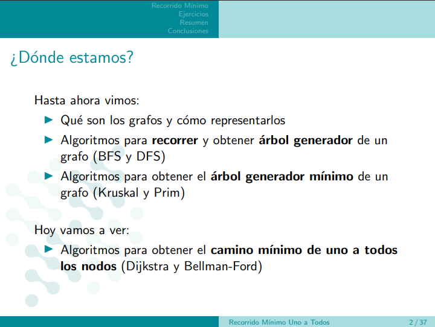

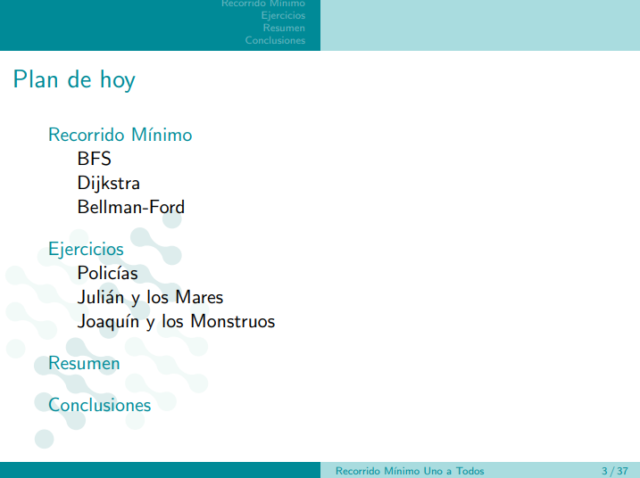

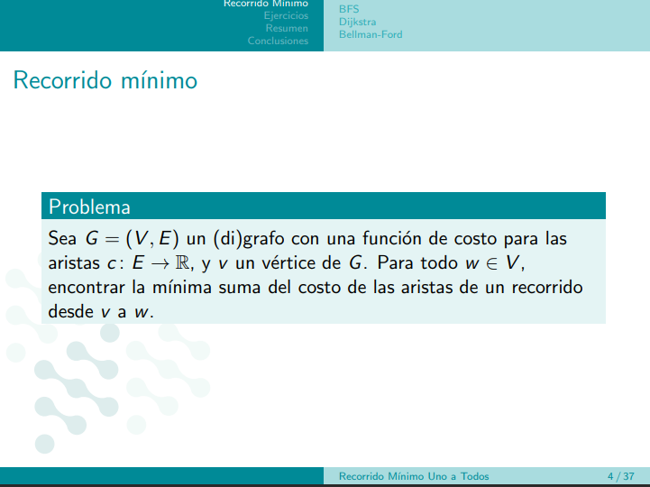

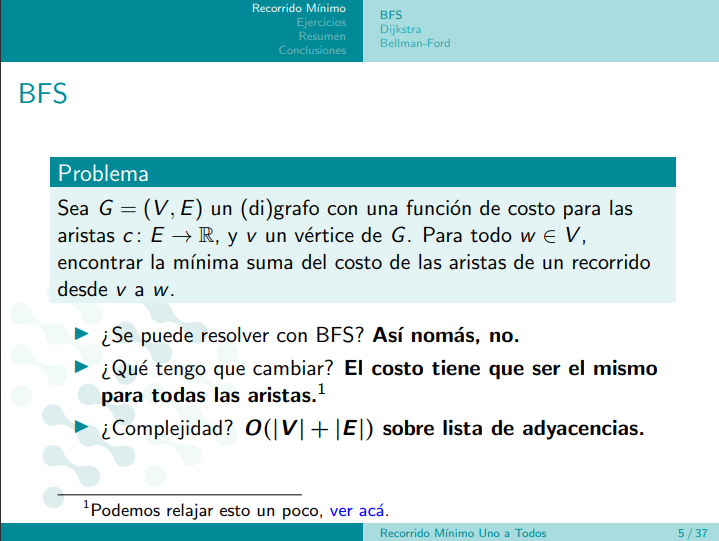

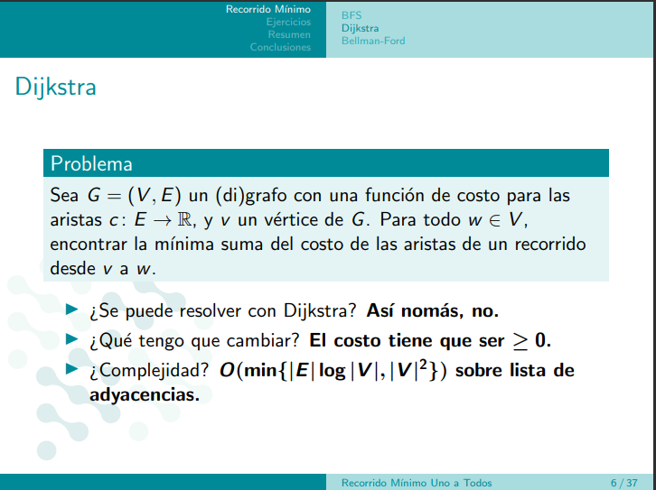

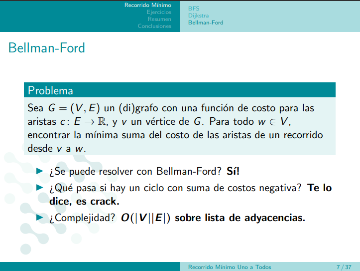

# Ejercicios

## Policias

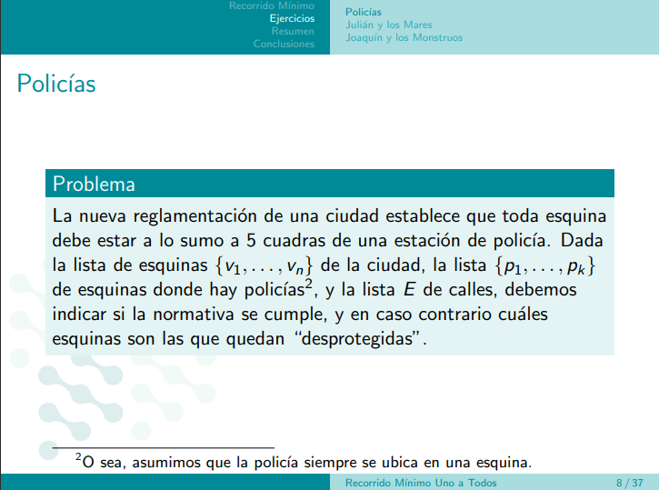

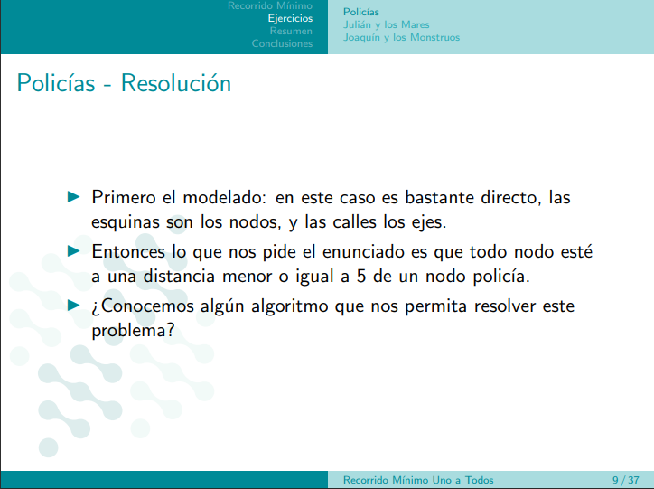

```
Se me ocurre que se haga un BFS desde cada esquina, pero que si se pasa de 5 y no encontró una estación de policia entonces devuelva que no encontró. Si cada recorrido desde cada calle conectada a cada esquina me dice que no hay una estación, entonces todo mal, sino todo bien. Aún mejor, si conectamos un nodo fantasma a todas las esquinas que no son policias y corremos BFS desde ahí pero que lo haga desde 6, entonces la complejidad mejora.
```

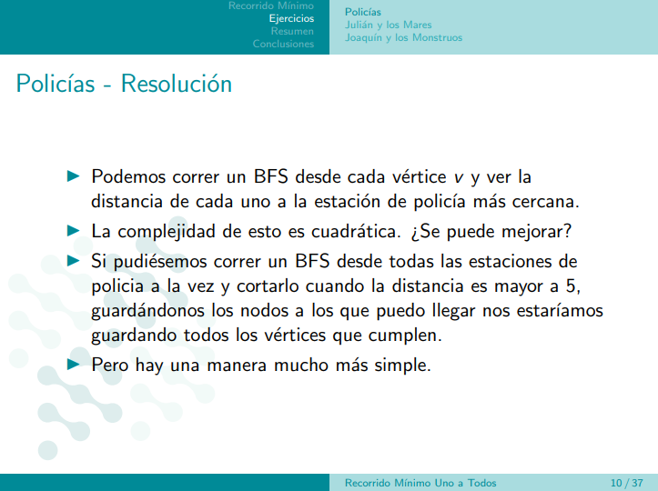

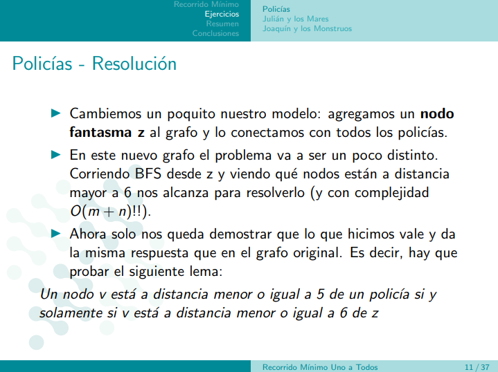

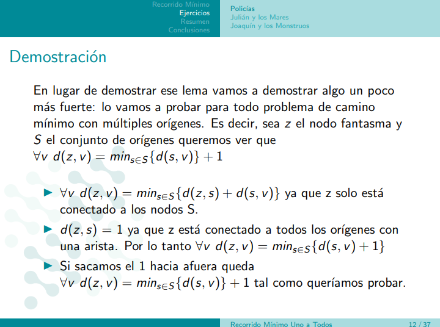

$\forall \in$
```
Dem que pienso rapidamente:
Nada
```

```
Dem que dan: idea

Para llegar de z a v quiero esa es la distancia entre v y s y la distancia entre s y z
```


## Julián y los mares

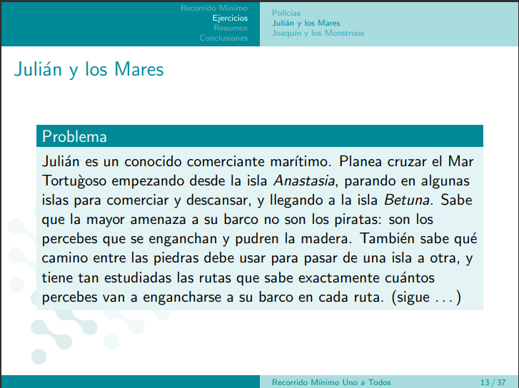


```
Se me ocurre hacer un grafo donde cada isla es un nodo, cada ruta marítima es una arista, si la ruta tiene percebes, entonces tiene peso negativo, si tiene tortugas entonces tiene peso negativo. 

Se me ocurre que podemos hacer un bellman ford con una especie de contador que esté pendiente de si ya resté percebes dos veces, si eso ocurre entonces devuelvo infinito. Para ese camino

También se me ocurre hacer un bellmand ford y que cuando reste por primera vez entonces le ponga peso infinito a todas las aristas tortugas del grafo.
```

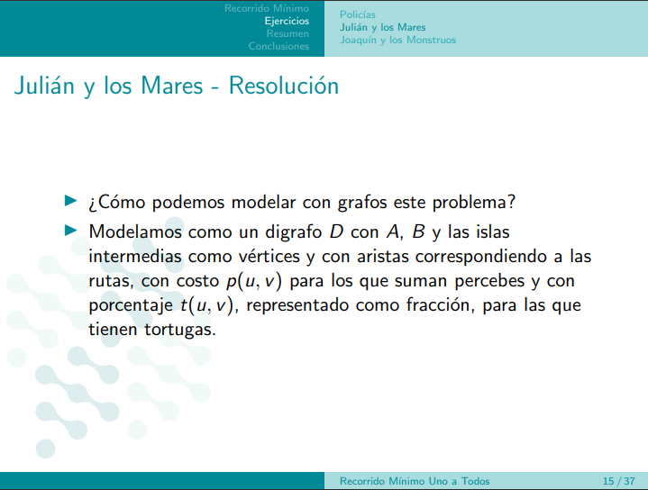

```
Es buenísimo poder imaginarse esto para poder entenderlo. 

La vaina es: hago Dijkstra desde A hasta B PERO EN EL GRAFO QUE NO TIENE ARISTAS TORTUGA. Luego meto una arista tortuga y como Dijkstra me da el camino mínimo de un nodo a todos los demás entonces calculo lo que me sale el nodo que se conecta a otro a través de la arista tortuga y luego transpongo el grafo y vuelvo a hacer Dijkstra pero desde B y me fijo cuánto me sale llegar hasta el nodo que agregué recién que tenía una arista tortuga.

El truco supremo es modelar el grafo como los dioses para que no tengas que modificar Dijkstra.
```

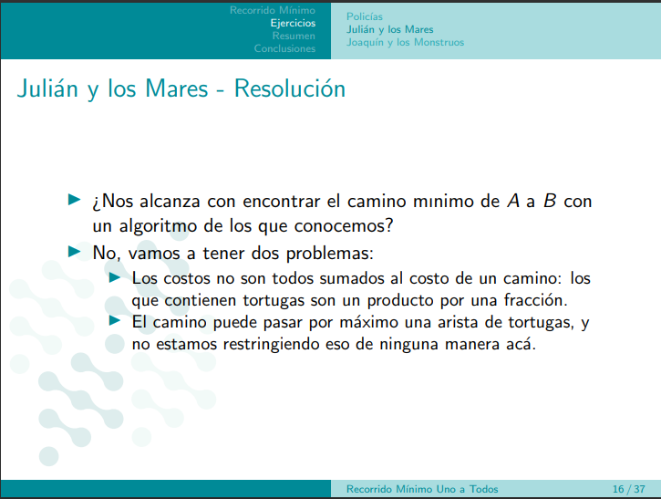

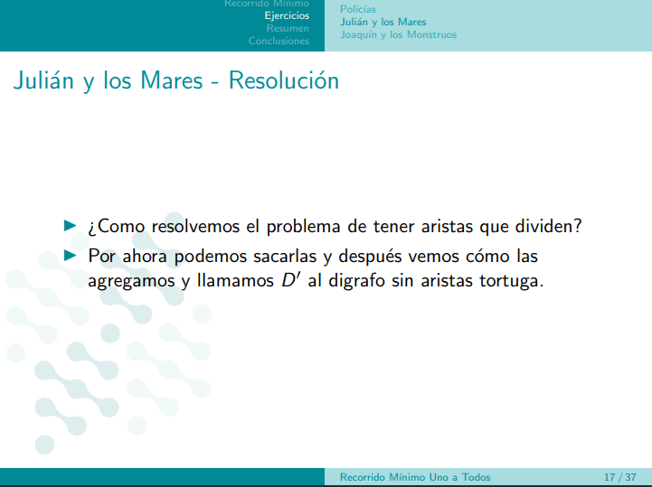

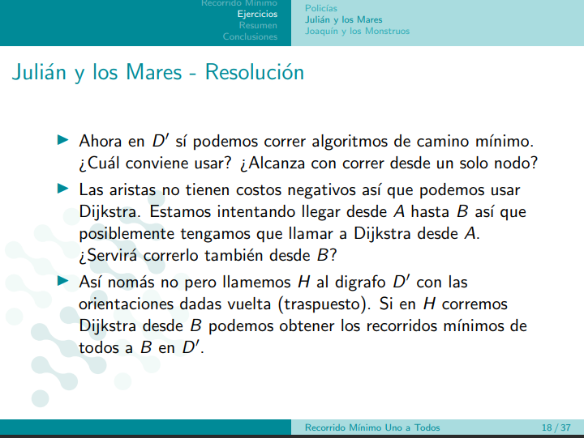

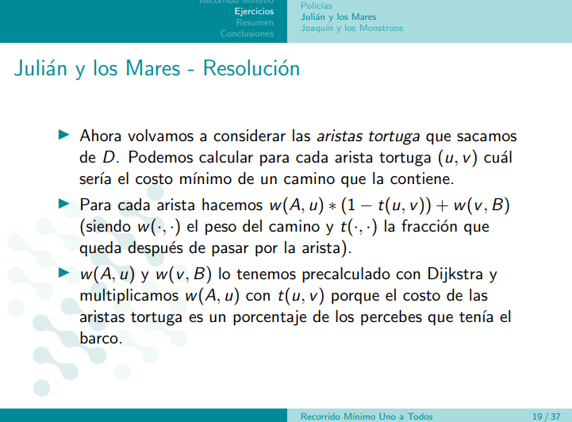

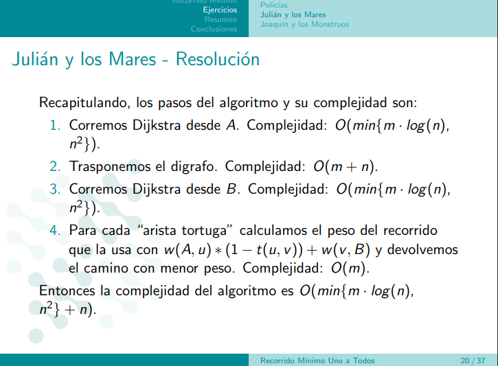

es O(m) porque vamos a hacer una cuenta a lo sumo m veces porque la vamos a hacer con cada arista tortuga y puede haber m tortugas posibles.

[Se saltearon la demo, hay que mirarla en casa como tarea]


```
Se podía resolver con Dijkstra por la manera en la que lo modelamos. 
```
```
Todos los problemas que se pueden resolver con Dijkstra se pueden resolver con Bellman Ford porque Dijkstra solo se puede con aristas no negativas, entonces la sumatoria de pesos positivos siempre es mayor que la suma de pesos negativos entonces no puede haber ciclos y por lo tanto se puede con Bellman Ford (es la idea).
```

## Joaquín y los monstruos

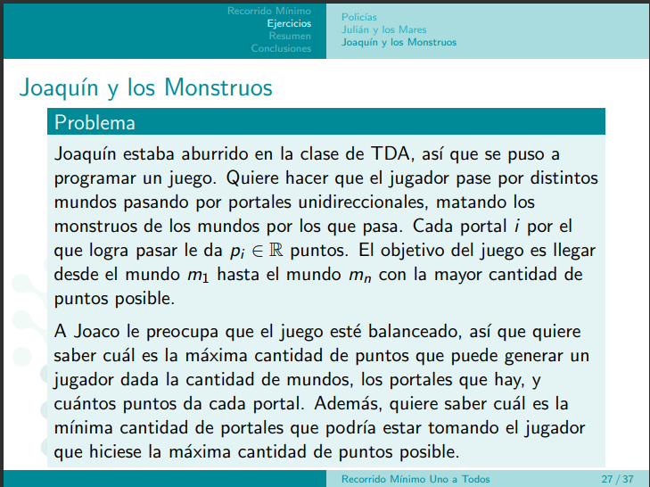

```
El modelado es:
Un mundo - Un nodo
Una arista - Un portal | Tiene peso positivo

Se me ocurre hacer esto como un problema de AGMáx. Si lo hacemos de esa manera obtengo toda la información que necesito, al menos en principio creo eso... Edit: no se puede porque son portales unidireccionales, buscar el AGMáx en este caso es inválido porque solo sirve para grafos.


Se me ocurre modelar al grafo igual que antes pero ahora cada arista tiene como peso una tupla (puntos que da, prioridad) donde prioridad es un número de 0 a 1 y mientras mayor sea la cantidad de puntos menor es la prioridad. Luego lo que hago es correr Dijkstra desde m1 pero solo viendo la prioridad. ESo me devuelve todo lo que me piden.
```

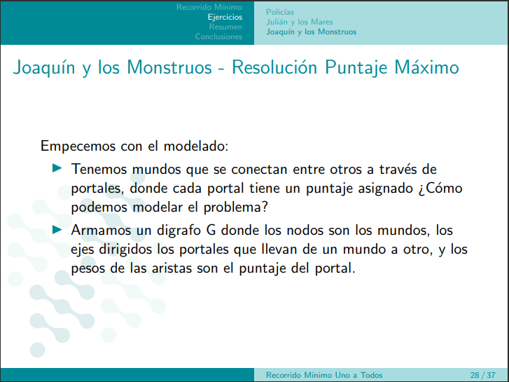

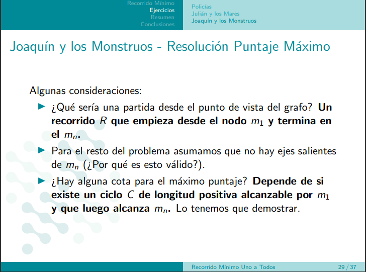


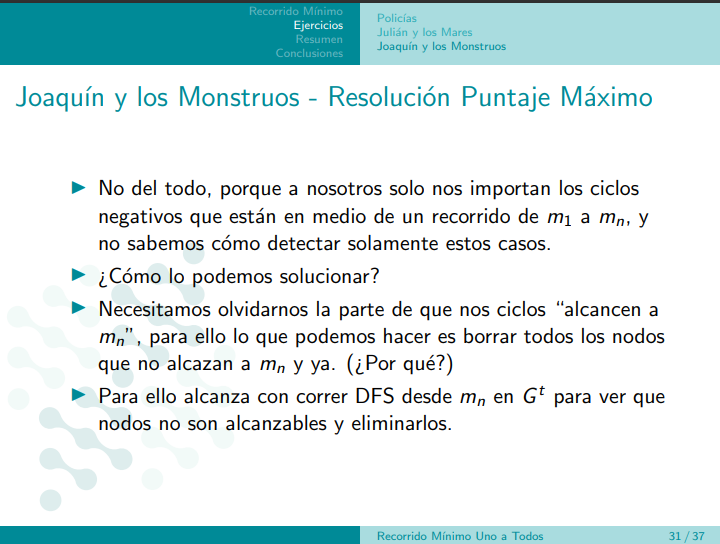

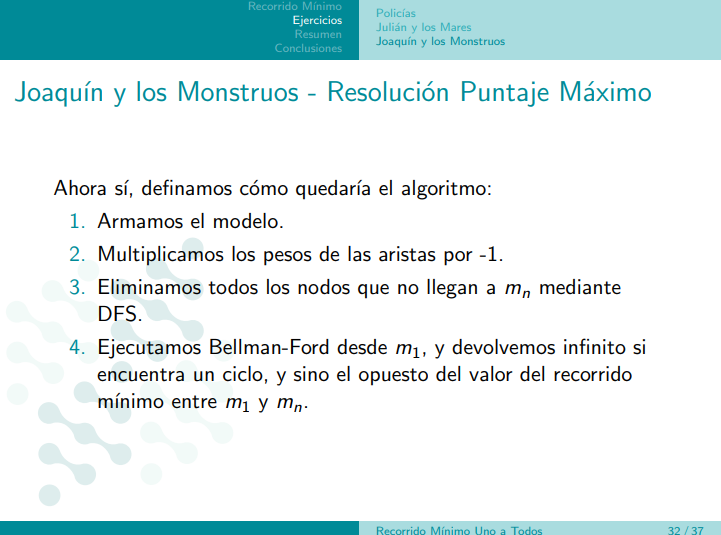


```
Esta es la manera en que nos construimos el DAG de caminos mínimos de un grafo.
```
```
La complejidad es O(m*n) porque hacer bellman ford en el grafo transpuesto me da la distancia desde Mn a todos los demás mundos, entonces solo basta con correrlo una sola vez.
```

# Notas

- DFS me demuestra conectitud, alcanzable de un nodo a todos los demás y todos a uno pero viendolo en el transpuesto.
- Camino uno a todos y todos a uno con Dijkstra.


# Notas extras

- Notar la bipartición en un grafo es hacer bfs y dividir por paridad con respecto a la distancia a la raíz. Luego ver que los pares no se conecten con los pares y lo mismo con los impares, solo conexión entre diferentes paridades.

# Para el tp ejercicio 3

- Lo que hay que ver son los ciclos donde hay aristas con el mismo peso. 