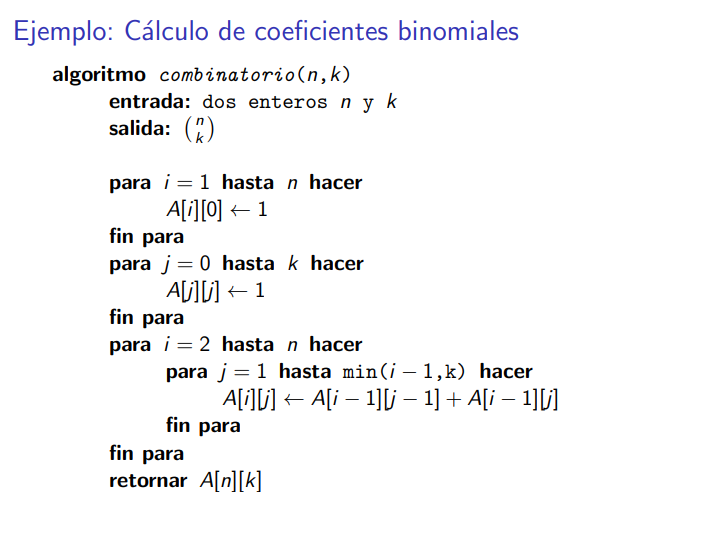
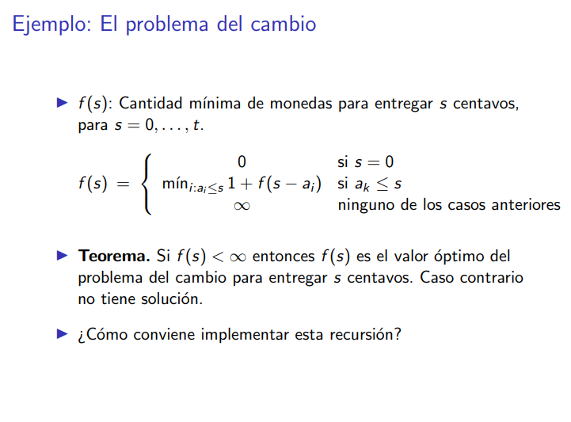

# Programación dinámica

**completar con la diapo todo antes de la diapo con la formula de numero combinatorio.**

## Def
Es basicamente ir calculando soluciones que me las voy a ir guardando, no me interesan ninguno de los resultados anteriores a los que realmente necesito.

Esto es simple: calculo, me acuerdo de lo que calculé, me voy a calcular lo siguiente acordandome lo que acabo de calcular (o lo que sea que vaya a necesitar para los siguientes calculos).

## Cuando conviene?
Cuando existe la superposición de estados. O sea que cuando se vea el arbol de estados/recursión, existan sub-problemas repetidos, en otras palabras, que se repitan nodos en el arbol.

## Enfoque Top-Down
Se refiere a resover el problema desde arriba hacia abajo, me voy acordando los resultados usando alguna estructura de datos.
> Si está en la memoria, no lo calcules.

## Enfoque bottom up
Trata de convertir un algoruimto recursivo en una forma que sea iterativa.

Emepzamos desde los casos bases y a partir de esos casos nos vamos calculando SOLO lo que necesitamos para llegar a la solución final.
> No calcules nada que no te lleve a la solución, tampoco repitas.




# Ejemplos clásicos

## Fibonacci
$$
fib(5) = fib(4) + fib(3)
$$
Ver el arbol de recursión de esto...

### Enfoque top-down
```python
def fib(n):
    if n<=1:
        return 1
    else:
        return fib(n-1)+fib(n-2)
```
### Enfoque bottom-up
> Esta sí es la implementación cheta 
```python
def fib(n):

    fib_n_menos_2=0
    fib_n_menos_1=1

    for _ in range(2,n+1):
        fibo=fib_n_menos_2+fib_n_menos_1
        fib_n_menos_2 = fib_n_menos_1
        fib_n_menos_1 = fibo
    
    return fibo
```

En estos casos, el enfoque bottom up es muchísimo más eficiente en terminos de manejo de memoria y temporal.

## Problema del cambio
Queremos saber la cantidad mínima que tenemos quedar para devolver el vuelto.

> Este problema se resuelve fácil con programación greedy. Sin embargo estamos en la clase de Programación dinámica ;)

Algoritmito:
1. Si el vuelto es 0, devuelvo 0 monedas.
2. Sino devuelvo 1 + el óptimo de restarle al vuelto la denominación de la moneda que acabo de agarrar.
3. Sino digo que devuelvo todas las monedas posibles, o sea $\infty$



$a_k$ Se refiere a las denominaciones de las monedas en el array que representa las denominaciones.

### Dem
Afirmacion 1
Una manera de demostrar esto es por contradicción.
Una solución dtien ep monedas. Tengo b monedas de denom. p
Si existe una solucción entonces debería ser finita.

Com oexiste esa solución se puede restar de manera recursiva una moneda menos el cambio a la cantidad de monedas.

**completar**

f(s) no puede ser igual a p y a $\infty$ al mismo tiempo.

AFirmacion 2
Digamos **completar**

Calcular un nuevo mejor depende de la cantidad de
### Enfoque Fuerza Bruta
```python
def monedas (vuelto: int, denominaciones: list[int])->int:
    if vuelto == 0:
        return 0
    
    pruebas = []

    for denominacion in denominaciones:
        if denomincacion<=s:
            pruebas.append(1+vuelto-denominacion, denominaciones)

    return min(pruebas)

denominaciones = [1,5,10,25,50]
```
### Enfoque Top-Down
Calculo el optimo usando una todas las denominaciones que tengan sentido (denominación es menor o igual al vuelto). 
```python
def monedas (vuelto: int, denominaciones: list[int], memo)->int:
    if vuelto == 0:
        return 0
    
    if vuelto in memo:
        return memo[vuelto]
    
    pruebas = []
    for denom in denominaciones:
        if denom <= vuelto:
            pruebas.append(1+monedas(s-denom,denominaciones, memo))
    
    mejor = min(pruebas)

    memo[vuelto] = mejor
    
    return mejor
```
Esta vaina anda porque python pasa por referencia al memo.

**hacer el enfoque bottom up**
conviene ejecutar esto y ver resultados
```python
def monedas (vuelto: int, denominaciones: list[int], memo: dict[int])->int:
    if vuelto == 0:
        return 0
    
    if vuelto in memo:
        return memo[vuelto]
    
    pruebas = []
    for denom in denominaciones:
        if denom <= vuelto:
            pruebas.append(1+monedas(s-denom,denominaciones, memo))
    
    mejor = min(pruebas)

    memo[vuelto] = mejor
    
    print(vuelto, mejor)

    return mejor
```

### Enfoque Botom-up
```python
memo=[0]
vuelto = 69
denominaciones = [1,5,10,25,50]
for s in range(1,vuelto+1):
    pruebas = []
    for denom in denominaciones:
        if denom <= s:
            pruebas.append(1+memo[s-denom])
    memo.append(min(pruebas))

memo[vuelto]
```

## Problema de la mochila
Tenemos una mochila que aguanta un peso n, tenemos b objetos con v valor cada uno, queremos guardar en la mochila el mayor valor posible usando esos objetos.


La idea para resolver esto tomar un objeto y hcaer el juego de ponerlo o no ponerlo y comparar si estaba bueno o no.

**Completar con la función de recursión que está en la diapo**

LA complejidad del algoritmo naive es 2^n. 

## Dem
HP: asumimos que para todo k>1, lo que sabiamos de antes es optimo. 

Es importante poder ver todos los casos posibles viendo la función de recursión.

En la demostración deben estar reflejados todos los casos posibles.

La mayoria de las cosas que son PD, cumplen con una propiedad de bellman. Si tenemos una solución optima, y le sacamos la ultima instancia entonces lo que nos queda es una solución óptima para la instancia anterior a la original.

> Si yo tenía algo optimo y le saco algo, entonces lo que me queda ES óptimo también.

Esto se puede aplicar para todo problema que cumpla las propiedades de ser PD.

El chiste es que todos los subproblemas van a ser óptimos pero para ese mismo subproblema.

Resolver esto es pseudopolinomial y depende de la capacidad de la mochila.

## Problema de la subsecuencia comun más larga

si subsec a = 0, entonces todo vale 0 y viceversa

Cuando me muevo a la derecha corto de la b y hacia bajo corto con la a. Cortar se refiere a me paro en un índice de la subsecuencia que corto y comparo con que la subsecuecnia a partir de ese índice es igual a la otra.

Muchas cosas recaen como en la mochila. Lo pongo o no lo pongo.

# Notas
- Es importante entender que programación dinámica es super conveniente cuendo hay superposición de estados.
- Si tengo un problema que se me divide en partes disjuntas entonces D&C. Si tengo un problema que me trae superposicion de problemas y me las puedo acordar, entonces Programación dinámica. Si tengo un problema que me trae superposición de problemas PERO yo tengo una regla que me dice cómo llegar a la mejor, entonces es greedy.
- Todo sale por programación dinámica.