# Árboles

---

Creo que hoy vemos DFS y BFS

---

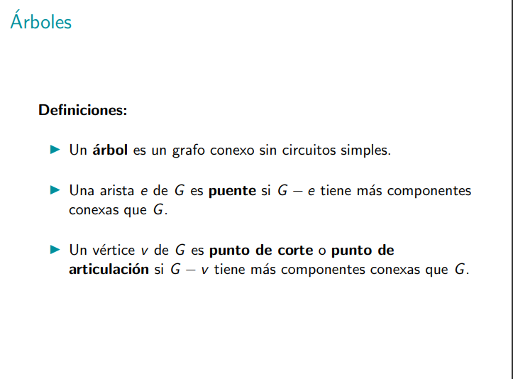
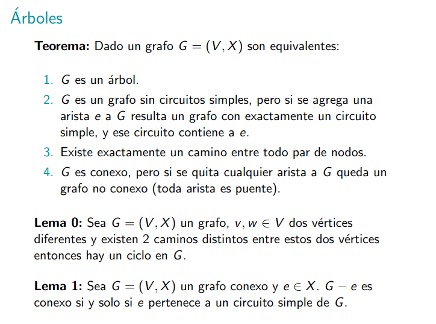

la demostracion de equivalencia se hace en el orden:

1 => 3 => 4 => 2 => => 1

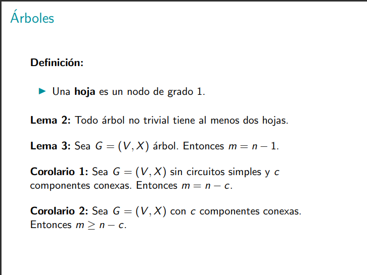

El lema 2 se puede demostrar mirando el camino más largo posible pues ambos extremos son hojas.

EL lema 3 se puede demostrar haciendo unducción por el número de nodos.

El corolario 1 se puede demostrar usando el lema 3.

El corolario 2 se puede demostrar con la idea de que quiero que sea como el corolario 1, entonces me pongo a sacar aristar hasta que caigo en el corolario 1.

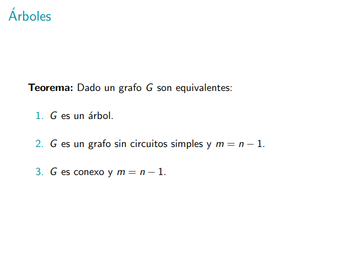

Esto sirve para poder demostrar que un grafo sea un árbol, o sea que si pruebo a 2 o 3, entonces el grafo es un árbol.

1=>2=>3=>1

la de 3 => 1 se prueba por absurdo diciendo que 3 tiene un ciclo y me pongo a sacar aristas hasta que sea aciclico (y por lo tanto ya sería un árbol) ah! pero resulta que saqué aristas y todavía vale m = n-1? absursdo.

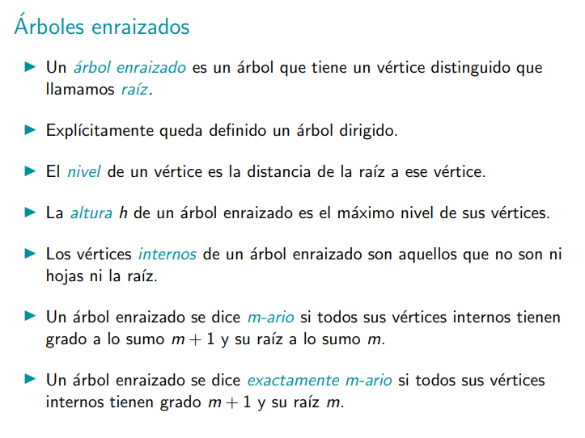
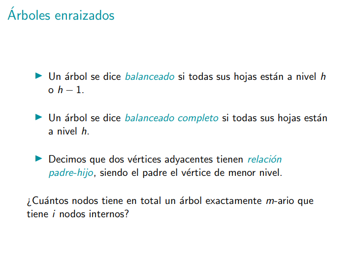

respuesta a la pregunta = i * m + m + 1
explicación: hay i * m nodos internos cada uno con m hijos.
Hay m nodos que son hijos de la raíz.
la raíz suma uno más.

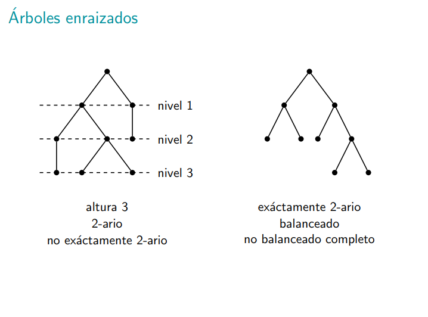
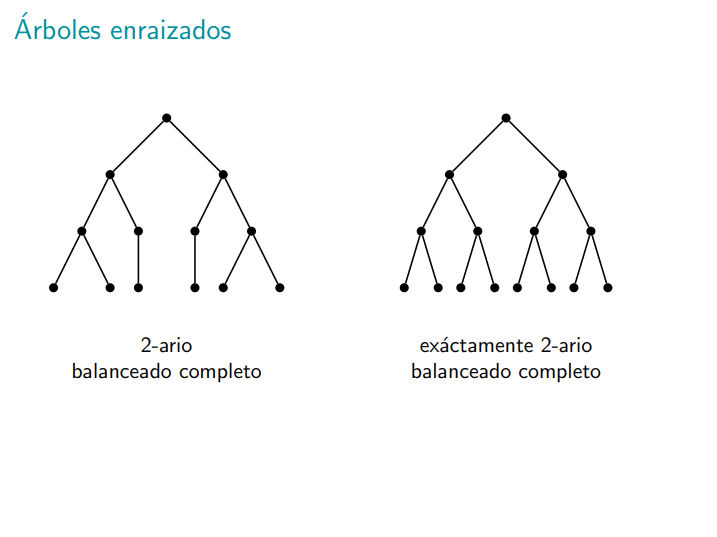
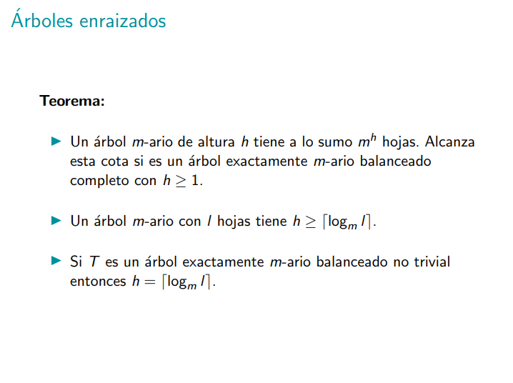

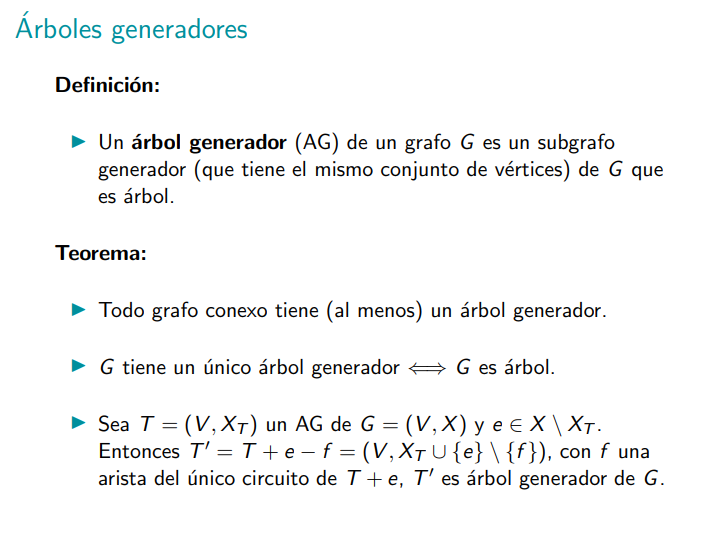

Los lemas y corolarios anteriores lo que hacen es encapsularme la idea de que si me pongo a sacar aristas entonces no tengo problemas con el tema de conectitud.

El último teorema lo que dice es que si tengo un árbol generador y si le meto una arista de G que no estaba en el árbol generador y le saco otra arista que estaba en el árbol generador, entonces obtengo otro árbol generador.

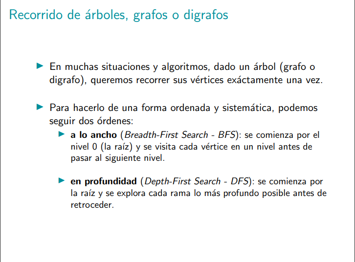
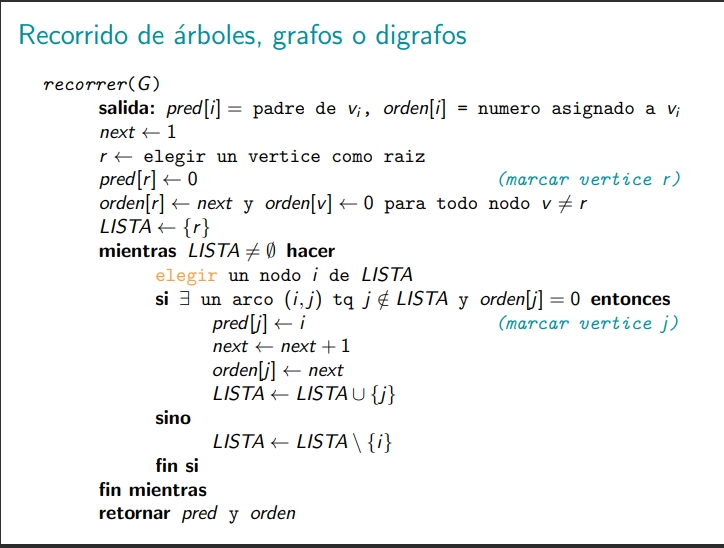

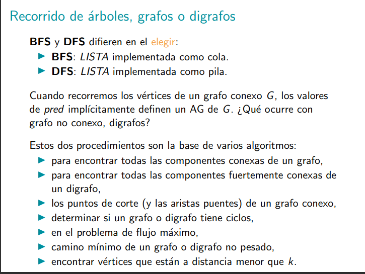


```

                A
            /       \
            B        C
          /           \
         D              E
         |
         g
``` 
d[a, a] = 0
d[a, b] = d[a, a] + 1 
d[a, c] = d[a, a] + 1
d[a ,d] = d[a, b] + 1 
d[a, e] = d[a, c] + 1
d[a, g] = f[a, d] + 1

BFS es ideal para calcular distancias entre cada nodo del grafo hasta la raíz.

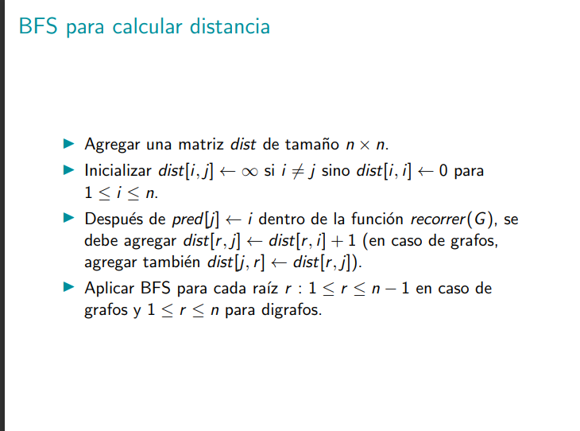


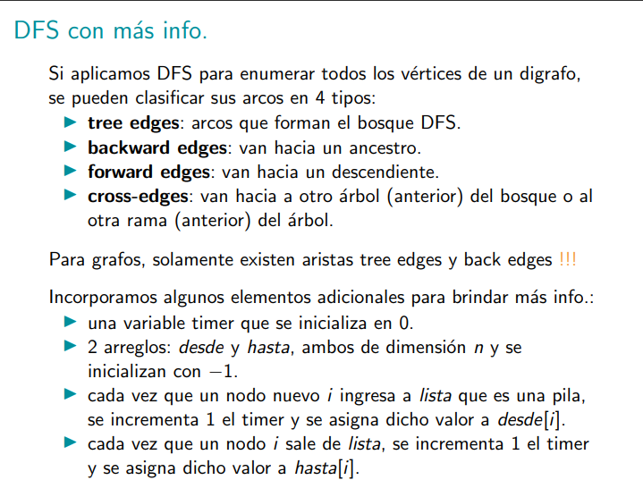

```
            A                   F
        /                      /
       B <--------------------G
      /         
     C
    / \
   D   E
```

Es muy dificil dibujar el grafo acá, dibujar a mano y subir.

Que sea backward tiene que ver con el orden en que se visitan los nodos.

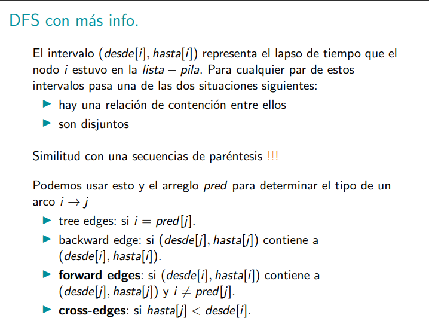

Hacer un ejemplo de ejecución y luego ver el resultado de la ejecución en una recta numérica.

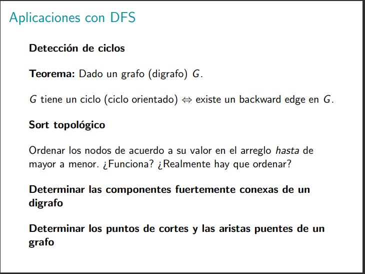

por cada backward edges tengo un ciclo.

El ordenamiento topologico es un ordenamiento de los nodos que respeta que los hijos vienen después de los padres.

Componente fuertemente conexa: son componentes tales que para todo nodos u v podemos ir de u a v y de v a u.

Algoritmo Kosaraju para encontrar componentes fuertemente conexas de un digrafo: https://youtu.be/QlGuaHT1lzA?si=BgRRH23qJjxmRtU7 y https://youtu.be/00fiBfxlzio?si=yVvv9qdknzgQqHXn

Algoritmo de Tarjan para puentes: https://www.youtube.com/watch?v=qrAub5z8FeA y https://www.youtube.com/watch?v=Rhxs4k6DyMM 

Algoritmo de Tarjan para puntos de articulación: https://www.youtube.com/watch?v=64KK9K4RpKE y https://www.youtube.com/watch?v=jFZsDDB0-vo

## Notas sorbe ambos algoritmos:

- **Algoritmo de Kosaraju para encontrar componentes fuertemente conexas en un digrafo**: El truco es aprovecharse de que si existe un ciclo entre los mismos nodos tanto en el grafo base como en el transpuesto, entonces esa es una componente fuertemente conexa. El algoritmo de Kosaraju usa un pila para llevar un orden conveniente de los nodos que fueron recorridos. Luego de transponer, si uno hace dfs y justo te encuentras con un ciclo y los nodos que recorriste seguían en la pila, entonces sucede que en el grafo base había un ciclo entre esos mismos nodos y que por lo tanto esa tiene que ser una componente fuertemente conexa.

- **Algoritmo de Tarjan para puentes**: Tiene sentido que una arista u-v sea puente sii low[v] > dist[u] pues eso significa que ninguno de los hijos de v pudo llegar a algun ancestro de u, y por lo tanto la única conexión posible de v con el resto del grafo es a través de la arista u-v. Notar que si low[v] = dist[u] significa que existía un recorrido alterno para llegar de v a u, y por lo tanto la arista u-v no era puente.
- **Algoritmo de Tarjan para puntos de articulación**: tiene sentido que un nodo u sea punto de articulación si low[v] >= dist[u] porque: 
  - **si low[v] > dist[u]**: entonces eso significa que ningun hijo de v pudo llegar a algun ancestro de u por lo tanto la única manera de que el subgrafo enraizado en v se pueda conectar con los demás nodos es a través de alguna arista con el nodo u.
  - **si low[v] = dist[u]**: entonces eso significa que existe algún recorrido dentro del subgrafo enraizado en v que tiene como inicio a un nodo que logra llegar a u como nodo, esto lo que provoca es algo así como que u sea el ancestro "más viejo" de todo el subgrafo enraizado en v, por lo tanto la única manera de que ese subgrafo se conecte con todos los demás nodos ese a través de alguna arista u-v.

# Notas

- Grafo acíclico: grafo sin circuitos simples.