# Árboles generadores mínimos

Un árbol generados (AG): de un grafo G es un subgrafo generados (que tiene el mismo conjunto de vértices) de G que es árbol.

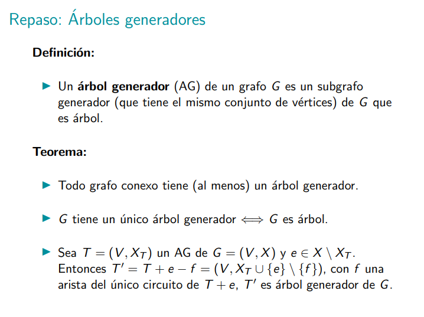

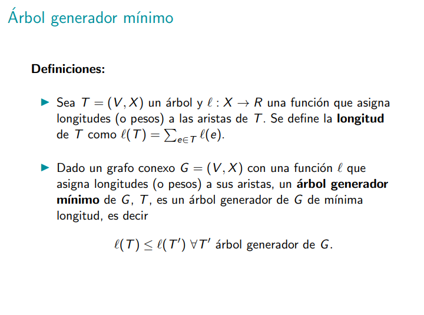

La longitud de un árbol es la suma de todos los pesos de todas las aristas que lo conforman.

El árbol generador mínimo es el árbol generador que tiene longitud mínima.

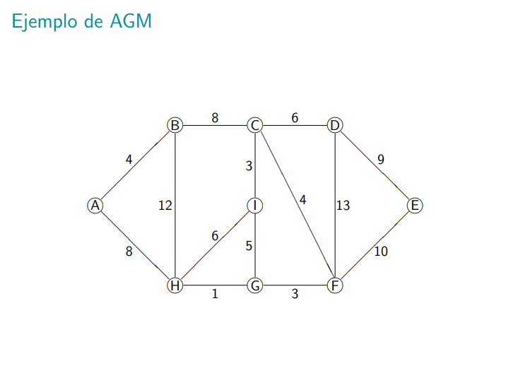
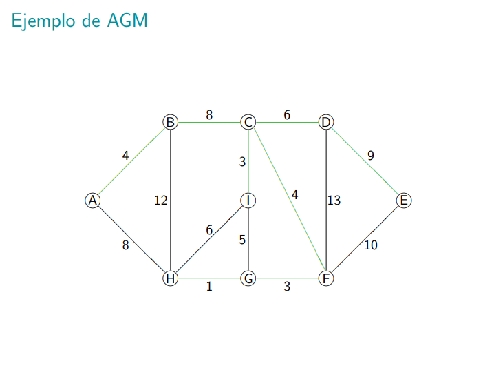
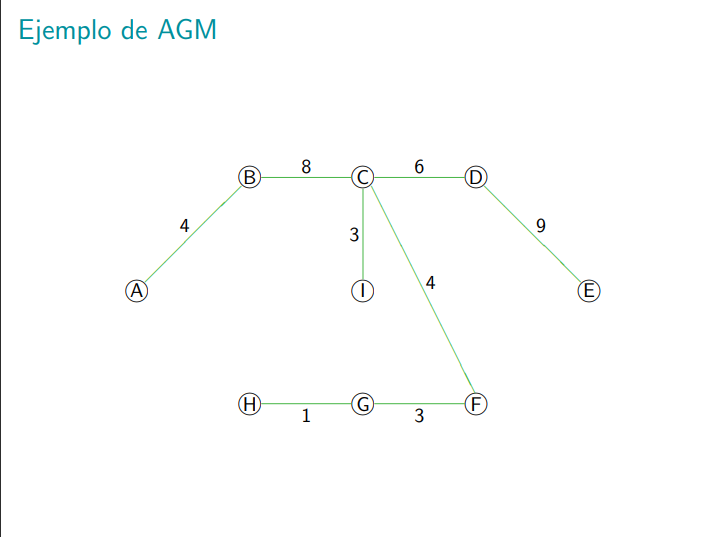

## Algoritmo de Prim

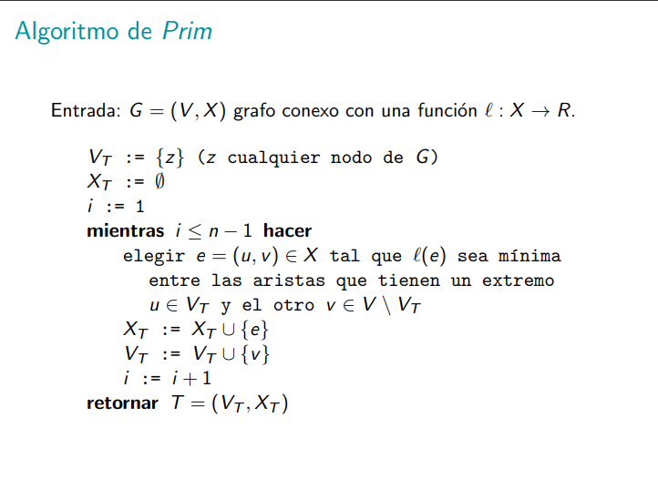

El algoritmo de Prim ta bueno, comienza desde un nodo y se va por la arista de menor peso que sale de él, y así con todos los nodos que va recorriendo, siempre y cuando no llegue a un nodo que ya había visitado.

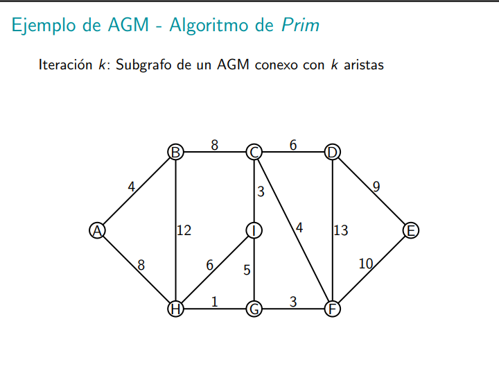
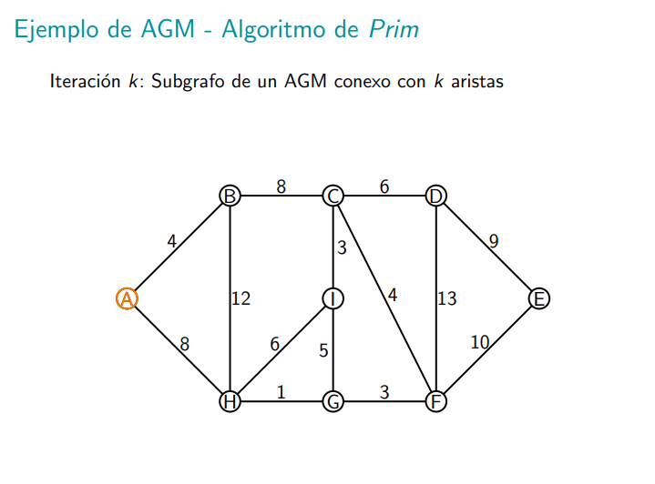
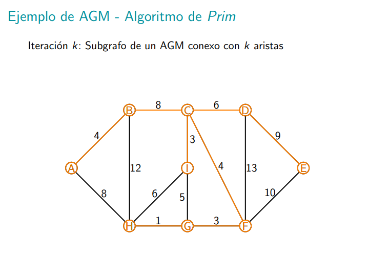

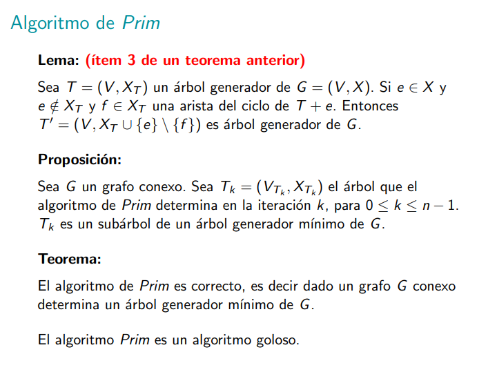
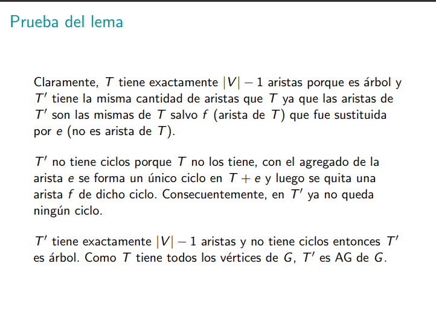
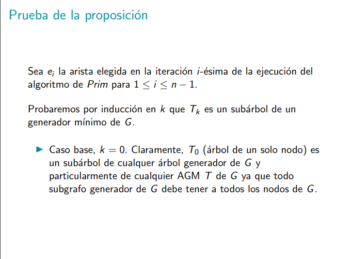
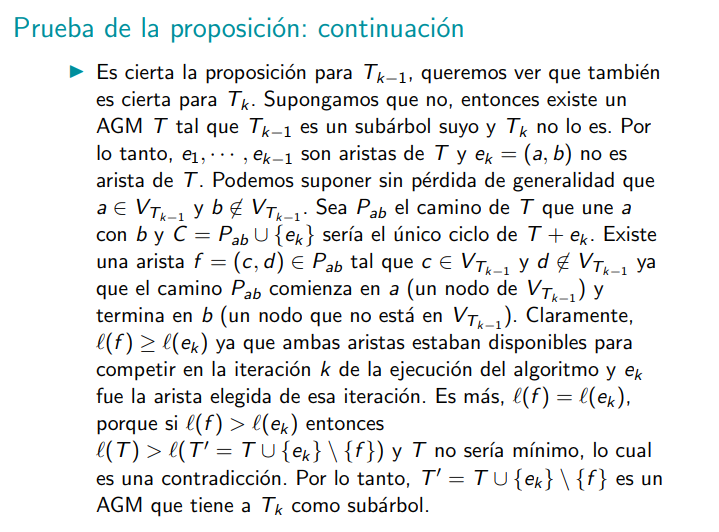
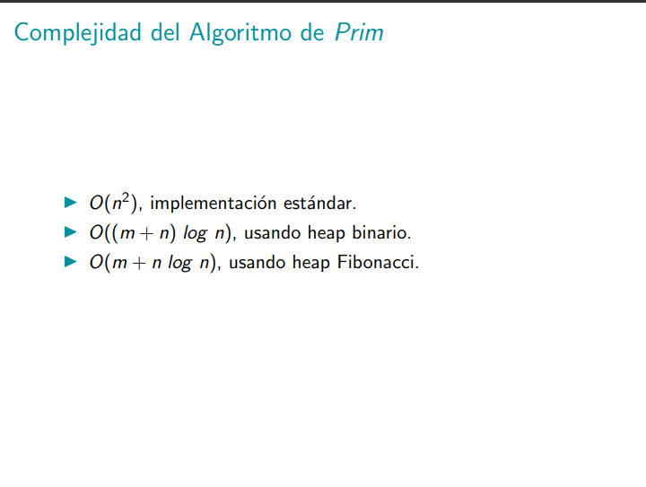

## Algoritmo de Kruskal

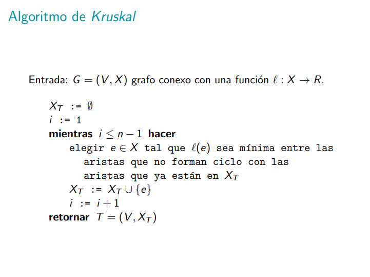
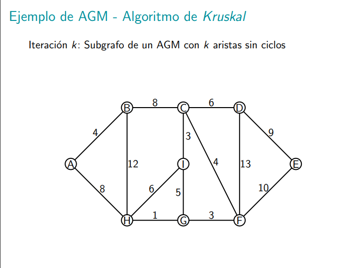
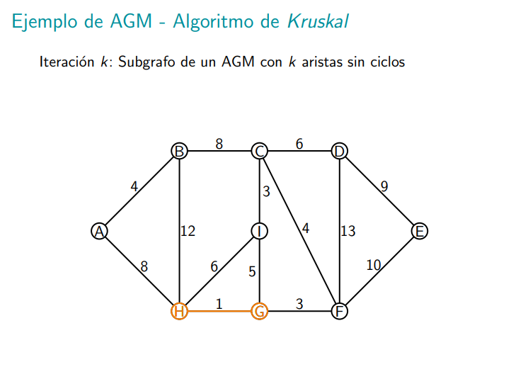
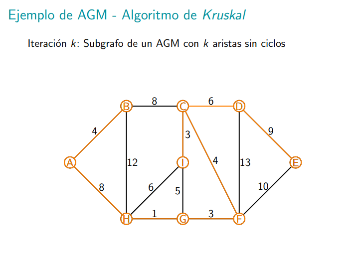

En la implementación de Kruskal se evitan elegir aristas "malas", entonces lo que se hace es solo usar aristas que no me conecten nodos del mismo conjunto.

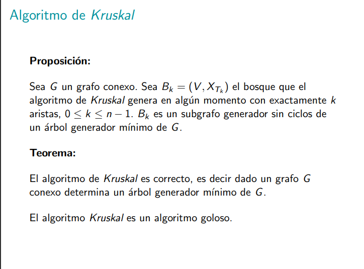

Un bosque es un conjunto de árboles. No es conexo el bosque (al menos hasta que haya terminado la ejecución del algoritmo).

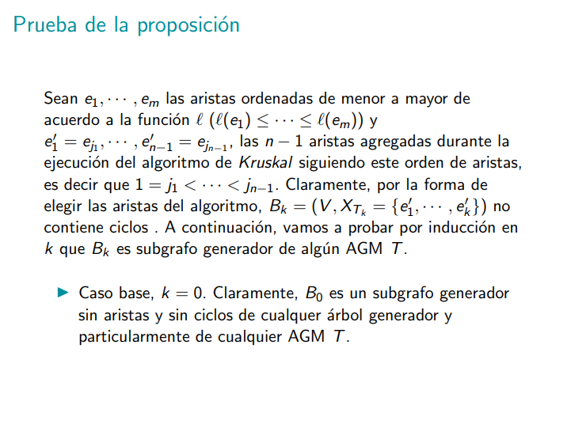

todas las e' son las aristas que agrega kruskal.

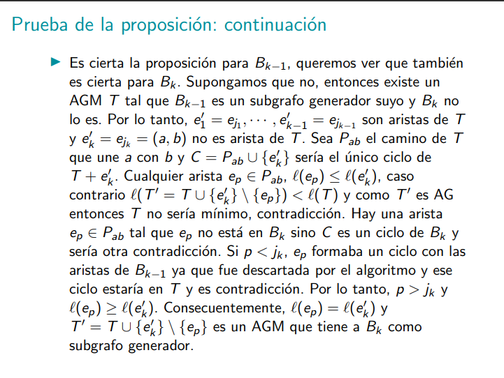
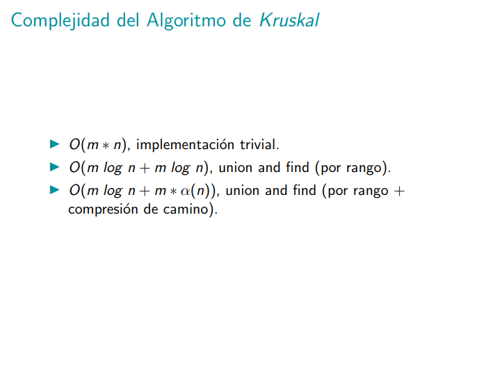

