# Caminos mínimos parte 2

Propiedad: Todos los vertices dentro de un camino mínimo están unidos por caminos minimos.

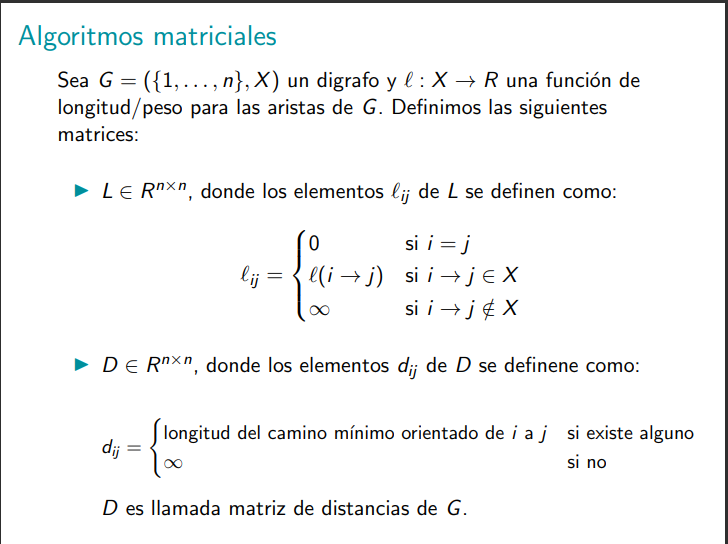

# Notas:
- Los algoritmos de hoy son matriciales y nos van a dar el camino mínimo entre todo par de nodos.

Traducción: una matriz en la posición ij es el largo del camino desde el nodo i al j, si no hay camino entonces es infinito.

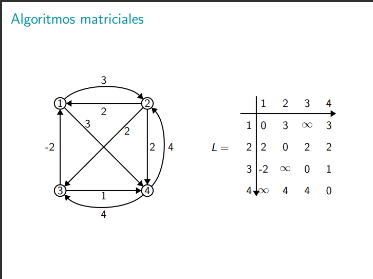

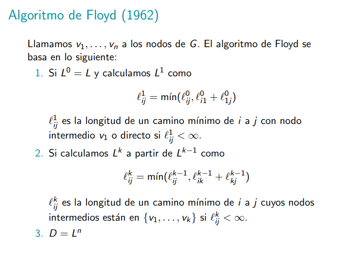

O sea, Floyd es basicamente: saber el camino de i a j es lo mismo que ver el minimo de las longitudes entre el camino minimo que ya conozco de i a j y el camino mínimo desde i a un nodo k + el camino mínimo de k a j. O sea, en super castellano: floyd hace una comparación de longitudes de caminos mínimos de un nodo i a otro j tratando de pasar por un nodo k en el medio, se queda con el minimo de pasar directo por la arista i->j o de pasar primero por un nodo k antes de lelgar a j.

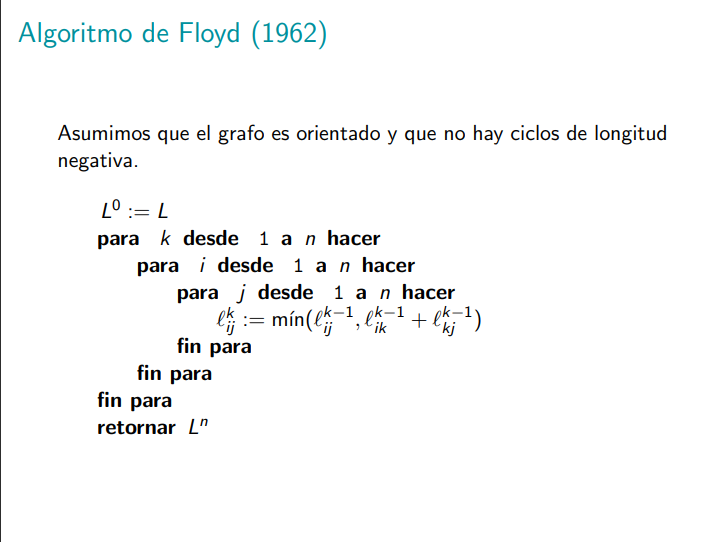

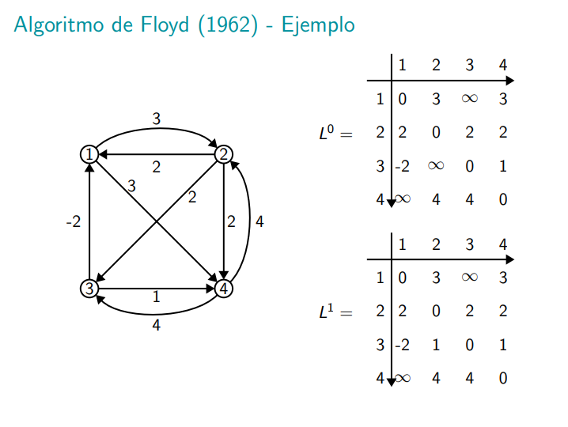
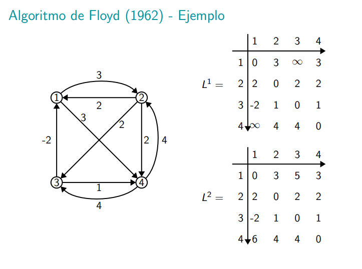
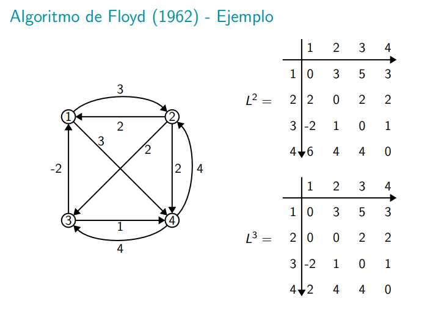
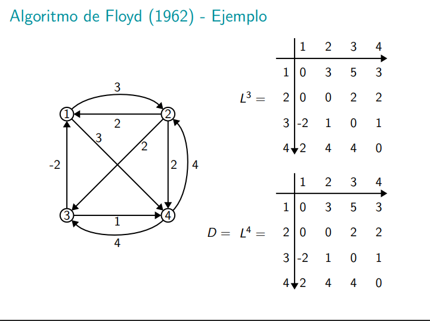

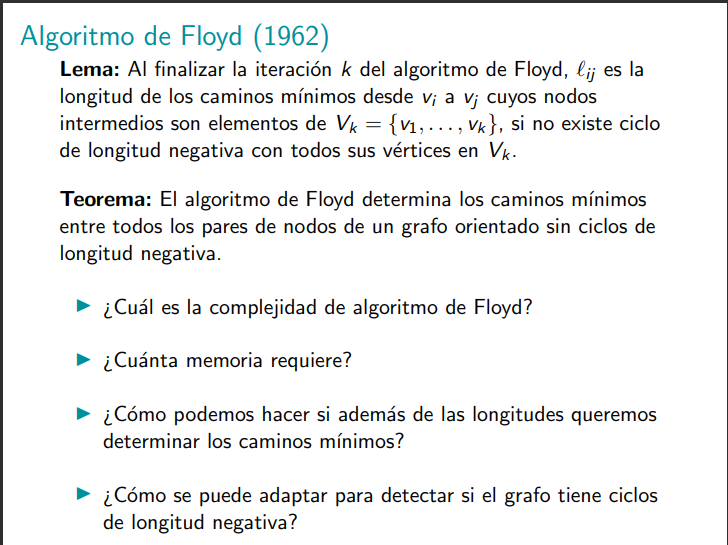

traducción: EN la iteración k se tiene la longitud del camino mínimo de i a j pasando por los primeros k nodos (siempre y cuando no exista un ciclo de longitud negativa).

Para saber el camino de nodos, nos tenemos que guardar los predecesores en cada desición del algoritmo.

Moraleja: Floyd no sabe todos los caminos mínimos hasta que termina de correr todo el grafo.

> Floyd me da en el medio  todos los caminos mínimos que contengan en el medio a los primeros k vértices.

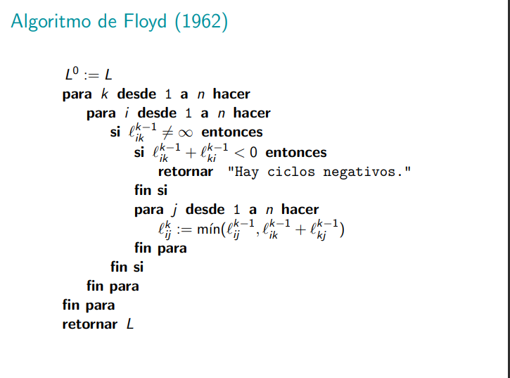

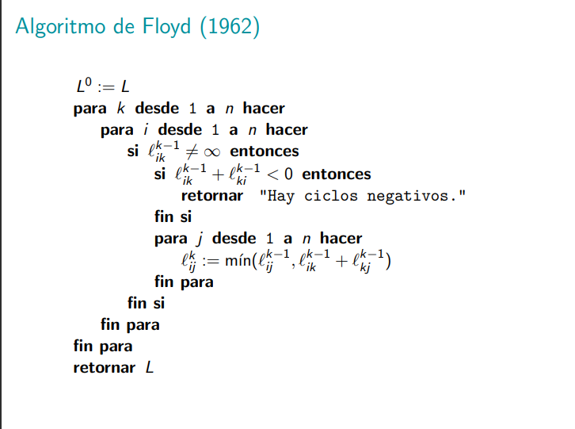

# Dantzig

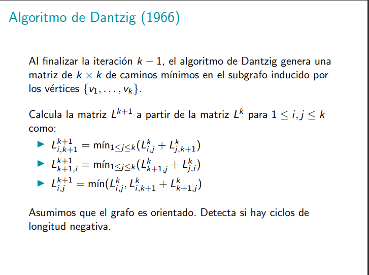

Dantzig dice que hasta la iteración k se tiene una matriz de tamaño k de caminos mínimos.

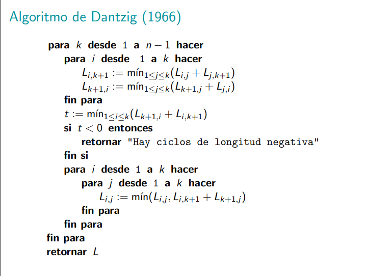

[ver un ejemplo de esto en video] El algortimo está muy bueno. Es como un floyd mejorado.

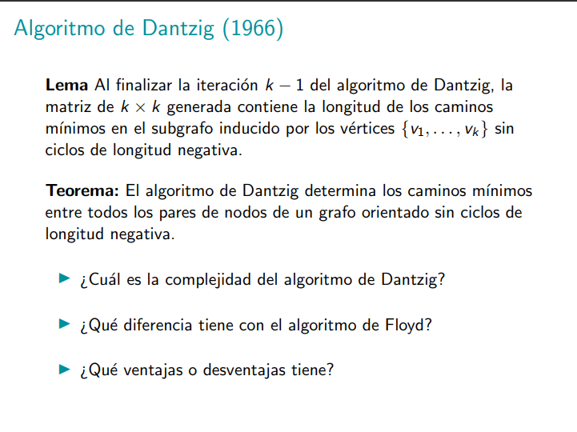

Solo usamos Dantzig para casos donde vamos a estar agregando nodos constantemente porque si agrego un nodo entonces me guardo el Dantzig anterior y luego corro desde la última iteración de Dantzig con ese nuevo nodo. Si no hacemos esto con Dantzig entonces hay que hacer Floyd y es más lento porque floyd no me asegura nada hasta que el algoritmo no haya terminado de correr.