# Flujo máximo

Hay muchos problemas que se resuelben con flujo máximo. Uno que está bueno es el de matchinf máximo.

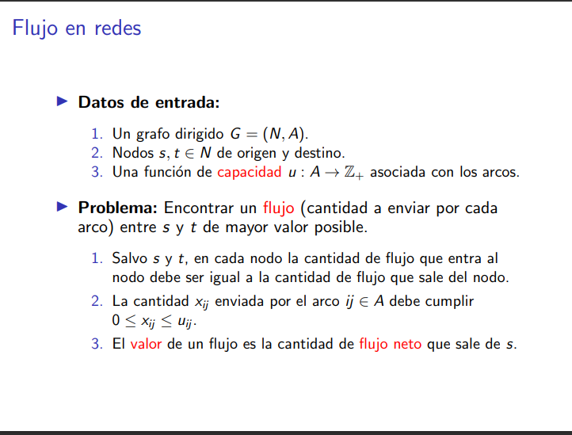

La función capacidad es la que me dice la cantidad máxima de flujo que acepta esa arista.

La cantidad X_ij debe cumplir que no se pasa de la capacidad del arco.

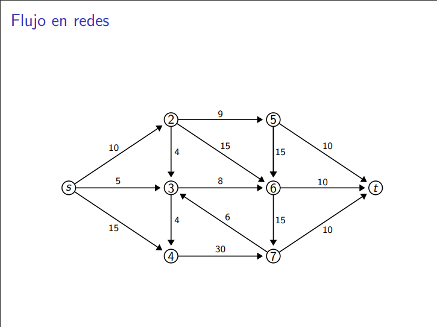
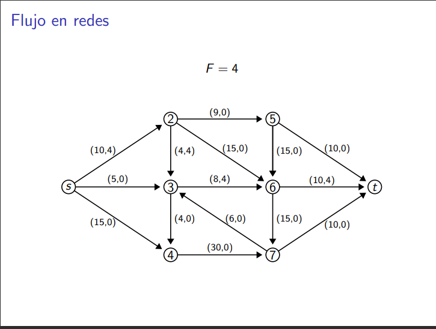

El de la izquierda es la capacidad y el de la derecha es la cantidad de unidades de flujo que enviamos por esa arista. Es ejemplo no es de flujo máximo.

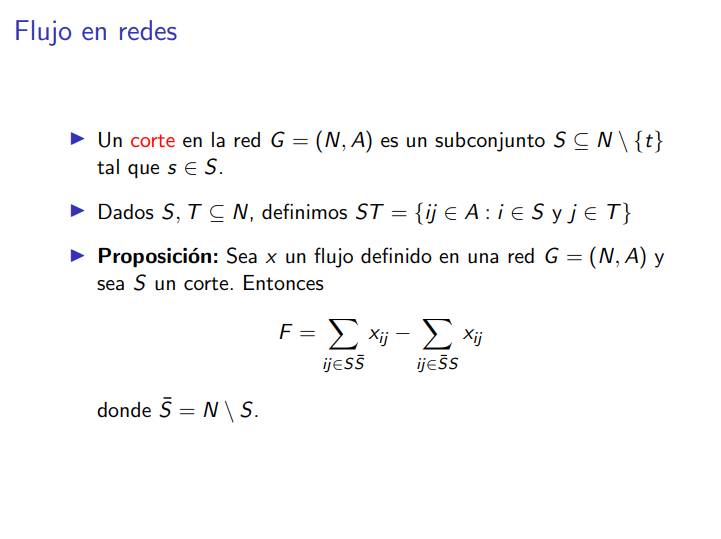

Un corte me divide en dos subconjuntos, en uno esta s y en el otro está t.

El corte es importante porque me indica conceptualmente que si tengo dos regiones y si lo que sale de una no es todo lo que le llega a la otra, entonces en algún lado se está acumulando el flujo y no es lo que buscamos (mandar todo el flujo posible sin acumularlo en un luegar diferente de t).

Esa sumatoria es importante pues es la formalización de la idea de arriba.

Demo
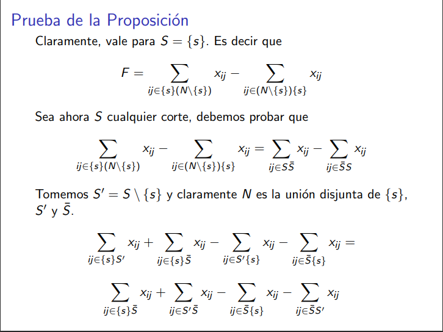
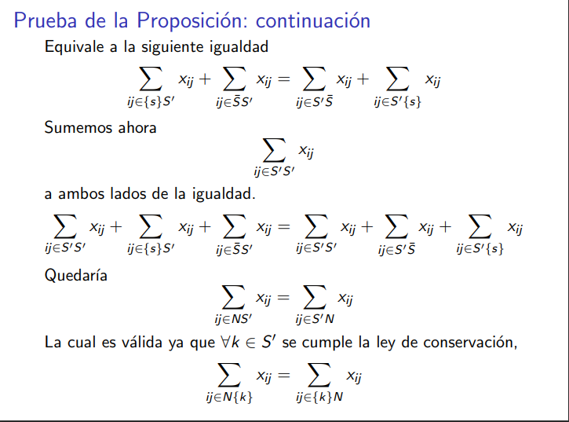

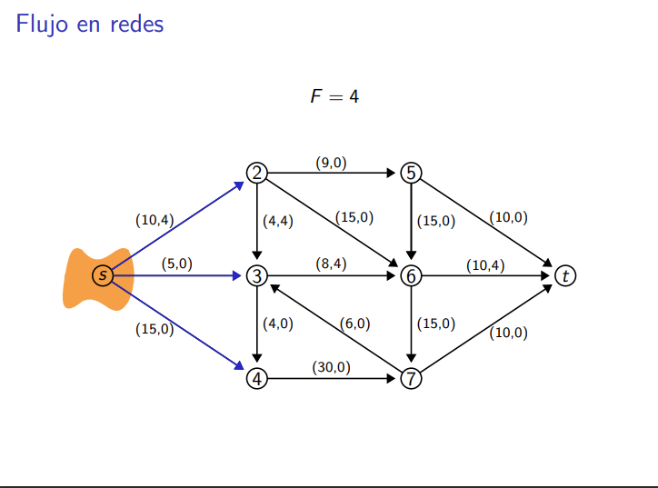
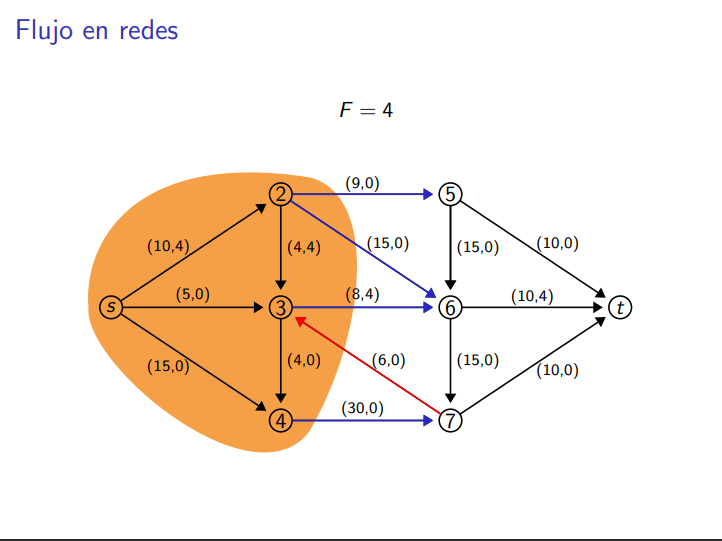
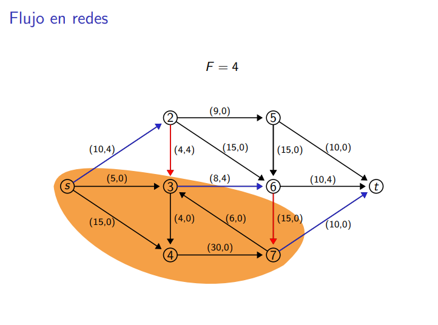

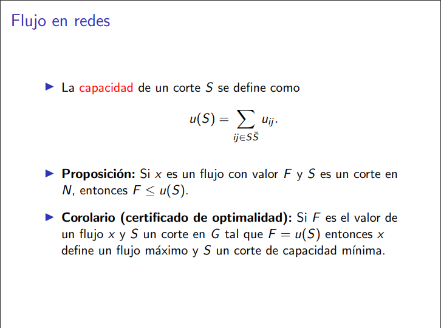

La capacidad de un corte es la suma de las capacidades de las aristas que envían flujo. Eso no implica que el flujo máximo es la capacidad del corte porque no necesariamente vamos a estar enviando todo el flujo posible por cada arista con capacidad, podemos tener aristas que me limitan el flujo que puedo enviar.

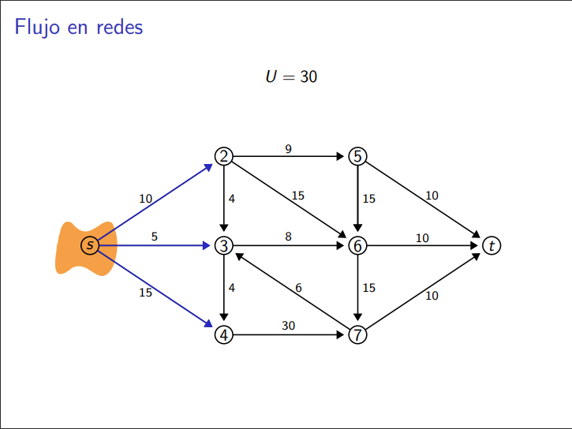
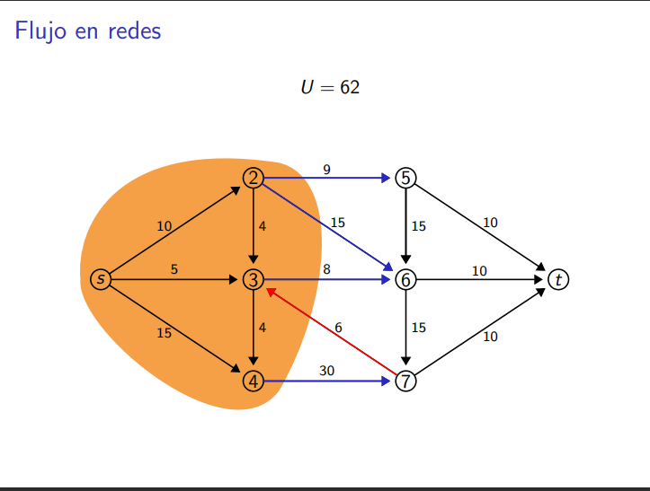
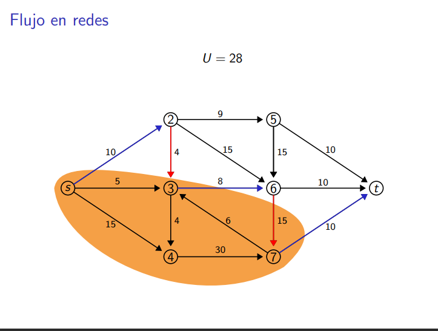

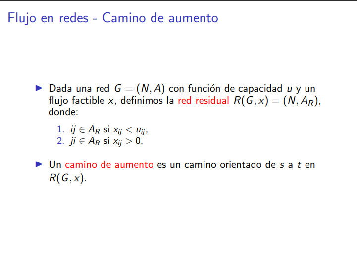

Aumentar un flujo es enviar más flujo por arcos que no están saturados ó devolviendo flujo por un arco que ya estamos usando.

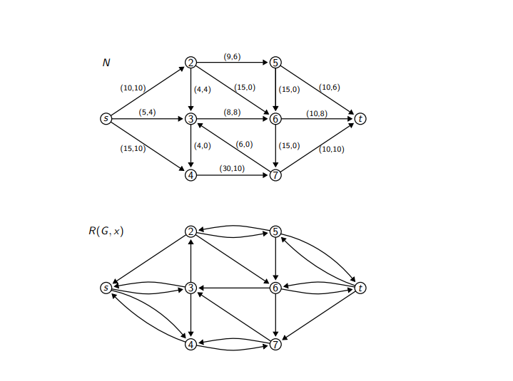
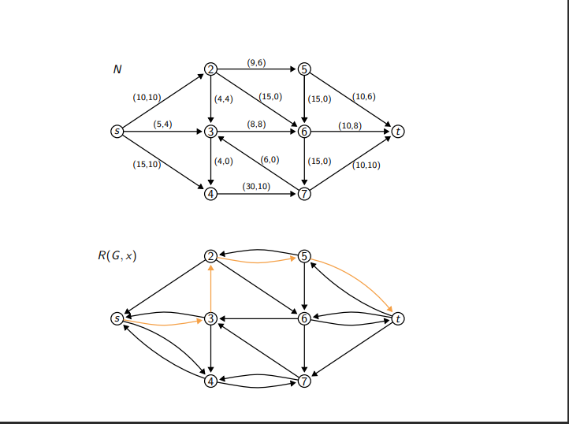

Idea: siempre que haya un camino residual, podemos aumentar el flujo.

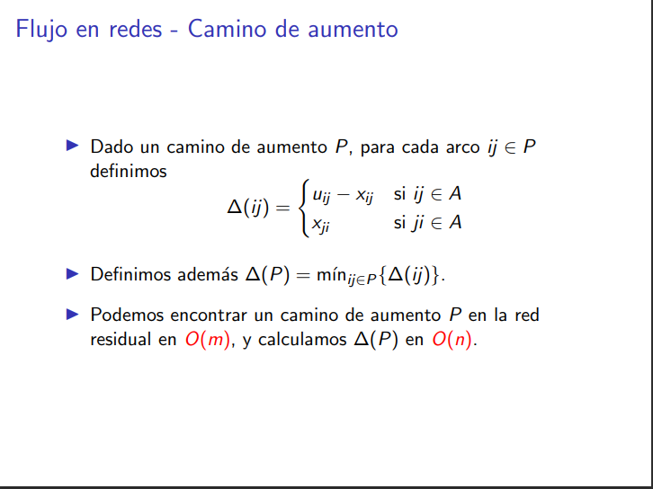
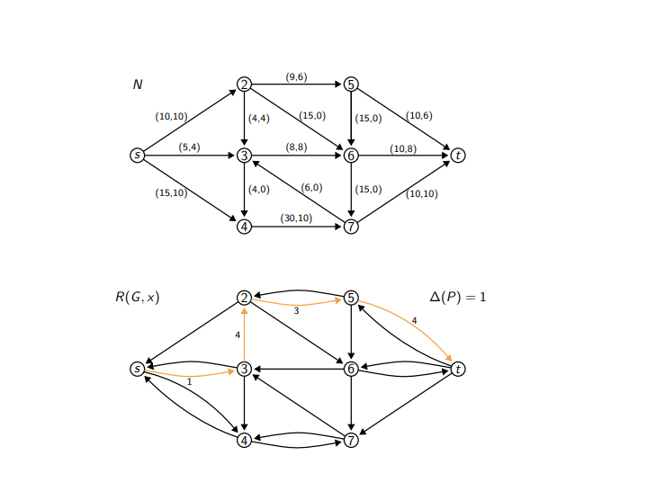

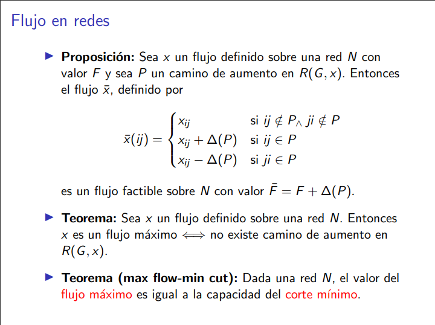

La proposición es: los caminos de aumento me aumentan el flujo en la red original. Lo aumenta según $\Delta$ P.

Si no hay un camino de aumento s a t en la red residual, entoces el flujo ya es máximo.

En el corte mínimo, la capacidad es igual al corte mínimo.

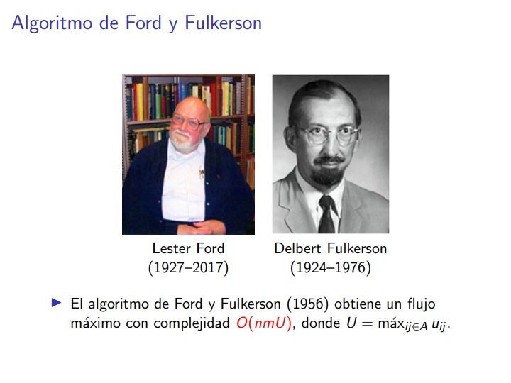

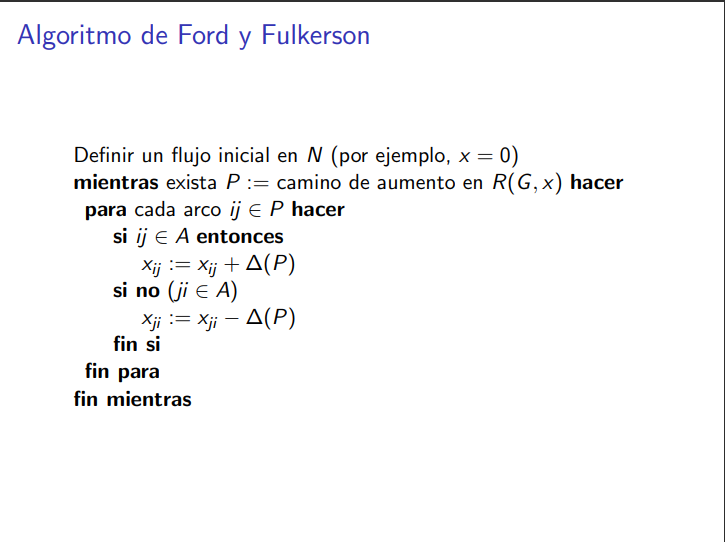

A Ford Fulkerson no le importa cómo encuentras un camino de s a t en la red residual.

[Ver diapos 41-53]

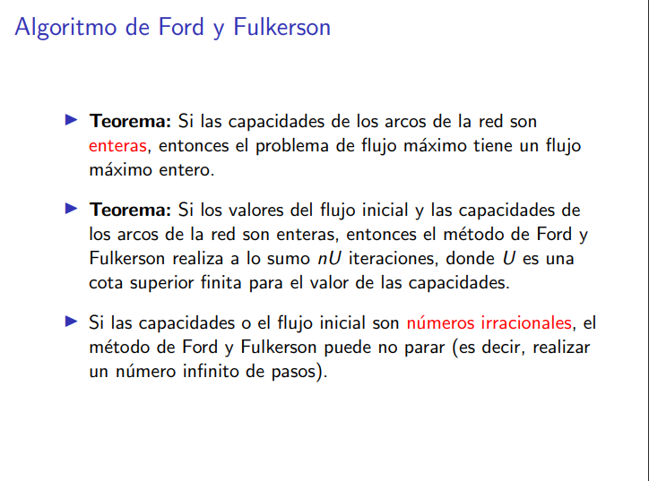

U es la capacidad máxima del grafo original.

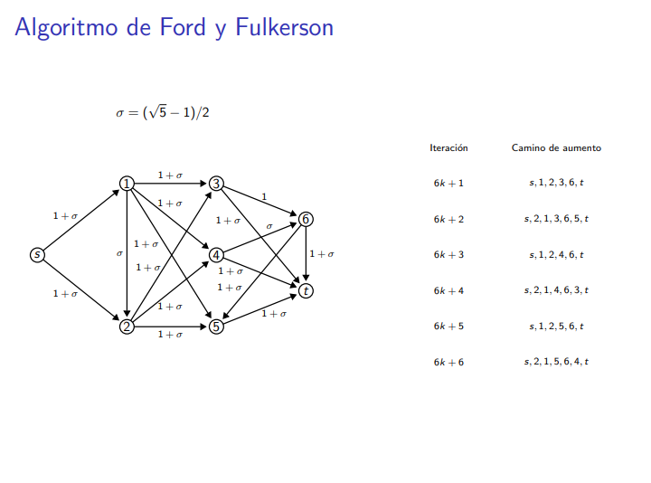

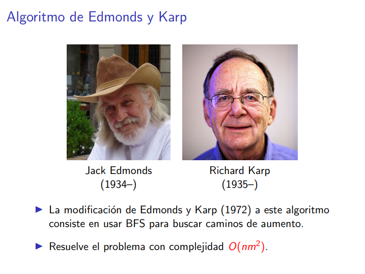

Edmonds y Karp es literalmente el mismo algoritmo de Ford y Fulkerson pero especificando que debemos usar BFS para encontrar el camino de aumento.

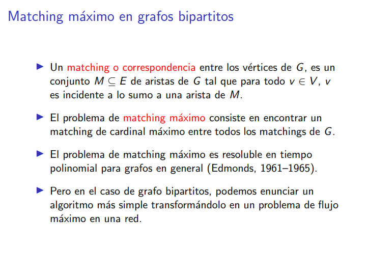
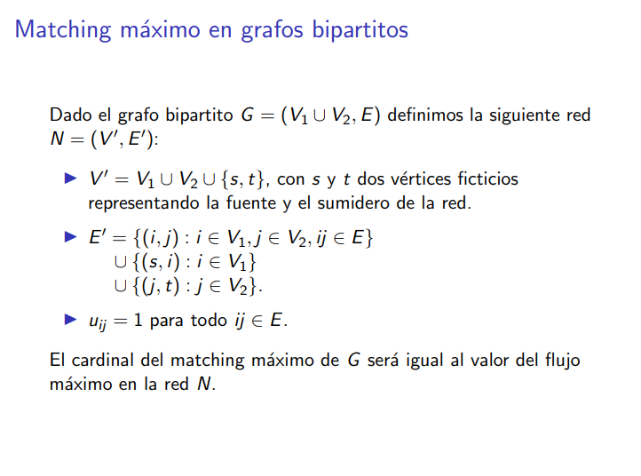

El problema del matching máximo QUE VEMOS EN LA MATERIA solo se hace de a pares, o sea entre dos conjuntos.

