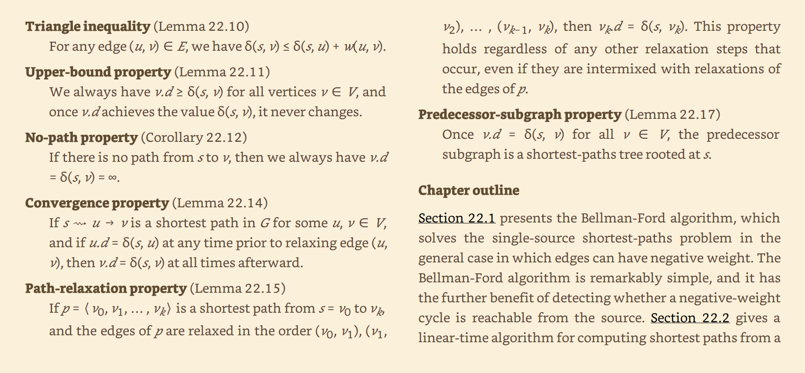
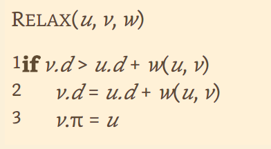
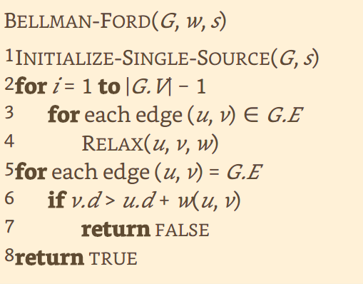
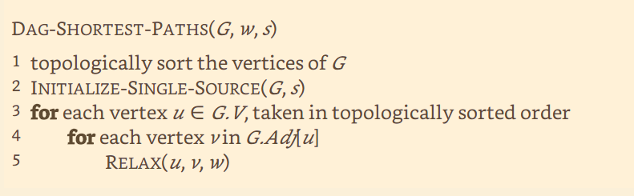
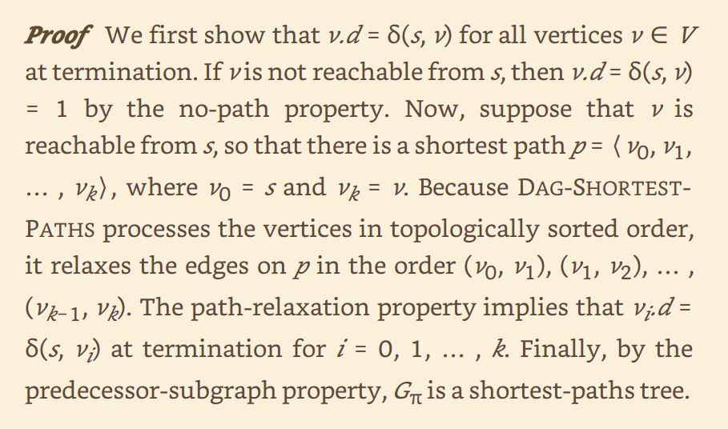
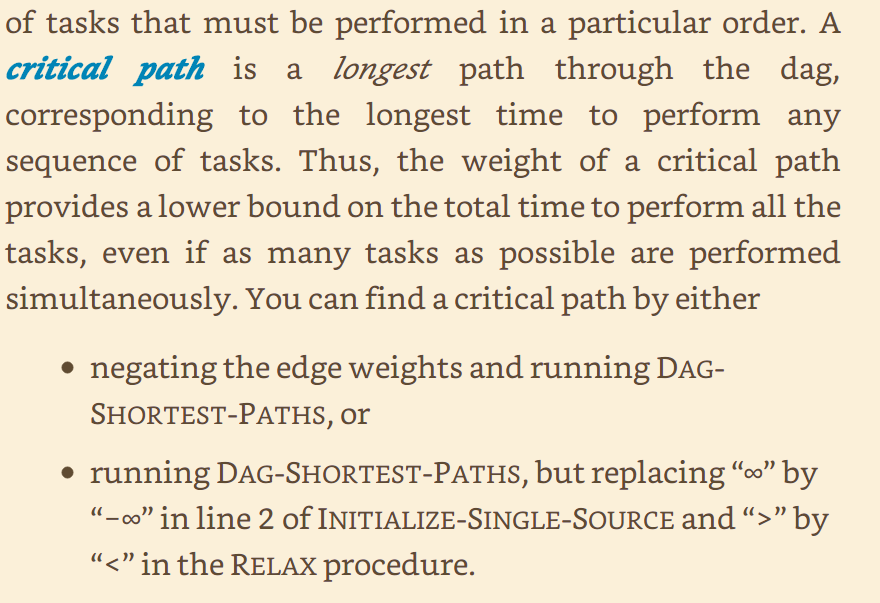

# BFS

Me da la cantidad minima de aristas desde el nodo en que se empezó a correr BFS hasta todos los demás nodos. Si no hay un camino desde el start hasta otro nodo entonces se nota como $\infty$

# DFS

Me da
- Bosque de componentes conexas.
- Aristas Backedge, Forward Edge, Cross Edge, Tree Edges.
- Lista de predecesores.
- Orden topológico si hago DFS e invierto la lista de nodos que encontró durante el recorrido. Solo tiene sentido en un DAG.

> Algoritmos basados en DFS que son útiles:
>
> Algoritmo de Kosaraju: me da las componentes fuertemente conexas de un grafo en O(V + E)
> Algoritmo de Tarjan para puentes: me da los puentes de un DAG.
> Algoritmo de Tarjan para puntos de articulación: me da los puntos de articulación de un DAG.

# ¿Qué son las componentes biconexas?

# Kruskal

- El invariante es que me da el bosque de AGMs que son subgrafos de un AGM del grafo original.
- Su copmlejidad es O(m log n).
- Se usa la estructura con Disjoint Set para mejorar la complejidad de las operaciones capaces de union y detección de subgrafos no conectados durante la generación del bosque.
- Si el grafo no era conexo entonces me queda el bosque de AGM del grafo.

# Prim

- El invariante no lo tengo
- Su copmlejidad es O(m log n), si se implementa con Fibo heap queda en O(E + V log V) que es mejor que la anterior porque m es menor que n
- Se debe correr desde un nodo y solo me devuelve el AGM de todos los nodos ques estaban conectados a ese nodo, si había uno que no tenía un camino que lo conectara al start, entonces se pierde esa información y no se genera un AGM en ese otro nodo.

# Camino mínimo uno a todos

## Propiedades
- Se vale la desigualdad triangular (la distancia mínima entre u y v es menor o igual que ir de u a un nodo k y luego ir de ese nodo k a v).
- Una vez que se encontró la distancia mínima entre un nodo s y otro mínimo, entonces esta no cambia.
- Si no hay camino entre s y v para algún nodo v, entonces la distancia mínima es $\infty$
- Si existe una arista u->v y ocurre que ya tenemos que la distancia mínima entre s y u es d, entonces la distancia mínima de s a v (hasta la k-ésima relajación) es la distancia de s a u y luego sumar la arista u->v.
- Hasta la k-ésima relajación, si existe una secuencia de nodos tales que fueron relajados en el mismo orden que el orden de la secuencia y el primer nodo es el nodo 's' desde donde se empezó a correr el algoritmo, entonces la distancia del i-ésimo nodo en la secuencia es la distancia mínima desde s hasta el i-ésimo nodo.
- Después de que se haya encontrado la distancia mínima desde s a todos los demás nodos, entonces tendremos un árbol de caminos mínimpos desde s a todos los demás que sean alcanzables desde s.

> Thomas H. Cormen. Introduction to Algorithms, Fourth Edition -- Thomas H_ Cormen;Charles E_ Leiserson;Ronald L_ -- MIT Press, Cambridge, Massachusetts, 2022 -- The MIT -- 9780262046305 -- 74876a446f9e57e964b1d44425a478b6 -- Anna’s  (Kindle Locations 14871-14894). Kindle Edition. 

# Dijsktra

- Camino mínimo de u a v.
- Si se hace en el grafo transpuesto y partimos de v, entonces tenemos el camino mínimo de todos a v.
- No acepta ninguna arista negativa.
- Se valen ciclos positivos.
- Solo se corre en grafos dirigidos sin aristas negativas.
- Su complejidad es O((V + E)log V) = O(E log V) si se implementa con un heap binario y el grafo es ralo (|E| << |V|). Sino es O(V^2). 
- Invariante: hasta la k-ésima iteración, Dijkstra me da el camino mínimo entre de los primeros k nodos.

# Bellman Ford

- Camino mínimo de uno a todos.
- Acepta aristas de peso negativo siempre y cuando no forme un ciclo.
- Se valen ciclos positivos.
- El algoritmo devuelve True si no habían ciclos negativos. Caso contrario devuelve False!

# Camino mínimo en DAGs
- El camino mínimo en un DAG SIEMPRE está bien definido, esto es: no importa si hay aristas negativas y tampoco hay que preocuparnos por los ciclos negativos (pues es un DAG).
- Para obtener el camino mínimo desde un nodo u a todos los demás nodos en un DAG lo podemos lograr en complejidad O(V + E).
    >Algoritmo:
    >1. Gt := TopoSort(G)
    >2. Inicializar todas las distancias desde s como infinito en G.
    >3. Para cada vertice en Gt
    >
    >       Para cada arista en N_{Gt}(u)
    >
    >       relajar(arista)

> ese 1 que aparece ahí es un error de interpretación del Kindle, en realidad es un $\infty$

- Camino máximo en un DAG es multiplicar todas las aristas por -1 y correr el algoritmo de arriba 

# Camino mínimo todos a todos
- Se puede hacer en un grafo con aristas negativas pero no en un grafo con pesos negativos.

## Floyd-Warshall
- La idea del algoritmo es: me fijo si hay un camino mínimo que pase por una arista diferente en la arista u->v para poder llegar hasta v. O sea, llegamos hasta u y queremos ver si hay algo mejor para llegar a v a partir de u sin usar la arista u->v.

## Dantzig
- Tiene la misma complejidad temporal y espacial que Floyd-Warshall (O(n^3) y O(n^2), respectivamente), la diferencia está en que este es me asegura que hasta la k-ésima iteración ya conocemos el camino mínimp entre todos los primeros k nodos entre sí. 
- La idea de usar a Dantzig es guardarme el estado de Dantzig hasta la última iteración que podamos y luego si tengo que agregar un nodo nuevo, entonces sigo corriendo Dantzig desde ese punto (pero ahora con el nuevo nodo) y listo, de esta manera obtengo de forma mucho más rápida (en complejidad temporal) todos los caminos mínimos desde entre ese nodo y todos los demás nodos. 

## Algoritmo de Johnson.
- Me da el camino mínimo entre todos los pares en mejor complejidad que Floyd Warshall si tenemos un grafo ralo.
- Su complejidad es O(V*E log V).

# Flujo máximo

## Teorema de max flow min-cut

Idea: si tomamos un corte de la red flujo tal que su capacidad es mínima con respecto a todas las capacidades de todos los demás cortes posibles, entonces **no** es posible que llegue hasta el sumidero un flujo mayor al flujo que pase por ese corte. Se puede pensar como que ese corte de capacidad mínima lo que hace es restringirme el flujo máximo que puedo enviar desde s a t.

## Teorema de flujo entero

> NOTA: Sé que parece inutil, pero es muy útil para poder demostrar que el flujo que encontramos es máximo.

Simple: si la capacidad de flujo de todas las aristas es un número entero y el flujo es siempre entero, entonces el flujo máximo es un entero.

Este teorema existe porque si las capacidades no fueran enteras entonces el método de FF no necesariamente nos calcularía el flujo máximo (puede colgarse).

## Ford - Fulkerson
- Es un método que me resuelve el problema. Se le dice método porque va recorriendo la red residual en busca de un camino de aumento, y ese recorrido por la red residual puede estar hecho con cualquier algoritmo de búsqueda.
- Su complejidad es O(V U) donde U es el flujo máximo.

## Edmonds - Karp

- Es lo mismo que FF pero tomando como elección de búsqueda en la red residual al algoritmo BFS. 
- Su complejidad es O(V*(E^2))

